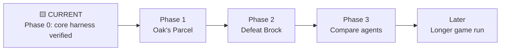
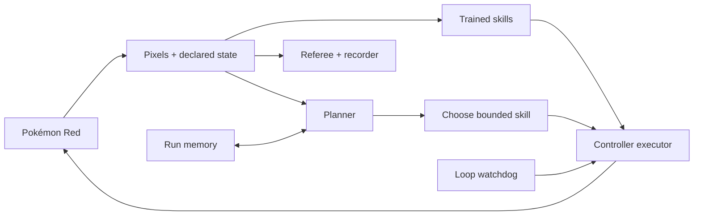

# Pokémon Red AI

[](https://github.com/PeteAndrews1289/pokemon-red-ai/actions/workflows/ci.yml)
[](LICENSE)

**Can an AI learn to play Pokémon Red—and can we show the learning process without hiding the
failures, shortcuts, or human help?**

This is a transparent, reproducible attempt to build one. The long-term plan combines a
language-model planner, trained navigation and battle skills, persistent memory, and a watchdog
that notices loops. The nearer goal is concrete: deliver Oak's Parcel, then defeat Brock from a
clean game start.

> **Current status: Phase 0, the measuring instrument.** The emulator harness is working and
> reproducible. Model training has **not** started. The project can reliably boot a clean game,
> choose the built-in RED and BLUE names, reach the bedroom, read a deliberately small state, and
> prove that two independent runs agree.

## The story so far

Pokémon Red looks simple because a person brings an enormous amount of invisible knowledge: what a
door looks like, how dialogue advances, why walking in circles is bad, and which tiny victories
matter on the way to a distant goal. An agent has none of that for free.

Before asking whether a model can learn, this project asks a less glamorous question: **can we trust
the test?** A surprising amount has to be settled first—one exact ROM revision, deterministic button
timing, clean start states, observation boundaries, private artifact handling, and a record of every
attempt. That foundation is Act I of the project, not backstage work to be edited out later.

The full editorial direction lives in [The project narrative](docs/narrative.md). The detailed
status, including what is measured versus merely planned, is in [Progress](docs/progress.md).

## At a glance

| Question | Current answer |
| --- | --- |
| Is there a trained Pokémon-playing model yet? | No |
| Does the supplied game boot and accept controlled input? | Yes |
| Can a clean run reach the first playable bedroom state? | Yes, deterministically |
| Can the harness identify map, position, party size, and battle state? | Yes, read-only |
| Are ROMs, saves, snapshots, and gameplay captures committed? | No |
| First learned-skill milestone | Leave the bedroom |
| First end-to-end quest milestone | Deliver Oak's Parcel |
| First public boss milestone | Defeat Brock |
| Planned comparison | Language-model only vs. RL only vs. hybrid |

## The journey



GitHub issues and experiment records will attach evidence to this roadmap. A checked engineering
task is not automatically model progress; the [detailed roadmap](docs/roadmap.md) keeps those tracks
separate.

## What Phase 0 proves

- The target ROM is identified by exact title, size, SHA-1, and SHA-256 before emulation starts.
- PyBoy runs headlessly at unlimited speed without writing save data beside the private ROM.
- Every controller action has explicit hold and release durations.
- In-memory snapshots are integrity-checked and bound to the ROM hash and PyBoy version.
- A frozen input sequence reaches RED's bedroom at logical frame 9,804.
- Two independent clean boots produce identical state, pixels, game-area, and snapshot hashes.
- An 8-frame press plus 16-frame release moves RED exactly one tile at the bedroom start.
- The current instrumentation reader exposes six named fields and no memory-writing method.
- Pre-game scratch values are hidden so Oak's introduction cannot masquerade as playable state.
- Sanitized JSONL traces contain reproducibility hashes, not ROM paths or bytes.
- CI rejects common ROM, save, snapshot, private-path, and documentation mistakes.

These claims are covered by the unit and private-ROM integration test suite. They do **not** imply
that an agent has learned navigation, understood the screen, or completed a quest.

## Planned system



The planner cannot write game memory or load snapshots. The referee can measure success but cannot
choose actions. The watchdog may replan or stop a failed attempt; it may not teleport the player.
See [Architecture](docs/architecture.md) for the full authority boundaries and decision cycle.

## What will count as progress?

The project uses the canonical [Progress evidence ladder](docs/progress.md#evidence-ladder) so a
polished clip cannot outrank a repeatable result.

| Level | Meaning | Example |
| --- | --- | --- |
| E0 — Proposed | A written design or roadmap item | Proposed reward function |
| E1 — Implemented | Code and a documented interface | Environment wrapper exists |
| E2 — Checked | Automated unit, integration, lint, or safety check | One-tile timing test passes |
| E3 — Repeated | Reproducible run artifacts with matching declared outcomes | Two clean boots agree |
| E4 — Evaluated | Frozen policy, budget, all attempts, and aggregate metrics | 17/20 held-out attempts |

Every public experiment should state its observation track, training budget, evaluation attempts,
interventions, failures, model usage, cost, and Git commit. Shaped reward is useful diagnostic data;
it is not proof that a task was solved.

## Documentation map

Start with [the documentation hub](docs/index.md), or jump directly to:

- [Project narrative](docs/narrative.md) — the central question and story arc
- [Progress](docs/progress.md) — current evidence, status, and reporting rules
- [Roadmap](docs/roadmap.md) — engineering, learning, and storytelling milestones
- [Architecture](docs/architecture.md) — components, data flow, and authority boundaries
- [Experiment protocol](docs/experiment-protocol.md) — what claims require what evidence
- [State instrumentation](docs/state-observation.md) — exact read-only fields and caveats
- [Run reports](docs/run-reports.md) — turning traces into local visual summaries
- [Video outline](docs/video-outline.md) — a possible YouTube structure and shot plan
- [Visual storytelling](docs/visual-storytelling.md) — charts and visuals worth collecting
- [Glossary](docs/glossary.md) — technical ideas in audience-friendly language
- [Development log](docs/devlog.md) and [changelog](CHANGELOG.md) — what changed and why

Reusable records:

- [Experiment record template](docs/experiment-template.md)
- [Agent card template](docs/agent-card-template.md)

## Reproduce the current milestone

### Requirements

- Python 3.11 or newer
- A legally obtained Pokémon Red ROM matching the supported fingerprint below
- macOS, Linux, or Windows with a PyBoy-supported Python build

```bash
git clone https://github.com/PeteAndrews1289/pokemon-red-ai.git
cd pokemon-red-ai

python3 -m venv .venv
source .venv/bin/activate
python -m pip install -e ".[dev]"
```

On Windows PowerShell, create and activate the environment with:

```powershell
py -m venv .venv
.\.venv\Scripts\Activate.ps1
py -m pip install -e ".[dev]"
```

Keep the ROM outside the repository and provide its path only at runtime:

```bash
export POKEMON_RED_ROM="/absolute/path/to/Pokemon Red.gb"

pokemon-red-ai doctor
pokemon-red-ai smoke-test
pokemon-red-ai bootstrap-test
```

The bootstrap test starts two clean games, compares the outcomes, verifies the input-ready bedroom
state, calibrates one-tile movement, and restores the untouched starting snapshot. Generated traces
and private screenshots go under `runs/`, which Git ignores.

Turn any smoke or bootstrap trace into a standalone visual report:

```bash
pokemon-red-ai report runs/bootstrap-YYYYMMDDTHHMMSSZ
```

The resulting `report.html` explains the manifest, outcome, repeated attempts, timeline, and the
important fact that these harness runs contain no model-training metrics. The generator does not
add screenshots, ROM assets, JavaScript, or remote dependencies; it redacts common sensitive
values, but reports still require review before publication. See [Run reports](docs/run-reports.md).

Use `--rom "/absolute/path/to/Pokemon Red.gb"` instead of the environment variable if preferred.
No OpenAI API key is needed for Phase 0.

## Supported ROM

**The ROM is not included in this repository.** The harness currently supports exactly:

```text
Title:   POKEMON RED
Size:    1,048,576 bytes
SHA-1:   ea9bcae617fdf159b045185467ae58b2e4a48b9a
SHA-256: 5ca7ba01642a3b27b0cc0b5349b52792795b62d3ed977e98a09390659af96b7b
```

The filename is not proof of identity. Other revisions can have different memory layouts and save
states, so the harness refuses them until they are deliberately supported. The named state fields
were checked against a matching build of
[`pret/pokered`](https://github.com/pret/pokered/tree/1e96034092686d006e863cace09e87273051a3d8).

## Development checks

```bash
python scripts/check_private_artifacts.py
python scripts/check_docs.py
ruff check .
pytest -m "not integration"
pytest -m integration  # Requires POKEMON_RED_ROM
```

The reinforcement-learning stack remains optional until training begins:

```bash
python -m pip install -e ".[rl]"
```

See [Contributing](CONTRIBUTING.md) before adding observations, rewards, or published results.

## Legal and project hygiene

Pokémon is owned by Nintendo, Game Freak, and The Pokémon Company. This is an independent
educational and research project and is not affiliated with or endorsed by them.

The repository does not distribute ROMs, save data, emulator states, extracted game assets, or
gameplay recordings. Contributors are responsible for obtaining and using game software in
accordance with applicable law. Never commit ROMs, saves, snapshots, API keys, private machine
paths, checkpoints, or recordings.

The project code and original documentation are available under the [MIT License](LICENSE).
