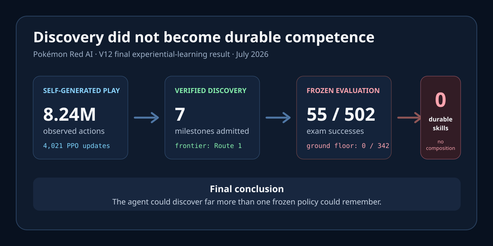
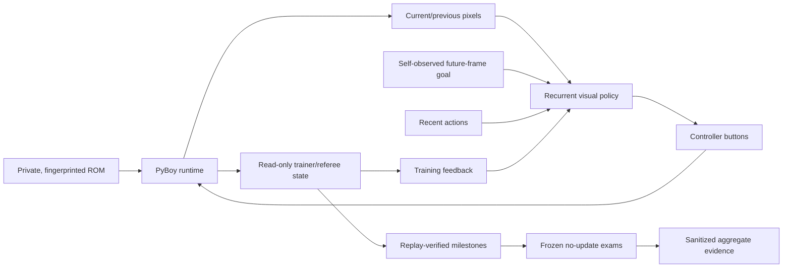

# Pokémon Red AI — Discovery Without Durable Competence

[](https://github.com/PeteAndrews1289/pokemon-red-ai/actions/workflows/ci.yml)
[](LICENSE)
[](docs/final-retrospective.md)

**Can one recurrent visual policy teach itself Pokémon Red from pixels and buttons—without a
walkthrough, imported gameplay, save-state start, online decision model, or human-selected action?**

> **Status: completed research project, July 2026.** The final V12 run processed 8,236,144
> self-generated actions in 9h54m56s and replay-verified seven discoveries through Route 1.
> Frozen no-update evaluation ended at 55/502 exams, zero competent skills, zero composition
> attempts, and no Hall-of-Fame result. The project is closed without claiming that the agent
> learned to play Pokémon Red.



## Final result

| Measurement | V12 outcome |
| --- | ---: |
| Observed training actions | 8,236,144 |
| PPO updates | 4,021 |
| Self-generated hindsight examples | 3,518,624 |
| Replay-verified discoveries | 7, through Route 1 |
| Frozen exam successes | 55 / 502 |
| Competent skills at the end | 0 |
| Composition attempts | 0 |
| Hall-of-Fame completions | 0 |

The first local skill briefly crossed its 8/10 competence threshold and was then forgotten twice.
The second skill passed 0/342 exams. More than 7.85 million actions after the Route 1 discovery
produced no Viridian City promotion.

That gap is the result: **the system became much better at finding and preserving promising
trajectories than at turning them into durable, cumulative closed-loop behavior.**

Read the [final retrospective](docs/final-retrospective.md) for the interpretation and the
[V12 experiment record](experiments/v12-final/README.md) for the complete numerical denominator,
milestone timeline, integrity note, and claim boundary.

## What I built

- A deterministic PyBoy harness that refuses any ROM outside one declared fingerprint.
- Explicit controller timing, clean power-on starts, in-memory snapshots, and exact restore checks.
- Separate actor and referee authority: the policy chooses every evaluated button while
  trainer-only state measures consequences and verifies discoveries.
- Random, archive, neuroevolution, recurrent-PPO, imitation, recovery, and hindsight-learning
  experiment families preserved as an auditable progression rather than rewritten as successes.
- Replay-verified milestone admission and source-, ROM-, model-, optimizer-, and curriculum-bound
  checkpoints that fail closed on inconsistent resume state.
- Frozen no-update skill exams and prerequisite gates that prevent archive depth or training loss
  from being presented as one capable policy.
- Local dashboards, structured traces, experiment templates, decision logs, and redistribution-safe
  aggregate evidence.
- Automated guards that reject ROMs, saves, snapshots, checkpoints, recordings, credentials,
  private paths, and other unsafe artifacts from publication.

The repository contains 300+ ROM-free checks plus separate private-ROM integration coverage. CI
tests the core harness, the Visual Apprentice stack, and recurrent-PPO components on Linux and
macOS.

## System boundary



The referee may grade or verify behavior, but it cannot choose, replace, or mask the actor's
evaluated actions. Checkpoint restores are training tools and are disabled when testing one frozen
policy from power-on. Every historical experiment declares any broader assistance separately.

## Research progression

| Stage | Question | Result |
| --- | --- | --- |
| Random and pixels-only controls | Can blind exploration create reusable progress? | Luck produced events; randomness could not retain them |
| Neuroevolution | Can inheritance extend a narrow success? | Learned game start, then failed the next-map gate in all six lanes |
| Archive and curriculum systems | Can verified slices push the frontier? | Reached later milestones, but archive depth did not prove one policy |
| Recurrent PPO and Students | Can one model retain and compose the route? | Better fit and occasional exam passes; zero durable composition |
| Assisted V11 control | Can an auditable planner hierarchy operate the game? | Operational control, but online reasoning changed the scientific claim |
| Final V12 self-learner | Can self-generated goals create stable competence? | Seven discoveries; 55/502 exams; zero competent skills |

The [append-only decision register](docs/decision-register.md) records the accepted, rejected,
retired, superseded, and failed-to-qualify choices behind that progression.

## Why the negative result matters

This project deliberately separates four things that are easy to conflate:

1. **Activity:** parameters updated and losses changed.
2. **Discovery:** some run reached a new milestone.
3. **Retention:** a frozen policy could reproduce a local skill repeatedly.
4. **Composition:** one frozen policy could connect retained skills from power-on.

V12 established the first two and failed the last two. Publishing that distinction is more useful
than presenting a lucky Route 1 clip as an AI that learned Pokémon.

## Reproduce the public checks

Python 3.11 or newer is required.

```bash
git clone https://github.com/PeteAndrews1289/pokemon-red-ai.git
cd pokemon-red-ai

python3 -m venv .venv
source .venv/bin/activate
python -m pip install -e ".[dev]"

python scripts/check_private_artifacts.py
python scripts/check_docs.py
ruff check .
pytest -m "not integration"
```

The public suite does not need the game ROM. Optional learning stacks are installed separately:

```bash
python -m pip install -e ".[apprentice]"
python -m pip install -e ".[rl]"
```

[`requirements-closeout.txt`](requirements-closeout.txt) records the exact Python packages used
for the final repository validation. It is a closeout snapshot, not an assertion that the
historical V12 runtime can be reconstructed without its private external artifacts.

## Private-ROM verification

The ROM is not included. The harness supports exactly the revision identified in the
[experiment protocol](docs/experiment-protocol.md), and contributors must obtain and use any game
software lawfully.

Keep the ROM outside the repository and provide its path only at runtime:

```bash
export POKEMON_RED_ROM="/absolute/path/to/Pokemon Red.gb"

pokemon-red-ai doctor
pokemon-red-ai smoke-test
pokemon-red-ai bootstrap-test
pytest -m integration
```

Generated traces, screenshots, saves, model checkpoints, and runtime artifacts remain ignored and
private. The committed experiment records contain aggregate measurements and hashes, not
proprietary game data.

## Evidence map

- [Final retrospective](docs/final-retrospective.md) — conclusion, recurring failure modes, and
  successor requirements
- [V12 final result](experiments/v12-final/README.md) — frozen identity, measurements, exams, and
  shutdown limitation
- [Architecture](docs/architecture.md) — component and authority boundaries
- [Experiment protocol](docs/experiment-protocol.md) — evidence levels and evaluation rules
- [Documentation hub](docs/index.md) — all historical designs and experiment records
- [Roadmap](docs/roadmap.md) — the completed research sequence and intentionally unpursued work
- [Decision register](docs/decision-register.md) — chronological technical decisions and failures
- [Contributing](CONTRIBUTING.md) — supported maintenance scope and artifact rules

## Known limitations

- No learned policy completed Pokémon Red or retained even the opening skill at project close.
- The final stop interrupted the normal finalizer. The last integrity-bound checkpoint is valid,
  but no clean terminal power-on evaluation was produced and 11,376 later observed actions remain
  outside that checkpoint.
- The work evaluates one game revision, one hardware class, and the declared algorithm families;
  it does not establish a general impossibility result.
- Historical systems include trainer-side curricula, checkpoint restores, RAM-derived grading,
  or online reasoning only where their experiment records explicitly disclose them.

## Legal and license

Pokémon is owned by Nintendo, Game Freak, and The Pokémon Company. This independent educational
research project is not affiliated with or endorsed by them and distributes no ROM, save data,
emulator state, extracted game asset, or gameplay recording.

Original source code and documentation are available under the [MIT License](LICENSE).
The historical V11 adaptation patch retains its upstream attribution in
[Third-Party Notices](THIRD_PARTY_NOTICES.md).
