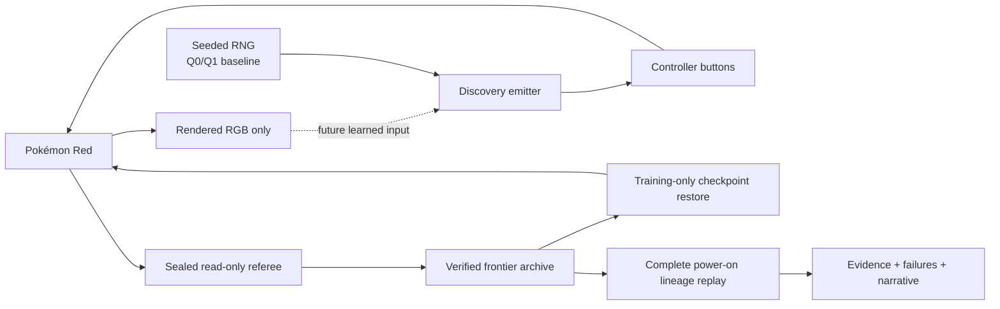

# Pokémon Red AI

[](https://github.com/PeteAndrews1289/pokemon-red-ai/actions/workflows/ci.yml)
[](LICENSE)

**How far can an agent get in Pokémon Red when nobody tells it what Pokémon is?**

This is a transparent, reproducible Pokémon Red learning project. Every experiment separately
discloses what chooses buttons, what that component observes, and what its training system may know.
The original game-naive, pixels-only condition remains a strict control. The Q0/Q1 completion
baseline deliberately used a seeded random action emitter and a sealed, read-only referee; the next
trials compare learned or optimized emitters under the same checkpoint and replay rules.

> **Current status: V7 restarts the original question with a self-taught agent.**
> Stage 0 memorized and exactly replayed its one 419-action house-exit route. Reverse curriculum
> completed that opening in development, and Frontier Apprentice proved that network updates can be
> gated behind replay-verified milestones. Its limitation was equally important: almost every
> failed suffix produced no gradient update. The new
> [parallel PPO lane](docs/parallel-ppo.md) runs four simultaneous games into one shared recurrent
> pixel policy so every rollout can teach, while Archive v2 still requires exact local replay and
> three complete power-on replays before admitting a named milestone. Pixels-only and separately
> labeled privileged-input canaries pass; a four-worker production-shaped canary completed two
> optimizer updates, wrote all live frames, and saved a hash-bound checkpoint. The first long
> pixels-only run then exposed episode-reset novelty farming. Version 2 fixed that loophole but paid
> for ending battles whether or not the agent won. Version 3 required durable battle results and
> ended cleanly at 1,147,988 actions with nine successful battles, but still no promotion beyond
> Route 1. Version 4 added bounded opponent-HP credit, three-action history, longer episodes, and
> classified loop termination. Its completed 1,776,644-action run produced a replay-verified
> Viridian City promotion at action 790,900. Version 5 then verified entry into the Mart at action
> 619,660 and Oak's Parcel at 619,956 in its own run. That success exposed a general failure:
> expired Mart guidance continued paying when the correct task was to backtrack. Version 5.1 gates
> rewards to the active goal, inserts Parcel-return checkpoints, reuses certified routes in both
> directions, and gives signed route-distance credit that oscillation cannot farm. It then verified
> Pallet Town, Oak's Lab, and the Pokédex by action 402,320 before spending another 3,035,252
> actions without reaching Viridian Forest. Version 5.2 turns that plateau into ten visible steps
> from Oak's Lab through Route 2, both Forest gates, Pewter City, and Pewter Gym, plus bounded credit
> for escaping navigation traps. See
> [From one solved errand to the road to Brock](docs/version-5-2-northbound.md). Its first long run
> verified leaving Oak's Lab and reaching Route 1, then exposed the deeper limitation: the archive
> could assemble successful slices without requiring one current model to reproduce them together.
> Version 6 retains the actual PPO policy and optimizer, divides training between discovery and
> rehearsal, and moves its start backward only after a rolling competence gate passes. See
> [Make one policy remember the journey](docs/version-6-consolidation.md). This is a
> curriculum-learning experiment, not yet a claim that one unassisted model can complete Pokémon
> Red from power-on. The declared V6 run closed at 1,001,476 new actions. It reached the target in
> 11 of 206 earlier-start attempts and finished at 5/10 in the rolling window, below the required
> 8/10; no backward gate passed. That partial learning confirmed both that retention was possible
> and that another obstacle-specific reward repair would continue the wrong experiment. Version 7
> begins with random weights and only power-on, imports no actions or demonstrations, turns its own
> replay-verified discoveries into visual-goal skills, and rehearses the weakest skill. Its first
> 8,192-action real-ROM canary independently started the game and reached the ground floor, creating
> two self-generated skills and eight direct imitation updates. See
> [Let a new player teach itself](docs/version-7-self-taught.md).

The current code preserves every historical runner, including Monkey, Archivist, online learners,
and clean-start neuroevolution, so rejected approaches remain reproducible. See
[the selection × mutation lab](docs/selection-mutation-lab.md) for the concluded matrix and
[the decision register](docs/decision-register.md) for every accepted, retired, superseded, and
failed-to-qualify choice.

## The story so far

Pokémon Red looks simple because a person brings an enormous amount of invisible knowledge: what a
door looks like, how dialogue advances, why walking in circles is bad, and which tiny victories
matter on the way to a distant goal. An agent has none of that for free.

Before asking whether a model can learn, this project asks a less glamorous question: **can we trust
the test?** A surprising amount has to be settled first—one exact ROM revision, deterministic button
timing, clean start states, observation boundaries, private artifact handling, and a record of every
attempt. That foundation is Act I of the project, not backstage work to be edited out later.

The primary completion protocol is the
[Hall of Fame completion program](docs/completion-program.md). The original
[game-naive, pixels-only curiosity](docs/blind-curiosity.md) protocol remains the philosophical
control. The next learned-policy design is frozen in
[Visual Apprentice v1](docs/visual-apprentice.md). The editorial direction lives in
[The project narrative](docs/narrative.md), and evidence levels remain tracked in
[Progress](docs/progress.md).

## At a glance

| Question | Current answer |
| --- | --- |
| Is there a trained neural Pokémon-playing model yet? | Yes, several development policies now update from gameplay; no evaluated full-game policy or Hall-of-Fame result exists |
| Can a game-naive agent explore from power-on? | Yes: random, archive, and online pixels-only runners have been exercised |
| Why retire Pure Monkey? | Its action distribution never changes; lucky outcomes cannot become future behavior |
| What replaced it? | A quality-diversity neuroevolution population proved narrow inheritance, then failed to extend it beyond the opening |
| What guides the Archivist trainer? | Coarse pixels, novelty membership, and archive visit counts |
| Does RAM guide every arm? | No. Every run declares actor and training information separately; the completion referee may guide training but never chooses buttons |
| Does the supplied game boot and accept controlled input? | Yes |
| Can a clean run reach the first playable bedroom state? | Yes, deterministically |
| Can the harness identify map, position, party size, and battle state? | Yes, read-only |
| Are ROMs, saves, snapshots, and gameplay captures committed? | No |
| Preserved random comparison | Monkey vs. pixels-only Archivist under matched budgets |
| Completed 90-minute pretrial | Evolution reached tier 1; online learners plateaued around Pallet Town and Route 1 |
| Concluded neural experiment | Six inherited-archive lanes all failed the second-map/party gate under equal fuel |
| Current completion work | Retained-policy PPO alternates frontier discovery with backward-expanding rehearsal; discovery, training competence, and frozen power-on evaluation remain separate claims |
| North star | First discover a replayable Hall-of-Fame lineage, then train and evaluate one frozen pixel policy |

## The journey

```mermaid
flowchart LR
    P0["✅ Harness<br/>trust the stage"] --> B0["✅ Monkey<br/>baseline concluded"]
    B0 --> B2["✅ Online learners<br/>pretrials"]
    B2 --> B1["✅ First inheritance<br/>repeat game start"]
    B1 --> EV["✅ 2 × 3 mechanism lab<br/>no next-map progress"]
    EV --> EX["✅ Q0 checkpoint runner<br/>remember stepping stones"]
    EX --> Q1["🟨 Q1 house exit<br/>H3 reached; gate 1/2"]
    Q1 --> SC["✅ Archive v2<br/>bounded replay + recovery"]
    SC --> EM["🟨 Visual Apprentice<br/>learn one local skill"]
    EM --> FR["✅ Frontier Apprentice<br/>verify-only updates"]
    FR --> PPO["🟨 Parallel PPO<br/>learn from every rollout"]
    PPO --> HF["⬜ Complete lineage<br/>then one frozen policy"]
```



GitHub issues and experiment records will attach evidence to this roadmap. A checked engineering
task is not automatically model progress; the [detailed roadmap](docs/roadmap.md) keeps those tracks
separate.

## What Phase 0 proves

- The target ROM is identified by exact title, size, SHA-1, and SHA-256 before emulation starts.
- PyBoy runs headlessly at unlimited speed without writing save data beside the private ROM.
- Every controller action has explicit hold and release durations.
- In-memory snapshots are integrity-checked and bound to the ROM hash and PyBoy version.
- A frozen input sequence reaches RED's bedroom at logical frame 9,804.
- Two independent clean boots produce identical state, pixels, game-area, and snapshot hashes.
- An 8-frame press plus 16-frame release moves RED exactly one tile at the bedroom start.
- The current instrumentation reader exposes six named fields and no memory-writing method.
- Pre-game scratch values are hidden so Oak's introduction cannot masquerade as playable state.
- Sanitized JSONL traces contain reproducibility hashes, not ROM paths or bytes.
- CI rejects common ROM, save, snapshot, private-path, and documentation mistakes.

These claims are covered by the unit and private-ROM integration test suite. They do **not** imply
that an agent has learned navigation, understood the screen, or completed a quest.

## Primary completion system



The actor never receives RAM, checkpoint bytes, milestone names, or a route. The Q0/Q1 baseline
emitter received only a seeded pseudorandom generator; it is an open-loop discovery
baseline, not a learned model and not yet a pixel actor. Later visual policies will receive rendered
pixels under a separate label. RAM-derived state may influence training reward, archive selection,
curriculum, and failure termination through the declared referee. Checkpoint restores are
trainer-owned and disclosed; they are disabled when evaluating one frozen model from power-on. See
[the experiment protocol](docs/experiment-protocol.md) and
[the completion program](docs/completion-program.md).

The current parallel-PPO successor is Version 7. It starts one recurrent policy at random from the
unique power-on state, imports no earlier actions or parameters, and removes authored route,
milestone, Mart, and landmark-recovery reward. General consequence and novelty feedback remains
trainer-only. A replay-verified discovery becomes a visual target plus a dataset reconstructed from
the run's own actions; the policy directly self-imitates it and rehearses its weakest skill behind
an 8/10 gate. Earlier assisted lanes and V6 consolidation remain preserved as disclosed comparison
systems, not hidden ingredients in V7.

## What will count as progress?

The project uses the canonical [Progress evidence ladder](docs/progress.md#evidence-ladder) so a
polished clip cannot outrank a repeatable result.

| Level | Meaning | Example |
| --- | --- | --- |
| E0 — Proposed | A written design or roadmap item | Proposed reward function |
| E1 — Implemented | Code and a documented interface | Environment wrapper exists |
| E2 — Checked | Automated unit, integration, lint, or safety check | One-tile timing test passes |
| E3 — Repeated | Reproducible run artifacts with matching declared outcomes | Two clean boots agree |
| E4 — Evaluated | Frozen policy, budget, all attempts, and aggregate metrics | 17/20 held-out attempts |

Every public experiment should state its observation track, training budget, evaluation attempts,
interventions, failures, model usage, cost, and Git commit. Shaped reward is useful diagnostic data;
it is not proof that a task was solved.

## Documentation map

Start with [the documentation hub](docs/index.md), or jump directly to:

- [Project narrative](docs/narrative.md) — the central question and story arc
- [Blind curiosity protocol](docs/blind-curiosity.md) — pixels-only rules, novelty, archive, and run guide
- [Evolutionary Explorer](docs/neuroevolution.md) — how genomes, mutation, selection, and lineage worked, plus the checkpoint successor they motivated
- [Selection × mutation lab](docs/selection-mutation-lab.md) — the concluded 90-minute evidence, completed six-lane fork, and failed next-map gate
- [Q1 `left_home` result](experiments/q1-left-home/README.md) — both seeds, the verified successful lineage, replay cost, and failed robustness gate
- [Hall of Fame completion program](docs/completion-program.md) — the checkpoint expedition, claim ladder, qualification gates, and path to one learned policy
- [Parallel recurrent PPO](docs/parallel-ppo.md) — four-worker learning, information boundaries, rewards, replay admission, benchmarks, and long-run interpretation
- [Version 5.2: the road to Brock](docs/version-5-2-northbound.md) — completed predecessor evidence, ten northbound lessons, recovery reward, and video narrative
- [Version 7: let a new player teach itself](docs/version-7-self-taught.md) — random power-on start, self-generated visual skills, direct self-imitation, competence gates, and canary evidence
- [Version 6: remember the journey](docs/version-6-consolidation.md) — retained PPO weights, backward competence gates, failed and passed canaries, and the new claim ladder
- [Append-only decision register](docs/decision-register.md) — accepted, rejected, retired, superseded, and failed ideas with their evidence
- [Progress](docs/progress.md) — current evidence, status, and reporting rules
- [Roadmap](docs/roadmap.md) — engineering, learning, and storytelling milestones
- [Architecture](docs/architecture.md) — components, data flow, and authority boundaries
- [Experiment protocol](docs/experiment-protocol.md) — what claims require what evidence
- [State instrumentation](docs/state-observation.md) — exact read-only fields and caveats
- [Run reports](docs/run-reports.md) — turning traces into local visual summaries
- [Video outline](docs/video-outline.md) — a possible YouTube structure and shot plan
- [Visual storytelling](docs/visual-storytelling.md) — charts and visuals worth collecting
- [Glossary](docs/glossary.md) — technical ideas in audience-friendly language
- [Development log](docs/devlog.md) and [changelog](CHANGELOG.md) — what changed and why

Reusable records:

- [Experiment record template](docs/experiment-template.md)
- [Agent card template](docs/agent-card-template.md)

## Reproduce the current milestone

### Requirements

- Python 3.11 or newer
- A legally obtained Pokémon Red ROM matching the supported fingerprint below
- macOS, Linux, or Windows with a PyBoy-supported Python build

```bash
git clone https://github.com/PeteAndrews1289/pokemon-red-ai.git
cd pokemon-red-ai

python3 -m venv .venv
source .venv/bin/activate
python -m pip install -e ".[dev]"
```

On Windows PowerShell, create and activate the environment with:

```powershell
py -m venv .venv
.\.venv\Scripts\Activate.ps1
py -m pip install -e ".[dev]"
```

Keep the ROM outside the repository and provide its path only at runtime:

```bash
export POKEMON_RED_ROM="/absolute/path/to/Pokemon Red.gb"

pokemon-red-ai doctor
pokemon-red-ai smoke-test
pokemon-red-ai bootstrap-test
```

The bootstrap test starts two clean games, compares the outcomes, verifies the input-ready bedroom
state, calibrates one-tile movement, and restores the untouched starting snapshot. Generated traces
and private screenshots go under `runs/`, which Git ignores.

Turn any smoke or bootstrap trace into a standalone visual report:

```bash
pokemon-red-ai report runs/bootstrap-YYYYMMDDTHHMMSSZ
```

The resulting `report.html` explains the manifest, outcome, repeated attempts, timeline, and the
important fact that these harness runs contain no model-training metrics. The generator does not
add screenshots, ROM assets, JavaScript, or remote dependencies; it redacts common sensitive
values, but reports still require review before publication. See [Run reports](docs/run-reports.md).

The reviewed, metadata-only evidence for the repeated Phase 0 run is published in
[experiments/phase-0-bootstrap](experiments/phase-0-bootstrap/README.md). It contains no gameplay
image or save state.

Use `--rom "/absolute/path/to/Pokemon Red.gb"` instead of the environment variable if preferred.
No OpenAI API key is needed for Phase 0.

Reproduce a bounded historical game-naive baseline directly from power-on:

```bash
pokemon-red-ai blind-run --mode monkey --hours 8 --max-actions 5000000
pokemon-red-ai blind-run --mode archivist --hours 8 --max-actions 5000000
```

Each run writes a live `index.html`, bounded screenshots, status, trace, and recoverable checkpoint
under ignored `runs/`. No OpenAI API key or reinforcement-learning download is required. See the
[blind curiosity protocol](docs/blind-curiosity.md) before interpreting or publishing a result.

The current `arena-run` command reproduces the concluded **successor pretrial** configuration:
Evolutionary Explorer plus the three online learners. Historical Monkey runs remain reproducible
through `blind-run --mode monkey` and their preserved artifacts. The ROM-backed six-lane mechanism
runner has passed a one-child-per-lane qualification: all six lanes imported the same 33-elite
archive, completed exactly 12,000 actions, wrote one genealogy record, and exited cleanly.

Run the paired 2 × 3 selection-by-mutation lab with one combined dashboard:

```bash
pokemon-red-ai evolution-lab-run \
  --output "/Volumes/External/PokemonRedAI/evolution-labs/selection-mutation-YYYYMMDD" \
  --seed-archive "/path/to/completed-pretrial/evolution" \
  --hours 4 \
  --max-actions-per-lane 1536000 \
  --seed 20260725 \
  --port 8765
```

The default matrix runs uniform/frontier selection × broad/gentle/multiscale mutation. All lanes
use the same archive, paired seed, 12,000-action child lifetime, and 1,536,000-action ceiling. Use
`evolution-lab-status PATH` to inspect it or `evolution-lab-stop PATH` for a graceful group stop.
The lab preserves a synchronized six-image frame set every ten minutes, exact first-milestone
screenshots with hashes, hourly Markdown comparisons, and JSONL evidence. After a reboot or
orchestrator interruption, repeat the identical command with `--resume`; configuration, source,
ROM, lane matrix, and predecessor hashes must all still match.

Run the bounded checkpoint expedition on an external SSD:

```bash
pokemon-red-ai expedition-run \
  --output "/Volumes/External/PokemonRedAI/expeditions/archive-v2-development-seed-20260730" \
  --hours 1 \
  --max-actions 20000 \
  --seed 20260730 \
  --port 8765
```

The localhost dashboard exists only while the command is running; the finished `index.html`
remains in the run directory. Use `expedition-status PATH` and `expedition-stop PATH`. A fresh v2
run may repeat the identical command with `--resume` after a graceful stop; concluded Q1/v1 stores
remain historical evidence and are deliberately refused by the v2 runner. The initial emitter is
explicitly labeled `RANDOM-ACTION-EMITTER`; archive selection remembers verified stepping stones,
but this is not yet one learned policy. If the process dies after advancing beyond its checkpoint,
resume privately preserves the abandoned event/cell tail—even a half-written final event—in a
hashed recovery bundle before exact rollback. The checkpoint carries its own display frame, so a
newer live dashboard image cannot invalidate it. Archive v2 has now passed its staged scaling gate;
the next constraint is qualifying a learned emitter, not spending more compute on random suffixes.

Run the bounded Visual Apprentice Stage-0 learning test with the optional CPU dependency:

```bash
python -m pip install -e ".[dev,apprentice]"

pokemon-red-ai apprentice-extract \
  --expedition "/Volumes/External/PokemonRedAI/expeditions/q1-left-home/frontier" \
  --cell-id 4618cb56f99c95b594534474 \
  --expected-lineage-sha256 84aa0179b01df7a8c9d5220d5bd5ba042f639489e2918459570b5c4e42d0c25c \
  --output "/Volumes/External/PokemonRedAI/visual-apprentice/stage0-dataset-a"

pokemon-red-ai apprentice-extract \
  --expedition "/Volumes/External/PokemonRedAI/expeditions/q1-left-home/frontier" \
  --cell-id 4618cb56f99c95b594534474 \
  --expected-lineage-sha256 84aa0179b01df7a8c9d5220d5bd5ba042f639489e2918459570b5c4e42d0c25c \
  --output "/Volumes/External/PokemonRedAI/visual-apprentice/stage0-dataset-b"

pokemon-red-ai apprentice-data-qualify \
  --first "/Volumes/External/PokemonRedAI/visual-apprentice/stage0-dataset-a" \
  --second "/Volumes/External/PokemonRedAI/visual-apprentice/stage0-dataset-b" \
  --output "/Volumes/External/PokemonRedAI/visual-apprentice/stage0-data-gate"

pokemon-red-ai apprentice-overfit \
  --dataset "/Volumes/External/PokemonRedAI/visual-apprentice/stage0-dataset-a" \
  --output "/Volumes/External/PokemonRedAI/visual-apprentice/stage0-training" \
  --port 8770

pokemon-red-ai apprentice-evaluate \
  --model "/Volumes/External/PokemonRedAI/visual-apprentice/stage0-training" \
  --dataset "/Volumes/External/PokemonRedAI/visual-apprentice/stage0-dataset-a" \
  --output "/Volumes/External/PokemonRedAI/visual-apprentice/stage0-evaluation"

pokemon-red-ai apprentice-stage0-qualify \
  --data-qualification "/Volumes/External/PokemonRedAI/visual-apprentice/stage0-data-gate" \
  --training "/Volumes/External/PokemonRedAI/visual-apprentice/stage0-training" \
  --evaluation "/Volumes/External/PokemonRedAI/visual-apprentice/stage0-evaluation" \
  --output "/Volumes/External/PokemonRedAI/visual-apprentice/stage0-qualification"
```

Pass `--rom` to the two emulator commands or set `POKEMON_RED_ROM`. Extraction opens the historical
store through an immutable view and requires the explicit promotion cell, lineage hash, three
historical power-on certificates, and an exact new terminal replay. The private dataset contains
420 processed decision-boundary frames and 419 labels. Stage 0 passes only if two independent
extractions share one logical hash, the frozen reload predicts all 419 labels in teacher-forced and
feedback modes, and the live clean-power-on model reaches `left_home`. Even a pass means only that
one model exactly fit one trajectory offline and reached the same goal once in closed loop;
recovery and generalization remain untested. Dataset arrays and model checkpoints are rejected by
the publication guard.

Historical reproducibility only: the command below is the retired 48-hour successor-arena design.
It is preserved so the earlier protocol can be audited, **not** as the current next run. Do not
launch it while the checkpoint expedition's Q1 and scaling gates remain open.

```bash
pokemon-red-ai arena-run \
  --output "/Volumes/T7 Developer/PokemonRedAI/arenas/four-agent-48h-YYYYMMDD" \
  --hours 48 \
  --max-actions 150000000 \
  --q-policy-buckets 1048576
```

If that historical arena is deliberately reproduced, its dashboard appears at
`http://127.0.0.1:8765/index.html`. Its recovery and storage controls do not remove the scientific
reason it was retired.
[The four-agent arena](docs/four-agent-arena.md) records both the historical protocol and the
replacement decision. [Evolutionary Explorer](docs/neuroevolution.md) defines the neural lane, and
[the selection × mutation lab](docs/selection-mutation-lab.md) preserves the concluded control.

## Supported ROM

**The ROM is not included in this repository.** The harness currently supports exactly:

```text
Title:   POKEMON RED
Size:    1,048,576 bytes
SHA-1:   ea9bcae617fdf159b045185467ae58b2e4a48b9a
SHA-256: 5ca7ba01642a3b27b0cc0b5349b52792795b62d3ed977e98a09390659af96b7b
```

The filename is not proof of identity. Other revisions can have different memory layouts and save
states, so the harness refuses them until they are deliberately supported. The named state fields
were checked against a matching build of
[`pret/pokered`](https://github.com/pret/pokered/tree/1e96034092686d006e863cace09e87273051a3d8).

## Development checks

```bash
python scripts/check_private_artifacts.py
python scripts/check_docs.py
ruff check .
pytest -m "not integration"
pytest -m integration  # Requires POKEMON_RED_ROM
```

The Stage-0 behavioral-cloning test needs only the smaller optional PyTorch extra. The later
recurrent-PPO stack remains separate so extraction and historical runners stay lightweight:

```bash
python -m pip install -e ".[apprentice]"
python -m pip install -e ".[rl]"
```

See [Contributing](CONTRIBUTING.md) before adding observations, rewards, or published results.

## Legal and project hygiene

Pokémon is owned by Nintendo, Game Freak, and The Pokémon Company. This is an independent
educational and research project and is not affiliated with or endorsed by them.

The repository does not distribute ROMs, save data, emulator states, extracted game assets, or
gameplay recordings. Contributors are responsible for obtaining and using game software in
accordance with applicable law. Never commit ROMs, saves, snapshots, API keys, private machine
paths, checkpoints, or recordings.

The project code and original documentation are available under the [MIT License](LICENSE).
