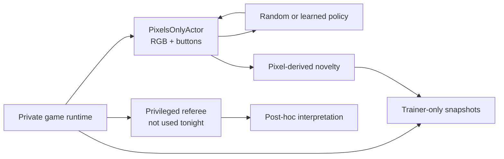
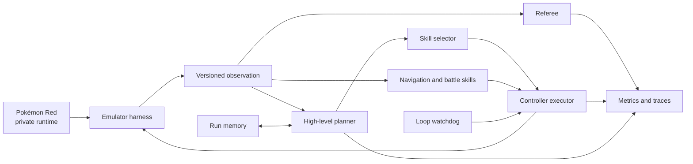
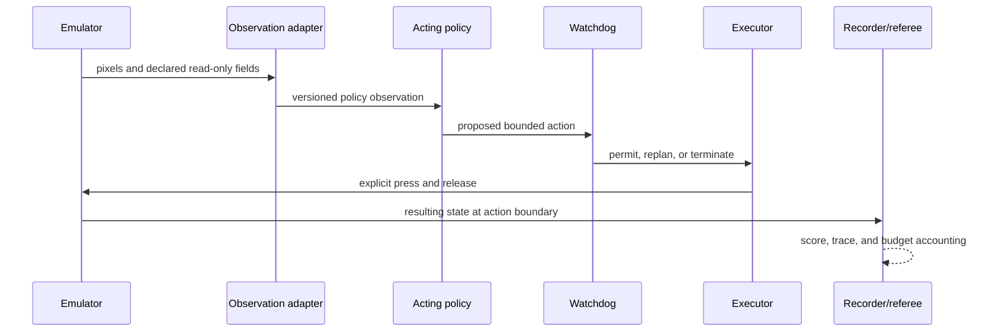
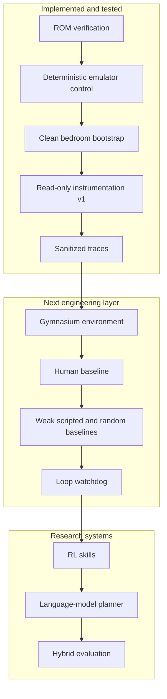

# Architecture

> **Primary-track update:** The game-naive, pixels-only track now comes first. The planner/RL hybrid
> described later in this document remains a possible informed comparison, not the source of
> actions or rewards in the blind experiment. See [Blind curiosity](blind-curiosity.md).

## Pixels-only authority boundary

The `PixelsOnlyActor` object deliberately exposes no raw PyBoy object, RAM reader, tile map,
snapshot method, OCR, or referee call. Snapshot branching belongs to the Archivist trainer. Its
selection uses only pixel cells and visit/selection counts. The current runner does not read RAM at
all. Tests verify the narrow facade and deterministic pixel-cell transformation.

## Later informed-comparison design

## Design goal

Build one reproducible harness that can compare a language-model controller, a trained RL policy,
and a hybrid system without changing the emulator or evaluation rules underneath them.

## Component boundaries

The arrows are authority boundaries, not just data flow. The planner may request a bounded skill;
it cannot write emulator memory. The referee may measure success; it cannot choose controller
actions. The recorder may describe what happened; it cannot change the outcome.

### Emulator harness

Owns the private ROM stream, PyBoy lifecycle, controller timing, screenshots, logical frame count,
and in-memory snapshots. It never saves cartridge RAM beside the ROM and exposes no memory-writing
method.

### State instrumentation and future observation adapter

The implemented Phase 0 reader converts six named WRAM fields into a versioned, read-only
instrumentation snapshot for validation, tracing, and future referee logic. No agent consumes this
snapshot yet. See [state-observation.md](state-observation.md) for the exact fields and caveats.

Phase 1 will define a separate policy observation schema: exactly which pixels and instrumentation
fields cross into an acting agent, how they are transformed, and when they are sampled. That schema
does not exist until the agent-facing environment and its tests are implemented.

### Planner

Chooses bounded goals such as exploring until a map transition or navigating to a previously
discovered doorway. It does not act every frame and cannot load snapshots, alter memory, or write
directly to the emulator.

### Skills

Execute bounded navigation and battle tasks. The first learned baseline will use PPO, but the
interface should permit deterministic and alternative learned implementations.

### Memory

Stores discovered map connections, evidence-backed facts, recent outcomes, and known failure
patterns. Official evaluation runs begin with empty run-specific memory unless a continual-learning
protocol is declared in advance.

### Executor and watchdog

The executor is the only agent-facing component allowed to request controller inputs. The watchdog
detects repeated screens, position cycles, and exhausted action budgets. During official evaluation
it may request replanning or terminate a run; it may not teleport or silently reload.

### Referee

Uses a separately declared set of read-only RAM fields to score progress and terminate tasks. Data
visible only to the referee must never leak into policy observations.

### Recorder

Writes JSONL events, metrics, and optional screenshots under ignored artifact directories. Traces
contain hashes and relative artifact references—not ROM paths, ROM bytes, raw save states, or secret
values.

## One decision cycle

The final cadence will vary by controller, but every implementation must preserve the same logical
order:

The policy never receives a hidden success signal through this loop. Any field used for reward but
not observation remains on the referee side of the boundary.

## What exists now and what is planned

This distinction is important: the current repository proves that the measuring instrument is
stable. It does not yet contain a trained Pokémon-playing model.

## Authority matrix

| Capability | Policy | Executor | Watchdog | Referee | Development harness |
| --- | :---: | :---: | :---: | :---: | :---: |
| Read declared policy observation | yes | yes | yes | yes | yes |
| Request controller action | yes | no | replan/stop only | no | yes |
| Send controller input | no | yes | no | no | yes |
| Read referee-only progress fields | no | no | declared subset | yes | yes |
| Write emulator memory | no | no | no | no | no |
| Load development snapshot | no | no | no | no | yes |
| Declare task success | no | no | no | yes | validation only |

Official evaluation disables development-only conveniences. If a future experiment changes one of
these cells, it becomes a different protocol and must be labeled accordingly.

## Reproducibility invariants

- A run is bound to one exact ROM SHA-256 and PyBoy version.
- Snapshots are accepted only when their payload hash, ROM hash, and PyBoy version match their
  metadata and the running emulator.
- Save/load occurs at neutral controller boundaries.
- Logical frame count rewinds with a snapshot even though PyBoy's own counter does not.
- Every action has explicit hold and release durations.
- Official prompts, checkpoints, and evaluation budgets are frozen before evaluation.
