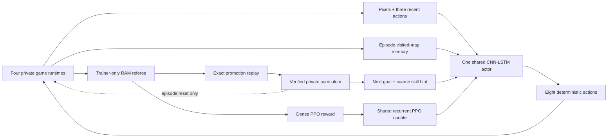
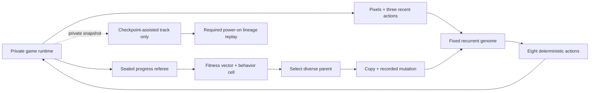
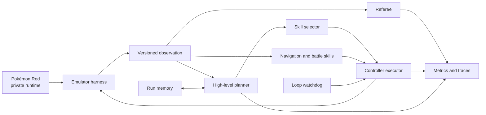
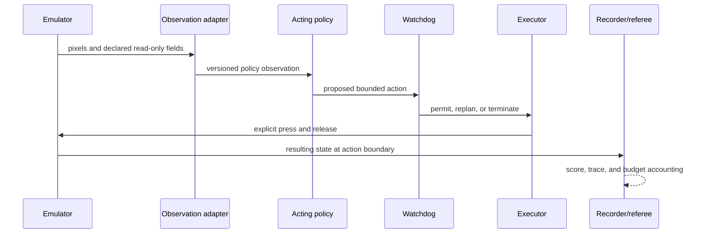
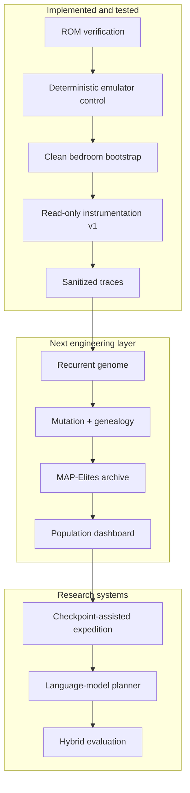

# Architecture

> **Primary-track update:** the active Version-5.2 system is one assisted recurrent teacher trained
> by PPO across four emulator environments. Its training aids are explicit and will be removed in
> a later pixels-only student and power-on evaluation. Existing pixels-only, random,
> quality-diversity, checkpoint, and verify-only learners remain reproducible comparisons. See
> [Parallel recurrent PPO](parallel-ppo.md).

## Active parallel-learning boundary

The current teacher receives pixels, its three most recent actions, a trainer-built map of positions
visited during this episode, and the next goal/skill lesson. The map exposes no future tiles,
collision data, or scripted buttons and resets with the episode. The referee computes reward and
checks named outcomes but cannot choose buttons. This lane cannot be presented as pixels-only. The
historical pixels-only actor omits both training aids; the separately labeled privileged comparator
instead adds a fixed 24-value state vector. A checkpoint restore resets actor memory, episode map,
and pixel history with emulator state.

## Historical evolutionary authority boundary

The genome never reads referee state, fitness, milestone labels, archive location, parent score, or
private snapshots. Selection may use those measurements after a fixed-policy child finishes. This
is learning between lifetimes, not an extra observation during one lifetime.

## Historical pixels-only authority boundary

The `PixelsOnlyActor` object deliberately exposes no raw PyBoy object, RAM reader, tile map,
snapshot method, OCR, or referee call. Snapshot branching belongs to the Archivist trainer. Its
selection uses only pixel cells and visit/selection counts. Later arena versions added a sealed RAM
referee to every lane for reporting; only declared rewarded lanes use those outputs for learning,
and only Conventional adds a disclosed coarse subset to policy state.

## Later informed-comparison design

## Design goal

Build one reproducible harness that can compare a language-model controller, a trained RL policy,
and a hybrid system without changing the emulator or evaluation rules underneath them.

## Component boundaries

The arrows are authority boundaries, not just data flow. The planner may request a bounded skill;
it cannot write emulator memory. The referee may measure success; it cannot choose controller
actions. The recorder may describe what happened; it cannot change the outcome.

### Emulator harness

Owns the private ROM stream, PyBoy lifecycle, controller timing, screenshots, logical frame count,
and in-memory snapshots. It never saves cartridge RAM beside the ROM and exposes no memory-writing
method.

### State instrumentation and future observation adapter

The read-only instrumentation began with six named WRAM fields and now supports expanded referee
measurements for maps, party, Pokédex, events, items, moves, badges, and blackouts. Actor and reward
boundaries remain separately declared for every lane. See
[reward-architecture.md](reward-architecture.md) for the current catalogue.

The pixels-only PPO schema contains two processed 72 × 80 grayscale frames plus one-hot encodings
of three previous actions. Version 5's assisted teacher appends a two-plane 64 × 64 visited/current
map, next-goal one-hot, three-way skill hint, and normalized map/goal context. Version 5.1 expanded
that context with the next map and distance on the shortest certified-or-observed route to the
active goal. Its signed route potential pays net progress and removes equal credit for reversal.
Version 5.2 extends the disclosed trainer topology only through Pewter Gym and adds trainer-only,
bounded credit when movement resumes after a stationary navigation trap. It does not expose the
trap type or a recovery button to the actor.
The privileged
comparator appends 24 normalized values instead. All three are described in
[Parallel recurrent PPO](parallel-ppo.md); reward-only fields remain on the referee side.

### Planner

Chooses bounded goals such as exploring until a map transition or navigating to a previously
discovered doorway. It does not act every frame and cannot load snapshots, alter memory, or write
directly to the emulator.

### Skills

Execute bounded navigation and battle tasks. Recurrent PPO is now the active shared-policy
baseline; the interface still permits deterministic and alternative learned implementations.

### Memory

Stores discovered map connections, evidence-backed facts, recent outcomes, and known failure
patterns. Official evaluation runs begin with empty run-specific memory unless a continual-learning
protocol is declared in advance.

### Executor and watchdog

The executor is the only agent-facing component allowed to request controller inputs. The watchdog
detects repeated screens, position cycles, and exhausted action budgets. During official evaluation
it may request replanning or terminate a run; it may not teleport or silently reload.

### Referee

Uses a separately declared set of read-only RAM fields to score progress and terminate tasks. Data
visible only to the referee must never leak into policy observations.

### Recorder

Writes JSONL events, metrics, and optional screenshots under ignored artifact directories. Traces
contain hashes and relative artifact references—not ROM paths, ROM bytes, raw save states, or secret
values.

## One decision cycle

The final cadence will vary by controller, but every implementation must preserve the same logical
order:

The policy never receives a hidden success signal through this loop. Any field used for reward but
not observation remains on the referee side of the boundary.

## What exists now and what is planned

This distinction is important: the repository contains exercised online Q learners, but the neural
population remains planned. Neither fact is a frozen claim that one model can play Pokémon.

## Authority matrix

| Capability | Policy | Executor | Watchdog | Referee | Development harness |
| --- | :---: | :---: | :---: | :---: | :---: |
| Read declared policy observation | yes | yes | yes | yes | yes |
| Request controller action | yes | no | replan/stop only | no | yes |
| Send controller input | no | yes | no | no | yes |
| Read referee-only progress fields | no | no | declared subset | yes | yes |
| Write emulator memory | no | no | no | no | no |
| Load development snapshot | no | no | no | no | yes |
| Declare task success | no | no | no | yes | validation only |

Official evaluation disables development-only conveniences. If a future experiment changes one of
these cells, it becomes a different protocol and must be labeled accordingly.

## Reproducibility invariants

- A run is bound to one exact ROM SHA-256 and PyBoy version.
- Snapshots are accepted only when their payload hash, ROM hash, and PyBoy version match their
  metadata and the running emulator.
- Save/load occurs at neutral controller boundaries.
- Logical frame count rewinds with a snapshot even though PyBoy's own counter does not.
- Every action has explicit hold and release durations.
- Official prompts, checkpoints, and evaluation budgets are frozen before evaluation.
