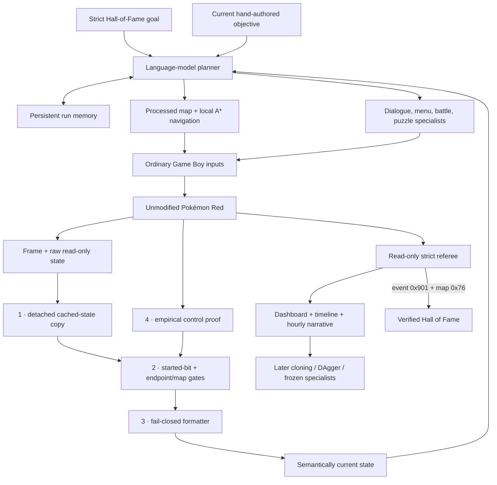
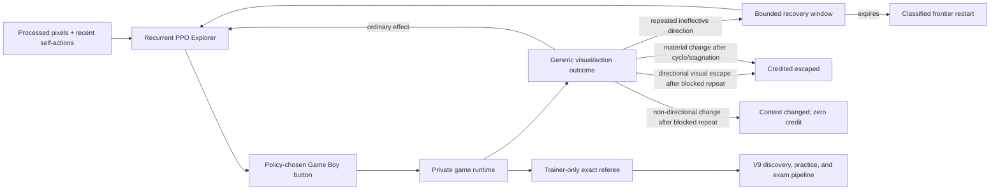
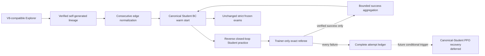
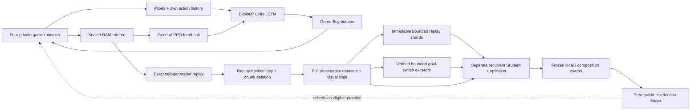
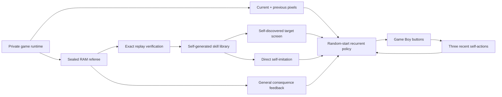
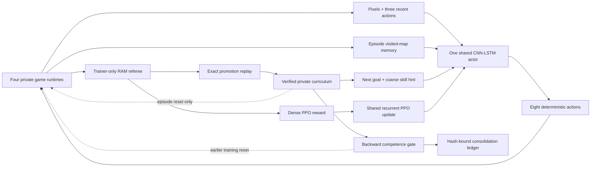
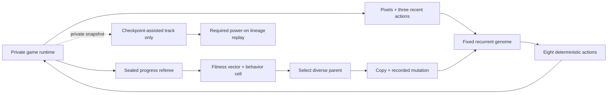
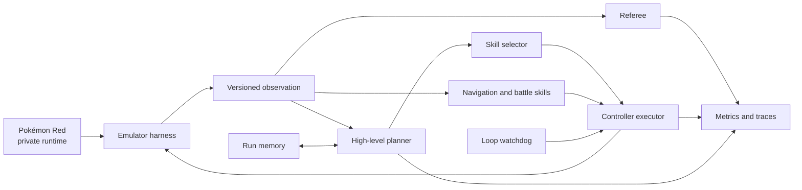
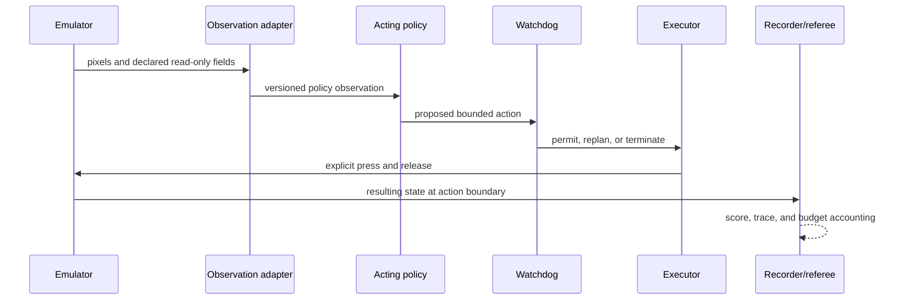
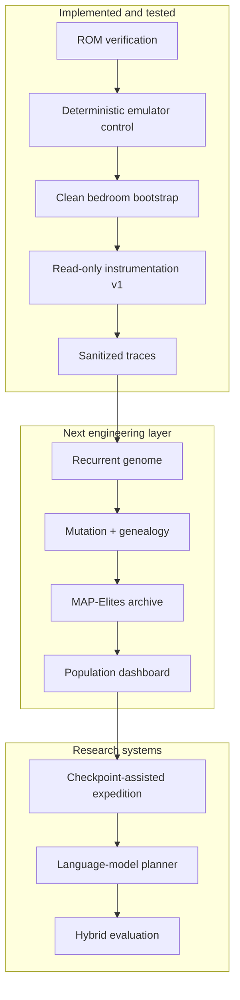

# Architecture

> **Primary-track update:** Versions 7–10 are now preserved controls rather than the active
> completion architecture. V8 separated exploration from a recurrent Student but ended at 1/47
> frozen exams. V9 added reverse closed-loop practice and reached 68.5919% training accuracy, yet
> ended at 4/87 with zero competent skills. V10 added bounded policy-controlled local recovery and
> qualified that mechanism, but its matched run again stopped at Route 1: 534,924 Explorer actions,
> 3/32 frozen exams, zero competent skills, and no composition. Its 1,977-window recovery ledger is
> complete; the result does not support broader exploration or long-horizon competence. See
> [Version 9](version-9-self-correcting-student.md) and
> [Version 10](version-10-recovery-before-reset.md).
> [Version 11](version-11-hierarchical-pivot.md) was the assisted implementation track. It changed
> the unit of
> reasoning from flat button-level reward optimization to a disclosed assisted hierarchy: a
> structured-state language-model planner, persistent run memory, processed maps, map-local A*
> navigation, controller specialists, and a separate strict completion referee. It begins from
> power-on with no imported save, action lineage, evolved policy, or prior-run gameplay memory.
> Canary 4 qualified the opening referee and empirical player-control gate. Its continuous run then
> closed after 950.308 seconds, 329 actions, and 144 online model calls. V11 remains a labeled
> assisted control.
> [Version 12](version-12-final-self-learner.md) is the final implementation track: one
> random-initialized recurrent visual actor, direct clean power-on, self-generated future-frame
> goals, correct-goal contrast, route-agnostic recovery, replay-verified rare discoveries, and
> checkpoint-separated frozen exams. Three bounded real-ROM canaries qualified that mechanism. The
> fixed 48-hour run is prepared but has not launched because the T7 is unmounted.

## Preserved Version-11 assisted boundary

## State truth is a server property

Canary 3 showed why the arbiter belongs between raw memory and planning. Oak's introduction was
still visible, yet initialized transition RAM looked like a playable `RedsHouse2f (3,6)` and the
server called it `overworld`. The planner trusted its declared interface, asked A* for a bedroom
path, and self-attested the first objective. The operator rejected that progress and stopped the
run after 251.630 seconds and 50 actions. Prompting the planner to “be careful” would have left the
same false authority in place.

The replacement boundary has four mutually reinforcing layers:

1. server and tool consumers deep-copy the emulator's short-lived cached state before enriching it;
2. the documented game-start bit gates player/world fields, every map-producing endpoint, direct
   map tools, and navigation, while stale pre-game map caches are discarded;
3. the formatter independently refuses map context when `game_started` is false; and
4. the opening objective requires empirical controller evidence—an ordinary directional input must
   change the bedroom coordinates—rather than a planner declaration or plausible static tuple.

The exact Gen 1 signals and their pinned `pret/pokered` sources are recorded in
[state-observation.md](state-observation.md). Battle, structural message-box detection, `pregame`,
and `overworld` remain reader decisions; a dashboard dialogue cache cannot overwrite them.

Canary 4 qualified this opening boundary when RIGHT moved RED from `(3,6)` to `(4,6)` at
`2026-07-22T03:22:41Z`. Only afterward did the server accept `pallet_000`. The bounded run finished
at story index 1/84 with no party, badges, or Hall-of-Fame result. A residual server-only pre-game
map leak found during that canary motivated extending the same gates across the HTTP state and map
endpoints, MCP state/map/navigation tools, and formatter. The following continuous run,
`v11-continuous-20260721-233300`, closed after 950.308 seconds and does not make an advance
completion claim.

The planner owns the next subgoal and may use explicit structured assistance. The navigator converts
a same-map destination into directional controller inputs. Specialists handle interactions where a
coordinate is insufficient. Persistent memory records discoveries, failures, and recovery plans.
The referee may observe exact game state, report progress, and stop the run, but cannot select,
replace, or mask a controller action.

This is intentionally a different information boundary from V7–V10. Every result must carry the
label `STRUCTURED-STATE LLM PLANNER + A* NAVIGATOR + CONTROLLER SPECIALISTS / ASSISTED MAP +
OBJECTIVE + RUN MEMORY / POWER-ON / HYBRID-SYSTEM`. A successful run would demonstrate disclosed
hierarchical completion, not pixels-only discovery, newly trained foundation-model weights, or the
existing frozen-policy H5 claim.

Clean start is a validity condition, not a visual impression. Adjacent-state auto-load is disabled
by default, and a claimed run starts with empty run memory. Completion requires both event bit
`0x901` and Hall-of-Fame map `0x76`; entry into the Champion room is not sufficient. Canary 4 proved
the opening referee, local planner authentication, ordinary-button authority, evidence refresh, and
bounded shutdown. The continuous run must still prove later objective validation, stall recovery,
and strict terminal monitoring before a Hall-of-Fame result can be claimed.

If V11 completes the game, its full success-and-correction trajectory becomes training data for
behavioral cloning and DAgger-style specialists. Learned components must then replace the guided
ones one at a time under frozen power-on evaluation. The assisted teacher and any later learned
student remain separate claims.

## Historical Version-10 implementation boundary

V10 adds no actor observation key. Short-term direction/outcome memory belongs to trainer-side
reward and termination code. It may establish that one directional action had no useful generic
effect, apply the declared bounded penalty, and determine whether recovery succeeded or expired.
It cannot choose, replace, sample, or mask an action. It cannot consult authored route distance,
destination-specific logic, or a correct direction. The dashboard must expose trainer-selected
buttons as zero. After a visual-cycle or pixels-only long-stagnation trigger, escape is deliberately
semantic-free: a policy-chosen direction, A/B press, dialogue advance, or menu change may qualify.
After `blocked_repeat`, only a policy-chosen directional material visual outcome is
credited `escaped`; non-directional material change closes as zero-credit `context_changed` and is
not an escape or success. An expired window is a terminal PPO failure; only the ordinary episode
action ceiling remains a time-limit truncation.

Pixels-only long stagnation opens recovery after 1,024 consecutive ineffective outcomes, before the
legacy hard watchdog can terminate. Visually effective activity, including backtracking through an
already visited position, resets that hard timer without clearing the independent 128-frame,
at-most-eight-signature visual-cycle detector. Visual-cycle and long-stagnation triggers already
receive the ordinary -2 loop penalty before at most +0.25 escape credit.

Fresh-start means random untrained parameters and only a verified power-on root imported from the
predecessor curriculum. After the new run replay-verifies its own progress, Explorer episodes may
restart from that self-generated frontier. This is checkpoint-assisted training from the run's own
experience, not a claim that every training episode begins at power-on and not permission to import
V9's learned route.

Campaign-level V10 narrative counters, unique positions, and active environment ranks are
checkpointed under `v10-narrative-telemetry-v1`. Episode-local detector history cannot be restored
into a fresh emulator rollout, so persisted active ranks become `abandoned_on_resume`. Active
windows are likewise classified on episode and campaign end. Every opened window must therefore be
exactly escaped, context-changed, expired, active, or abandoned; unresolved inactive windows must
remain zero.

The separate Student, consecutive-edge graph, reverse closed-loop practice, success-only
aggregation, and frozen exam authority remain V9-compatible. A successful recovery is therefore
Explorer training evidence only. It does not grant a Student skill, local competence, composition,
or Hall-of-Fame capability. Deterministic E2 qualification passed with 67 focused checks, 293
default-suite passes plus 13 private-ROM skips, and 54/54 selected ROM-bearing checks with the
private ROM in 19.02 seconds. Escape credit is capped at the 0.25 blocked-activation penalty, so the
credited directional pair is reward-neutral; a non-directional blocked-repeat context change earns
zero. This qualifies engineering behavior, not a real-ROM campaign result, exploration, or
competence. Direct E3 mechanism calibration at the committed ground-floor fixture proves Up×3 →
Start is zero-credit `context_changed`, while a fresh Up×3 → Down is credited `escaped`; the
submitted and executed buttons remain identical in both sequences.

The first clean campaign canary bound this architecture to commit
`a0ec14a5506fe3a0c4bcb15787f68be4d512d764`, seed 20260810, the private ROM, and one environment.
It stopped at `duration_limit` after 144.102 seconds, 6,099 actions, and 47 PPO updates. All 73
windows were `blocked_repeat`: 36 escaped, 32 context-changed, and five expired; active, abandoned,
unresolved, and action-override counts ended at zero. Its two verified promotions, ground-floor
depth, and 93 positions are canary observations, not evidence of better exploration or learning.
Visual-cycle and long-stagnation campaign paths remained unexercised in that canary. The
matched-configuration V10 campaign `parallel-ppo-v10-recovery-8h-20260721-seed20260809` began at
`2026-07-22T00:37:44.442964Z` from clean commit
`513afc378d091d18560efb4af4931d882c05000d` and later ended cleanly by SIGINT. Its terminal record
contains 4,503.282 seconds, 534,924 Explorer actions at 118.785/s, 522 PPO updates, 122 episodes,
567 unique positions, and seven promotions through Route 1. The Student completed 270 rounds and
3,366 updates over 121,194 examples, but finished at 43.2519% action accuracy, 1.556849 NLL, and
3/32 frozen exams; zero skills became competent and no composition ran. Recovery closed 1,977
windows as 956 escaped, 910 context-changed, 110 expired, and one campaign-end abandonment, with
zero trainer-overridden actions. This is a complete negative learning result, not a Hall-of-Fame or
superiority claim.

## Historical Version-9 implementation boundary

The actor observation keys are exactly `pixels`, `action_history`, and `target_pixels`. Practice
may restore a snapshot reached by the same run and schedule a reverse rung, but skill identity,
rung, horizon, attempt seed, RAM, coordinates, and milestone labels remain trainer-only. Closed-
loop means the Student chooses every practice button. Failed attempts are evidence but never BC
targets. The mechanism qualified on the real ROM, but the terminal 4/87 frozen result produced no
competent skill or composition.

## Closed Version-8 boundary

Explorer and Student never share an optimizer. PPO rollout gradients cannot overwrite the Student,
and Student imitation gradients cannot change the Explorer. Trainer-only state can propose a
candidate milestone boundary or removable loop, but an emulator replay must independently preserve
the protected outcome before the edit enters a dataset. The Student sees a short terminal pixel
clip, never the milestone label used by the verifier.

The prerequisite scheduler can order only transitions this same run discovered. Periodic frozen
exams reset recurrent state, preserve every planned attempt, and may revoke competence after
retention failures. Exactly one deterministic grade is allowed per Student checkpoint at 16,384-
Explorer-action intervals; an 8/10 local window spans ten different Student versions. Local
snapshot competence remains a weaker claim than restore-free composition from power-on.

That composition lane is a disclosed goal-conditioned hierarchy. One frozen Student chooses the
buttons, but the trainer-side RAM referee switches its current target among an ordered playlist of
self-generated visual clips when declared milestones fire. It supplies neither an authored quest
route nor a controller action. A future Hall-of-Fame result would therefore mean completion under
this frozen goal-switching protocol, not unaided pixel-only autonomy.

Training for those switches is also self-generated and fail closed. Once a competent chain has at
least two edges, the trainer streams its exact compressed actions continuously from power-on and
verifies every protected endpoint. A success yields bounded pre/post-switch excerpts with no reset
at the switch; a failure is ledgered and supplies no examples. Only the current deepest verified
composition enters Student replay, with one ticket per constituent skill and deterministic
boundary rotation. Each local skill is divided at admission into immutable hash-bound shards, each
with at most 512 loss-bearing examples and up to one burn-in predecessor prefix. A persisted
per-skill cursor opens one shard per routine round and covers all shards across resume; the full
skill NPZ remains provenance-only. Archived composition datasets and audits remain hash-bound but
inactive.

Composition endpoint identity deliberately differs from distillation identity. Real-ROM testing
found PyBoy's full game-area hash can change after save/load while the processed visual and every
enumerated gameplay RAM field remain equal. Composition therefore matches the exact save/load-
stable visual-plus-RAM signature. Distillation keeps the stricter game-area hash because every
candidate comparison replays from the same snapshot. A stored two-skill power-on-to-bedroom chain,
a four-noop save/load chain, and wrong-endpoint rejection qualify this verifier mechanism; none is
a learned Student playthrough.

V8's reward tracker skips authored route guidance, active-goal lookup, and Mart-specific
calculations when its navigation/Mart weights are disabled. Its watchdog can react to new positions
and general durable consequences, but cannot consult authored route distance, milestone index, or
Viridian Mart script. V8 launch also
requires a clean Git commit including untracked-file detection. Checkpoint integrity binds source,
verified ROM identity, frozen curriculum, Explorer, Student, Student optimizer, skill/exam ledger,
distillation artifacts, worker memories, and action counter. The legacy V7 serializer omits V8-only
controls; missing ROM identity is backfilled only during resume without rewriting recorded source.
Routine checkpoints revalidate new or changed skill shards and every new or active composition.
They may skip unchanged archived files only when the exact seal is already bound by the last
atomically committed checkpoint; resume and full audit verify all sealed artifacts again.
For a fresh V8 comparison, `--v7-denominator PATH` read-only locks one running or finished V7
self-taught checkpoint by pairing its checkpoint-declared model hash with `latest` or `previous`.
The V8 manifest stores only path-free identity, action/milestone evidence, both hashes, and lock
state/timestamps. Resume consumes that sealed record and cannot point at a newer denominator.
V7 deliberately retains its historical authored watchdog shaping so an unchanged resume remains a
valid denominator; it is not fully blind at that trainer-side termination boundary.

If only the `previous` artifact matches the atomic checkpoint, recovery copies it back to `latest`
without consuming the fallback. A simulated second interrupted rotation is unit-checked; this does
not replace the pending process-kill real-ROM crash twin.

## Version-7 denominator boundary

The V7 target image is zero during open exploration. It becomes a previously observed terminal screen
only while rehearsing a transition this same run produced and replayed. Labels, coordinates,
routes, event flags, and earlier agents' actions never enter the actor. The unique root snapshot is
training infrastructure; every later inherited curriculum entry is deleted before V7 begins. V7
uses one network for PPO and direct self-imitation; V8 preserved a locked launch-time snapshot so
the two roles remain historically distinguishable. No terminal matched V7/V8 comparison exists.

## Historical assisted parallel-learning boundary

The current teacher receives pixels, its three most recent actions, a trainer-built map of positions
visited during this episode, and the next goal/skill lesson. The map exposes no future tiles,
collision data, or scripted buttons and resets with the episode. The referee computes reward and
checks named outcomes but cannot choose buttons. This lane cannot be presented as pixels-only. The
historical pixels-only actor omits both training aids; the separately labeled privileged comparator
instead adds a fixed 24-value state vector. A checkpoint restore resets actor memory, episode map,
and pixel history with emulator state.

Version 6 changes policy and scheduling continuity rather than the actor observation. A clean
predecessor supplies the PPO policy and optimizer. Frontier episodes seek discoveries;
consolidation episodes begin at one declared earlier checkpoint and target the current verified
frontier. Only the latter enter the rolling gate. Passing moves the start backward; it does not
change controller authority or qualify as a frozen evaluation.

## Historical evolutionary authority boundary

The genome never reads referee state, fitness, milestone labels, archive location, parent score, or
private snapshots. Selection may use those measurements after a fixed-policy child finishes. This
is learning between lifetimes, not an extra observation during one lifetime.

## Historical pixels-only authority boundary

The `PixelsOnlyActor` object deliberately exposes no raw PyBoy object, RAM reader, tile map,
snapshot method, OCR, or referee call. Snapshot branching belongs to the Archivist trainer. Its
selection uses only pixel cells and visit/selection counts. Later arena versions added a sealed RAM
referee to every lane for reporting; only declared rewarded lanes use those outputs for learning,
and only Conventional adds a disclosed coarse subset to policy state.

## Later informed-comparison design

## Design goal

Build one reproducible harness that can compare a language-model controller, a trained RL policy,
and a hybrid system without changing the emulator or evaluation rules underneath them.

## Component boundaries

The arrows are authority boundaries, not just data flow. The planner may request a bounded skill;
it cannot write emulator memory. The referee may measure success; it cannot choose controller
actions. The recorder may describe what happened; it cannot change the outcome.

### Emulator harness

Owns the private ROM stream, PyBoy lifecycle, controller timing, screenshots, logical frame count,
and in-memory snapshots. It never saves cartridge RAM beside the ROM and exposes no memory-writing
method.

### State instrumentation and future observation adapter

The read-only instrumentation began with six named WRAM fields and now supports expanded referee
measurements for maps, party, Pokédex, events, items, moves, badges, and blackouts. Actor and reward
boundaries remain separately declared for every lane. See
[reward-architecture.md](reward-architecture.md) for the current catalogue.

The pixels-only PPO schema contains two processed 72 × 80 grayscale frames plus one-hot encodings
of three previous actions. Version 5's assisted teacher appends a two-plane 64 × 64 visited/current
map, next-goal one-hot, three-way skill hint, and normalized map/goal context. Version 5.1 expanded
that context with the next map and distance on the shortest certified-or-observed route to the
active goal. Its signed route potential pays net progress and removes equal credit for reversal.
Version 5.2 extends the disclosed trainer topology only through Pewter Gym and adds trainer-only,
bounded credit when movement resumes after a stationary navigation trap. It does not expose the
trap type or a recovery button to the actor.
Version 6 retains this observation schema while preserving policy/optimizer state and adding a
trainer-side backward scheduler. Consolidation results never enter the actor input.
The privileged
comparator appends 24 normalized values instead. All three are described in
[Parallel recurrent PPO](parallel-ppo.md); reward-only fields remain on the referee side.

### Planner

Chooses bounded goals such as exploring until a map transition or navigating to a previously
discovered doorway. It does not act every frame and cannot load snapshots, alter memory, or write
directly to the emulator.

### Skills

Execute bounded navigation and battle tasks. Recurrent PPO is now the active shared-policy
baseline; the interface still permits deterministic and alternative learned implementations.

### Memory

Stores discovered map connections, evidence-backed facts, recent outcomes, and known failure
patterns. Official evaluation runs begin with empty run-specific memory unless a continual-learning
protocol is declared in advance.

### Executor and watchdog

The executor is the only agent-facing component allowed to request controller inputs. The watchdog
detects repeated screens, position cycles, and exhausted action budgets. During official evaluation
it may request replanning or terminate a run; it may not teleport or silently reload.

### Referee

Uses a separately declared set of read-only RAM fields to score progress and terminate tasks. Data
visible only to the referee must never leak into policy observations.

### Recorder

Writes JSONL events, metrics, and optional screenshots under ignored artifact directories. Traces
contain hashes and relative artifact references—not ROM paths, ROM bytes, raw save states, or secret
values.

## One decision cycle

The final cadence will vary by controller, but every implementation must preserve the same logical
order:

The policy never receives a hidden success signal through this loop. Any field used for reward but
not observation remains on the referee side of the boundary.

## What exists now and what is planned

This distinction is important: the repository contains exercised online Q learners, but the neural
population remains planned. Neither fact is a frozen claim that one model can play Pokémon.

## Authority matrix

| Capability | Policy | Executor | Watchdog | Referee | Development harness |
| --- | :---: | :---: | :---: | :---: | :---: |
| Read declared policy observation | yes | yes | yes | yes | yes |
| Request controller action | yes | no | replan/stop only | no | yes |
| Send controller input | no | yes | no | no | yes |
| Read referee-only progress fields | no | no | declared subset | yes | yes |
| Write emulator memory | no | no | no | no | no |
| Load development snapshot | no | no | no | no | yes |
| Declare task success | no | no | no | yes | validation only |

Official evaluation disables development-only conveniences. If a future experiment changes one of
these cells, it becomes a different protocol and must be labeled accordingly.

## Reproducibility invariants

- A run is bound to one exact ROM SHA-256 and PyBoy version.
- Snapshots are accepted only when their payload hash, ROM hash, and PyBoy version match their
  metadata and the running emulator.
- Save/load occurs at neutral controller boundaries.
- Logical frame count rewinds with a snapshot even though PyBoy's own counter does not.
- Every action has explicit hold and release durations.
- Official prompts, checkpoints, and evaluation budgets are frozen before evaluation.
