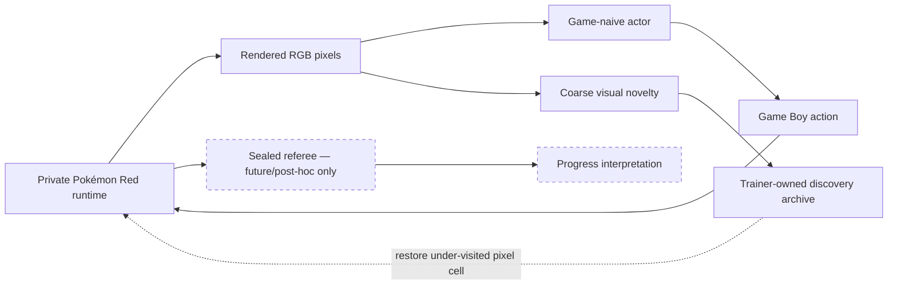

# Game-naive, pixels-only curiosity

> **Historical baseline note:** this protocol records why Monkey and Archivist were built and keeps
> their runs reproducible. Pure Monkey is now retired from future headline arenas because it cannot
> retain successful behavior. Its planned replacement is
> [Evolutionary Explorer](neuroevolution.md).

## The question

**How far can an agent get in Pokémon Red when nobody tells it what Pokémon is?**

The primary experiment begins at power-on. The agent receives the rendered 160×144 Game Boy
screen, the names of the nine available controller actions, and nothing resembling a walkthrough.
It is not told that the moving shape is a player, that text should be advanced with A, that doors
connect places, that Pokémon can be caught, or that badges exist.

“Game-naive” is more accurate than “born with no prior knowledge.” The experimenter still supplies
an emulator, a screen, a controller, action timing, a visual novelty calculation, computation, and
the decision to preserve interesting discoveries. Those advantages must remain visible in every
claim.

## The three agents

The project will compare three increasingly capable systems under the same pixel and controller
boundary.

| ID | Name | What changes with experience? | Status |
| --- | --- | --- | --- |
| B0 | **Monkey** | Nothing; buttons are sampled from a frozen distribution | Implemented, baseline concluded |
| B1 | **Curious** | A local policy learns to seek visually unfamiliar situations | Planned |
| B2 | **Archivist** | A trainer preserves novel pixel states and branches random exploration from under-visited cells | Implemented |

B0 is the “monkeys with typewriters” control. It demonstrated chance but no inheritance and is no
longer allocated a future long-horizon lane. B2 is the practical first learner: its individual
buttons are still uniformly random, but its pixel-driven trainer chooses which discoveries receive
memory and where the next random branch begins. It has no neural network; its archive is persistent
learned state. Calling it a “snapshot-assisted pixels-only visual-novelty archive search” is
accurate. Calling it a policy that looks at pixels to choose buttons—or a trained Pokémon
model—would be premature. B1 will later test whether a compact neural policy can internalize useful
behavior and choose actions from pixels directly.

## The blindness contract

The word “blind” is easy to overclaim. This project therefore treats every possible influence on a
decision—not only the policy input—as part of the information boundary.

| Channel | Allowed in B0/B1/B2? | Notes |
| --- | :---: | --- |
| Rendered RGB screen | yes | Frozen shape, cadence, preprocessing, and quantization |
| Agent's own previous actions | yes | Controller history is not game knowledge |
| Pixel-derived novelty signal | B1/B2 | B1 reward; B2 archive-admission score; no semantic labels |
| RAM, map ID, coordinates, party, battle state | no | May be used only by a sealed post-run referee later |
| PyBoy tile or `game_area()` values | no | These are internal structure, not rendered pixels |
| OCR or text transcript | no | Reading text is something the agent must eventually learn |
| Walkthroughs, maps, prompts, internet, or tools | no | No external Pokémon knowledge during a run |
| Human controller demonstrations | no | A human run may be compared afterward but never trained on |
| Scripted intro | no for power-on claims | Existing bedroom bootstrap remains a harness calibration |
| Save-state restore | B2 trainer only | Selected solely through pixel cells and visit counts |



The dashed referee lane cannot influence intrinsic score, reward, stopping, resets, archive
selection, action masks, checkpoint selection, or policy memory. A hidden RAM field used for any
of those purposes would still be leaked information.

## What “visual novelty” means in version 1

The current runner uses a deliberately small, frozen transformation:

1. Take the rendered 160×144 RGB screen at a controller-action boundary.
2. Convert it to brightness without OCR, object recognition, or a pretrained model.
3. Average each aligned 8×8 pixel block, producing a 20×18 grid.
4. Quantize each grid cell into eight brightness levels.
5. Hash the resulting 360-byte grid into a visual-cell identifier.
6. Award one intrinsic point the first time that identifier enters a bounded visit filter.

This groups some tiny pixel changes while retaining large layout and text changes. It is not a
perfect definition of a meaningful situation. Two different game states can look identical, and a
small animation can sometimes look novel. Those are scientific limitations, not implementation
details to hide.

The live **novelty rate** is:

```text
(first-visited visual cells after power-on) / controller actions
```

A falling rate can mean the agent is exhausting a region. It can also mean the visual hash is too
coarse. A high rate can mean real discovery, rapidly changing text, or an animation exploit. The
screen reel is required beside the number so viewers can distinguish those stories.

## How the Archivist learns

The Archivist is inspired by archive-based exploration:

1. Begin from an unmodified power-on state.
2. Record the first coarse visual cell and an integrity-bound emulator snapshot.
3. Select an under-visited archive cell without consulting game state.
4. Restore that cell and press random buttons for a short branch.
5. Add newly observed visual cells, their compressed snapshots, and their action lineage.
6. Repeat until a declared action, time, disk, or stop limit is reached.

Snapshot restores make rare discoveries computationally reusable. They also mean B2 is not one
continuous playthrough and is more capable than a literal monkey. The dashboard and manifest say
this explicitly. Clean power-on evaluation, once a policy exists, will disable learning and archive
restores.

Archive capacity is bounded. Once full, the trainer continues measuring pixel novelty and branching
from retained cells but cannot preserve every new screen. The visit filter is also bounded and can
produce false “already seen” results; it cannot manufacture a false novelty score.

## The first overnight protocol

The development run is deliberately resource-limited:

| Budget | Default ceiling |
| --- | ---: |
| Wall clock | 8 hours |
| Controller actions | 5,000,000 |
| Emulator workers | 1 per experimental arm |
| Retained Archivist cells | 10,000 |
| Screenshots | 96 |
| Run-directory size | 512 MiB |
| Free-disk emergency stop | 10 GiB |
| Status refresh | 30 seconds |
| Durable checkpoint | 5 minutes |

The first run is development evidence, not a performance evaluation. Its job is to reveal whether
the agent can escape trivial screen loops, whether the novelty definition is exploitable, how the
archive grows, and which failure becomes the next research question.

## Running it

Keep the ROM private and outside the repository. After installing the normal project dependencies:

```bash
export POKEMON_RED_ROM="/absolute/private/path/to/Pokemon Red.gb"

pokemon-red-ai blind-run \
  --mode archivist \
  --hours 8 \
  --max-actions 5000000
```

The random control uses the same boundary and limits:

```bash
pokemon-red-ai blind-run \
  --mode monkey \
  --hours 8 \
  --max-actions 5000000
```

Each command prints its run directory when it finishes. While it runs:

```bash
pokemon-red-ai blind-status runs/blind-archivist-YYYYMMDDTHHMMSSZ
```

Open `index.html` in that directory for the visual dashboard. Request a graceful stop with:

```bash
pokemon-red-ai blind-stop runs/blind-archivist-YYYYMMDDTHHMMSSZ
```

The runner checks the `STOP` request at a safe action boundary, writes a final checkpoint, updates
the dashboard, and records the stop reason. Resume requires the original run directory and exactly
the same configuration so an accidental rule change cannot silently enter one result.

### Unattended macOS launch

For an overnight run, a foreground terminal is too fragile. From the repository root with the ROM
environment variable already exported, launch a detached `screen` session at reduced priority and
hold a macOS idle-sleep assertion for the lifetime of the experiment:

```bash
/usr/bin/screen -L \
  -Logfile runs/overnight-archivist.console.log \
  -dmS pokemon-archivist \
  /usr/bin/caffeinate -i \
  /usr/bin/nice -n 10 \
  .venv/bin/pokemon-red-ai blind-run \
  --output runs/overnight-archivist \
  --mode archivist \
  --hours 8 \
  --max-actions 5000000
```

Use `screen -ls` to verify the detached session and `pokemon-red-ai blind-status` to verify a fresh
heartbeat. `caffeinate` prevents idle sleep while the command runs; it cannot keep a Mac laptop
running with its lid closed. Leave the machine connected to power with adequate ventilation.

The checkpoint records a source/implementation digest and a trace offset. Resume refuses changed
code or configuration, clears an already-honored stop marker, and truncates trace events newer than
the recovered checkpoint. Two checkpoint generations are retained so an interrupted write does not
destroy the previous recovery point.

## What the dashboard communicates

Every run produces a local, self-contained dashboard with:

- the exact information contract;
- elapsed time and controller actions;
- unique coarse visual cells and archive size;
- discovery growth over time;
- novelty rate and action throughput;
- the complete button distribution;
- the latest rendered screen; and
- a bounded reel of visual-discovery milestones.

The page contains no remote scripts, ROM bytes, save-state payloads, RAM values, or model-generated
actions. Screenshots and checkpoints stay under Git-ignored `runs/` and must be reviewed before any
publication.

## How to interpret the morning result

Ask these questions in order:

1. **Did the process honor its limits?** Check the stop reason, checkpoint cadence, output size, and
   absence of privileged inputs.
2. **Did discovery continue?** Inspect the curve rather than only the final count.
3. **What produced the novelty?** Use the reel to separate menus, text, animation, and meaningful
   transitions.
4. **Did memory help?** Preserve the historical Archivist/Monkey comparison; do not spend new
   long-horizon budgets merely repeating a non-learning control.
5. **What is the most honest claim?** “Reached a naming screen” is stronger than “learned menus”;
   “found more visual cells” is not the same as “made more game progress.”

Important expected failures include farming blinking screens, repeatedly editing a name, being
unable to interpret menus, merging different hidden states that share one screen, and filling the
archive with visually different but behaviorally useless cells. Each failure supplies the premise
for the next experiment.

## Where language models belong

Codex can implement, audit, launch, summarize, and document the experiment. It must not select each
Game Boy action. A per-action language-model loop would be many orders of magnitude slower than the
emulator, consume unnecessary usage, inject pretrained Pokémon knowledge, and weaken the central
premise.

The overnight actor therefore runs entirely locally and makes no OpenAI calls. A language model may
help interpret the reviewed artifacts afterward, with that interpretation kept separate from the
recorded behavior.
