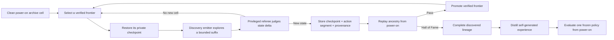

# The Hall of Fame completion program

> **Status, 2026-07-22:** The checkpoint, evolutionary, PPO, and recurrent-Student work remains the
> frozen learned-policy lane. It produced real local mechanisms and verified fragments but no
> competent whole-game policy. V10 is its latest terminal record: 4,503.282 seconds, 534,924
> actions, 3/32 frozen exams, and zero competent skills. It is closed.
>
> V11 became the separately labeled assisted hierarchical lane: a
> structured-state language-model planner, processed maps and A* navigation, persistent run memory,
> controller specialists, and a strict read-only Hall-of-Fame referee. Its canary history is part of
> the evidence. C1 failed on path resolution; C2 failed on MCP authorization; C3 became operational
> but was rejected after initialized bedroom RAM falsely described story progress; and C4 qualified
> the opening referee after 136 controller actions and 70 language-model calls with empirical RIGHT-
> movement proof and story objective 1/84. Its continuous attempt closed after 950.308 seconds, 329
> controller actions, and 144 online model calls. V12 is now the final experiential experiment: one
> local recurrent visual actor learns from self-generated future-frame goals and receives no live
> model decisions, walkthrough, demonstrations, or predecessor policy. Three bounded canaries
> qualified the mechanism. The T7 storage gate now passes at 220 GiB free; a zero-action detached-
> process failure is preserved and the source-frozen launch retry uses a macOS job. No competent
> skill, Hall-of-Fame result, success probability, or completion guarantee is claimed.

### Implementation ledger

| Completion foundation | State | Evidence boundary |
| --- | --- | --- |
| Ordered named milestone catalogue | ✅ Implemented and tested | 66 read-only outcomes, including mandatory keys/HMs, Parcel return stages, and the complete map-level road to Pewter Gym; does not imply an agent reached any of them |
| Strict Hall-of-Fame condition | ✅ Implemented and tested | Champion event and Hall-of-Fame map must coincide |
| Private snapshot/action store | ✅ Implemented and tested | ROM/version/payload, parent, frame, depth, cell, lineage, and audit hashes fail closed |
| Mandatory power-on replay semantics | ✅ Real-ROM integration checked | A deliberately false Hall-of-Fame cell is rejected even when its snapshot and screen hashes replay exactly |
| Verified frontier promotion | ✅ Implemented | Every v2 lineage boundary needs one exact local edge replay; milestone advances additionally need three complete power-on replays |
| Single-writer bounded runner and dashboard | ✅ Implemented and checked | Real stop/resume preserved archive, selection/RNG state, and the intervention ledger |
| First autonomous house-exit qualification | 🟨 H3 reached; Q1 failed 1/2 | One seed replayed `left_home`; both-seed robustness requirement was not met |
| Bookkeeping/disk scaling foundation | ✅ Implemented and private-ROM checked | Constant-time replay-count lookup, streamed lineages, topological validation, and bounded disk reconciliation; does not reduce emulator replay count by itself |
| Archive v2 local verification/scheduling | ✅ Staged real-ROM qualification passed | Continuous, graceful-resume, and hard-crash trials reached exact limits; edge cost stayed bounded and the crash twin matched deterministic terminal state |
| Visual Apprentice v1 | ✅ Local development curriculum complete | Stage 0 replayed the exact route; the adaptive reverse curriculum then completed seven rungs and two final 29/30 windows; no held-out H2 claim |
| Recurrent PPO curriculum | ✅ Viridian City verified | Version 4 promoted a 2,109-action suffix after one edge and three power-on replays; this is checkpoint-assisted H3 evidence |
| Version 5 assisted teacher | ✅ Closed at Oak's Parcel | Three replay-verified promotions reached the Mart and Parcel; the run also exposed obsolete lesson reward after completion |
| Version 5.1 active-goal return curriculum | ✅ Closed at the Pokédex | Six promotions verified the complete return errand; 3,035,252 later actions without Forest progress define the successor problem |
| Version 5.2 northbound chapter curriculum | ✅ Preserved historical result | Ten map-level steps lead from the Pokédex through Pewter Gym; the run reached Route 1 and did not establish one composed policy |
| Version 6 retained-policy consolidation | ✅ Engineering canary passed | One continuing PPO policy alternates discovery with backward rehearsal; its ledger separates verified frontier from rolling training competence |
| Version 7 self-taught hierarchy | ✅ Preserved learned-policy denominator | Random power-on policy imported no actions or parameters, discovered two verified opening skills, and applied direct self-imitation; 8/10 and clean-start composition remain unproved |
| Version 8 distilled Student | ✅ Closed: mechanism qualified, behavior failed | The clean 3,584-action canary reached Oak's lab, created four skills, survived two resumes, and passed 0/7 exams. The final longer run reached Route 1 with seven skills, 2,513 Student updates, and 53.0817% fit, but finished at 1/47, zero competent skills, and zero compositions |
| Version 8 checkpoint-separated grading | ✅ Implemented and checked | One deterministic grade per Student checkpoint every 16,384 Explorer actions; 8/10 spans ten versions. The canary's duplicate 2/2 and 14/14 are superseded mechanism history, not robustness evidence |
| Version 8 comparison denominator lock | ✅ Implemented and checked | Fresh V8 can read-only pair a running/finished V7 checkpoint with its latest/previous model hash, seal a path-free baseline in its manifest, and refuse to move it on resume |
| Version 8 self-generated composition training | ✅ Implemented and checked | A full competent chain must replay continuously from power-on before bounded goal-switch excerpts enter the Student. Active-prefix, replay-balance, admission-time immutable shards, persistent coverage cursors, provenance, and failure-ledger controls are checked; learned multi-skill behavior is not |
| Version 8 real-ROM composition verifier | ✅ Mechanism checked | A stored 289-action two-skill opening and a four-noop save/load fixture pass exact stable visual-plus-RAM endpoint checks; wrong endpoints fail closed. This repaired a save/load-volatile PyBoy game-area hash and does not show Student competence |
| Version 9 self-correcting Student | ✅ Mechanism qualified; competence absent | After a failed 248.801-second overrun/report-merge diagnostic, commit `e1ea199` hardened the boundary. The corrected canary ended at a 144.082-second campaign clock against 144.0, classified 22 practice attempts, retained 16 successes, and passed 0/3 frozen exams. The 288-check suite and canary qualify machinery, not learning |
| Version 9 long campaign | ✅ Closed negative learning result | It closed at 2h52m39.143s and 1,431,556 actions after reaching Route 1; 4/87 frozen exams yielded zero competent skills and no composition |
| Version 9 recurrent PPO recovery | ⬜ Deferred and disabled | A future automatic no-success escalation would update the canonical Student under the same actor boundary. It is not implemented and remains ineligible until closed-loop plumbing plus a matched BC-only ablation qualify |
| Version 10 recovery campaign | ✅ Closed negative learning result | It closed at 4,503.282s and 534,924 actions with 3/32 frozen exams and zero competent skills. Local recovery was measurable; long-horizon competence was not |
| Version 11 canaries C1–C3 | ✅ Preserved failures/rejection | Path resolution failed, MCP authorization failed, then an operational run was rejected because initialized bedroom RAM falsely described later story state |
| Version 11 canary C4 | ✅ Opening referee qualified | 136 actions and 70 language-model calls produced empirical RIGHT-movement proof and verified story objective 1/84; this is opening mechanism evidence, not completion or learning |
| Version 11 clean run | 🟨 Active assisted attempt | Fresh power-on, empty run memory, no planned wall-clock limit. Strict success, failure, disk, and operator-stop boundaries remain; Hall of Fame is neither guaranteed nor claimed |
| Goal-conditioned Student clean composition | ⬜ Not demonstrated | Historical repeated power-on checks reached only `game_started`; no valid multi-skill chain or H5-relevant later gameplay has been graded under the corrected protocol. V8's RAM-triggered self-generated goal playlist must remain disclosed |

## The destination

The long-term goal is a machine-learning system that knows enough to begin Pokémon Red from a clean
power-on state and reach the Hall of Fame without human controller input, a scripted rescue, or an
emulator-state shortcut during evaluation.

There are now two active claim lanes, and the project will not merge their names:

1. **Assisted hierarchical completion:** one fixed, disclosed planner–memory–navigator–specialist
   system starts from clean power-on and reaches the Hall of Fame without human controller input or
   emulator-state rescue. V11 pursues this lane now.
2. **Frozen learned-policy completion:** one frozen learned system, receiving only its declared
   runtime observation, reaches the Hall of Fame from power-on without checkpoint assistance. The
   V7–V10 evidence belongs here and remains a negative long-horizon result.

The first achievement can generate the curriculum and correction data needed for the second. It
does not itself prove that one neural network learned the whole game. The older replayable
`ACTION-LINEAGE` expedition remains a third, historical discovery claim rather than either result.

This is a research objective, not a promised schedule. Each stage advances only after its evidence
gate passes. An honest failure at a gate changes the design and remains part of the record.

## Why the predecessor clean-start engine could not merely run until it won

The predecessor evolutionary child started at power-on, received a fixed 12,000-action lifetime, and
passed down weights but not its game position, route, or action history. Its small recurrent policy
had to rediscover every preceding button sequence before it could spend even one action on a new
frontier. At the end of the lifetime, that progress disappeared from the emulator.

That creates three compounding problems:

- **Detachment:** a rare useful state is found and then lost before descendants can explore beyond
  it.
- **Derailment:** mutations that enable a new behavior can destroy the fragile behavior needed to
  return to its starting point.
- **Horizon inflation:** every later objective contains the entire game before it, so almost all
  compute repeatedly buys the opening instead of new exploration.

The final 2 × 3 mechanism lab tested two selection rules and three mutation scales under equal
fuel. All six lanes finished 128 children and 1,536,000 actions. Frontier–broad reached seven
positions, the largest local count; no lane reached a second map, acquired a party member, or
advanced past milestone tier 1. That result does not prove that no clean-start policy can ever
succeed. It does show that parent selection and mutation scale alone did not remove the dominant
long-horizon bottleneck.

## The information labels

“The model only saw pixels” is insufficient disclosure. RAM can still affect rewards, parent
selection, curriculum, checkpoints, or termination without appearing in the model's input. Every
future run must therefore publish all four labels below.

### Actor-information label

| Label | Meaning |
| --- | --- |
| `RANDOM-ACTION-EMITTER` | The acting component receives only a seeded pseudorandom generator. It is a reproducible discovery baseline, not a learned model and not a pixels-only policy. |
| `PIXEL-ACTOR` | The acting policy receives rendered pixels plus only explicitly declared internal history, such as its previous action or recurrent state. |
| `RAM-INFORMED-ACTOR` | One or more disclosed emulator-memory or semantic game fields reach the acting policy. |
| `SCRIPTED-ACTOR` | A hand-authored action sequence, route, or rule system chooses actions. |

### Training-information label

| Label | Meaning |
| --- | --- |
| `STRICT-BLIND` | Only pixels and action history may causally influence reward, selection, curriculum, resets, checkpoint choice, termination, or retained training memory. A privileged referee may describe the result only after the attempt is fixed. |
| `PRIVILEGED-TRAINING-REFEREE` | A sealed referee may read disclosed RAM fields to score outcomes, choose parents or frontier cells, schedule curriculum, or terminate failed branches. It cannot choose controller actions or write game memory. |
| `ASSISTED-TRAINING` | Human demonstrations, walkthrough knowledge, hand-authored action segments, or another external teacher influence learning. The exact assistance must be named. |

The Q0/Q1 runner is `RANDOM-ACTION-EMITTER / PRIVILEGED-TRAINING-REFEREE`. Its training system can
learn which verified states deserve more exploration, but its button emitter does not learn. The
planned visual-policy expedition is `PIXEL-ACTOR / PRIVILEGED-TRAINING-REFEREE`; the earlier
Evolutionary Explorer also belongs to that family. `STRICT-BLIND` remains a valuable control and
philosophical experiment; it is not the only route allowed to pursue completion.

### Start-state label

| Label | Meaning |
| --- | --- |
| `POWER-ON` | A new game begins from the emulator's declared clean power-on condition. |
| `FIXED-SNAPSHOT` | A local skill begins from one declared private snapshot. |
| `ARCHIVE-RESTORE` | Training branches from a state previously discovered and accepted into the expedition archive. |
| `LINEAGE-REPLAY` | A recorded ancestral action stream is replayed from power-on for verification. |

### Evaluated-object label

| Label | Meaning |
| --- | --- |
| `FIXED-POLICY` | One frozen set of model parameters chooses every evaluated action. |
| `POPULATION` | Selection and variation across multiple policies are part of the evaluated system. |
| `ACTION-LINEAGE` | A recorded sequence assembled across ancestors is the artifact being verified. |
| `HYBRID-SYSTEM` | More than one declared learned or planned component shares control. |

An example expedition training card is:

```text
Actor: RANDOM-ACTION-EMITTER
Training information: PRIVILEGED-TRAINING-REFEREE
Start: ARCHIVE-RESTORE
Evaluated object: POPULATION
Human interventions: 0 during recorded branches
```

An example unaided pixel-only final evaluation card is:

```text
Actor: PIXEL-ACTOR
Training information: PRIVILEGED-TRAINING-REFEREE during training; disabled during evaluation
Start: POWER-ON
Evaluated object: FIXED-POLICY
Checkpoint assistance during attempt: none
Human interventions: 0
```

V8's restore-free composition evaluation uses a different, equally explicit card. One frozen
Student chooses every button, but the RAM referee remains enabled to switch an ordered playlist of
the run's self-generated visual targets at declared milestones:

```text
Actor: PIXEL-ACTOR + SELF-GENERATED VISUAL GOAL
Evaluation information: RAM-TRIGGERED DECLARED GOAL SWITCHES
Start: POWER-ON
Evaluated object: FIXED-POLICY IN A FROZEN GOAL-CONDITIONED HIERARCHY
Checkpoint assistance during attempt: none
Authored quest direction / controller actions / human interventions: 0
```

That is completion under a declared goal-switching protocol, not unaided pixel-only autonomy.

V11 uses a more assisted card and must never inherit the language of the frozen-policy lane:

```text
Actor: STRUCTURED-STATE LLM PLANNER + A* NAVIGATOR + CONTROLLER SPECIALISTS
Runtime assistance: OBJECTIVES + PROCESSED MAPS + PERSISTENT RUN MEMORY
Start: POWER-ON WITH EMPTY RUN MEMORY
Evaluated object: HYBRID-SYSTEM
Human controller input / emulator-state rescue: 0 in a claimed attempt
```

A V11 success is an assisted hierarchical completion. It is not a `FIXED-POLICY` result and does
not make V7–V10 successful after the fact.

## Claim ladder

The project may climb this ladder one rung at a time. A higher rung includes, but does not erase,
the lower evidence.

| ID | Permitted claim | Minimum evidence | What it does not prove |
| --- | --- | --- | --- |
| H0 | **The completion harness is ready.** | Named milestones, Hall-of-Fame detector, snapshot/action replay tests, and frozen schemas pass. | That any learning occurred. |
| H1 | **A useful behavior was inherited or learned.** | A descendant or updated policy repeats a bounded behavior above a declared baseline. | That the behavior composes into game progress. |
| H2 | **One frozen policy learned a local skill.** | A fixed policy passes a predeclared skill evaluation from held-out local starts. | That it can reach those starts or play end to end. |
| H3 | **The expedition reached a milestone.** | A checkpoint-assisted lineage reaches a named milestone and its complete action lineage replays from power-on under the frozen verifier. | That one model can reach it independently. |
| H4 | **The evolutionary system discovered a complete solution.** | The complete winning action lineage replays from power-on through a machine-checked Hall-of-Fame event without intervention. | That one policy learned the complete solution. |
| HA | **A disclosed assisted hierarchy completed Pokémon Red.** | One fixed version of the planner, memory, navigator, specialists, and control-transfer rules starts from clean power-on and reaches the strict Hall-of-Fame condition without human controller input, state rescue, or undeclared prior-run memory. Every call, intervention, and attempt is reported. | That a frozen learned policy completed the game; pixels-only learning; unassisted route discovery. |
| H5 | **One frozen policy completed Pokémon Red under the declared evaluation wrapper.** | One fixed model starts from power-on and chooses every button through the Hall of Fame, with no snapshot restore, model update, authored action script, or human input during the attempt. Every planned attempt and any trainer-side goal-switching rule are reported. | Robustness outside the declared emulator and starting distribution; unaided pixel-only autonomy when RAM-triggered goal switching is enabled. |
| H6 | **The learned policy completes reliably.** | The fixed model meets a success threshold frozen in advance across a held-out set of RNG/start-timing conditions or other declared perturbations. | General intelligence or ability on other games. |

For H3 and H4, every promoted major milestone must replay successfully three times before it is
treated as a dependable frontier. Identical deterministic replays are an integrity check, not a
statistical success rate. H5 and H6 require their own frozen evaluation attempt set.

The phrase **“a frozen learned policy knows enough to complete the game”** is reserved for H5 or
H6. HA is described as **“a disclosed assisted hierarchical AI completed the game.”** H4 may instead
be described as **“evolution discovered a replayable route through the game.”**

## Expedition architecture



The system has six authority-separated parts.

### 1. Discovery emitter

The emitter chooses buttons. Q0/Q1 uses a seeded random emitter that receives no observation. A
later matched experiment can compare discovery representations such as:

- mutations to short action-sequence suffixes, which are efficient for a deterministic emulator
  but do not create a reactive policy; and
- mutations or updates to a recurrent visual policy, which can react to pixels but are harder to
  optimize.

Successful action suffixes are discovery data, not evidence of a learned model. They can later
train a reactive policy using imitation plus reinforcement learning.

### 2. Frontier archive

Each occupied cell represents a meaningfully different verified state, not merely a different
button habit. A cell key may include:

- furthest named story milestone and required-event bitset;
- map, directed entrance/exit, and a coarse spatial bucket;
- interaction mode: overworld, dialogue, menu, or battle;
- bounded party capabilities needed for future progression; and
- a visual/history digest to distinguish states that semantic fields collapse together.

The actor does not receive this key. It belongs to training selection and reporting.

The archive must reserve capacity for advanced milestone tiers and use quality-aware eviction.
Once full, it may not reject every novel cell merely because an unrelated early-game habit arrived
first. The existing dominant-action descriptor remains a diagnostic chart, not a primary
completion coordinate.

### 3. Frontier scheduler and emitters

The scheduler chooses which cell deserves compute. It should balance:

- the furthest verified frontier;
- cells with high uncertainty or few descendants;
- behaviorally distinct alternatives that may escape a dead end; and
- a small wildcard budget for older or unusual cells.

Different emitters can make micro edits, wider network mutations, action insertions/deletions, or
recurrent-policy updates. Their allocation should respond to measured improvement rather than use
one mutation scale forever. Every allocation rule and change belongs in the decision register.

### 4. Sealed training referee

The referee may inspect named, read-only game state to determine what happened. It cannot press a
button, load a state on behalf of the actor, modify game memory, or expose semantic fields to a
`PIXEL-ACTOR`.

Rewards and selection compare the branch's terminal state with its starting frontier. This avoids
paying descendants repeatedly for achievements already contained in the checkpoint. Signals should
be ordered:

1. newly completed required milestone;
2. newly satisfied prerequisite event or required capability;
3. new directed transition or useful mode transition;
4. bounded local exploration, battle, collection, or visual novelty; and
5. efficiency and reliability for otherwise equivalent outcomes.

Collection and Pokédex discovery are useful secondary signals, not unlimited substitutes for story
progress. Arbitrary event-flag counts, level grinding, repeated menu animations, and coordinate
counts are never allowed to outrank a required transition.

### 5. Loop and failure watchdog

The watchdog detects repeated screen-position-action cycles, prolonged dialogue/button spam,
unchanged menus, repeated blackouts, and suffixes that consume their budget without state change.
It terminates wasted branches under a frozen rule; it does not rescue them. Early termination saves
compute and the classified failure becomes training and narrative data.

### 6. Replay verifier and provenance store

Every promoted cell needs enough private provenance to reconstruct exactly how it was reached:

- immutable cell, parent-cell, genome/policy, and action-segment identifiers;
- start and terminal state hashes;
- full controller timing and action-segment hash;
- observation, action, referee, milestone, and snapshot schema versions;
- ROM fingerprint, emulator version, source commit, configuration hash, and random seeds;
- recurrent hidden-state/reset semantics and policy changes at segment boundaries;
- milestone ledger, termination reason, resources used, and intervention count; and
- replay attempts and their observed hashes.

Private snapshots, action payloads that could expose game data, and gameplay captures stay outside
Git. The public record may contain reviewed summaries and content hashes.

Two replays must remain distinct:

- **Action-lineage replay:** execute the recorded ancestral buttons. This verifies that the
  expedition discovered a complete route.
- **Policy replay:** let one frozen policy choose the buttons again. This tests learned capability.

## Adaptive horizons

The current 12,000-action clean-start lifetime is both wasteful near the title screen and too rigid
for a whole-game curriculum. The qualification runner begins at 32 actions and doubles a repeatedly
selected frontier up to 1,024. These are implemented trial defaults, not a selected scientific
winner. A later stage may justify a different range through matched evidence.
Dialogue and battles may need longer budgets than one navigation probe.

These ranges are starting hypotheses, not frozen constants. The calibration record must report:

- improvement probability by suffix length and stage;
- useful milestones per million actions;
- loop-terminated fraction;
- replay pass rate; and
- wall time, storage, and emulator actions per worker.

### Scaling gate discovered during Q0 and Q1

The original trustworthy implementation was not a 150-million-action implementation. In one
1,024-action Q0 real-ROM qualification, 75 exact verification replays consumed another 9,280
actions—about 9.1 replay actions for every exploration action—and still reached no named playable
milestone. Q1 later spent 954,704 replay actions on 40,000 exploration actions. Its store also
materialized complete action tuples, repeatedly scanned replay evidence, and revalidated ancestry
more often than necessary.

Those measurements were useful failure evidence, not permission to buy a larger SSD and ignore
algorithmic cost. Replay counts are now indexed, lineages stream by segment, graph validation is
topological, disk scans are bounded, and Archive v2 limits ordinary persistence and local replay.
Its runner also preserves complete or torn post-checkpoint crash tails and orphan cell metadata in
hashed private recovery bundles, and can finish the same rollback after a second interruption. The
checkpoint's display state is embedded atomically rather than borrowed from the mutable live
dashboard. The remaining gate is empirical:
continuous, graceful-resume, and hard-crash real-ROM qualifications must measure the new replay and
file ratios. Lineage-wide eligibility caching at extreme depths and a safe private-payload
retention policy remain follow-ups before a multi-day campaign is authorized.

The chosen horizon policy must be recorded before an official training block begins.

## Goal graph through the Hall of Fame

Pokémon allows some objectives in more than one order. The referee therefore needs a prerequisite
graph, not one brittle walkthrough. Coordinates and expected button sequences are not goals. Named
outcomes and capabilities are.

| Stage | Required outcome family | Representative machine-checkable evidence |
| ---: | --- | --- |
| G0 | Harness truth | Clean boot; named state reads; exact action replay; Hall-of-Fame detector independently tested. |
| G1 | First autonomy | Leave the bedroom floor; exit the house; preserve and replay both discoveries. |
| G2 | Opening quest | Meet Oak; choose a starter; complete the first rival encounter; collect and deliver Oak's Parcel; obtain the Pokédex. |
| G3 | First badge | Reach Pewter Gym and earn the Boulder Badge. |
| G4 | Early Kanto | Progress through Mt. Moon and Cerulean; acquire the next required badge/capabilities under the goal graph. |
| G5 | Midgame systems | Demonstrate reliable navigation, menus, healing, party management, trainer battles, key-item use, and required HM use while accumulating required badges/events. |
| G6 | Late Kanto | Resolve the remaining required story events and obtain all eight badges. |
| G7 | Pokémon League | Reach and traverse Victory Road; defeat the Elite Four and Champion without an undeclared reset. |
| G8 | Hall of Fame | Detect the independently defined Hall-of-Fame terminal state and preserve the full provenance chain. |
| G9 | Policy distillation | Train one visual recurrent policy, using self-generated expedition data, to reproduce and recover from the discovered route. |
| G10 | Clean evaluation | Freeze the policy and evaluate it from power-on under H5, then a held-out variation set under H6. |

Optional exploration—captures, Pokédex entries, alternate party choices, and unusual routes—remains
valuable for diversity and storytelling. It cannot replace a required goal-graph dependency.

## Qualification gates

### Q0 — referee and replay truth

Before training changes:

- define and test named opening milestones and the Hall-of-Fame success condition;
- record a human or test-driver baseline only to measure action horizons and validate the referee;
- prove neutral-boundary snapshot restore and recorded-action replay;
- bind every private snapshot to ROM, emulator, schema, and payload hashes; and
- make a corrupt, stale, or mismatched snapshot fail closed.

A human baseline is measurement infrastructure. Its actions do not become demonstrations unless a
later run is explicitly labeled `ASSISTED-TRAINING`.

**Result:** passed for the completion harness. The real-ROM suite rejects false Hall-of-Fame
semantics, forged niches/quality summaries, changed milestone semantics, unverified ancestors,
corrupt payloads, and complete audit-line corruption. A torn final audit record is preserved in a
private recovery file and the valid hash chain resumes. A bounded real run passed every replay and
a second run preserved a graceful stop, resume event, counters, random state, and final budget.
This is H0 engineering evidence; it is not H1 learning evidence.

### Q1 — one checkpoint step that survives scrutiny

- reach the exact named `left_home` milestone from power-on with no human action segment;
- preserve snapshot, action segment, parent, and all hashes;
- replay the full ancestry from power-on three times;
- show the branch and all failed siblings in the dashboard; and
- pass under two fresh seeds, each capped at 20,000 exploration actions, one hour, 2 GiB of output,
  and the same 32–1,024 adaptive suffix schedule before choosing the mechanism.

Do not launch a multi-day campaign until Q1 passes. A system that cannot reliably preserve the
first frontier will only create a larger pile of opening attempts.

**Concluded result:** seed `20260730` reached `left_bedroom` and exhausted 20,000 exploration
actions. Seed `20260731` reached `left_home` at exploration action 17,832; its shortest accepted
lineage contained 419 actions and passed three of three promotion replays. Both runs had zero human
interventions and stopped at exactly 20,000 actions. The target result was therefore 1/2: enough
for H3 milestone evidence, not enough to pass Q1. The full denominator and integrity anchors are in
the [Q1 result record](../experiments/q1-left-home/README.md).

The trial also strengthened the scaling blocker. It used 954,704 replay actions for 40,000
exploration actions—23.87 replay actions per exploration action—and admitted 2,317 cells. The unchanged
random emitter will not receive a larger rescue budget. Q1 is now the fixed baseline for a
materially different scheduler/emitter comparison.

### Q2 — opening curriculum

- reach each G2 outcome through archived, replay-verified progress;
- demonstrate that loop termination saves actions without hiding ordinary failures;
- compare action-suffix, recurrent-policy, and hybrid emitters under matched action budgets; and
- freeze the first useful scheduler, archive admission rule, and adaptive horizon policy.

**Current result:** the verified lineage now reaches Viridian City. Version 4's promotion occurred
at action 790,900 and survived all required replays. Version 5 subdivides the remaining G2 chain,
starting with entering Viridian Mart before collecting the Parcel. Its assisted teacher is allowed
episode-local map memory and a lesson identity; those aids make its result curriculum evidence,
not an H5 policy result. Q2 remains open through Oak's Parcel, Pokédex, and the rest of G2.

### Q3 — first badge

- replay a complete power-on lineage through Brock;
- train and evaluate separate navigation, dialogue/menu, and battle capabilities where the flat
  controller fails;
- retain older-stage rehearsal so training a new skill does not erase the opening; and
- publish action-normalized compute and every invalid/failed replay.

### Q4 — scale without silent assistance

- extend the goal graph through all required badges and story dependencies;
- add capacity only after profiling the current bottleneck;
- keep milestone-tier archive reservations and bounded storage retention;
- automatically generate periodic narrative summaries from immutable event data; and
- rehearse power-on lineage verification after every major milestone, not only at the end.

### Q5 — discovered completion

- satisfy G8;
- replay the complete action lineage from power-on three times with no intervention;
- retain every planned verification attempt; and
- publish the H4 claim with the explicit `ACTION-LINEAGE` label.

### Q6 — one learned policy

- build a richer visual recurrent model using the expedition's self-generated trajectories and
  checkpoint curriculum;
- train it to recover from its own deviations rather than memorize only one open-loop action list;
- freeze weights, memory initialization, observation/action schemas, and evaluation rules; and
- run the complete H5 attempt ledger from power-on without snapshots or updates.

### Q7 — reliable completion

- freeze a held-out evaluation set and pass threshold before seeing results;
- vary declared RNG/start timing and, if technically valid, small action-timing perturbations;
- retain successes, failures, loops, blackouts, and crashes; and
- make an H6 claim only if the frozen threshold is met.

## Model-development path

Checkpoint search solves the exploration horizon; it does not automatically solve perception,
memory, or control. The model path is therefore staged.

1. **Keep the existing 13,096-parameter RNN as a historical control.** It answered useful
   inheritance questions and remains cheap to run.
2. **Use direct action-suffix search as a discovery emitter.** It can find deterministic stepping
   stones efficiently, but its results remain labeled `ACTION-LINEAGE`.
3. **Introduce a richer visual recurrent policy.** A small convolutional encoder, short frame
   history, and substantially larger GRU/LSTM should be tested first on bounded skills, not on the
   entire game at once.
4. **Train local capabilities from a checkpoint distribution.** Navigation, dialogue advance,
   menu control, and battles receive their own measurable evaluations while sharing a compatible
   visual backbone where useful.
5. **Distill self-generated successful and recovery trajectories.** Every proposed loop or chunk
   removal must preserve the protected outcome under replay; no human walkthrough is required for
   the main track.
6. **Train a separate recurrent Student with rehearsal and frozen exams.** Earlier skills remain in
   balanced sequence replay, while competence can be revoked after retention failures.
7. **Fine-tune or compose end to end without hiding the control rule.** Earlier milestones remain in the training distribution
   so later progress does not cause catastrophic forgetting.
8. **Freeze and evaluate one policy.** Completion is decided by Hall-of-Fame outcomes, not return.

Whether the final controller uses one network with several heads or a learned router among skill
policies is an experiment, not a foregone conclusion. A hybrid can support H5 if every component
and control-transfer rule is frozen and no checkpoint assistance occurs during evaluation.

## Run structure on the current Mac

The completed lightweight six-lane lab demonstrated roughly 2,615 aggregate controller actions per
wall-clock second. A richer visual learner will be slower and the 8 GB machine has less margin than
the emulator-only benchmark suggests.

The initial expedition should use one authoritative coordinator and, after the single-runner
qualification, up to four exploration workers that submit results back to that coordinator. No
worker may independently rewrite the archive index. This leaves capacity for the dashboard,
checkpoint verification, summaries, and the operating system. A scheduler may reduce or increase
workers after measuring memory pressure, emulator throughput, and replay backlog. Six lightweight
workers remain a useful calibration, not a permanent promise.

Every unattended block needs:

- action, wall-time, storage, and crash/retry ceilings;
- safe checkpoint intervals and graceful stop handling;
- free-space and artifact-growth alarms;
- a bounded replay-verification queue;
- automatic per-stage and per-hour summaries generated from source events; and
- a retained manifest identifying code, schemas, models, seeds, budgets, and information labels.

More compute is authorized only when the run can create a stronger kind of evidence. A plateaued
configuration should stop under its declared stagnation rule instead of consuming its maximum just
because storage remains.

## Research anchors

These references motivate mechanisms and measurement choices. They do not establish that this
implementation can complete Pokémon Red.

- [Go-Explore](https://www.nature.com/articles/s41586-020-03157-9) motivates preserving rare
  stepping stones, returning to them reliably, and exploring outward instead of repeatedly losing
  the frontier.
- [MAP-Elites](https://arxiv.org/abs/1504.04909) motivates retaining quality solutions across
  declared behavioral/state niches rather than keeping one global champion.
- [Playing Pokémon Red via Deep Reinforcement Learning](https://arxiv.org/abs/2502.19920) documents
  the extreme decision horizon, multitask control problem, and reward-design difficulty in this
  game.
- [PokeRL](https://arxiv.org/abs/2604.10812) provides a recent early-game curriculum example and
  discusses loops, repeated actions, sparse rewards, and exploration memory.
- The [pret Pokémon Red disassembly](https://github.com/pret/pokered) is the implementation reference
  for independently naming and testing event, badge, map, and Hall-of-Fame referee conditions.

## Required visuals and narrative evidence

The completion dashboard should make the learning process legible without a technical lecture:

- a Kanto-independent goal graph showing locked, discovered, and verified milestones;
- the current frontier and the exact ancestral branch that produced it;
- failed branches and their terminal reasons, not only survivors;
- actions spent at each stage and useful discoveries per million actions;
- archive occupancy by milestone/mode rather than dominant button alone;
- replay-pass history for every promoted frontier;
- which emitter, model, and mutation created each child;
- action-lineage progress and frozen-policy progress in separate panels; and
- assisted-hierarchy progress and frozen learned-policy progress in separate, permanently labeled
  lanes;
- compute, storage, interventions, crashes, and protocol-version changes.

The central narrative is not that endless random input inevitably wins. It is:

> **The first agents could stumble, but local lessons never became a journey. We preserved that
> learned-policy evidence, then zoomed out to an openly assisted hierarchy that must plan, remember,
> act, and show its work. Completion and learning remain two different finish lines.**

That story remains interesting if a chosen architecture fails. The
[append-only decision register](decision-register.md) preserves the discarded mechanisms and the
evidence that changed course.

## Immediate implementation order

1. ✅ Freeze the completed clean-start lab as the historical control and publish its reviewed
   result without private paths or game assets.
2. ✅ Implement a named milestone catalogue and independently tested Hall-of-Fame detector.
3. ✅ Define integrity-bound expedition cell, action segment, lineage, audit, and replay schemas.
4. ✅ Implement private snapshot inheritance and mandatory semantic power-on action-lineage replay.
5. ✅ Quarantine unverified discoveries and use milestone-aware active-archive replacement.
6. ✅ Complete the single-writer runner, loop classification, bounded adaptive suffixes, exact
   resume, storage ceilings, ancestry quarantine, and dashboard.
7. ✅ Record Q1 as H3 reached but robustness failed: one of two 20,000-action seeds replayed
   the exact `left_home` milestone.
8. ✅ Bound replay and archive-selection growth and pass continuous, graceful-resume, and
   hard-crash Archive v2 qualification.
9. ✅ Run the Visual Apprentice and V7–V10 learned-policy sequence; preserve the resulting local
   mechanisms, failed composition gates, and terminal frozen-exam denominators.
10. ✅ Close V10 at 4,503.282 seconds, 534,924 actions, 3/32 frozen exams, and zero competent skills;
    do not extend the flat-policy reward loop as the primary completion strategy.
11. ✅ Preserve the V11 canary ladder: C1 path failure, C2 authorization failure, C3 rejected false
    state, and C4's qualified 136-action/70-call opening with real RIGHT-movement proof and 1/84.
12. ✅ Close and retain the V11 clean-start run after 950.308 seconds, 329 actions, and 144 online
    model calls. Preserve its assisted label and exact terminal reason.
13. ✅ Implement and qualify V12's direct-power-on, self-generated hindsight mechanism without
    imported answers or online decisions.
14. 🟨 Run the fixed 48-hour V12 experiment after the T7 launch gate passes, then publish its
    frozen terminal power-on evaluation regardless of outcome.

The [experiment protocol](experiment-protocol.md) remains authoritative for official attempts. The
[Evolutionary Explorer](neuroevolution.md) document describes the predecessor mechanism in more
detail; this page defines the completion program that follows from its evidence.
