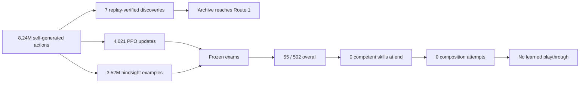

# Final retrospective: what the agent actually learned

## The short answer

This project did not produce an AI that could beat Pokémon Red. Its final model could not even
reliably reproduce the opening skills that its own training archive had discovered.

That does not make the experiment empty. It produced a concrete answer to a more precise question:
**on this hardware, with this information boundary and these learning systems, discovery was much
easier than durable competence.** The project repeatedly found ways to reach early milestones.
Every time evaluation asked one frozen policy to reproduce and connect those milestones without
help, the apparent progress mostly disappeared.

The final V12 experiment makes that distinction unusually clear. In roughly 9 hours 55 minutes,
the system processed 8.24 million actions, verified seven milestones through Route 1, generated
more than 3.5 million hindsight training examples, and ran 502 frozen exams. It ended with zero
competent skills and zero attempts to compose a journey.

## How the premise changed

The project began with a playful “monkeys with typewriters” premise: if a blind agent pressed
buttons for long enough, what might happen? Pure randomness answered quickly. Accidents occurred,
but nothing about the random process changed after an accident. Luck could not become skill.

Neuroevolution added inheritance. A population learned one narrow tendency—start the game—but six
selection and mutation variants still failed to extend that behavior beyond the opening. The
experiment then moved toward replay archives, milestone rewards, and curricula. Those systems
made visible progress through early objectives, but they also gave the trainer increasing power to
define the next useful slice of the game.

That exposed the project's central tension. A system can be engineered to reach a destination by
adding checkpoints, goals, route rewards, planners, maps, or an online language model. Each tool
may be legitimate, but the resulting claim changes. The desired claim was not “software under my
control reached the Hall of Fame.” It was “a local model learned how to play through experience.”

V7 through V10 returned to self-generated data and strict frozen exams. Their Explorers found
useful trajectories and their Students improved training fit, but those improvements did not
survive closed-loop evaluation. V11 deliberately tested the opposite extreme: an assisted
planner–navigator–specialist hierarchy. It was auditable, but routine online model queries proved
access to an external reasoner rather than local experiential learning, so it was closed as a
control.

V12 was the final reconciliation attempt. One randomly initialized recurrent actor received no
demonstration, route, imported policy, save-state start, or online decision. Its own future frames
became goals, allowing ordinary wandering to create dense hindsight lessons. Replay verification
preserved rare discoveries, while checkpoint-separated exams decided whether the current policy
actually retained them.

## What happened in the final run

The beginning looked promising. The system replay-verified game start within 992 actions, reached
the ground floor at 2,132, stepped outside at 38,972, chose a starter at 43,564, finished the first
rival battle at 64,432, and reached Route 1 at 378,388. All seven promotions arrived in the first
half hour.

Then the frontier stopped. More than 7.85 million additional actions produced no Viridian City
promotion. The more important failure was behind the frontier: the current policy could not retain
the route already in its archive.

The first frozen skill, “The adventure begins,” passed 55 of 160 exams over the run. It temporarily
crossed the required 8/10 rolling threshold, then lost that status twice. Its final window was only
1/10. The next skill, reaching the ground floor, passed 0 of 342 exams. Because competence was
sequential, the five later discovered skills were never eligible for isolated exams and the system
never attempted power-on composition.

V12's goal-use diagnostic also collapsed. A qualification canary had shown a small positive
preference for demonstrated actions under the correct visual goal. By the final checkpoint the
advantage over a blank goal was effectively zero. The network was still updating, and hindsight
loss was still being computed, but the actor was no longer using the goal in the meaningful way
the experiment required.

## The result diagram

The left half is genuine training activity and discovery. The right half is the behavioral result.
Both must be shown to understand the experiment.

## The recurring mistakes—and why preserving them matters

### Mistaking movement for learning

Pure Monkey could move through the game, but its future action distribution never changed. A
compelling screenshot was not evidence of learning.

### Mistaking archive depth for one capable policy

Checkpoint expeditions could join successful slices from different attempts. That proved the
system could discover a route, not that one current model could traverse it.

### Mistaking training fit for closed-loop skill

V8's Student improved action accuracy dramatically while frozen exams stayed near zero. Recorded
success states did not teach recovery from the Student's own mistakes.

### Mistaking local recovery for long-horizon competence

V10 learned to classify and sometimes escape visual loops without trainer-selected actions. That
was a real mechanism result, but it did not yield a competent journey.

### Mistaking external reasoning for learned local ability

V11 could ask a capable language model what to do. That may be useful engineering, but it was not
the intended scientific claim.

### Mistaking dense updates for stable goal-conditioned behavior

V12 produced a lesson after nearly every rollout. Millions of examples still failed to prevent
goal neglect and catastrophic forgetting.

## What the project did accomplish

The repository now contains more than a sequence of failed training runs. It contains a reusable
experimental standard:

- exact ROM identification without publishing the ROM;
- deterministic control and read-only milestone verification;
- explicit separation of actor information from trainer/referee information;
- private run artifacts and redistribution-safe public evidence;
- source-bound manifests and checkpoint hashes;
- action, wall-clock, storage, and assistance denominators;
- replay-verified discoveries separated from frozen-policy competence;
- failure-preserving decision and development logs; and
- dashboards and report formats that make “it moved” visibly different from “it learned.”

The M1-class Mac was not too weak to run a serious local experiment. Four emulators sustained about
231 actions per second in V12, enough for millions of overnight interactions. The limitation was
not simply disk space or emulator throughput. The chosen algorithms did not turn that experience
into stable, compositional control.

## What a successor would need

This project is closed, but its evidence suggests what a genuinely new project—not V13 by reflex—
would need to change:

1. a representation-learning objective that makes controllable visual state and goal identity
   stable before long-horizon policy learning;
2. an explicit anti-forgetting method such as frozen skill modules, rehearsal with balanced
   coverage, or policy distillation into versioned competencies;
3. learned temporal abstraction so navigation, dialogue, battle, and menu behavior can operate as
   reusable skills rather than one flat stream of button probabilities;
4. exploration that targets model uncertainty or reachable state novelty without letting the
   trainer encode a walkthrough;
5. evaluation from power-on that remains completely separate from archive restores and training;
   and
6. substantially larger compute or offline parallelism if the same sample-hungry PPO family is
   retained.

Those changes would create a different research program. More hours on the final V12 checkpoint
would not, by itself, address the observed goal collapse and forgetting.

## Final conclusion

The hoped-for ending was a Hall-of-Fame screen produced by a model that had taught itself how to
play. That ending did not happen.

The honest ending is that the project built increasingly convincing forms of apparent progress,
then designed stricter tests that refused to confuse them with competence. The final agent could
discover much more than it could remember. That is not a viral victory, but it is a useful and
reproducible result—and a better GitHub project for saying exactly so.

The complete numerical closeout is in the
[V12 final experiment record](../experiments/v12-final/README.md).
