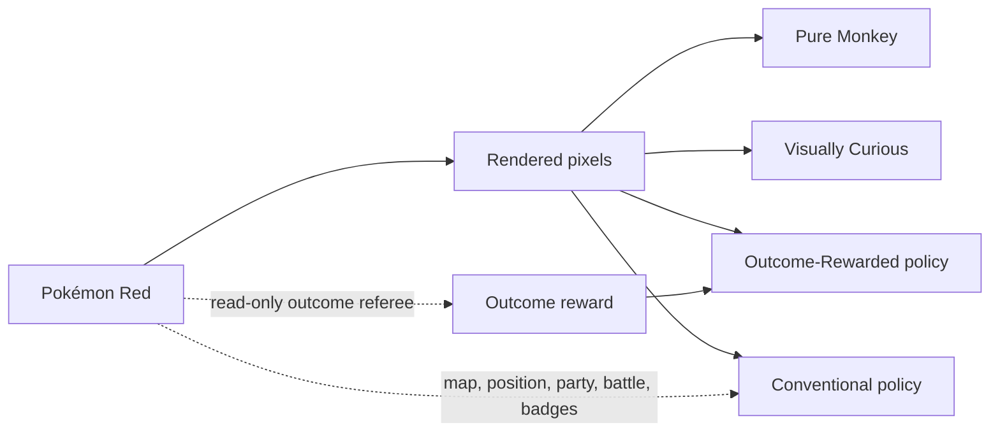
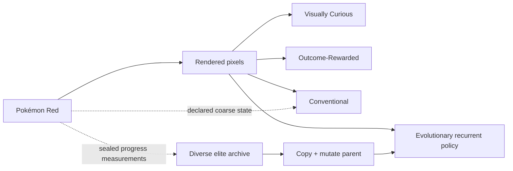

# The four-agent arena: baseline and successor

> **Decision update, 2026-07-19:** Pure Monkey has completed its role as the true-random control and
> is retired from future headline arenas. The existing command and artifacts remain reproducible.
> The next arena will replace it with Evolutionary Explorer after the population runner passes the
> gates in [the neuroevolution design](neuroevolution.md).

## The completed baseline design

The first arena asked how much guidance an agent needs before apparently random Pokémon play becomes
repeatable progress. Four local emulators began from the same Pokémon Red revision and power-on
condition. Each lane added one category of information or guidance.

| Agent | Policy observes | Reward or guidance | Intended role |
| --- | --- | --- | --- |
| **Pure Monkey** | Nothing meaningful | Nothing | Completed chance baseline; now retired |
| **Visually Curious** | Rendered screen pixels | Definite first visits to coarse visual cells | Recommended game-naive learner |
| **Outcome-Rewarded** | Rendered screen pixels | New positions/maps, party increases, battle types, badges | Blind observation with semantic teaching |
| **Conventional Agent** | Rendered pixels and disclosed RAM fields | The same explicit outcome objectives | Practical, least monkey-like arm |

The agents were intentionally **not** presented as four equally informed contestants. They formed
an information ladder. Pure Monkey did not learn: its seeded random sequence was reproducible, but
no successful outcome changed a later action probability.



## The planned successor arena

| Agent | Learns through | Central question |
| --- | --- | --- |
| **Evolutionary Explorer** | Selection and mutation across a diverse population | Can useful accidents become inherited behavior? |
| **Visually Curious** | Online visual-novelty Q learning | Can one lifetime learn to seek visually new situations? |
| **Outcome-Rewarded** | Online Q learning from semantic consequences | Can pixels-only choices benefit from game-aware teaching? |
| **Conventional** | Online Q learning with coarse RAM and explicit milestones | What does practical game-specific guidance buy? |

Evolutionary Explorer will observe pixels and its own previous action. The sealed referee may use
RAM to select parents, but those values do not become neural inputs. The evolutionary lane learns
**between** child evaluations; the other three learn **during** their individual lifetimes.



This successor is currently an E0 design, not working software. Until it reaches E2, the local
dashboard continues to represent the legacy arena and must be labeled accordingly.

## What learning meant in the baseline arena

The three guided arms use the same bounded n-step replay Q learner. A rendered frame is reduced to
a coarse pixels-only situation key; a fixed-size hash table keeps eight action values per situation.
Each transition is trained with a 128-action return, then retained in a 100,000-transition replay
buffer. A separate 10,000-transition important buffer keeps non-zero returns from being erased by
long stretches of unrewarded play. Half of replay samples come from that important buffer.

This is deliberately lightweight enough for four concurrent processes on an 8 GB M1 iMac. It is
not a pretrained vision model and receives no demonstrations, OCR, walkthrough, extracted map, or
internet access. Replay changes how often recorded experience is learned from; it does not grant a
new observation channel.

The Visually Curious arm receives `1.0` only for a definite first visit to the frozen visual-cell
representation. Repeated visual cells receive zero.

The reward ladder changed after the first pretrial exposed coordinate farming and sparse story
credit. [Reward architecture](reward-architecture.md) is the canonical current specification;
individual run manifests remain the authority for historical values. Reward weights are
engineering choices, not claims about the true value of Pokémon progress.

Outcome-Rewarded and Conventional receive **no visual novelty reward**. The first trial showed that
the former `0.05` visual reward still contributed about 97% of their cumulative score, making them
behaviorally too similar to Visually Curious. Removing it makes the intended comparison real:
pixels-only novelty versus pixels with semantic teaching versus pixels and semantic state.

### The crucial Outcome-Rewarded boundary

The Outcome-Rewarded policy hashes **pixels only** when choosing a button. A separate trainer reads
the declared outcome fields after the action and supplies the scalar reward. Those fields are not
added to the policy state. Tests cover that separation.

### The Conventional head start

The Conventional Agent is allowed a disclosed fixed macro that advances the introduction and uses
the built-in Red and Blue names. Every macro action and emulated frame remains in its counters. The
other three agents receive no such sequence. After the introduction, its online policy may use the
declared RAM tuple alongside pixels.

## The legacy living dashboard

`arena-run` starts four isolated runners plus a local-only web dashboard. The arena page refreshes
every five seconds and shows:

- the latest rendered frame from every agent;
- elapsed time and the shared wall-clock budget;
- actions, throughput, visual cells, and cumulative reward;
- maps and positions rewarded, largest party, and badges;
- a discovery sparkline and a link to each complete per-agent dashboard;
- process health, stop reasons, and automatic restart count in `status.json`.

The runner also captures an exact frame at every new map, party increase, battle type, and badge.
The trace record links the screenshot to the action, reward components, elapsed time, and complete
declared referee state. New-coordinate rewards remain in the trace without generating thousands of
nearly identical screenshots.

The dashboard server binds to `127.0.0.1`, so it is visible from this Mac but not exposed to the
local network or internet. No ROM bytes or emulator save states are served.

## Reproducing the legacy SSD-backed arena

The internal disk is too full for a multi-day experiment. Use the external T7 volume:

```bash
screen -L -Logfile "/Volumes/T7 Developer/PokemonRedAI/arena.console.log" \
  -dmS pokemon-arena \
  .venv/bin/pokemon-red-ai arena-run \
  --output "/Volumes/T7 Developer/PokemonRedAI/arenas/supervised-YYYYMMDD" \
  --hours 8 \
  --max-actions 50000000
```

Open `http://127.0.0.1:8765/index.html` while it is active.

```bash
pokemon-red-ai arena-status "/Volumes/T7 Developer/PokemonRedAI/arenas/supervised-YYYYMMDD"
pokemon-red-ai arena-stop "/Volumes/T7 Developer/PokemonRedAI/arenas/supervised-YYYYMMDD"
```

Stopping is graceful. Every agent receives a stop marker and writes a final checkpoint before the
supervisor exits.

## Retired 48-hour baseline configuration

This command remains as a reproducibility record. Do **not** use it as the next headline run: it
still allocates one lane to Pure Monkey.

```bash
pokemon-red-ai arena-run \
  --output "/Volumes/T7 Developer/PokemonRedAI/arenas/four-agent-48h-YYYYMMDD" \
  --hours 48 \
  --max-actions 150000000 \
  --q-policy-buckets 1048576 \
  --q-n-step 128 \
  --replay-capacity 100000 \
  --replay-batch-size 16 \
  --replay-interval 4 \
  --important-replay-capacity 10000 \
  --seen-filter-mib 64 \
  --timelapse-minutes 10 \
  --max-output-mib-per-agent 2048 \
  --min-free-gib 50
```

The supervisor checkpoints each process every five minutes and retries a failed nonterminal runner
up to three times from its last valid checkpoint. A power outage still stops the iMac; the latest
checkpoint remains recoverable, but the machine cannot resume until it boots again.

The 1,048,576-bucket table is 64 times the trial table. Each learning arm allocates about 36 MiB
for nine float32 action values plus 4 MiB for visit counts, or roughly 120 MiB of Q-table memory
across the three learning agents. At the measured trial rates, each arm should execute about
98–113 million actions in 48 hours, so the 150-million ceiling leaves wall time in control.

## Storage budget

The one-hour trial grew to about 35 MiB, including two rotating checkpoints per arm. Scaling that
measurement and allowing for the much larger Q tables gives this planning range:

| Artifact | Expected | Conservative allowance |
| --- | ---: | ---: |
| Four agent directories | 1.5–4 GiB | 8 GiB hard cap |
| 30-second narrative frames and hourly journals | 0.1–0.3 GiB | 1 GiB |
| Repository, reports, charts, and contact sheets | under 0.5 GiB | 1 GiB |
| Experimental archive total | 2–5 GiB | 10 GiB reserved |

The per-agent output cap is 2 GiB, so the four agents cannot consume more than 8 GiB before a
controlled stop. The narrative recorder sits outside those caps, but 23,040 Game Boy-sized interval
frames over 48 hours should remain well below 1 GiB. Keep 10 GiB free for the experiment itself and
20–30 GiB if the same SSD will also hold video-editor caches, proxy media, and final exports.

## Qualification before the successor arena

Every protocol change starts with bounded calibration. The successor arena should not launch until
the evolutionary runner passes its own synthetic tests, then 16-candidate and 128-candidate
Pokémon pretrials. Existing online-learning policies must start fresh in the comparison.

1. all four lanes remain healthy and checkpoint-resumable;
2. replay transitions and updates increase continuously;
3. exact semantic-event screenshots agree with their trace records;
4. Outcome-Rewarded and Conventional report zero visual reward;
5. at least one rewarded arm records semantic progress after the initial opening burst;
6. policy-table occupancy, checkpoint duration, disk use, and action throughput remain bounded.
7. evolutionary genomes, ancestry, mutation seeds, and archive replacements are reproducible;
8. promoted checkpoint-assisted milestones replay from power-on without intervention.

Passing these gates proves that the mechanism is operating as designed. It still does not guarantee
that an agent will solve Pokémon Red.

## How results must be compared

More reward does not mean one arm “won,” because the reward definitions differ. Publish at least
three views:

1. progress after the same number of controller actions;
2. progress after the same wall-clock time;
3. post-run semantic milestones from a sealed referee.

One run per arm is a scouting comparison and a narrative episode, not statistical proof. The next
scientific step is to repeat the most informative arms across multiple seeds.

## Narrative spine

The baseline supplied the first answer: **luck without inheritance remains luck**. The successor
asks a stronger question: **what happens when a useful accident is allowed to have descendants?**
Introduce each generation through its family tree, let the audience meet extinct and surviving
lineages, and keep checkpoint-assisted population progress separate from a single frozen policy.
