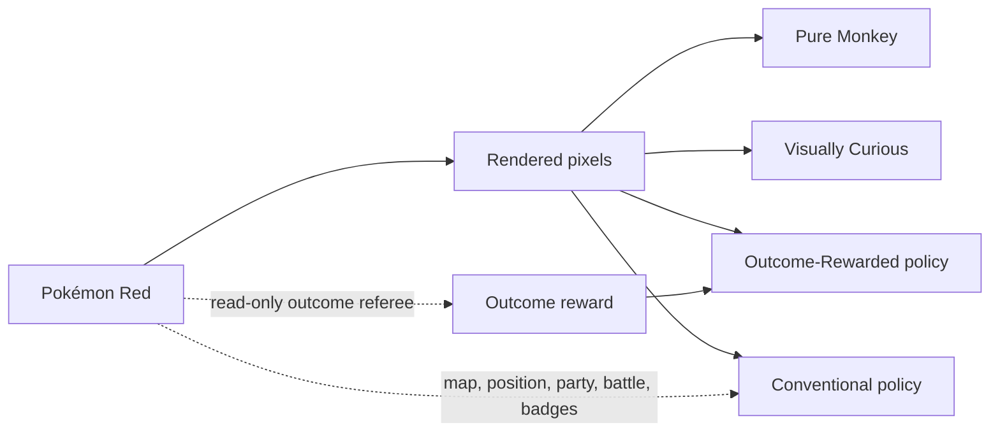

# The four-agent arena

## The experiment

The arena asks how much guidance an agent needs before apparently random Pokémon play becomes
repeatable progress. Four local emulators begin from the same Pokémon Red revision and power-on
condition. Each lane adds one category of information or guidance.

| Agent | Policy observes | Reward or guidance | Intended role |
| --- | --- | --- | --- |
| **Pure Monkey** | Nothing meaningful | Nothing | Literal chance baseline |
| **Visually Curious** | Rendered screen pixels | Definite first visits to coarse visual cells | Recommended game-naive learner |
| **Outcome-Rewarded** | Rendered screen pixels | New positions/maps, party increases, battle types, badges | Blind observation with semantic teaching |
| **Conventional Agent** | Rendered pixels and disclosed RAM fields | The same explicit outcome objectives | Practical, least monkey-like arm |

The agents are intentionally **not** presented as four equally informed contestants. They are an
information ladder. Their differences are the subject of the experiment.



## What “learning” means here

The three guided arms use a small, local, online Q learner. A rendered frame is reduced to a coarse
pixels-only situation key; a fixed-size hash table keeps nine action values per situation. This is
deliberately lightweight enough for four concurrent processes on an 8 GB M1 iMac. It is not a
pretrained vision model and receives no demonstrations, OCR, walkthrough, extracted map, or
internet access.

The Visually Curious arm receives `1.0` only for a definite first visit to the frozen visual-cell
representation. Repeated visual cells receive zero.

The two outcome-guided arms receive:

| Event | Reward |
| --- | ---: |
| Definite new visual cell | 0.05 |
| Game begins | 3 |
| New map | 5 |
| New coordinate on a map | 0.20 |
| Each additional party member | 25 |
| First observed wild or trainer battle type | 10 |
| Each new badge | 100 |

These values are frozen in the run manifest. They are engineering choices, not claims about the
true value of Pokémon progress.

### The crucial Outcome-Rewarded boundary

The Outcome-Rewarded policy hashes **pixels only** when choosing a button. A separate trainer reads
the declared outcome fields after the action and supplies the scalar reward. Those fields are not
added to the policy state. Tests cover that separation.

### The Conventional head start

The Conventional Agent is allowed a disclosed fixed macro that advances the introduction and uses
the built-in Red and Blue names. Every macro action and emulated frame remains in its counters. The
other three agents receive no such sequence. After the introduction, its online policy may use the
declared RAM tuple alongside pixels.

## The living dashboard

`arena-run` starts four isolated runners plus a local-only web dashboard. The arena page refreshes
every five seconds and shows:

- the latest rendered frame from every agent;
- elapsed time and the shared wall-clock budget;
- actions, throughput, visual cells, and cumulative reward;
- maps and positions rewarded, largest party, and badges;
- a discovery sparkline and a link to each complete per-agent dashboard;
- process health, stop reasons, and automatic restart count in `status.json`.

The dashboard server binds to `127.0.0.1`, so it is visible from this Mac but not exposed to the
local network or internet. No ROM bytes or emulator save states are served.

## SSD-backed supervised run

The internal disk is too full for a multi-day experiment. Use the external T7 volume:

```bash
screen -L -Logfile "/Volumes/T7/PokemonRedAI/arena.console.log" \
  -dmS pokemon-arena \
  .venv/bin/pokemon-red-ai arena-run \
  --output "/Volumes/T7/PokemonRedAI/arenas/supervised-YYYYMMDD" \
  --hours 8 \
  --max-actions 50000000
```

Open `http://127.0.0.1:8765/index.html` while it is active.

```bash
pokemon-red-ai arena-status "/Volumes/T7/PokemonRedAI/arenas/supervised-YYYYMMDD"
pokemon-red-ai arena-stop "/Volumes/T7/PokemonRedAI/arenas/supervised-YYYYMMDD"
```

Stopping is graceful. Every agent receives a stop marker and writes a final checkpoint before the
supervisor exits.

## Monday’s 48-hour configuration

The final unattended run should use a new directory and an action ceiling high enough that wall
time—not the former five-million-action cap—ends the experiment:

```bash
pokemon-red-ai arena-run \
  --output "/Volumes/T7/PokemonRedAI/arenas/four-agent-48h-YYYYMMDD" \
  --hours 48 \
  --max-actions 200000000 \
  --seen-filter-mib 64 \
  --timelapse-minutes 10 \
  --max-output-mib-per-agent 2048 \
  --min-free-gib 50
```

The supervisor checkpoints each process every five minutes and retries a failed nonterminal runner
up to three times from its last valid checkpoint. A power outage still stops the iMac; the latest
checkpoint remains recoverable, but the machine cannot resume until it boots again.

## How results must be compared

More reward does not mean one arm “won,” because the reward definitions differ. Publish at least
three views:

1. progress after the same number of controller actions;
2. progress after the same wall-clock time;
3. post-run semantic milestones from a sealed referee.

One run per arm is a scouting comparison and a narrative episode, not statistical proof. The next
scientific step is to repeat the most informative arms across multiple seeds.

## Narrative spine

The arena supplies a natural video structure: **what must we tell a machine before luck becomes
learning?** Introduce each contestant as one new concession. Let the audience see live screens
before showing the charts. The ending is not merely a leaderboard; it is an accounting of which
piece of knowledge bought each piece of progress.

