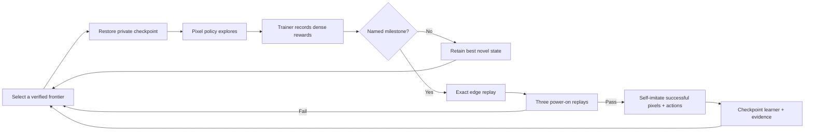

# Frontier Apprentice: a full-game learning ratchet

> **Status:** implemented, unit checked, and exercised in a real-ROM stop/resume canary. This is a
> development training system, not evidence that a model completed Pokémon Red.

The frozen Visual Apprentice proved that a self-generated route can become a repeatable local
pixel skill. The eight-hour handoff then showed the limit of freezing it: the system reached the
Pokédex in about 68 minutes, but spent more than five additional hours without promoting the next
named milestone. Frontier Apprentice turns every later verified milestone into another lesson.

Its terminal condition is the same strict Hall-of-Fame condition as the completion program. The
same loop applies to every entry in the 55-milestone catalogue; Viridian Forest is the first test,
not a special case in the code.

## The central loop



The crucial ordering is **verify, then learn**. An unverified lucky label, corrupt checkpoint, or
non-replayable branch cannot update the model. Failed attempts remain valuable measurements and
reward-ledger data, but they do not teach the policy to repeat their actions.

## Information boundary

| Component | Receives | Does not receive |
| --- | --- | --- |
| Pixel actor | Two processed frames, previous action, recurrent state, seeded exploration coin | RAM, map ID, coordinates, milestone identity, reward values, snapshots |
| Training referee | Documented read-only RAM, rendered screen loop signal, verified parent | Authority to press buttons or change emulator memory |
| Archive scheduler | Milestone tier, map-balanced frontier groups, selection history | Authority to alter the policy action after selection |
| Self-imitation update | Pixel/action suffix from a replay-verified promotion | Walkthrough, human route, failed arbitrary actions |

Run label:

```text
Actor: PIXEL-ACTOR
Training information: PRIVILEGED-TRAINING-REFEREE
Start: ARCHIVE-RESTORE during training
Evaluated object: HYBRID-SYSTEM with online model updates
Human demonstrations: none
```

This does not qualify for H5. A later H5 attempt must freeze the final parameters, disable all
updates and checkpoint restores, and start from clean power-on.

## Rewards across the complete game

Rewards are trainer-side causes for selection and reporting. They are paid only for a new maximum
or first observation in persistent run memory, so restoring a strong checkpoint cannot farm its
existing badge, item, level, or Pokédex state.

| Component | Default | Purpose |
| --- | ---: | --- |
| Next named milestone | +1,000 | Dominant progress signal across all 55 milestones |
| New badge | +500 | Make Gym completion unmistakable |
| New persistent event bit | +20 | Reward story and prerequisite changes without a walkthrough |
| New map / directed warp | +25 / +10 | Reward leaving local cul-de-sacs and using doors |
| New exact coordinate | +0.05 | Gentle local navigation signal, intentionally tiny |
| New party member | +50 | Reward captures and required gifts |
| New maximum party level | +5 per level | Support the strength needed for later battles |
| New move | +3 | Reward learned capabilities, including HM use once acquired |
| New species seen / owned | +5 / +30 | Encourage interaction and capture without dominating badges |
| New bag item | +10 | Reward new capabilities and supplies once |
| Battle ended without blackout | +10 | Reward returning to the overworld; this may be a win or escape |
| First transition to blackout | -20 | Make losing clearly worse |
| Visual loop / long repeated action | -0.2 / -0.02 | Discourage wall, menu, and button cycles |

The generic milestone reward automatically covers story events, badges, required items and HMs,
dungeons, the Elite Four, the Champion, and the Hall of Fame because the canonical catalogue—not
an early-game conditional—defines progress.

### The complete ratchet

The same code path covers every chapter below. Each range is inclusive and refers to the ordered
55-milestone catalogue; there is no separate early-game terminal condition.

| Milestones | Chapter | Boundary outcomes |
| ---: | --- | --- |
| 1–6 | Pallet Town | Game start through the first rival battle |
| 7–11 | Oak's Errand | Route 1 through receiving the Pokédex |
| 12–14 | Boulder Badge | Viridian Forest through Brock |
| 15–16 | To Cerulean City | Mt. Moon through Cerulean City |
| 17–18 | Cerulean City | Cascade Badge and Bill |
| 19–22 | Vermilion City | S.S. Ticket through Thunder Badge |
| 23–24 | Toward Lavender | Rock Tunnel through Lavender Town |
| 25–33 | Celadon and Lavender | Rainbow Badge, Rocket Hideout, Pokémon Tower, and Poké Flute |
| 34–37 | Saffron City | Silph Co., Giovanni, and Marsh Badge |
| 38–42 | Fuchsia City | Safari Zone, Surf, Strength, and Soul Badge |
| 43–45 | Cinnabar Island | Cinnabar, Secret Key, and Volcano Badge |
| 46 | Viridian City | Earth Badge |
| 47–49 | Pokémon League | Route 23 through Indigo Plateau |
| 50–53 | Elite Four | Lorelei through Lance |
| 54 | Champion | Champion defeated |
| 55 | Hall of Fame | Champion flag and Hall-of-Fame map both observed |

## What changes after a plateau

The frozen handoff used 35% random replacement forever. Frontier Apprentice instead increases its
exploration probability linearly from 35% to 100% over 250,000 actions without a new verified
milestone. A stale house-trained prior therefore fades out rather than controlling most actions
indefinitely.

The old scheduler spread attempts across every cell at the best milestone. The new frontier path
first balances compute across maps, then favors recent under-selected cells within the chosen map.
This prevents a map containing hundreds of redundant checkpoints from receiving hundreds of times
more attempts than a newly reached map boundary.

The old loop detector immediately ended 91.9% of measured suffixes. The learner now receives up to
two 64-action, fully exploratory escape bursts before a repeated screen terminates the suffix.
Escape bursts and final loop stops are counted separately on the dashboard.

## How the model changes

The initial CNN-LSTM weights come from the completed house-exit curriculum. A newly promoted
milestone supplies an episode of processed pixel pairs, prior actions, and selected actions. The
trainer:

1. reconstructs reverse suffixes with zero recurrent state;
2. applies cross-entropy self-imitation to the successful actions;
3. rehearses bounded exemplars from earlier promoted milestones;
4. applies a small anchor penalty toward the initial apprentice parameters;
5. clips gradients and writes an atomic learner checkpoint; and
6. binds the learner file and parameter hashes into the runner checkpoint.

This version deliberately waits for verified successes instead of updating neural weights from
dense rewards. That gave the first full-game ratchet a causal, auditable baseline. The active
[parallel recurrent-PPO successor](parallel-ppo.md) now uses the same reward ledger and verified
archive to test whether learning from failures improves time-to-milestone.

## Crash and restart behavior

Learner weights change at most once per newly promoted milestone. The latest and previous model
files are retained. Each runner checkpoint records the exact learner file hash, tensor hash, update
count, reward memory, and most recent learned milestone. On resume, the loader accepts only a model
file matching that checkpoint. This prevents a crash between model persistence and runner
checkpoint persistence from silently advancing or rolling back the policy.

## Dashboard and narrative record

The live page adds:

- learning update count;
- verified milestones learned;
- trainer reward total and named component ledger;
- current adaptive exploration probability;
- loop escape bursts versus terminal loop stops;
- best and next canonical milestone;
- archive, edge-replay, and full-promotion replay health; and
- the latest gameplay frame.

The trace records each suffix reward breakdown and one `frontier_learner_updated` event containing
the milestone, successful action count, optimizer-step count, mean loss, and resulting parameter
hash. These events provide the future video's learning timeline without pretending that reward is
game completion.

## First qualification gates

1. Unit-check non-repeatable rewards, model persistence, exact resume, map-balanced scheduling, and
   the verify-before-update rule.
2. Run a short real-ROM canary through the already learned opening.
3. Confirm that every early promotion changes the model hash only after all required replays pass.
4. Run a bounded Viridian-Forest trial and compare it with the frozen handoff's measured plateau.
5. If the forest gate passes, continue the identical ratchet toward Pewter and Brock rather than
   writing another early-game-only runner.
6. Freeze periodic policies for clean-power-on evaluation; never call archive-assisted training an
   autonomous completion.

## First real-ROM canary

The 2026-07-20 canary ran for 11,495 controller actions across an intentional graceful restart. It
promoted through `chose_starter`, learned five verified milestones from 763 successful actions,
performed 38 optimizer updates, and passed 49/49 replay checks. The restart resumed at action
8,467 with the same learner-file hash, parameter hash, reward memory, update count, archive, and
counters; it then advanced to action 11,495. The learner parameter hash changed five times, each
after its corresponding `frontier_learner_updated` event and replay gate.

This result checks the mechanism and persistence boundary. It does not yet demonstrate that the
learner beats the frozen baseline at Viridian Forest or that it can complete the game.

A second seed on the finalized reward labels reached `left_home`, learned three verified
promotions, and stopped at its 12,000-action ceiling with 52/52 replay checks. Its non-terminal
restart twin was deliberately stopped at action 8,045, resumed with the exact same model-file and
parameter hashes plus 19 updates, and continued to action 11,858 with 55/55 replay checks. The
different opening outcomes are retained as useful variance, not collapsed into one highlight.
