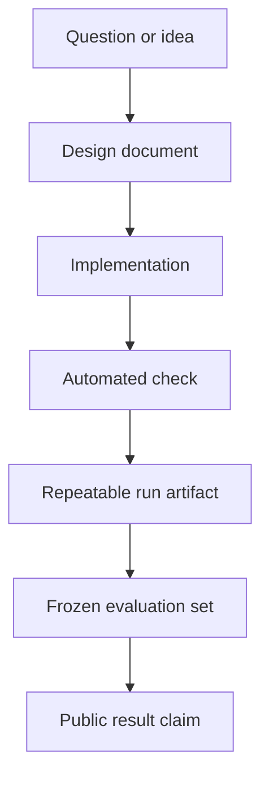

# Documentation hub

This is the documentation hub for a **completed research project**. The repository preserves two
deliberately separate lanes:

1. **Experiential learning.** The final V12 experiment started one recurrent visual policy from
   random parameters and clean ROM power-on. It imported no route, demonstration, predecessor
   policy, save state, or online decision model.
2. **Assisted control.** V11 tested a structured-state language-model planner, A* navigation,
   persistent memory, and controller specialists as an explicitly assisted upper-bound control.

V12 observed 8,236,144 actions in 9h54m56s, replay-verified seven milestones through Route 1, and
generated 3,518,624 hindsight action examples. Frozen exams ended at 55/502, zero competent skills,
and no composition. The first skill lost competence twice; the second passed 0/342 exams.

The project therefore closes without a whole-game result or a frozen learned policy that can
reliably reproduce even the opening sequence. The central finding is that discovery and training
activity can look substantial while durable, cumulative competence remains absent. The
[final retrospective](final-retrospective.md) explains that result; the
[V12 record](../experiments/v12-final/README.md) preserves the full denominator and shutdown
integrity limitation.

## Start here

| If you want to… | Read… | What it answers |
| --- | --- | --- |
| Understand the project in a few minutes | [Project README](../README.md) | What was built, what happened, and how to verify it |
| Audit the primary experiment | [Blind curiosity protocol](blind-curiosity.md) | What the agent sees, how novelty works, and what counts as leakage |
| Watch the four agents together | [Four-agent arena](four-agent-arena.md) | Exact information ladder, rewards, dashboard, and 48-hour procedure |
| Learn what evolutionary training tested | [Evolutionary Explorer](neuroevolution.md) | Genomes, mutation, MAP-Elites, lab results, checkpoint successor, and claim boundaries |
| Inspect the concluded selection experiment | [Selection × mutation lab](selection-mutation-lab.md) | The 90-minute result, six-lane matrix, measurements, narrative, and claim limits |
| Review the original completion contract | [Hall of Fame completion program](completion-program.md) | Expedition architecture, information labels, claim ladder, qualification gates, and policy distillation |
| Understand the Visual Apprentice stage | [Visual Apprentice v1](visual-apprentice.md) | Pixel inputs, self-generated demonstrations, reverse curriculum, recovery training, hardware bounds, and frozen evaluation gates |
| Review the verified-frontier stage | [Frontier Apprentice](frontier-apprentice.md) | Verify-before-update milestone ratchet, adaptive exploration, full-game rewards, crash safety, and evaluation limits |
| Understand the shared-policy learner | [Parallel recurrent PPO](parallel-ppo.md) | Four-worker PPO, pixels/RAM boundaries, verified curriculum, dense rewards, checkpoints, dashboard, and benchmark evidence |
| Audit the V5.2 curriculum | [Version 5.2: the road to Brock](version-5-2-northbound.md) | V5.1's completed result, ten northbound lessons, recovery reward, evidence limits, and run questions |
| Understand the composition pivot | [Version 6: remember the journey](version-6-consolidation.md) | Retained weights, backward rolling gates, canary evidence, claim boundaries, and the next imitation ablation |
| Understand the game-naive reset | [Version 7: let a new player teach itself](version-7-self-taught.md) | Random power-on start, strict information rules, self-generated visual skills, self-imitation, canary evidence, and falsification gates |
| Understand the closed V8 result | [Version 8: separate discovery from learning](version-8-distilled-student.md) | Why V7 remains the denominator; how the 0/7 canary qualified the mechanism; why the longer seven-skill run still ended at 1/47 and zero competent skills |
| Understand the closed self-correction experiment | [Version 9: let the Student practice being wrong](version-9-self-correcting-student.md) | Exposure bias, consecutive edges, reverse practice, the failed and corrected canaries, success-only aggregation, campaign timing, and frozen-exam result |
| Understand the loop-recovery successor | [Version 10: let the Explorer recover before resetting](version-10-recovery-before-reset.md) | Why immediate reset may hide the recovery lesson; strict policy action authority; route-agnostic recovery, telemetry, falsifiers, canary gates, and claim limits |
| Understand the assisted control | [Version 11: stop teaching one button at a time](version-11-hierarchical-pivot.md) | Why V10 closed; planner/navigation/memory/specialist roles; assistance label; opening canaries; and why the continuous run was stopped |
| Understand the final experiential learner | [Version 12: every journey creates its next lesson](version-12-final-self-learner.md) | Hindsight goals, correct-goal contrast, fixed information rules, canary evidence, 48-hour contract, and falsifiers |
| Audit the V12 qualification | [V12 qualification record](../experiments/v12-qualification/README.md) | Three ROM-free canary summaries and the narrow reason the mechanism qualified |
| Read the final conclusion | [Final retrospective](final-retrospective.md) | What the agent actually learned, why discovery failed to become competence, and what a successor would need |
| Audit the final V12 run | [V12 final result](../experiments/v12-final/README.md) | Public endpoint, milestones, frozen exams, assistance boundary, and shutdown integrity limitation |
| Inspect the first verified expedition milestone | [Q1 `left_home` result](../experiments/q1-left-home/README.md) | Both seeds, full denominator, lineage hashes, replay cost, and why 1/2 is not a pass |
| Audit the qualified memory substrate | [Archive v2 qualification](../experiments/archive-v2-qualification/README.md) | Bounded replay, exact resume, crash recovery, deterministic comparison, and the failed stop-timing attempt |
| Audit every accepted and discarded idea | [Decision register](decision-register.md) | Append-only decisions, failed hypotheses, alternatives, evidence, and consequences |
| Follow the central story | [Project narrative](narrative.md) | Why the failures and evidence are part of the project |
| Understand the reward ladder | [Reward architecture](reward-architecture.md) | Actions, milestones, loop controls, and reporting boundaries |
| Audit evidence levels | [Progress](progress.md) | What was implemented, checked, repeated, evaluated, or rejected |
| Review the concluded roadmap | [Roadmap](roadmap.md) | Completed milestones, failed gates, and intentionally unpursued work |
| Understand the system | [Architecture](architecture.md) | How the emulator, agent, memory, watchdog, and referee fit together |
| Audit the original instrumentation boundary | [State instrumentation](state-observation.md) | Six read-only harness/referee fields and their limits; V11's separately disclosed structured-state actor uses a broader assisted interface |
| Judge future experimental claims | [Experiment protocol](experiment-protocol.md) | Training/evaluation separation, required metrics, and comparison rules |
| Turn experiments into clear visuals | [Visual storytelling](visual-storytelling.md) | Charts, timelines, run summaries, and a possible video structure |
| Generate a local result page | [Run reports](run-reports.md) | How a JSONL trace becomes a readable standalone report |
| Audit the Phase 0 repeated run | [Phase 0 evidence](../experiments/phase-0-bootstrap/README.md) | Public metadata, attempt ledger, exact hashes, and limitations |
| Review the shelved video plan | [Video outline](video-outline.md) | Historical series arc, shots, and claims checklist |
| Translate technical terms | [Glossary](glossary.md) | Plain-language definitions used throughout the project |
| Follow decisions chronologically | [Development log](devlog.md) | Dated implementation decisions and verified milestones |
| Record an experiment | [Experiment template](experiment-template.md) | A reusable protocol and results record |
| Describe an evaluated agent | [Agent card template](agent-card-template.md) | Inputs, actions, training, memory, and limitations |
| Contribute code or documentation | [Contributing guide](../CONTRIBUTING.md) | Local checks, safety rules, and repository hygiene |

## The project at a glance

The diagram shows project position, not game progress. Reaching the game-start state is a narrow
inherited behavior, the concluded inherited-archive fork was not a frozen evaluation, and Q0
runner reliability is not a gameplay milestone.

## Three reading paths

### For a viewer following the story

Read the [Project narrative](narrative.md), then [Progress](progress.md), then the
[Video outline](video-outline.md). Use [Visual storytelling](visual-storytelling.md) when turning a
new result into charts or footage.

### For someone reproducing the work

Read the [README](../README.md), [Experiment protocol](experiment-protocol.md), and
[State instrumentation](state-observation.md). Generate a [local run report](run-reports.md) from the
sanitized trace. Use the exact commands and supported ROM fingerprint in the README; the ROM itself
is never distributed here.

### For someone designing a successor

Read [Architecture](architecture.md), [Roadmap](roadmap.md), and the
[Contributing guide](../CONTRIBUTING.md). Begin a separately declared successor from the
[experiment template](experiment-template.md) and complete an [agent card](agent-card-template.md).
In particular, preserve the boundary between what the acting policy sees and what the referee may
inspect.

## Vocabulary used throughout the documentation

| Term | Meaning in this project |
| --- | --- |
| **Harness** | Emulator lifecycle, inputs, observations, snapshots, traces, and safety checks |
| **Agent** | Any system choosing actions; it may be scripted, learned, language-model-driven, or hybrid |
| **Policy** | The action-selection component being evaluated |
| **Training run** | A run allowed to update model parameters or persistent training state |
| **Evaluation attempt** | A frozen-policy attempt scored under a declared protocol |
| **Referee** | Measurement code that can score outcomes but cannot choose or alter actions |
| **Intervention** | A human action that changes a run, including manual input, reset, or recovery |
| **Success** | Meeting a task-specific completion rule; shaped reward alone is not success |
| **Clean start** | A new game from reset, not a development save state |

## How project truth is recorded

A later box provides stronger evidence than an earlier one. A roadmap checkbox records project
work; it is not a substitute for an evaluation result. The [Progress](progress.md) page applies
this evidence ladder to the current repository.

## Documentation principles

- Put the current status before the ambition.
- Label scripts, human baselines, training runs, and frozen evaluations differently.
- Report all official evaluation attempts, including failures.
- Pair every important number with its denominator, configuration, and evidence source.
- Separate shaped reward from task completion.
- Prefer diagrams and data-derived graphics over proprietary game art.
- Never publish ROM data, save states, private paths, credentials, or unreviewed traces.
- Correct the docs when implementation changes; do not let the narrative outrun the evidence.
