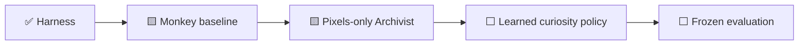
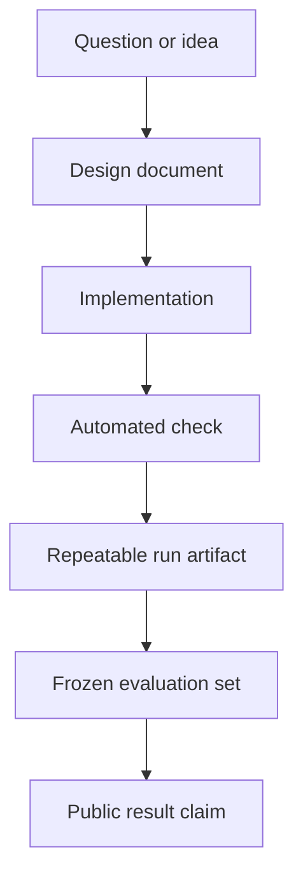

# Documentation hub

This project has two stories running in parallel:

1. the engineering story — building a trustworthy way to run and measure Pokémon Red; and
2. the learning story — what an agent eventually tries, learns, forgets, and masters.

The emulator foundation is working, and the first autonomous game-naive search runner now exists.
There is still **no trained neural Pokémon model or evaluated gameplay result**. The current learner
is an honest pixels-only discovery archive whose limitations are part of the story.

## Start here

| If you want to… | Read… | What it answers |
| --- | --- | --- |
| Understand the project in a few minutes | [Project README](../README.md) | What is being built and how to run it |
| Audit the primary experiment | [Blind curiosity protocol](blind-curiosity.md) | What the agent sees, how novelty works, and what counts as leakage |
| Follow the central story | [Project narrative](narrative.md) | Why the failures and evidence are part of the project |
| See what is genuinely complete today | [Progress](progress.md) | What is verified, what is merely implemented, and what is still planned |
| Follow the journey ahead | [Roadmap](roadmap.md) | Milestones, gates, dependencies, and definitions of done |
| Understand the system | [Architecture](architecture.md) | How the emulator, agent, memory, watchdog, and referee fit together |
| Audit current instrumentation | [State instrumentation](state-observation.md) | Six read-only harness/referee fields and their limits; no policy consumes them yet |
| Judge future experimental claims | [Experiment protocol](experiment-protocol.md) | Training/evaluation separation, required metrics, and comparison rules |
| Turn experiments into clear visuals | [Visual storytelling](visual-storytelling.md) | Charts, timelines, run summaries, and a possible video structure |
| Generate a local result page | [Run reports](run-reports.md) | How a JSONL trace becomes a readable standalone report |
| Audit the current repeated run | [Phase 0 evidence](../experiments/phase-0-bootstrap/README.md) | Public metadata, attempt ledger, exact hashes, and limitations |
| Plan a video | [Video outline](video-outline.md) | Episode 0, series arc, shots, and claims checklist |
| Translate technical terms | [Glossary](glossary.md) | Plain-language definitions used throughout the project |
| Follow decisions chronologically | [Development log](devlog.md) | Dated implementation decisions and verified milestones |
| Record an experiment | [Experiment template](experiment-template.md) | A reusable protocol and results record |
| Describe an evaluated agent | [Agent card template](agent-card-template.md) | Inputs, actions, training, memory, and limitations |
| Contribute code or documentation | [Contributing guide](../CONTRIBUTING.md) | Local checks, safety rules, and repository hygiene |

## The project at a glance

The diagram shows project position, not game progress. The current Archivist learns an archive,
not a neural policy, and an overnight development run is not a frozen evaluation.

## Three reading paths

### For a viewer following the story

Read the [Project narrative](narrative.md), then [Progress](progress.md), then the
[Video outline](video-outline.md). Use [Visual storytelling](visual-storytelling.md) when turning a
new result into charts or footage.

### For someone reproducing the work

Read the [README](../README.md), [Experiment protocol](experiment-protocol.md), and
[State instrumentation](state-observation.md). Generate a [local run report](run-reports.md) from the
sanitized trace. Use the exact commands and supported ROM fingerprint in the README; the ROM itself
is never distributed here.

### For someone extending the agent

Read [Architecture](architecture.md), [Roadmap](roadmap.md), and the
[Contributing guide](../CONTRIBUTING.md). Start new evaluations from the
[experiment template](experiment-template.md) and complete an [agent card](agent-card-template.md).
In particular, preserve the boundary between what the acting policy sees and what the referee may
inspect.

## Vocabulary used throughout the documentation

| Term | Meaning in this project |
| --- | --- |
| **Harness** | Emulator lifecycle, inputs, observations, snapshots, traces, and safety checks |
| **Agent** | Any system choosing actions; it may be scripted, learned, language-model-driven, or hybrid |
| **Policy** | The action-selection component being evaluated |
| **Training run** | A run allowed to update model parameters or persistent training state |
| **Evaluation attempt** | A frozen-policy attempt scored under a declared protocol |
| **Referee** | Measurement code that can score outcomes but cannot choose or alter actions |
| **Intervention** | A human action that changes a run, including manual input, reset, or recovery |
| **Success** | Meeting a task-specific completion rule; shaped reward alone is not success |
| **Clean start** | A new game from reset, not a development save state |

## How project truth is recorded

A later box provides stronger evidence than an earlier one. A roadmap checkbox records project
work; it is not a substitute for an evaluation result. The [Progress](progress.md) page applies
this evidence ladder to the current repository.

## Documentation principles

- Put the current status before the ambition.
- Label scripts, human baselines, training runs, and frozen evaluations differently.
- Report all official evaluation attempts, including failures.
- Pair every important number with its denominator, configuration, and evidence source.
- Separate shaped reward from task completion.
- Prefer diagrams and data-derived graphics over proprietary game art.
- Never publish ROM data, save states, private paths, credentials, or unreviewed traces.
- Correct the docs when implementation changes; do not let the narrative outrun the evidence.
