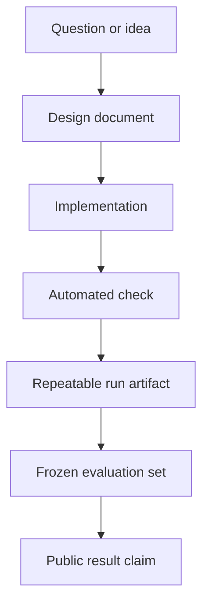

# Documentation hub

This project has two stories running in parallel:

1. the engineering story — building a trustworthy way to run and measure Pokémon Red; and
2. the learning story — what an agent eventually tries, learns, forgets, and masters.

The emulator foundation, blind runners, online learners, and first neuroevolution population are
working. There is still **no evaluated successful Pokémon-playing policy or whole-game result**.
Pure Monkey completed its role as the random baseline. A 90-minute evolutionary pretrial inherited
a narrow game-start behavior; the completed six-lane follow-up then failed to extend any treatment
beyond one map. The checkpoint expedition then reached and replayed `left_home` in one of two
bounded seeds. That earns a narrow expedition milestone claim while failing the frozen two-seed Q1
gate. Archive v2 then passed continuous, graceful-resume, and hard-crash qualification. Turning the
verified route into a learned visual skill is now the active work.
Stage 0 then reproduced its sole route exactly, reverse curriculum completed the opening in
development, and Frontier Apprentice established a replay-gated self-imitation baseline. The active
successor is four-worker recurrent PPO: every rollout can now update one shared policy while the
same verifier controls named curriculum promotion. Version 5.1 used explicit active goals to reach
the Pokédex, then plateaued for more than three million actions. Version 5.2 turned the road from
Oak's Lab to Pewter Gym into a visible curriculum and reached Route 1. Version 6 retained that
policy but ended at 5/10—short of its 8/10 first composition gate—after one million actions.
Version 7 now restarts from random weights and
power-on only, using no imported actions or human demonstration. It converts only its own verified
discoveries into visual-goal skills and directly rehearses them. Its current long trial remains
running unchanged as the denominator. Version 8 is implemented beside it: PPO Explorers keep
searching, but a separate recurrent Student studies replay-distilled self-generated trajectories
and replay-verified bounded handoffs between locally competent skills. It earns competence only in
checkpoint-separated frozen exams. Its first 5,248-action real-ROM canary passed the
mechanism and clean-resume gate on `game_started`; it did not test causal learning or useful later
gameplay. The later clean-commit canary discovered four skills through Oak's lab and exercised
bounded replay across two resumes, but passed 0/7 frozen Student exams. That mechanism record is
preserved. V8's final longer run reached Route 1 with seven skills and 53.0817% action accuracy, but
passed only 1/47 frozen exams; zero skills became competent and no composition ran. Version 9 now
has engineering-checked consecutive edges, exact-target reverse closed-loop practice, success-only
bounded replay, terminal counters, and checkpoint rollback. Its first real-ROM canary exposed a
wall-time overrun and report-merge defect; the corrected 144-second canary qualified mechanism,
observability, and campaign timing while passing 0/3 frozen exams. Competence remains open, and the
future PPO recovery lane remains disabled.

## Start here

| If you want to… | Read… | What it answers |
| --- | --- | --- |
| Understand the project in a few minutes | [Project README](../README.md) | What is being built and how to run it |
| Audit the primary experiment | [Blind curiosity protocol](blind-curiosity.md) | What the agent sees, how novelty works, and what counts as leakage |
| Watch the four agents together | [Four-agent arena](four-agent-arena.md) | Exact information ladder, rewards, dashboard, and 48-hour procedure |
| Learn what evolutionary training tested | [Evolutionary Explorer](neuroevolution.md) | Genomes, mutation, MAP-Elites, lab results, checkpoint successor, and claim boundaries |
| Inspect the current experiment branch | [Selection × mutation lab](selection-mutation-lab.md) | The 90-minute result, six-lane matrix, measurements, narrative, and claim limits |
| See the path to completing the game | [Hall of Fame completion program](completion-program.md) | Expedition architecture, information labels, claim ladder, qualification gates, and policy distillation |
| Understand the next learned model | [Visual Apprentice v1](visual-apprentice.md) | Pixel inputs, self-generated demonstrations, reverse curriculum, recovery training, hardware bounds, and frozen evaluation gates |
| Follow learning through the remainder of the game | [Frontier Apprentice](frontier-apprentice.md) | Verify-before-update milestone ratchet, adaptive exploration, full-game rewards, crash safety, and evaluation limits |
| Understand the active shared-policy learner | [Parallel recurrent PPO](parallel-ppo.md) | Four-worker PPO, pixels/RAM boundaries, verified curriculum, dense rewards, checkpoints, dashboard, and benchmark evidence |
| Audit the current curriculum | [Version 5.2: the road to Brock](version-5-2-northbound.md) | V5.1's completed result, ten northbound lessons, recovery reward, evidence limits, and run questions |
| Understand the composition pivot | [Version 6: remember the journey](version-6-consolidation.md) | Retained weights, backward rolling gates, canary evidence, claim boundaries, and the next imitation ablation |
| Understand the game-naive reset | [Version 7: let a new player teach itself](version-7-self-taught.md) | Random power-on start, strict information rules, self-generated visual skills, self-imitation, canary evidence, and falsification gates |
| Understand the closed V8 result | [Version 8: separate discovery from learning](version-8-distilled-student.md) | Why V7 remains the denominator; how the 0/7 canary qualified the mechanism; why the longer seven-skill run still ended at 1/47 and zero competent skills |
| Understand the current architecture change | [Version 9: let the Student practice being wrong](version-9-self-correcting-student.md) | Exposure bias, consecutive edges, reverse practice, the failed and corrected canaries, success-only aggregation, campaign timing, strict 0/3 exams, and video narrative |
| Inspect the first verified expedition milestone | [Q1 `left_home` result](../experiments/q1-left-home/README.md) | Both seeds, full denominator, lineage hashes, replay cost, and why 1/2 is not a pass |
| Audit the qualified memory substrate | [Archive v2 qualification](../experiments/archive-v2-qualification/README.md) | Bounded replay, exact resume, crash recovery, deterministic comparison, and the failed stop-timing attempt |
| Audit every accepted and discarded idea | [Decision register](decision-register.md) | Append-only decisions, failed hypotheses, alternatives, evidence, and consequences |
| Follow the central story | [Project narrative](narrative.md) | Why the failures and evidence are part of the project |
| Understand the reward ladder | [Reward architecture](reward-architecture.md) | Actions, milestones, loop controls, and reporting boundaries |
| See what is genuinely complete today | [Progress](progress.md) | What is verified, what is merely implemented, and what is still planned |
| Follow the journey ahead | [Roadmap](roadmap.md) | Milestones, gates, dependencies, and definitions of done |
| Understand the system | [Architecture](architecture.md) | How the emulator, agent, memory, watchdog, and referee fit together |
| Audit current instrumentation | [State instrumentation](state-observation.md) | Six read-only harness/referee fields and their limits; no policy consumes them yet |
| Judge future experimental claims | [Experiment protocol](experiment-protocol.md) | Training/evaluation separation, required metrics, and comparison rules |
| Turn experiments into clear visuals | [Visual storytelling](visual-storytelling.md) | Charts, timelines, run summaries, and a possible video structure |
| Generate a local result page | [Run reports](run-reports.md) | How a JSONL trace becomes a readable standalone report |
| Audit the current repeated run | [Phase 0 evidence](../experiments/phase-0-bootstrap/README.md) | Public metadata, attempt ledger, exact hashes, and limitations |
| Plan a video | [Video outline](video-outline.md) | Episode 0, series arc, shots, and claims checklist |
| Translate technical terms | [Glossary](glossary.md) | Plain-language definitions used throughout the project |
| Follow decisions chronologically | [Development log](devlog.md) | Dated implementation decisions and verified milestones |
| Record an experiment | [Experiment template](experiment-template.md) | A reusable protocol and results record |
| Describe an evaluated agent | [Agent card template](agent-card-template.md) | Inputs, actions, training, memory, and limitations |
| Contribute code or documentation | [Contributing guide](../CONTRIBUTING.md) | Local checks, safety rules, and repository hygiene |

## The project at a glance

```mermaid
flowchart LR
    A["✅ Harness"] --> B["✅ Random baseline"]
    B --> C["✅ Online-learning pretrials"]
    C --> D["✅ Evolution engine"]
    D --> E["✅ First inherited behavior"]
    E --> L["✅ 2 × 3 mechanism lab<br/>failed next-map gate"]
    L --> F["✅ Referee + lineage foundation"]
    F --> G["✅ Q0 expedition runner"]
    G --> H["🟨 Q1 house exit<br/>H3 reached; gate 1/2"]
    H --> I["✅ Archive v2<br/>qualified memory"]
    I --> J["✅ Visual Apprentice<br/>one-route pipeline"]
    J --> K["✅ Frontier Apprentice<br/>verify-only baseline"]
    K --> P["✅ Parallel recurrent PPO<br/>verified slices"]
    P --> V6["✅ Version 6<br/>composition failure measured"]
    V6 --> V7["🟨 Version 7<br/>live denominator"]
    V7 --> V8["✅ Version 8<br/>0/7 canary; 1/47 final"]
    V8 --> V9["✅ Version 9 mechanism<br/>0/3; competence open"]
```

The diagram shows project position, not game progress. Reaching the game-start state is a narrow
inherited behavior, the concluded inherited-archive fork was not a frozen evaluation, and Q0
runner reliability is not a gameplay milestone.

## Three reading paths

### For a viewer following the story

Read the [Project narrative](narrative.md), then [Progress](progress.md), then the
[Video outline](video-outline.md). Use [Visual storytelling](visual-storytelling.md) when turning a
new result into charts or footage.

### For someone reproducing the work

Read the [README](../README.md), [Experiment protocol](experiment-protocol.md), and
[State instrumentation](state-observation.md). Generate a [local run report](run-reports.md) from the
sanitized trace. Use the exact commands and supported ROM fingerprint in the README; the ROM itself
is never distributed here.

### For someone extending the agent

Read [Architecture](architecture.md), [Roadmap](roadmap.md), and the
[Contributing guide](../CONTRIBUTING.md). Start new evaluations from the
[experiment template](experiment-template.md) and complete an [agent card](agent-card-template.md).
In particular, preserve the boundary between what the acting policy sees and what the referee may
inspect.

## Vocabulary used throughout the documentation

| Term | Meaning in this project |
| --- | --- |
| **Harness** | Emulator lifecycle, inputs, observations, snapshots, traces, and safety checks |
| **Agent** | Any system choosing actions; it may be scripted, learned, language-model-driven, or hybrid |
| **Policy** | The action-selection component being evaluated |
| **Training run** | A run allowed to update model parameters or persistent training state |
| **Evaluation attempt** | A frozen-policy attempt scored under a declared protocol |
| **Referee** | Measurement code that can score outcomes but cannot choose or alter actions |
| **Intervention** | A human action that changes a run, including manual input, reset, or recovery |
| **Success** | Meeting a task-specific completion rule; shaped reward alone is not success |
| **Clean start** | A new game from reset, not a development save state |

## How project truth is recorded

A later box provides stronger evidence than an earlier one. A roadmap checkbox records project
work; it is not a substitute for an evaluation result. The [Progress](progress.md) page applies
this evidence ladder to the current repository.

## Documentation principles

- Put the current status before the ambition.
- Label scripts, human baselines, training runs, and frozen evaluations differently.
- Report all official evaluation attempts, including failures.
- Pair every important number with its denominator, configuration, and evidence source.
- Separate shaped reward from task completion.
- Prefer diagrams and data-derived graphics over proprietary game art.
- Never publish ROM data, save states, private paths, credentials, or unreviewed traces.
- Correct the docs when implementation changes; do not let the narrative outrun the evidence.
