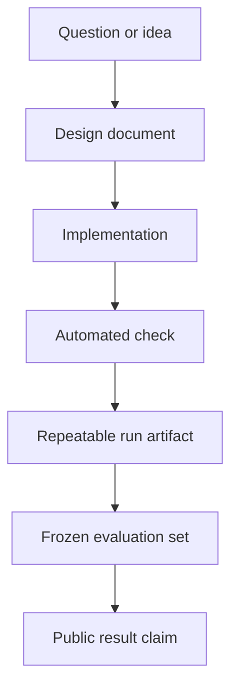

# Documentation hub

This project now has one central story and two deliberately separate research lanes:

1. **Experiential-learning lane — final experiment prepared.** V12 starts one recurrent visual
   policy from random parameters and clean ROM power-on. It converts visually different future
   frames from its own rollouts into local goals, contrasts the real goal against a blank goal, and
   grades retained behavior in deterministic no-update exams. It imports no route, demonstration,
   predecessor policy, save state, or online model decision.
2. **Assisted hierarchical lane — closed control.** V11 used a structured-state language-model
   planner, declared objectives, processed maps, A* navigation, persistent run memory, controller
   specialists, and a strict read-only referee. It is retained as an explicitly assisted upper
   bound, not presented as local experiential learning.

There is still **no whole-game result and no frozen learned policy that can complete Pokémon Red**.
V10 is the terminal learned-policy record immediately before the architectural pivot: it closed at
4,503.282 seconds, 534,924 actions, 3/32 frozen exams, and zero competent skills. Its recovery
mechanism worked, but long-horizon competence did not emerge.

V11's opening qualification is complete, and all four canaries remain part of the public story:

| Canary | Outcome | What it taught us |
| --- | --- | --- |
| C1 | Path-resolution failure | The launcher could not prove it was using the intended runtime inputs, so it failed closed |
| C2 | MCP-authorization failure | The planner connection was unavailable; no gameplay claim survived the failed authorization boundary |
| C3 | Operational but rejected | The hierarchy ran, but initialized bedroom RAM falsely described later story state; visible game evidence overruled the attractive false result |
| C4 | Opening referee qualified | 136 controller actions and 70 language-model calls produced empirical RIGHT-movement proof and verified story objective 1/84 |

The later V11 continuous attempt closed after 950.308 seconds, 329 controller actions, and 144 live
model calls, without party or badge progress. It was stopped because querying an online model for
decisions did not test the premise the project ultimately chose: learning to play through local
experience.

V12 has passed three bounded real-ROM mechanism canaries. Its latest matched-budget corrective
canary processed 6,000 actions from random weights, trained 176 self-generated hindsight lessons,
and moved demonstrated-action preference for the correct future goal from `-0.00018086` to
`+0.00353084`. No skill became competent. The T7 has 220 GiB free. A zero-action detached-process
failure is preserved, and the source-frozen retry uses a macOS-managed launch job.

The through-line for the documentation and eventual video is the pivot itself. The project began
with the “monkeys with typewriters” question, learned that randomness cannot retain luck, learned
that local rewards and rare milestone lessons can still fail to compose a journey, and tested an
auditable planner–memory–specialist system as an assisted control. The final iteration returns to
the harder premise: one local policy must make dense lessons from its own experience and prove it
uses their goals before the story credits it with learning.

## Start here

| If you want to… | Read… | What it answers |
| --- | --- | --- |
| Understand the project in a few minutes | [Project README](../README.md) | What is being built and how to run it |
| Audit the primary experiment | [Blind curiosity protocol](blind-curiosity.md) | What the agent sees, how novelty works, and what counts as leakage |
| Watch the four agents together | [Four-agent arena](four-agent-arena.md) | Exact information ladder, rewards, dashboard, and 48-hour procedure |
| Learn what evolutionary training tested | [Evolutionary Explorer](neuroevolution.md) | Genomes, mutation, MAP-Elites, lab results, checkpoint successor, and claim boundaries |
| Inspect the current experiment branch | [Selection × mutation lab](selection-mutation-lab.md) | The 90-minute result, six-lane matrix, measurements, narrative, and claim limits |
| See the path to completing the game | [Hall of Fame completion program](completion-program.md) | Expedition architecture, information labels, claim ladder, qualification gates, and policy distillation |
| Understand the next learned model | [Visual Apprentice v1](visual-apprentice.md) | Pixel inputs, self-generated demonstrations, reverse curriculum, recovery training, hardware bounds, and frozen evaluation gates |
| Follow learning through the remainder of the game | [Frontier Apprentice](frontier-apprentice.md) | Verify-before-update milestone ratchet, adaptive exploration, full-game rewards, crash safety, and evaluation limits |
| Understand the active shared-policy learner | [Parallel recurrent PPO](parallel-ppo.md) | Four-worker PPO, pixels/RAM boundaries, verified curriculum, dense rewards, checkpoints, dashboard, and benchmark evidence |
| Audit the current curriculum | [Version 5.2: the road to Brock](version-5-2-northbound.md) | V5.1's completed result, ten northbound lessons, recovery reward, evidence limits, and run questions |
| Understand the composition pivot | [Version 6: remember the journey](version-6-consolidation.md) | Retained weights, backward rolling gates, canary evidence, claim boundaries, and the next imitation ablation |
| Understand the game-naive reset | [Version 7: let a new player teach itself](version-7-self-taught.md) | Random power-on start, strict information rules, self-generated visual skills, self-imitation, canary evidence, and falsification gates |
| Understand the closed V8 result | [Version 8: separate discovery from learning](version-8-distilled-student.md) | Why V7 remains the denominator; how the 0/7 canary qualified the mechanism; why the longer seven-skill run still ended at 1/47 and zero competent skills |
| Understand the closed self-correction experiment | [Version 9: let the Student practice being wrong](version-9-self-correcting-student.md) | Exposure bias, consecutive edges, reverse practice, the failed and corrected canaries, success-only aggregation, campaign timing, and frozen-exam result |
| Understand the loop-recovery successor | [Version 10: let the Explorer recover before resetting](version-10-recovery-before-reset.md) | Why immediate reset may hide the recovery lesson; strict policy action authority; route-agnostic recovery, telemetry, falsifiers, canary gates, and claim limits |
| Understand the assisted control | [Version 11: stop teaching one button at a time](version-11-hierarchical-pivot.md) | Why V10 closed; planner/navigation/memory/specialist roles; assistance label; opening canaries; and why the continuous run was stopped |
| Understand the final experiential learner | [Version 12: every journey creates its next lesson](version-12-final-self-learner.md) | Hindsight goals, correct-goal contrast, fixed information rules, canary evidence, 48-hour contract, and falsifiers |
| Audit the V12 qualification | [V12 qualification record](../experiments/v12-qualification/README.md) | Three ROM-free canary summaries and the narrow reason the mechanism qualified |
| Inspect the first verified expedition milestone | [Q1 `left_home` result](../experiments/q1-left-home/README.md) | Both seeds, full denominator, lineage hashes, replay cost, and why 1/2 is not a pass |
| Audit the qualified memory substrate | [Archive v2 qualification](../experiments/archive-v2-qualification/README.md) | Bounded replay, exact resume, crash recovery, deterministic comparison, and the failed stop-timing attempt |
| Audit every accepted and discarded idea | [Decision register](decision-register.md) | Append-only decisions, failed hypotheses, alternatives, evidence, and consequences |
| Follow the central story | [Project narrative](narrative.md) | Why the failures and evidence are part of the project |
| Understand the reward ladder | [Reward architecture](reward-architecture.md) | Actions, milestones, loop controls, and reporting boundaries |
| See what is genuinely complete today | [Progress](progress.md) | What is verified, what is merely implemented, and what is still planned |
| Follow the journey ahead | [Roadmap](roadmap.md) | Milestones, gates, dependencies, and definitions of done |
| Understand the system | [Architecture](architecture.md) | How the emulator, agent, memory, watchdog, and referee fit together |
| Audit the original instrumentation boundary | [State instrumentation](state-observation.md) | Six read-only harness/referee fields and their limits; V11's separately disclosed structured-state actor uses a broader assisted interface |
| Judge future experimental claims | [Experiment protocol](experiment-protocol.md) | Training/evaluation separation, required metrics, and comparison rules |
| Turn experiments into clear visuals | [Visual storytelling](visual-storytelling.md) | Charts, timelines, run summaries, and a possible video structure |
| Generate a local result page | [Run reports](run-reports.md) | How a JSONL trace becomes a readable standalone report |
| Audit the current repeated run | [Phase 0 evidence](../experiments/phase-0-bootstrap/README.md) | Public metadata, attempt ledger, exact hashes, and limitations |
| Plan a video | [Video outline](video-outline.md) | Episode 0, series arc, shots, and claims checklist |
| Translate technical terms | [Glossary](glossary.md) | Plain-language definitions used throughout the project |
| Follow decisions chronologically | [Development log](devlog.md) | Dated implementation decisions and verified milestones |
| Record an experiment | [Experiment template](experiment-template.md) | A reusable protocol and results record |
| Describe an evaluated agent | [Agent card template](agent-card-template.md) | Inputs, actions, training, memory, and limitations |
| Contribute code or documentation | [Contributing guide](../CONTRIBUTING.md) | Local checks, safety rules, and repository hygiene |

## The project at a glance

```mermaid
flowchart LR
    A["✅ Harness"] --> B["✅ Random baseline"]
    B --> C["✅ Online-learning pretrials"]
    C --> D["✅ Evolution engine"]
    D --> E["✅ First inherited behavior"]
    E --> L["✅ 2 × 3 mechanism lab<br/>failed next-map gate"]
    L --> F["✅ Referee + lineage foundation"]
    F --> G["✅ Q0 expedition runner"]
    G --> H["🟨 Q1 house exit<br/>H3 reached; gate 1/2"]
    H --> I["✅ Archive v2<br/>qualified memory"]
    I --> J["✅ Visual Apprentice<br/>one-route pipeline"]
    J --> K["✅ Frontier Apprentice<br/>verify-only baseline"]
    K --> P["✅ Parallel recurrent PPO<br/>verified slices"]
    P --> V6["✅ Version 6<br/>composition failure measured"]
    V6 --> V7["✅ Version 7<br/>preserved denominator"]
    V7 --> V8["✅ Version 8<br/>0/7 canary; 1/47 final"]
    V8 --> V9["✅ Version 9 mechanism<br/>0/3 qualification"]
    V9 --> L9["✅ Version 9 long run<br/>4/87; zero competent"]
    L9 --> V10["✅ Version 10 closed<br/>3/32; zero competent"]
    V10 --> V11["✅ Version 11 assisted control<br/>closed after opening"]
    V11 --> V12["✅ Version 12 mechanism<br/>three bounded canaries"]
    V12 --> RUN["🟨 Fixed 48-hour run<br/>source-frozen retry prepared"]
    RUN --> HF["⬜ Frozen-policy Hall of Fame<br/>strict power-on verifier"]
```

The diagram shows project position, not game progress. Reaching the game-start state is a narrow
inherited behavior, the concluded inherited-archive fork was not a frozen evaluation, and Q0
runner reliability is not a gameplay milestone.

## Three reading paths

### For a viewer following the story

Read the [Project narrative](narrative.md), then [Progress](progress.md), then the
[Video outline](video-outline.md). Use [Visual storytelling](visual-storytelling.md) when turning a
new result into charts or footage.

### For someone reproducing the work

Read the [README](../README.md), [Experiment protocol](experiment-protocol.md), and
[State instrumentation](state-observation.md). Generate a [local run report](run-reports.md) from the
sanitized trace. Use the exact commands and supported ROM fingerprint in the README; the ROM itself
is never distributed here.

### For someone extending the agent

Read [Architecture](architecture.md), [Roadmap](roadmap.md), and the
[Contributing guide](../CONTRIBUTING.md). Start new evaluations from the
[experiment template](experiment-template.md) and complete an [agent card](agent-card-template.md).
In particular, preserve the boundary between what the acting policy sees and what the referee may
inspect.

## Vocabulary used throughout the documentation

| Term | Meaning in this project |
| --- | --- |
| **Harness** | Emulator lifecycle, inputs, observations, snapshots, traces, and safety checks |
| **Agent** | Any system choosing actions; it may be scripted, learned, language-model-driven, or hybrid |
| **Policy** | The action-selection component being evaluated |
| **Training run** | A run allowed to update model parameters or persistent training state |
| **Evaluation attempt** | A frozen-policy attempt scored under a declared protocol |
| **Referee** | Measurement code that can score outcomes but cannot choose or alter actions |
| **Intervention** | A human action that changes a run, including manual input, reset, or recovery |
| **Success** | Meeting a task-specific completion rule; shaped reward alone is not success |
| **Clean start** | A new game from reset, not a development save state |

## How project truth is recorded

A later box provides stronger evidence than an earlier one. A roadmap checkbox records project
work; it is not a substitute for an evaluation result. The [Progress](progress.md) page applies
this evidence ladder to the current repository.

## Documentation principles

- Put the current status before the ambition.
- Label scripts, human baselines, training runs, and frozen evaluations differently.
- Report all official evaluation attempts, including failures.
- Pair every important number with its denominator, configuration, and evidence source.
- Separate shaped reward from task completion.
- Prefer diagrams and data-derived graphics over proprietary game art.
- Never publish ROM data, save states, private paths, credentials, or unreviewed traces.
- Correct the docs when implementation changes; do not let the narrative outrun the evidence.
