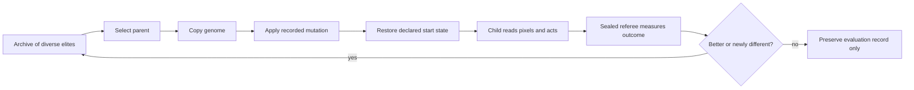

# Evolutionary Explorer: learning by inheritance

> **Status: first 90-minute Pokémon pretrial concluded; six-lane mechanism lab ROM-qualified.** The
> population inherited a reproducible game-start behavior, but uniform archive selection and broad
> mutation did not carry it into further game progress. The next engineering fork varies selection
> and mutation while keeping the source archive, power-on start, and action budget fixed. This is
> pretrial evidence—not evidence that a policy has learned to play Pokémon successfully.

## The idea in one sentence

Run a population of small pixel-reading neural policies, keep a diverse archive of the descendants
that discover something useful, mutate those survivors, and make every new generation explainable
through a recorded family tree.

This is **neuroevolution**: evolutionary search changes a neural network's parameters instead of
gradient descent changing them. The individual policy does not update while it plays. Learning
happens between evaluations, when selection decides which genomes are allowed to produce mutated
offspring.

## Why Pure Monkey is retiring

Pure Monkey sampled every action independently from a fixed uniform distribution. Its random seed
made a run reproducible, but success never changed the probability of the next action. A lucky door,
starter choice, or battle therefore left no knowledge behind.

That made it a useful control. It established what persistent game state plus true randomness can
produce and gave the project a denominator for early claims. It is not a useful main character for
multi-day training because it cannot improve.

The decision is **retire, not erase**:

- keep the `monkey` command so historical experiments remain reproducible;
- keep every existing trace, checkpoint, dashboard, and narrative;
- stop allocating a headline lane to it in future four-way arenas;
- label its evidence as a frozen random baseline rather than a learner;
- replace that lane with Evolutionary Explorer after qualification.

## What kind of evolution are we choosing?

The video description alone does not identify one exact algorithm. Several systems can look like
“run 1,000, breed the winner” from the outside:

| Method | What is inherited | Strength | Problem for this project |
| --- | --- | --- | --- |
| Genetic action search | A literal sequence of button presses | Very simple and visually intuitive | Brittle; does not learn how to react to a changed screen |
| Fixed-topology neuroevolution | Neural-network weights | A real reactive policy with manageable implementation | Network shape is supplied rather than discovered |
| NEAT | Weights and network structure | Can grow complexity and protect different species | Crossover, topology, and speciation complicate the first causal story |
| Evolution strategies | A parameter distribution or population perturbations | Efficient parallel optimization | Usually emphasizes one objective and can hide ancestry |
| MAP-Elites | A diverse archive of any genome type | Preserves different successful behaviors | Needs carefully chosen behavioral descriptors |
| Go-Explore | Promising environment states and return paths | Handles rare, long-horizon discoveries | Snapshot-assisted progress is not one policy solving from scratch |

MAP-Elites and Go-Explore are layers around a policy representation, not alternatives to neural
networks. Our version combines a fixed recurrent neural genome with a MAP-Elites archive; the
checkpoint-assisted track additionally borrows Go-Explore's return-then-explore principle.

The first version is **quality-diversity neuroevolution with mutation-only reproduction**. It
borrows two ideas:

1. **MAP-Elites:** preserve strong but behaviorally different descendants instead of keeping only
   the single highest score.
2. **Go-Explore:** remember promising deterministic game states, return to one, and explore outward
   from it rather than repeatedly losing every rare discovery.

It will not initially be NEAT. NEAT evolves both network weights and network topology, using
speciation and crossover to protect structural innovations. That is powerful, but it adds several
moving parts before we know whether a small fixed network and an honest fitness/archive protocol
can cross the early game. Fixed topology makes the first experiment easier to understand, test,
serialize, visualize, and reproduce. Topology evolution becomes a later ablation.

It will also not use crossover initially. A child will have one parent plus a recorded mutation.
This produces an unambiguous family tree: every behavioral change has one ancestral policy and one
mutation seed. Crossover can be tested later without silently changing the first question.

## The four lanes in the successor pretrial

| Lane | Learns through | Actor observes | Selection or reward sees |
| --- | --- | --- | --- |
| **Evolutionary Explorer** | Population selection and mutation | Pixels and its own previous action | Sealed progress referee plus diversity descriptors |
| **Visually Curious** | Online n-step Q learning | Pixels | Visual novelty only |
| **Outcome-Rewarded** | Online n-step Q learning | Pixels | Generic semantic outcomes |
| **Conventional** | Online n-step Q learning | Pixels plus disclosed coarse RAM | Semantic outcomes and explicit story milestones |

These are not four equal competitors. They ask four different questions:

- Can useful behavior accumulate through inheritance?
- Can a single lifetime learn curiosity from pixels?
- How much do semantic consequences help a pixels-only policy?
- What happens when both observation and objectives are game-aware?

## What the first full pretrial taught us

The successor arena ran for roughly 90 minutes before a deliberate graceful stop. Evolutionary
Explorer evaluated 236 fixed policies over 2,838,873 controller actions. Its final archive held 33
elites and reached milestone tier 1: 71 evaluations reached the game-start state, but the best
behavior still covered only one map and four positions. Thirty-eight evaluated children entered or
replaced an archive cell.

That is a narrow example of inheritance, not broad Pokémon ability. Children of parents that had
started the game repeated the behavior about 79% of the time in this run; children of non-starting
parents did so about 4.7% of the time. Yet uniform archive selection gave roughly 64% of later
evaluations to non-starting parents. Broad mutation also proved destructive: only one of 23 observed
children of the best four-position parent retained all four positions.

The three online learners executed roughly 2.2–2.56 million actions each, observed six maps, and
reached maximum party levels 27–29. They remained in a Pallet Town/Route 1 loop. Levels and actions
show activity; they do not establish story completion.

The archive and genealogy were frozen rather than discarded. The next
[selection × mutation lab](selection-mutation-lab.md) starts six evolutionary lanes from those same
neural elites. It imports brains, not game position: every child starts Pokémon from power-on.

## The policy: deliberately small and visible

The version-1 genome is the floating-point weights and biases of a fixed recurrent neural
network.

### Inputs

- the same frozen 20 by 18 quantized pixel grid used by the current blind learner;
- an eight-value one-hot encoding of the previous action;
- a constant bias input.

The actor does **not** receive map ID, coordinates, party data, Pokédex bits, event flags, rewards,
fitness, archive cell, milestone name, or parent score. Those belong to selection and reporting.

### Memory and outputs

- 32 recurrent `tanh` units provide a small within-episode memory;
- eight output logits correspond to Up, Down, Left, Right, A, B, Start, and No-op;
- the largest output selects the next action;
- every action uses the shared deterministic eight-held/twelve-released frame timing.

This is roughly thirteen thousand trainable numbers: small enough for hundreds of genomes, large
enough to associate visual patterns and recent context with buttons, and simple enough to draw.
The implementation contains **13,096 parameters**; result reports still generate this value from
the running implementation rather than trusting copied prose.

The initial policy is deterministic. Exploration comes from population diversity and mutation, not
from hidden random button sampling during evaluation. Given the same genome, start snapshot, and
software version, the action trace should be identical.

### Lifetime and early diversity

Each child receives exactly **12,000 actions** from a clean power-on state. Action count—not wall
time—is the scientific lifetime. A two-child ROM-backed qualification completed 24,000 actions in
26.2 seconds when run alone (about 917 actions/second); shared machine load lowers per-lane speed.
Fresh runs begin with 16 unrelated random genomes. The current engineering fork instead imports the
frozen 33-elite archive so selection and mutation can be isolated without waiting to rediscover the
title sequence six separate times.

The first two full lifetimes exposed an early descriptor defect: before meaningful game progress,
both policies landed in the same archive cell even though their button habits differed. The
behavior descriptor now includes a bounded action-profile bin alongside milestone tier, maps,
collection, and battle experience. Repeating the qualification preserved both children in two
separate cells. This is a mechanism check, not gameplay progress: neither child had started the
game yet.

## A generation, step by step

For each child:

1. Select a parent from the quality-diversity archive.
2. Copy its network parameters.
3. Perturb a declared subset with Gaussian noise using a recorded seed.
4. Reset the recurrent hidden state.
5. Restore the child's declared starting snapshot.
6. Run for a fixed action or milestone budget without changing its weights.
7. Measure the outcome with the sealed referee.
8. Insert the child only if it fills an empty behavioral cell or beats that cell's current elite.
9. Append the evaluation and genealogy whether the child survives or not.

There is no ambiguous phrase such as “the model learned during this run.” One child experiences one
fixed lifetime. The population learns because descendants differ and selection retains differences
that proved useful.

## Why not let only the single winner reproduce?

Pokémon contains deceptive local successes. An agent that gains levels on Route 1 can score better
than an agent that briefly explores Viridian City but loses a battle. Selecting only the largest
scalar score can turn the entire population into Route 1 specialists.

MAP-Elites instead keeps champions in different behavioral cells. The first proposed descriptors
are:

- furthest verified story milestone;
- number of distinct maps reached, placed into coarse bins;
- collection progress: no Pokédex, Pokédex obtained, species seen, and species owned;
- interaction profile: overworld-heavy, menu-heavy, or battle-experienced.

Within a cell, quality is compared lexicographically:

1. furthest validated milestone;
2. newly set persistent event flags;
3. unique directed warps;
4. species owned, then species seen;
5. badges;
6. bounded map and coordinate exploration;
7. fewer blackouts and fewer loop penalties;
8. fewer actions to the same result.

This ordering prevents thousands of local coordinates from outweighing one real story transition.
It also keeps the meaning of selection visible; a weighted scalar can hide such tradeoffs.

## Mutation and survival

Version 1 preserves every elite unchanged and creates each child from one parent. The original
control mutates each parameter with probability `0.10` and Gaussian sigma `0.05`, with a 5% chance
to use sigma `0.20`. In a 13,096-parameter network, an ordinary child therefore changes about 1,310
parameters. The first full pretrial showed that useful behavior could be inherited, but often did
not survive this edit.

The next lab compares the control against two alternatives:

- **gentle:** `p=0.02`, sigma `0.01` on every birth;
- **multiscale:** 80% micro (`p=0.01`, sigma `0.02`), 15% broad (`p=0.10`, sigma `0.05`), and 5%
  macro (`p=0.10`, sigma `0.20`).

All three profiles continue to:

- retain every current archive elite unchanged;
- produce one child from one parent;
- perturb a declared random fraction of parameters with zero-mean Gaussian noise;
- cap every parameter to a declared finite range;
- reject non-finite genomes before an emulator starts.

Mutation rate, standard deviation, mutation channel, population size, and episode budget live in
the run manifest and genealogy. These values are experimental treatments, not scientific constants.

## The long-horizon problem and checkpoint inheritance

A pure neuroevolution experiment would start every child at power-on and inherit only network
weights. That is the cleanest test of a general controller, but it repeatedly pays the entire cost
of the introduction, starter sequence, and every previous route. Completing a long role-playing
game that way is unlikely to be practical on one iMac.

The proposed **Evolutionary Expedition** therefore has two explicit evidence tracks.

### Track A — clean-start policy evolution

Every child starts at power-on. Only the genome is inherited. This answers the strongest learning
question, but initially uses short milestones such as obtaining a starter or reaching Viridian.

### Track B — checkpoint-assisted expedition

An archive elite may carry a private emulator snapshot and the complete action lineage that reached
it. Descendants branch from that state with mutated network weights. This makes whole-game search
plausible, but the population—not a single independently capable policy—is the acting system.

Checkpoint assistance must never be concealed. A result card will say either `CLEAN START` or
`CHECKPOINT-ASSISTED LINEAGE`.

Whenever Track B unlocks a new major milestone, the runner will replay the entire ancestral action
lineage from power-on. The milestone is accepted only if the replay reaches the same verified state
without manual intervention. The final completion claim requires a deterministic power-on replay of
the winning lineage. A later single-policy distillation experiment would be a separate result.

This design follows the practical insight behind Go-Explore: remember rare promising states and
return to them before exploring further. It does not pretend that snapshot inheritance is the same
as one neural network mastering the entire route.

## Population size and this Mac

“One thousand models” does not require one thousand simultaneous emulators. A model here is a small
genome evaluated in a queue.

The current six-lane calibration is:

| Setting | Initial value | Reason |
| --- | ---: | --- |
| Concurrent emulator workers | 6 | One independent runner for every 2 × 3 condition |
| Candidate population | 128 per lane | Enough variation for a bounded mechanism comparison |
| Elite carryover | Entire occupied archive | Never discard a cell's current champion |
| Child budget | 12,000 actions | Long enough to test inherited title-sequence behavior |
| Total budget | 1,536,000 actions per lane | Equal scientific fuel across all six conditions |
| Major-milestone replay | From power-on | Verify the lineage rather than trust a snapshot |
| Genome storage | Float32 plus hash | Compact and deterministic |

The M1 iMac runs six emulator processes concurrently, not 768 simultaneous policies. Every lane is
a queue of 128 child evaluations. A thousand candidates would likewise be a longer queue, not a
thousand open emulator windows. The dashboard should therefore emphasize **candidates evaluated**,
**actions consumed**, and **surviving lineages**, not imply that every genome is alive at once.

Later-stage children need larger budgets. The runner should increase the suffix budget only when a
milestone tier proves that a longer horizon is justified. Compute estimates must be recalculated
from calibration artifacts before the first unattended 48-hour expedition.

## What the dashboard must teach

The evolutionary dashboard is part laboratory notebook and part family album. It should show:

- current generation, evaluated children, survivors, and evaluations per hour;
- a family tree from ancestor to descendant, colored by milestone;
- the MAP-Elites grid, including occupied and empty behavioral cells;
- each elite's parent, mutation magnitude, fitness vector, and start condition;
- progress discovered per generation rather than reward per action alone;
- extinction and replacement events;
- the latest screen from each active worker;
- the champion lineage replay from power-on;
- compute time, disk use, crashes, retries, and human interventions.

Every genome receives an immutable ID derived from its parameters. Every child record contains its
parent ID, generation, mutation seed, code commit, configuration hash, start-state hash, end-state
summary, and action-lineage hash. Private snapshots and gameplay frames remain outside Git.

## Worked miniature example

Suppose generation 12 contains three elites:

- `A` reached many Pallet Town coordinates;
- `B` entered Route 1 with fewer coordinates;
- `C` opened menus and selected a starter.

A single-score genetic algorithm might keep only `A` because its exploration count is larger.
MAP-Elites keeps all three because they occupy different behavioral cells.

Generation 13 creates mutated children:

- `A.1` walks the same loop and does not replace `A`;
- `B.1` enters Viridian City and replaces `B` in the map-progress cell;
- `C.1` loses the rival battle but remains recorded;
- `C.2` wins the rival battle and creates a new battle-progress cell.

The next generation may descend from both `B.1` and `C.2`. Useful accidents become hereditary
without forcing every lineage to imitate the most immediately profitable behavior.

## Implementation stages and evidence gates

### E0 — design complete

- Freeze terminology, information boundaries, archive semantics, and claims language.
- Record this decision and retire Pure Monkey from future headline arenas.

### E1 — deterministic genome and policy

- ✅ Implement the fixed recurrent network with no machine-learning framework dependency.
- ✅ Round-trip genomes through checkpoints and reproduce identical action selection.
- ✅ Keep policy inputs restricted to declared pixels and previous action.

### E2 — population engine

- ✅ Implement parent selection, mutation, sequential evaluation, immutable genealogy, and resume
  checkpoints.
- ✅ Unit-test deterministic genomes, mutation, elitism, bounded archive replacement, and the
  clean-start runner.
- 🟨 Continue failure-injection and longer resume qualification during pretrials.

### E3 — Pokémon pretrial

- ✅ Complete the first 90-minute population run and preserve its archive and genealogy.
- ✅ Identify reproducible title-sequence inheritance plus uniform-selection and mutation-retention
  bottlenecks.
- 🟨 Run the equal-budget 2 × 3 selection/mutation fork from the frozen neural archive.
- 🟨 Confirm six-emulator stability, bounded storage, deterministic lineage replay, and visible
  diversity.
- ⬜ Repeat the selected mechanism from fresh random populations across multiple seeds.

### E4 — clean-start early-game evaluation

- Freeze a genome/archive configuration.
- Compare it against the preserved random baseline and the three online learners.
- Report every attempt and distinguish population training from frozen-policy evaluation.

### E5 — checkpoint-assisted expedition

- Enable snapshot inheritance only after clean-start behavior and replay verification work.
- Require a power-on ancestral replay for every promoted major milestone.
- Treat Hall of Fame as complete only after the entire winning lineage replays successfully.

## Failure modes we expect to learn from

| Failure | Why it happens | Planned defense |
| --- | --- | --- |
| One lineage dominates | Scalar fitness rewards a local optimum | MAP-Elites cells and novelty-biased parent selection |
| Useful lineages rarely reproduce | Uniform selection over many weak diversity cells | Compare frontier-biased selection with a 20% diversity reserve |
| Mutations erase skills | Too much parameter noise | Elitism, gentle and multiscale profiles, and immutable parents |
| No behavioral change | Too little parameter noise | Scheduled large mutations and diversity tracking |
| Snapshot corruption looks like progress | Invalid or incompatible state inheritance | ROM/version binding, hashes, and power-on lineage replay |
| Fitness is farmed | Coordinates, menus, or battles repeat cheaply | Lexicographic milestones and capped local signals |
| The archive grows forever | Too many descriptors or snapshots | Fixed bins, per-cell elite limits, and storage ceilings |
| “Solved” means only one lucky suffix | Checkpoint-assisted branches hide the history | Full ancestral replay and explicit evidence labels |
| Family tree becomes unreadable | Every failed child is drawn equally | Preserve all data but visually prioritize survivors and milestones |

## What would count as success?

The project will use increasingly strong claims:

1. **Evolution occurred:** descendants reliably differ and archive quality increases.
2. **Useful inheritance occurred:** a descendant retains an ancestral skill and adds a milestone.
3. **The population reached a milestone:** a checkpoint-assisted lineage reached and replayed it.
4. **A frozen genome learned a skill:** one fixed genome succeeds from declared clean starts.
5. **The evolutionary system completed the game:** the full winning action lineage replays from
   power-on through the Hall of Fame without intervention.
6. **One policy completed the game:** a single frozen genome does so from power-on. This is a
   stronger later goal and is not implied by claim 5.

## Primary references

- Stanley and Miikkulainen's
  [NEAT paper](https://direct.mit.edu/evco/article/10/2/99/1123/Evolving-Neural-Networks-through-Augmenting)
  explains evolving network weights and topology, speciation, and protecting structural innovation.
- Mouret and Clune's
  [MAP-Elites paper](https://arxiv.org/abs/1504.04909) describes maintaining high-performing
  solutions across user-chosen dimensions of behavioral variation.
- Lehman and Stanley's
  [work on novelty search](https://doi.org/10.1007/978-1-4614-1770-5_3) explains why an ambitious
  objective can lead search toward deceptive local optima.
- Lehman and Stanley's
  [Novelty Search with Local Competition](https://doi.org/10.1145/2001576.2001606) shows how
  behavioral diversity and quality among similar behaviors can be optimized together.
- Lehman and colleagues'
  [Safe Mutations paper](https://arxiv.org/abs/1712.06563) motivates mutations that change behavior
  without unnecessarily destroying a neural network's existing function.
- Ecoffet and colleagues'
  [Go-Explore paper](https://www.nature.com/articles/s41586-020-03157-9) motivates remembering
  promising states, returning to them, and then exploring outward in hard-exploration problems.

These papers inform the design; they do not prove that this particular system will solve Pokémon.
That remains the experiment.
