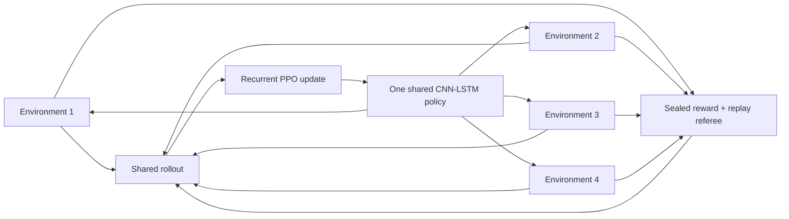

# Parallel recurrent PPO

> **Status:** implemented and exercised in pixels-only and privileged-input canaries on
> 2026-07-20. The first long pixels-only development campaign is the next evidence step. A canary
> proves that the machinery updates; it does not prove that the policy has learned Pokémon Red.

## Why this lane exists

Frontier Apprentice taught only from a rare kind of event: a new named milestone that survived
exact replay. That made every update easy to audit, but most of the agent's experience disappeared.
Walking into a new tile, discovering a map, entering a battle, gaining a level, or finding an item
could help the archive choose where to search, yet none of those events changed the network unless
the same suffix ended in a verified named promotion.

Parallel recurrent PPO changes that rule. Four emulator workers collect trajectories for one
shared CNN-LSTM policy. Every completed rollout contributes to an optimizer update. Dense trainer
rewards can therefore make a failed expedition informative while the existing replay referee still
decides whether a named milestone becomes part of the curriculum.

The audience-readable turn is simple:

> The earlier learner remembered victories. This learner can also learn from the road to them.

That sentence describes the update mechanism, not the result. Whether the mechanism produces
better behavior remains an empirical question.

## Influence and deliberate differences

This lane was prompted by Peter Whidden's
[Pokémon Red experiments](https://github.com/PWhiddy/PokemonRedExperiments) and the accompanying
[video](https://youtu.be/DcYLT37ImBY). That project demonstrated the practical value of recurrent
PPO, several simultaneous emulator environments, pixels plus structured game state, checkpointed
starting states, and visual progress reporting.

This implementation borrows the broad pattern and keeps this project's existing evidence rules:

| Design question | Whidden-inspired lesson | This project’s implementation |
| --- | --- | --- |
| How do failures teach? | Optimize from rollout batches | Recurrent PPO updates from every vector rollout |
| How is CPU time used? | Run many environments | Benchmark 2, 4, and 6; select four on the 8 GB M1 |
| What does the actor see? | Pixels plus useful state can accelerate learning | Primary lane is pixels plus previous action; a separately labeled privileged comparator adds 24 state values |
| Where do episodes begin? | Useful checkpoint starts shorten the horizon | Starts come only from a frozen, replay-verified Archive-v2 curriculum |
| What counts as progress? | Reward and map coverage make learning visible | Reward is diagnostic; only exact edge replay plus three power-on replays admit a new named milestone |
| Is this game completion? | Early-game progress can still be informative | Only a verified Hall-of-Fame promotion ends training as completion, and only frozen power-on evaluation can support an autonomous-policy claim |

This is an influence record, not a claim that the implementations or results are identical.

## Information boundaries

The code supports two actors so the project can measure the value of privileged state without
quietly mixing it into the pixels-only claim.

| Lane | Actor receives | Trainer/referee may inspect | Honest label |
| --- | --- | --- | --- |
| Pixels | Two 72 × 80 grayscale frames and previous action | Documented RAM for reward, termination, curriculum, and replay | `PIXEL-ACTOR / PRIVILEGED-TRAINING-REFEREE / PPO / ARCHIVE-RESTORE` |
| Privileged comparator | The pixel input above plus 24 normalized state values | The same referee fields | `PIXEL+RAM-ACTOR / PPO / ARCHIVE-RESTORE / COMPARATOR` |

The 24-value comparator vector contains game-start state, map and coordinates, party size, battle
kind, individual badge bits, maximum party level, Pokédex counts, event count, bag count, Pokédex
ownership state, and party diversity. It is intentionally small, versioned by the PPO protocol,
and never described as pixels-only.

Neither actor receives a milestone name, checkpoint identity, target action, walkthrough, reward
component, or replay result. Trainer-owned RAM can change learning signals and starting-state
selection; it cannot directly choose a button.

## The shared recurrent policy



The visual encoder matches the Visual Apprentice network: three convolution layers followed by a
256-unit representation. The previous action is appended before a 128-unit LSTM. The eight-way
policy head chooses Up, Down, Left, Right, A, B, Start, or No-op. The PPO value function is trained
alongside the policy.

The initial convolution, actor LSTM, and action-head weights are copied exactly from the current
Frontier Apprentice checkpoint. In the privileged comparator, the additional LSTM input columns
start at zero, so the warm start initially behaves like its pixels-only ancestor and can learn to
use the new state later. The value head begins new because Frontier Apprentice did not have one.

## Frozen verified curriculum

PPO never reads the active expedition store directly. At launch, the runner opens one atomic
Archive-v2 checkpoint boundary, rejects unverified cells, and copies one representative for each
available milestone/map niche into a private curriculum directory. Every entry contains:

- the exact frozen emulator snapshot;
- its canonical milestone key, index, and label;
- its complete action lineage from power-on; and
- a content hash bound in the curriculum manifest.

Seventy percent of episode resets sample the furthest verified milestone; the remainder sample the
broader curriculum. This makes the newest frontier common without erasing rehearsal of earlier
game states. Emulator state, recurrent state, pixel history, prior action, reward memory, and local
episode history all reset together. Hidden recurrent state is never smuggled across a checkpoint.

## What reward means

The reward ledger reuses the full-game shaping catalog:

- named milestone advancement;
- first visit to a map, coordinate, or warp during the episode;
- newly observed event flags, badges, party members, levels, moves, species, and items;
- battles ending;
- blackouts, repeated actions, and later loop signals as penalties.

Each restored parent is primed before scoring, so PPO is not repeatedly paid merely for loading a
good checkpoint. Novelty is episodic: discovering a useful transition again from a sampled parent
can reinforce the behavior again. The complete component totals are written to status and hourly
narrative records.

Reward remains a training diagnostic. A high return does not mean the agent completed a quest,
defeated a Gym Leader, or reached the Hall of Fame.

## Promotion remains harder than reward

When a worker observes a named milestone beyond the curriculum's current best, it writes a private
candidate containing the parent, local actions, terminal snapshot, screen hash, and referee
summary. The central trainer pauses admission and performs:

1. one exact replay of the candidate suffix from its parent snapshot; and
2. three exact replays of the parent's complete lineage plus the suffix from the unique power-on
   root.

Snapshot hash, screen hash, canonical milestone, and referee summary must all match. Only then does
the trainer atomically add the checkpoint to the curriculum and record a verified promotion. A
failed verification stays in the failure ledger and never becomes a training start.

This keeps two ideas separate:

- **PPO update:** the policy learned from a rollout batch; and
- **verified promotion:** the experiment proved a new durable game outcome.

## Checkpoints and interruption semantics

The latest and previous PPO archives are retained. A checkpoint binds the model file hash, total
actions, elapsed time, full configuration, and best milestone. Resume refuses a mismatched model or
configuration.

Stable-Baselines3 preserves model parameters, optimizer state, schedules, and timestep count. The
emulator processes and partially collected rollout restart. Every status and manifest therefore
uses the exact phrase:

`exact model/optimizer; fresh environment rollouts`

That is strong enough for an interrupted development campaign, but it is not a bit-identical
continuation of every worker's hidden emulator and LSTM state.

The runner stops cleanly for wall time, action ceiling, explicit stop request, low disk space,
output limit, or a replay-verified Hall of Fame. Disk tree scans happen on the reporting cadence,
not every action.

## Mac worker benchmark

The 2026-07-20 setup benchmark ran while the prior Frontier Apprentice baseline still occupied one
CPU core. Every candidate completed two real PPO updates.

| Environments | Combined actions | Measured actions/s | Interpretation |
| ---: | ---: | ---: | --- |
| 2 | 256 | 178.06 | Leaves CPU capacity unused |
| 4 | 512 | 419.34 | Fastest tested collection rate |
| 6 | 768 | 351.39 | Emulator and training contention begins |

The production-shaped four-environment canary then used 256-step rollouts, batch size 256, four
optimizer epochs, and the full 4,096-action episode horizon. It completed 2,048 actions and two PPO
updates at 218.65 actions/s, wrote all four gameplay frames, saved a hash-matched checkpoint, and
ended with the dashboard correctly marked `finished`.

Microbenchmarks are not learning results. Their purpose is to choose four workers and avoid wasting
the long-run window on an oversubscribed machine.

## Live dashboard and narrative evidence

The live page refreshes every five seconds and shows:

- combined controller actions and actions per second;
- environment count and current run state;
- best replay-verified milestone;
- PPO update and verified-promotion counts;
- episodes and unique map positions; and
- the latest rendered frame from every emulator worker.

TensorBoard receives optimizer metrics. `status.json` supplies machine-readable counters.
`NARRATIVE.md` appends an hourly chapter with the best milestone, actions, updates, promotions,
episodes, and coverage. Named promotions also create immediate chapters and preserve their exact
frame. These artifacts are private by default because gameplay frames, snapshots, curriculum
entries, and model weights must not enter Git.

## First long-run interpretation rules

### Launch record

The first 24-hour command was detached from its terminal with a generic shell wrapper. The Codex
app cleaned up that process group after four actions, before any PPO checkpoint existed. Its
private directory was preserved as a failed launch. The replacement uses the managed long-running
session that supported the earlier campaigns. It was not accepted as healthy merely because its
dashboard opened: the launch gate required all four worker frames, several complete PPO rollouts,
zero verification failures, and a model archive whose SHA-256 matched its checkpoint record.

The managed run passed that gate at 21,508 observed actions with 21 PPO updates, 278 unique
positions, and its first hash-matched checkpoint at action 16,384. The episode outcome remains
unknown. This operational failure belongs in the narrative because a visible dashboard alone can
outlive the process that was supposed to update it.

The first campaign is a development trial, not a frozen policy evaluation. Its useful outcomes are:

| Outcome | What it would support | What it would not support |
| --- | --- | --- |
| More PPO updates but no new milestone | The machinery learned from batches but failed to convert reward into named progress | That PPO is generally useless |
| Better coverage and reward, same milestone | Dense shaping changed behavior diagnostically | That the agent advanced the story |
| One verified later milestone | PPO-assisted training extended the curriculum once | Autonomous completion or robustness |
| Several verified promotions | The shared-policy/curriculum loop accumulated real progress | One frozen clean-start policy can reproduce it |
| Verified Hall of Fame | The archive-assisted training system found and replayed a complete lineage | H5/H6 autonomous-policy mastery until frozen power-on evaluation passes |

The pixels lane is primary. The privileged lane is a comparator to answer how much direct state
helps, not a fallback whose stronger information label can be hidden if it wins.

## Reproduction outline

Install the explicitly optional learning stack:

```bash
python -m pip install -e ".[dev,apprentice,rl]"
```

Then point the runner to private, ignored artifacts:

```bash
pokemon-red-ai ppo-run \
  --rom "/private/path/Pokemon Red.gb" \
  --output "/external/private/path/parallel-ppo-run" \
  --curriculum-source "/external/private/path/verified-expedition" \
  --learner "/external/private/path/verified-expedition/frontier-learner.pt" \
  --mode pixels \
  --environments 4 \
  --hours 8 \
  --max-actions 150000000 \
  --port 8772
```

Use `pokemon-red-ai ppo-status RUN_DIRECTORY` for a concise heartbeat and
`pokemon-red-ai ppo-stop RUN_DIRECTORY` for an atomic checkpoint request. Never publish the output
directory without a separate review and sanitization step.

## Questions deliberately left open

- Does episodic novelty pay common early transitions too often?
- Will 4,096 actions let the recurrent policy learn sufficiently long local skills?
- Does the current entropy setting preserve exploration after the warm-started action prior?
- Should verified curriculum sampling become milestone-balanced after later maps accumulate?
- Does pixels-only PPO beat verify-only self-imitation at the Viridian Forest gate?
- How much of any privileged comparator advantage comes from coordinates rather than game state?
- When should a frozen power-on evaluation interrupt training without consuming the training RNG?

Those are experiment questions. They should be answered with matched runs and retained failures,
not tuned away silently during the first long campaign.
