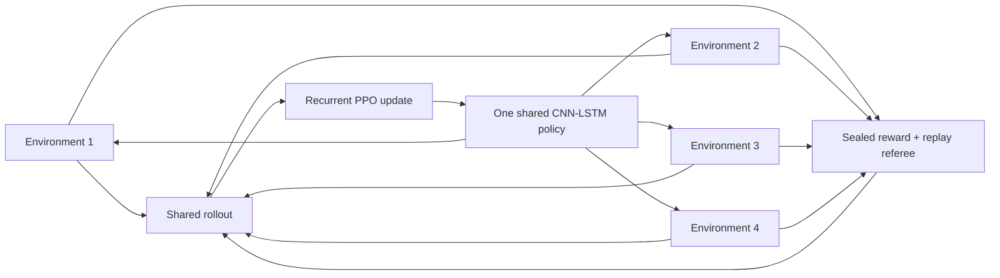

# Parallel recurrent PPO

> **Status:** Versions 4–6 established replay-verified PPO discovery, assisted lessons, and the
> distinction between a stored lineage and one-policy competence. Version 7 is the live
> random-start, self-generated denominator. Version 8 keeps that no-imported-solution boundary but
> separates four PPO Explorers from a replay-distilled recurrent Student and frozen examiner. A
> clean source-bound V8 canary reached Oak's lab, created four distilled skills, survived two
> resumes, and passed 0/7 frozen exams. That qualifies the pipeline. The final longer V8 run reached
> Route 1 with seven skills but finished at 1/47 and zero competent skills, so causal learning and
> later-game behavior remain unproved. V8 is closed. The corrected
> [Version 9](version-9-self-correcting-student.md) canary qualifies closed-loop mechanism,
> observability, and wall-time control at 0/3 frozen exams; it does not weaken the exam boundary or
> establish competence. Its eight-hour fresh-start campaign is active under a frozen protocol; the
> first 0/1 exam checkpoint is provisional, not a learning result.

## Why this lane exists

Frontier Apprentice taught only from a rare kind of event: a new named milestone that survived
exact replay. That made every update easy to audit, but most of the agent's experience disappeared.
Walking into a new tile, discovering a map, entering a battle, gaining a level, or finding an item
could help the archive choose where to search, yet none of those events changed the network unless
the same suffix ended in a verified named promotion.

Parallel recurrent PPO changes that rule. Four emulator workers collect trajectories for one
shared CNN-LSTM policy. Every completed rollout contributes to an optimizer update. Dense trainer
rewards can therefore make a failed expedition informative while the existing replay referee still
decides whether a named milestone becomes part of the curriculum.

The audience-readable turn is simple:

> The earlier learner remembered victories. This learner can also learn from the road to them.

That sentence describes the update mechanism, not the result. Whether the mechanism produces
better behavior remains an empirical question.

## Influence and deliberate differences

This lane was prompted by Peter Whidden's
[Pokémon Red experiments](https://github.com/PWhiddy/PokemonRedExperiments) and the accompanying
[video](https://youtu.be/DcYLT37ImBY). That project demonstrated the practical value of recurrent
PPO, several simultaneous emulator environments, pixels plus structured game state, checkpointed
starting states, and visual progress reporting.

This implementation borrows the broad pattern and keeps this project's existing evidence rules:

| Design question | Whidden-inspired lesson | This project’s implementation |
| --- | --- | --- |
| How do failures teach? | Optimize from rollout batches | Recurrent PPO updates from every vector rollout |
| How is CPU time used? | Run many environments | Benchmark 2, 4, and 6; select four on the 8 GB M1 |
| What does the actor see? | Pixels plus useful state can accelerate learning | Primary lane is pixels plus three recent actions; a separately labeled privileged comparator adds 24 state values |
| Where do episodes begin? | Useful checkpoint starts shorten the horizon | Starts come only from a frozen, replay-verified Archive-v2 curriculum |
| What counts as progress? | Reward and map coverage make learning visible | Reward is diagnostic; only exact edge replay plus three power-on replays admit a new named milestone |
| Is this game completion? | Early-game progress can still be informative | Only a verified Hall-of-Fame promotion ends training as completion, and only frozen power-on evaluation can support an autonomous-policy claim |

This is an influence record, not a claim that the implementations or results are identical.

## Information boundaries

The code supports five declared modes so the project can measure the value of assistance and privileged
state without quietly mixing either into the pixels-only claim.

| Lane | Actor receives | Trainer/referee may inspect | Honest label |
| --- | --- | --- | --- |
| Pixels | Two 72 × 80 grayscale frames and three recent actions | Documented RAM for reward, termination, curriculum, and replay | `PIXEL-ACTOR / PRIVILEGED-TRAINING-REFEREE / PPO / ARCHIVE-RESTORE` |
| Assisted teacher | The pixel input above, an episodic 64 × 64 visited-position map, next-milestone one-hot, coarse navigation/interaction/battle lesson, and normalized map/goal context | The same referee fields | `PIXEL+TRAINER-MAP+GOAL-ACTOR / PPO / ARCHIVE-RESTORE / TEACHER` |
| Privileged comparator | The pixel input above plus 24 normalized state values | The same referee fields | `PIXEL+RAM-ACTOR / PPO / ARCHIVE-RESTORE / COMPARATOR` |
| Self-taught | The pixel input, three recent actions, and during rehearsal only a terminal screen reached by the same run | General novelty, loop detection, replay grading, and skill scheduling | `SELF-TAUGHT / RANDOM-START / PIXELS+SELF-VISUAL-GOAL / NO-IMPORTED-ACTIONS` |
| Distilled Student | Explorer receives the self-taught open-play input; separate Student receives pixels, own action history, and a short terminal clip from the same run | Replay-backed trajectory reduction, prerequisite scheduling, and frozen grading; no live button authority | `SELF-TAUGHT / SEPARATE EXPLORER+STUDENT / SELF-GENERATED DISTILLED SEQUENCES` |

The self-taught lane deletes all inherited curriculum entries except the clean power-on root and
initializes a new recurrent policy randomly. Milestone labels and active routes remain referee
measurements only; their rewards are zero. See [Version 7](version-7-self-taught.md).

The 24-value comparator vector contains game-start state, map and coordinates, party size, battle
kind, individual badge bits, maximum party level, Pokédex counts, event count, bag count, Pokédex
ownership state, and party diversity. It is intentionally small, versioned by the PPO protocol,
and never described as pixels-only.

The assisted teacher receives the identity of the *next* canonical lesson as a one-hot value, but
not a target action, route, walkthrough, reward component, or replay result. Its map marks only
positions visited during the current episode and the current position; it is rebuilt by the
trainer and resets with the episode. Pixels and privileged-comparator modes receive no lesson ID.
Trainer-owned state can change learning signals and starting-state selection; it never presses a
button.

## The shared recurrent policy



The visual encoder matches the Visual Apprentice network: three convolution layers followed by a
256-unit representation. Version 4 appends one-hot encodings of the three most recent actions
before a 128-unit LSTM. The eight-way
policy head chooses Up, Down, Left, Right, A, B, Start, or No-op. The PPO value function is trained
alongside the policy.

The initial convolution, actor LSTM, and action-head weights are copied exactly from the current
Frontier Apprentice checkpoint. In the privileged comparator, the additional LSTM input columns
start at zero, so the warm start initially behaves like its pixels-only ancestor and can learn to
use the new state later. The value head begins new because Frontier Apprentice did not have one.

## Frozen verified curriculum

PPO never reads the active expedition store directly. At launch, the runner opens one atomic
Archive-v2 checkpoint boundary, rejects unverified cells, and copies one representative for each
available milestone/map niche into a private curriculum directory. Every entry contains:

- the exact frozen emulator snapshot;
- its canonical milestone key, index, and label;
- its complete action lineage from power-on; and
- a content hash bound in the curriculum manifest.

Seventy percent of episode resets sample the furthest verified milestone; the remainder sample the
broader curriculum. This makes the newest frontier common without erasing rehearsal of earlier
game states. Emulator state, recurrent state, pixel history, prior action, reward memory, and local
episode history all reset together. Hidden recurrent state is never smuggled across a checkpoint.

## What reward means

The reward ledger reuses the full-game shaping catalog:

- named milestone advancement;
- first visit to a map, coordinate, or warp during that worker's campaign;
- newly observed event flags, badges, party members, levels, moves, species, and items;
- worker-lifetime record experience, capped per observation;
- battles ending only after durable experience or capture progress;
- blackouts, repeated actions, and later loop signals as penalties.

Each restored parent is primed before scoring, so PPO is not paid merely for loading a good
checkpoint. Version 1 then reset its novelty memory at every episode. The first long run exposed
why that was unsafe: during one 238,592-action slice it recorded 1,784 episode-local position
rewards while adding only five globally unique positions. Familiar routes could therefore pay
again after every reset.

Version 2 keeps map, coordinate, warp, event, party, item, move, species, badge, level, and best
milestone memory for each worker's complete campaign. A reset absorbs its restored parent into that
memory before the first scored action. Four workers may each discover the same fact once, but no
worker can farm it on every episode. Every worker's compressed novelty memory is immutable,
content-hashed, and bound into each PPO checkpoint, so a graceful resume cannot reset the reward
history. The complete component totals are written to status and hourly narrative records.

Version 2 then exposed a second loophole. At 724,996 actions and 41 minutes it remained at Route 1:
the preceding 366,592-action interval added only 24 global positions while paying 2,930 reward for
293 more battle endings. An optimizer can learn to enter and leave frequent Route 1 encounters
without learning to win them. Version 3 therefore removes unconditional `battle_ended` reward.
A battle now earns a reduced `battle_success` value of 2 only if that same battle produced durable
experience or a newly owned species. Leaving without either produces no reward and is counted as
`ended_without_progress` on the dashboard. New party experience pays 0.02 per point only above the
worker's lifetime record, with at most 500 points rewarded at one observation. A reset can therefore
absorb an inherited experience total but cannot repay it. Blackouts retain their explicit penalty.

This is not a claim that RAM tells the actor how to battle. The pixels-only policy still receives
only two frames and its previous action. The trainer reads the documented three-byte experience
field to decide whether an outcome deserves training credit. The protocol is bumped to
`parallel-recurrent-ppo-v3`; version-2 PPO weights are not resumed under the new objective.

The version-2 run was preserved through its planned one-hour boundary rather than stopped at the
first suspicious interval. It ended after 3,649.552 seconds with 1,064,964 actions, 1,040 PPO
updates, 260 episodes, 515 global positions, Route 1, and no verified promotion or verification
failure. Its ledger paid 10,030 for 1,003 battle endings. From action 358,404 to the final checkpoint,
706,560 additional actions added only 26 global positions. The final model and every worker novelty
file matched the hashes recorded in the terminal checkpoint.

Reward remains a training diagnostic. A high return does not mean the agent completed a quest,
defeated a Gym Leader, or reached the Hall of Fame.

## Version 3 result and Version 4 response

Version 3 ended cleanly after 3,701.6 seconds. It completed 1,147,988 controller actions, 1,121 PPO
updates, and 280 episodes at 310.13 actions per second. It retained 500 unique positions and 18
verified curriculum starts. It began 152 battles, credited nine durable successes, recorded 110
no-progress exits, and observed 17 blackouts. Its best verified milestone remained Route 1. The
terminal model and all four persistent novelty memories matched the hashes in the final checkpoint.

That is stronger evidence than a screenshot of a stuck menu. Version 3 could sometimes finish a
battle, but its trainer supplied no credit for the useful intermediate act of selecting a move and
reducing an opponent's HP. The 4,096-action episode horizon also made resets frequent, while a
stable menu cycle could consume the rest of an episode without an explicit classification.

Version 4 changes four things together, so it is an engineering iteration rather than a clean
single-variable ablation:

1. **Battle-local credit.** The trainer reads the documented big-endian `wEnemyMonHP` and
   `wEnemyMonMaxHP` fields. Reducing an HP bar pays up to two points per full bar, capped at four
   points per battle. Healing cannot make the same damage repay. Partial damage never reclassifies
   an escape as a durable battle success.
2. **Explicit loop termination.** A trainer-only perceptual screen signature watches for a
   128-action low-diversity cycle. Useful new positions, milestones, experience, events, ownership,
   badges, or lower enemy HP reset the timer. A separate 1,024-action ceiling classifies general
   stagnation. The terminal penalty is paid once and the reason remains in the denominator.
3. **Longer local horizon.** The default episode grows from 4,096 to 16,384 actions. This is still
   one tenth of the reference project's 163,840-action setting; the watchdog makes the additional
   budget conditional on continuing progress.
4. **Visible action history.** The actor receives three recent one-hot actions rather than one.
   These are the actor's own past outputs, not game RAM or a scripted hint. New LSTM input columns
   start at zero during the Frontier Apprentice warm start.

The protocol becomes `parallel-recurrent-ppo-v4` and the reward protocol becomes
`battle-local-credit-and-stagnation-v1`. Version-3 PPO weights are preserved as evidence but cannot
resume under the new observation and reward definitions.

### What the reference implementation solves—and what it does not

The reference project's Version 2 uses 64 environments and 163,840-action episodes. Its policy is
not pixels-only: alongside three stacked screens it directly receives party health, encoded level
sum, badge bits, event bits, a local visited-map image, and three recent actions. Its reward combines
events, healing, badges, coordinate exploration, and a small coordinate-overuse term. This explains
why importing its complete recipe would change the central experiment instead of merely improving
it.

Three reference ideas survive our information-boundary test: longer episodes, multiple recent
actions, and early termination for prolonged lack of progress. The following do not enter the
headline lane:

- direct badge, event, health, or visited-map observations;
- episode-reset coordinate rewards, because Version 1 already proved those can be farmed;
- the reference `stuck` reward as a complete menu-loop solution, because it is a one-time potential
  change after 600 visits to one coordinate and Version 2 otherwise ends only at its action limit;
- healing reward, because repeated damage and recovery could become another renewable local loop.

The reference contains no ready-made opponent-HP damage reward or robust perceptual menu-cycle
detector. Those Version-4 mechanisms are local additions with their own tests and telemetry.

### Version-4 qualification

The first 16,384-action production-shape canary proved that the watchdog terminates real emulator
episodes: it classified two perceptual cycles and two long stagnations, wrote four live frames, and
finished 16 PPO updates with no promotion-verification failure. A second four-worker stress canary
ran 65,536 actions and 64 updates in 221.708 seconds (295.60 actions/s). It recorded 33 battle
starts, 27.157 points of bounded opponent-damage credit, seven durable successes, 14 no-progress
exits, five blackouts, 18 visual cycles, and four long stagnations. It retained 491 positions and
remained at Route 1 with no verification failure; all terminal hashes matched.

Review then caught a warm-start semantic error in those two canaries. The older one-action model's
weights had been copied into the oldest of Version 4's three history slots instead of the newest.
The canaries remain useful evidence for HP credit and loop wiring, but they do not qualify the final
observation mapping. The fix zeroes both new older-history slots and explicitly places the inherited
weights in the newest-action slot. A focused tensor test locks that mapping.

The corrected build then completed a fresh 16,384-action, four-worker canary in 57.035 seconds. It
recorded three battle starts, 5.412 opponent-damage credit, two durable successes, one blackout,
five visual cycles, one long stagnation, 16 PPO updates, and no promotion-verification failure. The
manifest records the corrected mapping, and the final model plus all four worker memories matched
their checkpoint hashes.

Together these checks passed the Version-4 engineering gate: real HP deltas reach the reward
ledger, partial damage and durable victory remain separate outcomes, loops end with named reasons,
all workers update one policy, and terminal artifacts are internally consistent.

### Version-4 result: the first PPO promotion

Version 4 was stopped deliberately after 6,033.643 seconds. It completed 1,776,644 actions, 1,735
PPO updates, and 968 episodes at 294.46 actions per second. At action 790,900 it produced a
2,109-action suffix from the Route 1 checkpoint that entered Viridian City. The suffix passed one
parent-edge replay and three complete power-on lineage replays before admission. That raised the
verified frontier from Route 1 to Viridian City and the curriculum from 18 to 19 entries.

The same run began 718 battles, credited 49 durable successes, classified 563 exits without
durable progress, and observed 50 blackouts. It terminated 499 visual cycles and 469 longer
stagnations. The final model and all four worker novelty memories matched their checkpoint hashes.
This is real checkpoint-assisted progress and the first recurrent-PPO promotion; it is not a claim
that one policy can travel from power-on to Viridian City without checkpoint restores.

The promotion also sharpened the bottleneck. A named milestone pays only after the agent has
already solved a long behavior chain. Version 4 could learn from movement, battle damage, and
durable outcomes, but its actor had no external memory of which city tiles it had already searched
and no way to distinguish “find the Mart” from the eventual goals that use the same visual world.
Waiting longer would increase the number of chances, but would not change that representation
problem.

## Version 5: micro-curriculum assisted teacher

Version 5 makes the training ladder explicit. The final ambition remains a frozen power-on agent,
but the current question is narrower: **can an assisted teacher reliably acquire one composable
skill at a time, and can those skills later be distilled into an unassisted student?**

The first lesson inserted after Viridian City is `entered_viridian_mart`. This leaves every earlier
milestone number unchanged, so Version 4's verified Viridian state remains milestone 8. Entering
the Mart becomes milestone 9; receiving Oak's Parcel moves to milestone 10. Later lessons still
come from the full canonical Hall-of-Fame catalogue rather than ending at the first errand.

Version 5 changes five connected mechanisms:

1. **Verified curriculum migration.** A finished Version-4 run may seed Version 5 only if its final
   state is clean, model hash matches, four novelty hashes match, every curriculum entry and
   progress ordinal remains canonical, and exactly one power-on root exists. Private snapshots and
   action lineages are copied and re-hashed; Version-4 PPO weights are not resumed under the new
   observation and reward objective.
2. **Episodic map memory.** The teacher receives two 64 × 64 planes: tiles visited on the current
   map during this episode and the current position. This answers “where have I already looked?”
   without exposing collision maps, doors, routes, or future tiles.
3. **Goal and skill context.** A one-hot goal identifies the next canonical milestone. A three-way
   hint labels the current lesson as navigation, interaction, or battle. The network still chooses
   every individual button from experience.
4. **Bounded local lessons.** While Viridian Mart is the frontier, each newly closest Manhattan
   distance to the documented Mart doorway pays 0.25 once per improved tile per episode. Moving
   away and returning cannot repay it. Advancing the Mart's trainer-only script stage pays five
   points per new stage during that episode. Entering the Mart still provides the ordinary named
   milestone and must pass the unchanged replay gate.
5. **Frontier concentration.** Ninety percent of resets sample the furthest verified checkpoint;
   ten percent rehearse the broader lineage. A promotion changes the current lesson automatically
   rather than terminating the run.

The teacher is intentionally more assisted than the Version-4 headline lane. Its result must be
reported as checkpoint-assisted curriculum learning. The intended later handoff is teacher-to-
student distillation: record verified teacher trajectories, train a pixels-plus-action-history
student, fine-tune without map/goal aids, then freeze it for restore-free power-on evaluations.
Until that succeeds, the project may claim that the curriculum or teacher reached a milestone,
but not that an autonomous pixels-only model completed it.

### Version-5 engineering canary

The first real-ROM canary imported all 19 Version-4 curriculum entries, retained Viridian City as
milestone 8, and ran four assisted workers for 16,384 actions. It completed 16 PPO updates in 65.8
seconds, retained 266 unique worker-reported positions, and paid 14.5 points of non-farmable Mart-
approach credit. It did not enter the Mart. It recorded 18 battle starts, two durable successes,
11 no-progress exits, four blackouts, two visual cycles, and three long stagnations, with zero
promotion-verification failures. The terminal model and all four novelty files matched the hashes
in the checkpoint. This qualifies the migration, observation, reward, optimizer, dashboard, and
checkpoint wiring—not the lesson itself.

Primary implementation references: the reference
[Version-2 environment](https://github.com/PWhiddy/PokemonRedExperiments/blob/master/v2/red_gym_env_v2.py),
[Version-2 trainer](https://github.com/PWhiddy/PokemonRedExperiments/blob/master/v2/baseline_fast_v2.py),
and the supported Pokémon Red
[battle core](https://github.com/pret/pokered/blob/master/engine/battle/core.asm).

## Version 5.1: active goals and bidirectional routes

Version 5 passed its Mart lessons but revealed that their rewards did not expire: Mart-approach
credit continued growing after Oak's Parcel was already held. Version 5.1 changes the protocol to
`parallel-recurrent-ppo-v5.1` and the reward protocol to
`active-goal-bidirectional-navigation-v1`.

The return trip is now three item-qualified milestones—Route 1, Pallet Town, then Oak's Lab. Local
lessons pay only while they own the current goal. The assisted actor receives the next map and
distance on a shortest route built from certified or worker-observed transitions. Map-level route
reward is signed, so moving toward the goal pays and undoing the move removes the same amount.
Goal-distance improvement also resets the trainer-only stagnation watchdog.

Version 5.1 may import a cleanly finished, hash-valid Version-5 curriculum. It does not resume its
PPO weights because the actor input and objective changed. Full rationale, preserved metrics,
limitations, and the narrative plan are in
[Version 5.1: learning that progress sometimes points backward](version-5-1-backtracking.md).

## Version 5.2: a chapter curriculum through Pewter Gym

Version 5.1 verified the entire return trip through the Pokédex, then spent 3,035,252 additional
actions without reaching Viridian Forest. Version 5.2 changes the protocol to
`parallel-recurrent-ppo-v5.2` and the reward protocol to
`northbound-curriculum-navigation-recovery-v1`.

Seven new named checkpoints split the next chapter into leaving Oak's Lab, Route 1, Viridian City,
Route 2, the Forest south gate, the Forest north gate, and Pewter Gym. Together with the existing
Forest, Pewter City, and Boulder Badge outcomes, the actor sees one current map-level lesson at a
time. The declared trainer graph ends at the first Gym and supplies no tiles or buttons.

When a landmark-navigation goal is active, the trainer also detects at least 12 actions without a
position change. It pays +2 only when movement resumes, never for waiting itself, never during a
battle, and at most three times per episode. This lets recurrent credit assignment learn an escape
sequence without exposing a menu flag or scripted recovery action to the actor. The dashboard and
hourly narrative report this component separately.

The completed V5.1 archive passed the V5.2 importer with all 24 entries, six promotions, its final
model, and four novelty memories intact. The canonical verified frontier remains Pokédex index 15;
new milestones begin after it. V5.2 starts fresh PPO weights under the changed objective. The full
rationale and evidence plan are in
[Version 5.2: from one solved errand to the road to Brock](version-5-2-northbound.md).

## Version 6: retain and rehearse

V5.2 exposed a distinction the earlier dashboard did not show. The verifier could assemble and
replay a complete action lineage across promotions, while each new PPO protocol restarted from the
older apprentice seed and overwhelmingly practiced only the latest checkpoint. The archive was
learning a route; one current policy was not required to retain it.

Version 6 changes the protocol to `parallel-recurrent-ppo-v6` and the reward/training protocol to
`retained-policy-backward-consolidation-v1`. It imports a clean compatible V5.2-or-later PPO policy
and optimizer with exact hash and training-shape checks. The new campaign keeps a fresh action
budget but does not discard the predecessor's network.

Episodes are explicitly labeled `frontier` or `consolidation`. Frontier episodes seek a new
verified outcome. Consolidation episodes begin one verified checkpoint earlier and try to reach the
fixed current frontier. Only consolidation episodes enter the rolling competence window. Once the
production window reaches 8/10, the start moves one available checkpoint backward; a new promotion
makes the old frontier the first start for the new target.

The atomic consolidation ledger and its checkpoint hash preserve every start→target attempt,
success, best reached index, rolling result, passed gate, and power-on training status. Dashboard
and hourly chapters show discovery and composition separately. Training-gate passage still is not
a frozen evaluation.

The complete rationale, failed first canary, corrected 8,192-action canary, claim ladder, and future
imitation ablation are in [Version 6: make one policy remember the journey](version-6-consolidation.md).

## Versions 7 and 8: self-generated teaching

Version 7 restarts at power-on with random parameters, deletes inherited later curriculum entries,
and admits visual skills only from exact transitions the same run discovered and replay-verified.
Its single recurrent network receives both PPO rollout gradients and direct imitation gradients
from the raw verified sequence. The active V7 long run remains unchanged so it can answer that
specific question with a complete denominator.

Version 8 changes the protocol to `parallel-recurrent-ppo-v8` and the reward/training protocol to
`distilled-self-generated-skills-v1`. Four PPO workers become dedicated Explorers. A separate
recurrent Student and optimizer train only on replay-verified, self-generated data. Trainer-only
state signatures may propose loop deletion, and bounded chunk reduction may propose further edits;
every accepted edit must replay from the same source to the same protected outcome. The audit keeps
raw and compressed counts, provenance mappings, accepted and rejected edits, and oracle cost.

Student replay uses contiguous recurrent windows, a loss-free burn-in prefix, overlapping training
horizons, short temporal pixel goals, and balanced sampling across skills. A prerequisite-aware
scheduler allocates minimum evaluation, mastery, retention, and frontier work. Periodic frozen
Student exams—not PPO reward, imitation accuracy, or moving-policy rehearsal—grant or revoke local
competence. One deterministic grade is allowed per Student checkpoint every 16,384 Explorer
actions; the 10-wide 8/10 window therefore spans ten distinct Student versions. The original
canary's duplicate 2/2 is retained only as superseded mechanism wiring. Restore-free power-on
composition remains a separate, stronger meter.

V8 also trains the handoff between locally competent skills. It streams the deepest competent
chain once from exact power-on, verifies every protected endpoint, and admits no data after a
failure. A passing replay stores bounded excerpts around each goal switch, with continuous context
through the switch and compact self-generated clips. Only one deepest composition is active in
Student loading; it receives exactly one replay ticket per constituent skill, at least half of its
draws rotate deterministically across boundaries, and local datasets are split at admission into
immutable hash-bound shards. Each shard owns a disjoint contiguous range of at most 512
loss-bearing examples and retains at most one configured burn-in prefix as loss-free context. A
persistent per-skill round-robin cursor opens one shard per routine round and covers all shards
across resume. The full source NPZ remains immutable provenance and routine replay never opens it.
Archived composition artifacts remain hash-bound.
Per-action loss remains uniform; this ticket schedule, not gamma weighting, controls composition
exposure. The status ledger reports retained examples/bytes and ceilings plus the expanded cycle.
The focused replay/Student/PPO/dashboard suite passed 61 tests after the final schema tweak.
Real-ROM integration also accepted a stored
289-action two-skill chain from power-on to `left_bedroom`, accepted a four-noop save/load
regression, and rejected wrong endpoints. Those checks qualify replay, verifier, and bounded-I/O
mechanics; multi-skill Student behavior remains unproved.

The verifier needed one P0 correction before that integration could pass. PyBoy's complete
game-area hash was not stable across save/load even when the processed screen and all enumerated
gameplay RAM matched. Composition now uses that exact save/load-stable visual-plus-RAM signature.
Distillation keeps the stricter game-area hash because deletion candidates are compared after
replaying from the same snapshot.

Composition is a goal-conditioned hierarchy, not a RAM-free controller. One frozen Student still
chooses every button, but the trainer-side RAM referee switches an ordered playlist of the run's
self-generated visual targets when declared milestones fire. It supplies no authored quest
direction or controller action. A future Hall-of-Fame result would therefore be completion under
that declared switching protocol, not unaided pixel-only autonomy.

V8 reward tracking, with navigation/Mart weights disabled, skips authored route guidance,
active-goal lookup, and Mart-specific calculations. Its stagnation timer uses new positions and
general durable consequences, never authored route distance, milestone index, or Viridian Mart
script. This closes trainer-side hints that could otherwise reward or keep alive an episode
specifically when it followed the host's known route.
V7 retains that historical hint unchanged for resume compatibility, so its “self-taught” label does
not mean the old termination watchdog was fully blind.

V8 launch requires a clean Git commit, treating untracked files as dirty. Explorer and Student
models, optimizers, verified ROM identity, frozen curriculum, datasets, distillation audits,
skill/exam ledger, worker memories, and action count must resume as one hash-compatible checkpoint
set. V7 retains its pre-V8 serialized configuration and backfills missing manifest ROM identity
only on resume without changing source provenance. The complete design,
qualification ladder, information contract, falsifiers, and video plan are in
[Version 8: separate discovery from learning](version-8-distilled-student.md).

## Promotion remains harder than reward

When a worker observes a named milestone beyond the curriculum's current best, it writes a private
candidate containing the parent, local actions, terminal snapshot, screen hash, and referee
summary. The central trainer pauses admission and performs:

1. one exact replay of the candidate suffix from its parent snapshot; and
2. three exact replays of the parent's complete lineage plus the suffix from the unique power-on
   root.

Snapshot hash, screen hash, canonical milestone, and referee summary must all match. Only then does
the trainer atomically add the checkpoint to the curriculum and record a verified promotion. A
failed verification stays in the failure ledger and never becomes a training start.

This keeps two ideas separate:

- **PPO update:** the policy learned from a rollout batch; and
- **verified promotion:** the experiment proved a new durable game outcome.

### Historical Version-3 battle-credit canaries

The first real-ROM version-3 canary completed 8,192 actions, 64 optimizer updates, and eight
episodes. It recorded one battle start, then 24 experience points, then one successful battle. Its
reward ledger contained `experience_gain=0.48` and `battle_success=2.0`; `battle_ended` was absent.
The final model archive and compressed worker memory matched their checkpoint hashes, and the worker
memory retained total party experience 159.

A separate canary requested a graceful stop at action 7,607. Version 3 restored the hash-checked
model, optimizer, and worker reward memory, then reached the original 8,192-action ceiling and 64
total updates. These checks establish wiring, classification, and restart behavior. One successful
wild encounter does not establish robust battle skill or later-game advancement.

The final production-shape gate used a clean source commit and the intended four workers, 256-step
rollouts, 256-sample batches, and four optimizer epochs. It completed 2,048 combined actions, two
updates, and four episodes at 376.10 actions/s. All four live frames existed, and the model plus all
four worker reward memories matched their terminal hashes.

## Checkpoints and interruption semantics

For V1–V7, the latest and previous PPO archives are retained. A checkpoint binds the model file hash, total
actions, elapsed time, full configuration, and best milestone. Resume refuses a mismatched model or
configuration.

Stable-Baselines3 preserves model parameters, optimizer state, schedules, and timestep count. The
emulator processes and partially collected rollout restart. Every status and manifest therefore
uses the exact phrase:

`exact model/optimizer; fresh environment rollouts`

That is strong enough for an interrupted development campaign, but it is not a bit-identical
continuation of every worker's hidden emulator and LSTM state.

V8 expands this boundary: Explorer and Student each require their own model and optimizer record,
and the checkpoint binds exact source commit, explicit verified-ROM identity, frozen curriculum,
compatible distillation, prerequisite, and frozen-exam state. Launch rejects dirty source including
untracked files. The same fresh-environment caveat remains. A mixed-age or identity-mismatched set
must fail closed. V7 omits V8-only controls from serialized configuration; an old missing manifest
ROM identity is added only on resume without rewriting the historical source field.

If the checkpoint hash matches only an artifact's `previous` generation, V8 atomically copies it
back to `latest` while preserving `previous`. A unit test recovers the same bytes after a simulated
second interrupted rotation. This qualifies the file-generation fallback, not the still-pending
process-kill real-ROM crash twin.

The runner stops cleanly for wall time, action ceiling, explicit stop request, low disk space,
output limit, or a replay-verified Hall of Fame. Disk tree scans happen on the reporting cadence,
not every action.

## Mac worker benchmark

The 2026-07-20 setup benchmark ran while the prior Frontier Apprentice baseline still occupied one
CPU core. Every candidate completed two real PPO updates.

| Environments | Combined actions | Measured actions/s | Interpretation |
| ---: | ---: | ---: | --- |
| 2 | 256 | 178.06 | Leaves CPU capacity unused |
| 4 | 512 | 419.34 | Fastest tested collection rate |
| 6 | 768 | 351.39 | Emulator and training contention begins |

The production-shaped four-environment canary then used 256-step rollouts, batch size 256, four
optimizer epochs, and the full 4,096-action episode horizon. It completed 2,048 actions and two PPO
updates at 218.65 actions/s, wrote all four gameplay frames, saved a hash-matched checkpoint, and
ended with the dashboard correctly marked `finished`.

Microbenchmarks are not learning results. Their purpose is to choose four workers and avoid wasting
the long-run window on an oversubscribed machine.

## Live dashboard and narrative evidence

The live page refreshes every five seconds and shows:

- combined controller actions and actions per second;
- environment count and current run state;
- best replay-verified milestone;
- PPO update and verified-promotion counts;
- episodes and unique map positions;
- successful versus no-progress battle exits;
- opponent-damage credit and classified loop/stagnation exits; and
- the latest rendered frame from every emulator worker.

V8 adds raw/compressed action totals and replay cost; separate Explorer and Student hashes, updates,
loss, accuracy, and entropy; prerequisite eligibility and competence losses; every frozen exam
attempt; separate discovery, library, local-competence, and restore-free composition depths; an
explicit Hall-of-Fame count; and the locked V7 denominator. Distillation-audit fallbacks derive
loop/chunk totals where possible and say `not recorded yet` for genuinely absent legacy fields.

TensorBoard receives optimizer metrics. `status.json` supplies machine-readable counters.
`NARRATIVE.md` appends an hourly chapter with the best milestone, actions, updates, promotions,
episodes, and coverage. Named promotions also create immediate chapters and preserve their exact
frame. These artifacts are private by default because gameplay frames, snapshots, curriculum
entries, and model weights must not enter Git.

## First long-run interpretation rules

### Launch record

The first 24-hour command was detached from its terminal with a generic shell wrapper. The Codex
app cleaned up that process group after four actions, before any PPO checkpoint existed. Its
private directory was preserved as a failed launch. The replacement uses the managed long-running
session that supported the earlier campaigns. It was not accepted as healthy merely because its
dashboard opened: the launch gate required all four worker frames, several complete PPO rollouts,
zero verification failures, and a model archive whose SHA-256 matched its checkpoint record.

The managed version-1 run passed that launch gate at 21,508 observed actions with 21 PPO updates,
278 unique positions, and its first hash-matched checkpoint at action 16,384. It was deliberately
stopped after 862,212 actions, 208 episodes, and 469 globally unique positions when the episodic
novelty loophole became clear. It never promoted beyond Route 1. This operational and reward-design
failure belongs in the narrative because a visible dashboard and active optimizer do not prove
that the chosen reward drives new behavior.

Version 2 passed a 512-action one-worker reset canary with four episode lifetimes, eight PPO
updates, and a hash-matched novelty record. A production-shaped four-worker canary then completed
2,048 actions, eight episode lifetimes, and two rollout updates at 375.69 actions/s. All four
worker memories and the model matched their checkpoint hashes. These checks authorize a fresh
version-2 run; they are not gameplay-progress evidence.

The first campaign is a development trial, not a frozen policy evaluation. Its useful outcomes are:

| Outcome | What it would support | What it would not support |
| --- | --- | --- |
| More PPO updates but no new milestone | The machinery learned from batches but failed to convert reward into named progress | That PPO is generally useless |
| Better coverage and reward, same milestone | Dense shaping changed behavior diagnostically | That the agent advanced the story |
| One verified later milestone | PPO-assisted training extended the curriculum once | Autonomous completion or robustness |
| Several verified promotions | The shared-policy/curriculum loop accumulated real progress | One frozen clean-start policy can reproduce it |
| Verified Hall of Fame | The archive-assisted training system found and replayed a complete lineage | H5/H6 autonomous-policy mastery until frozen power-on evaluation passes |

The pixels lane is primary. The privileged lane is a comparator to answer how much direct state
helps, not a fallback whose stronger information label can be hidden if it wins.

## Reproduction outline

Install the explicitly optional learning stack:

```bash
python -m pip install -e ".[dev,apprentice,rl]"
```

Then point the runner to private, ignored artifacts:

```bash
pokemon-red-ai ppo-run \
  --rom "/private/path/Pokemon Red.gb" \
  --output "/external/private/path/parallel-ppo-run" \
  --curriculum-source "/external/private/path/verified-expedition" \
  --learner "/external/private/path/verified-expedition/frontier-learner.pt" \
  --mode pixels \
  --environments 4 \
  --hours 8 \
  --max-actions 150000000 \
  --port 8772
```

A fresh V8 comparison can lock the current V7 denominator without copying it or recording its
private path. V8 launch also requires a clean named Git commit:

```bash
pokemon-red-ai ppo-run \
  --rom "/private/path/Pokemon Red.gb" \
  --output "/external/private/path/parallel-ppo-v8" \
  --curriculum-source "/external/private/path/verified-expedition" \
  --mode self_taught_v8 \
  --v7-denominator "/external/private/path/parallel-ppo-v7" \
  --environments 4 \
  --hours 8 \
  --max-actions 150000000 \
  --port 8772
```

The read-only lock accepts only a V7 `self_taught` manifest/checkpoint and pairs the checkpoint's
model hash with either `ppo-latest.zip` or `ppo-previous.zip`, retrying a crossing rotation. The V8
manifest stores no source path: only the V7 run ID, Explorer actions, best milestone, model hash,
checkpoint-JSON hash, source state/update timestamp, and lock timestamp. To resume V8, add
`--resume` but **omit** `--v7-denominator`; the sealed manifest record is authoritative, and a
resume request that tries to re-lock or move the baseline is rejected.

Use `pokemon-red-ai ppo-status RUN_DIRECTORY` for a concise heartbeat and
`pokemon-red-ai ppo-stop RUN_DIRECTORY` for an atomic checkpoint request. Never publish the output
directory without a separate review and sanitization step.

## Questions deliberately left open

- Is per-worker campaign novelty sufficient, or does later scale require a shared count model?
- Will 4,096 actions let the recurrent policy learn sufficiently long local skills?
- Does the current entropy setting preserve exploration after the warm-started action prior?
- Should verified curriculum sampling become milestone-balanced after later maps accumulate?
- Does pixels-only PPO beat verify-only self-imitation at the Viridian Forest gate?
- How much of any privileged comparator advantage comes from coordinates rather than game state?
- When should a frozen power-on evaluation interrupt training without consuming the training RNG?
- Does a separate Student retain skills that V7's shared PPO/self-imitation policy forgets?
- Does replay-backed compression improve frozen success, or merely reduce the dataset size?
- Does a temporal visual goal outperform one terminal frame on visually ambiguous transitions?
- How often should retention exams run before their emulator cost starves open exploration?

Those are experiment questions. They should be answered with matched runs and retained failures,
not tuned away silently during the first long campaign.
