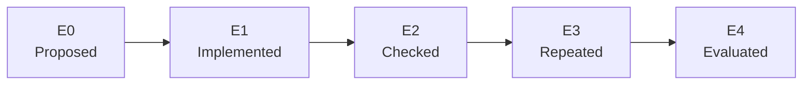

# Progress and evidence

> **Current research direction:** Parallel PPO Version 4 produced the first replay-verified PPO
> promotion, from Route 1 into Viridian City. Version 5 verified the Viridian Mart and Oak's Parcel.
> Version 5.1 then verified the return to Pallet Town, Oak's Lab, and the Pokédex before plateauing
> for 3,035,252 additional actions. Version 5.2 decomposes the road through Viridian Forest and
> Pewter Gym into explicit chapter steps and verified Route 1. Version 6 retained that PPO policy,
> improved its first composition window from 0/10 to 5/10, but failed the required 8/10 gate after
> one million actions. Version 7 resets the main question: random
> parameters, power-on only, no imported actions, and no authored route reward. It may imitate and
> rehearse only transitions it discovers and replay-verifies itself. Its current long run remains
> untouched as the denominator. Version 8 now separates its noisy PPO
> Explorer from a recurrent Student, compresses only replay-preserving edits, and grades learning in
> frozen exams. The clean source-bound canary discovered and distilled four transitions through
> Oak's lab and survived two resumes, but the Student passed 0/7 frozen exams. Useful learning,
> multi-skill retention, and later-game restore-free evaluation remain separate and harder claims.

- **Current stage:** Version 7's longer self-taught run is the live denominator; Version 8's
  mechanism and clean resume are qualified, while causal learning remains unproved
- **Status date:** 2026-07-21

**Most important caveat:** Q1 verified one replayable house-exit lineage, but the acting suffix
emitter was uniformly random and only one of two seeds reached the target. This is expedition
milestone evidence, not a learned-policy result or an Oak's Parcel result.

The project can now launch the exact supported game revision, issue deterministic controller
inputs, observe a small documented state, and reproduce the start of a clean game. That is useful
infrastructure. It is not evidence that an agent can play Pokémon yet.

## Status legend

| Marker | Meaning |
| --- | --- |
| ✅ Verified | Implemented and exercised by an automated check or repeatable local run |
| 🟨 In progress | Active milestone with an incomplete definition of done |
| ⬜ Planned | Specified, but not yet demonstrated |
| 🧭 Later | Directional idea whose exact design may change |

## Evidence ladder

Each claim receives the strongest level it has actually reached.

| Level | Name | Required evidence | What it does **not** prove |
| ---: | --- | --- | --- |
| E0 | Proposed | A written design or roadmap item | That code exists |
| E1 | Implemented | Code and a documented interface | That it behaves correctly in the emulator |
| E2 | Checked | Automated unit, integration, lint, or safety check | Robust performance across varied runs |
| E3 | Repeated | Reproducible run artifacts with matching declared outcomes | Generalization or task mastery |
| E4 | Evaluated | Frozen policy, fixed budget, all attempts reported, aggregate metrics | Fairness beyond the declared protocol |

Evidence levels describe support for a particular claim, not the overall quality of the project.
For example, a deterministic script can reach E3 without being intelligent, and a newly trained
policy should not be called successful until it reaches E4.



## Current evidence board

| Claim | Status | Evidence | Scope and limitation |
| --- | --- | ---: | --- |
| The harness rejects unsupported ROM revisions | ✅ Verified | E2 | Exact size, title, SHA-1, and SHA-256 are checked before emulation |
| Pokémon Red boots headlessly | ✅ Verified | E2 | Verified against the one supported US Rev. 0 fingerprint |
| Controller timing is explicit | ✅ Verified | E2 | Inputs have fixed hold and release frames; broader timing tolerances are not yet characterized |
| In-memory snapshots replay deterministically | ✅ Verified | E3 | Repeated in the smoke/bootstrap workflow; snapshots are private and never committed |
| A clean scripted boot reaches RED's bedroom | ✅ Verified | E3 | Two fresh attempts match at logical frame 9,804; this is a frozen script, not an agent |
| One-tile movement works at the bedroom start | ✅ Verified | E2 | DOWN moves one tile and snapshot restore returns to the initial state |
| Named state instrumentation is read-only | ✅ Verified | E2 | The sealed referee tracks maps, party, Pokédex, events, items, moves, badges, and blackouts; Conventional alone receives its disclosed coarse subset |
| Current smoke/bootstrap traces avoid ROM paths and bytes | ✅ Verified | E2 | Current writers and guards cover known private artifact forms; every future trace still requires review |
| A trace becomes a readable local run report | ✅ Verified | E2 | Standalone HTML escapes trace data, redacts absolute paths, and embeds no gameplay assets |
| Clean bootstrap has reviewed public evidence | ✅ Verified | E3 | Sanitized trace, two-attempt ledger, exact fingerprints, limitations, and generated report are committed |
| Pure Monkey is a non-learning random baseline | ✅ Verified | E2 | Its seeded uniform action distribution has no policy update or success-dependent state; it remains reproducible but is retired |
| The evolutionary successor has a frozen design | ✅ Verified | E1 | Genome, archive, selection, lineage, compute, and evidence rules are documented and implemented |
| A population neuroevolution runner exists | ✅ Verified | E2 | Deterministic genomes, mutation, archive replacement, genealogy, checkpointing, and a ROM-backed runner are tested |
| The population inherited game-start behavior | ✅ Verified in its development scope | E2 | One 90-minute run found strong parent/child retention; the behavior did not extend past one map and is not a held-out policy result |
| The selection × mutation fork completed | ✅ Verified | E3 | Six lanes each completed 128 children and 1,536,000 actions; every lane stayed on one map with no party member |
| Named milestones reach Hall of Fame | ✅ Verified | E2 | Fifty-five ordered outcomes include mandatory keys/HMs; completion requires both the Champion event and Hall-of-Fame map |
| Frontier evidence is integrity-bound | ✅ Verified | E2 | Cells bind ROM/version snapshots, action segments, frames, ancestry, semantic descriptors, full metadata, and a hash-chained audit log |
| False semantic replay is rejected | ✅ Verified | E2 | A real-ROM regression reproduces exact hashes for a deliberately false Hall-of-Fame cell and fails its canonical milestone check |
| Milestone frontiers require replay | ✅ Verified | E2 | Every v2 non-root cell requires one exact edge replay; a named promotion additionally requires three fresh complete power-on replays before active selection |
| A resumable expedition runner exists | ✅ Verified | E3 engineering | Bounded real-ROM qualification retained an explicit stop/resume and exact final budget; Q1 performance is reported separately |
| Replay bookkeeping is indexed and streamed | ✅ Verified | E2 | Replay counts rebuild from the authoritative event hash chain, lineage actions stream by segment, and ancestry validates topologically; the private-ROM suite passed |
| Disk monitoring is bounded between exact reconciliations | ✅ Verified | E2 | Known writes are counted incrementally, exact tree scans occur only at declared boundaries, and free-space/output limits remain enforced |
| Archive v2 bounds local verification and frontier arrivals | ✅ Qualified | E3 engineering | Three 4,096-action real-ROM trials passed continuous, graceful-resume, and hard-crash gates; edge replay stayed at or below 0.111× and the crash twin matched deterministic terminal state exactly |
| Visual Apprentice Stage 0 connects end to end | ✅ Qualified in its one-route scope | E3 pipeline | Two independent captures matched; one 468,312-parameter CNN-LSTM reached 419/419 offline and after reload, then selected the exact 419-action route to `left_home` once from clean power-on; no recovery, generalization, or H2 claim |
| Recurrent PPO can extend the verified curriculum | ✅ Verified once | E3 checkpoint-assisted | Version 4 promoted Route 1 to Viridian City at action 790,900; the suffix passed one edge and three complete power-on replays, but one policy has not reproduced that lineage from power-on |
| Version 5 assisted-teacher wiring is real-ROM checked | ✅ Qualified engineering | E3 pipeline | Four workers imported 19 verified entries, completed 16,384 actions and 16 PPO updates, exercised bounded Mart guidance, and ended with matching hashes; the Mart lesson itself remains unpassed |
| Version 5 reached Oak's Parcel | ✅ Replay verified | E3 checkpoint-assisted | The stopped run completed 1,390,596 actions and three verified promotions; Mart entry at 619,660 and Parcel at 619,956 each survived exact replay admission |
| Version 5.1 taught active-goal backtracking | ✅ Replay verified | E3 checkpoint-assisted | The run promoted Pallet Town, Oak's Lab, Parcel delivery, and Pokédex by action 402,320; its 10,819-action lineage passed exact replay admission |
| Version 5.1 exposed the post-Pokédex plateau | ✅ Preserved negative result | E3 training | It ran 3,035,252 more actions without Forest progress; all 1,900 episodes ended in 1,241 stagnations or 659 visual cycles |
| Version 5.2 represents the road to Brock as a chapter curriculum | ✅ Implemented and checked | E2 | Seven new milestones create ten visible steps through Route 2, both Forest gates, Pewter, and its Gym; 174 private-ROM tests and the V5.1 migration audit pass |
| Version 5.2 production path runs on the real ROM | ✅ Qualified engineering | E3 pipeline | Four workers completed 8,192 actions and eight updates at 256.18 actions/s, wrote all frames, exercised the recovery cap, and ended with matching model plus four novelty hashes |
| Version 5.2 reached Route 1 with the Pokédex | ✅ Replay verified | E3 checkpoint-assisted | Oak's Lab exit promoted at action 52,728 and Route 1 at 707,472; the run closed cleanly at 5,354,500 actions and 5,229 updates with eight promotions, zero replay failures, and matching terminal hashes, but spent more than four million later actions without Viridian progress |
| Version 6 retains one PPO policy across lessons | ✅ Qualified engineering | E2 / E3 pipeline | A compatible predecessor policy and optimizer load with hash and shape checks; the corrected canary completed eight updates under a fresh action budget |
| Version 6 measures backward composition | ✅ Qualified engineering | E2 / E3 pipeline | Frontier episodes are excluded; one of two earlier-start canary attempts reached Pokédex, the shortened 3/4 rolling gate stayed closed, and scheduler state matched its checkpoint hash |
| Version 6 one-million-action consolidation diagnostic | ✅ Preserved negative result | E3 training | It closed at 1,001,476 actions, 978 updates, and 390 episodes. The retained policy succeeded in 11/206 earlier-start attempts and ended at 5/10, below the required 8/10; no backward or power-on gate passed |
| Version 7 begins without an inherited solution | ✅ Qualified engineering | E3 pipeline | Manifest records random untrained parameters, zero imported actions/parameters, no demonstrations, and power-on only; 25 inherited later entries were deleted before the real-ROM canary |
| Version 7 creates skills from its own play | ✅ Replay verified | E3 checkpoint-assisted | In 8,192 actions the random policy verified game start and the ground floor, created two hashed visual/action skills, trained eight imitation updates over 2,048 examples, and reproduced the ground-floor skill once; 8/10 competence remains untested |
| Earlier live Version 7 denominator snapshot | 🟨 Active, unchanged | E3 training snapshot | At `2026-07-21T17:29:11Z`: 6,466,564 actions, Route 1, seven discoveries, zero competent skills, 19/1,274 rehearsals, and 66,560 imitation examples; this is not its terminal result |
| V8-locked Version 7 denominator snapshot | ✅ Hash-bound snapshot | E3 training snapshot | At `2026-07-21T18:42:15Z`: 7,442,496 actions and milestone index 8 (`Reached Viridian City`); V8 stores a path-free checkpoint/model pairing, and this remains a fixed launch-time anchor rather than V7's terminal result |
| Earlier Version 8 wiring canary | ✅ Qualified engineering | E3 pipeline | Canary `parallel-ppo-v8-resume-canary-20260721-seed20260791` stopped/resumed twice and ended `stop_requested` at 5,248 Explorer actions / 48.038s; one 256-action `game_started` edge distilled to 254 with final replay verified; its duplicate grades are retained only as historical wiring evidence |
| Version 8 committed mechanism runs on the real ROM | ✅ Qualified engineering | E3 pipeline | Clean-source canary `parallel-ppo-v8-canary-20260721-seed20260792` at commit `4c3c1fc` began from random power-on, survived two resumes, and reached index 4 (`met_professor_oak`) with four verified and distilled skills in 3,584 Explorer actions |
| Version 8 Student training and frozen exam wiring work | ✅ Qualified engineering | E3 pipeline | The clean canary completed 51 Student rounds and 134 optimizer updates; final NLL was 2.07149 and accuracy 13.7795%. It passed 0/7 checkpoint-separated frozen exams, so zero skills were competent and no composition was eligible |
| Version 8 trains self-generated skill handoffs | ✅ Implemented and checked | E2 | A continuous power-on replay must verify every protected endpoint before bounded goal-switch excerpts enter training. Only the deepest competent composition is active; one ticket per constituent skill, persisted boundary rotation, uniform action weights, immutable ≤512-loss-example replay shards, hashes, and failure ledgers passed 61 focused tests after the final schema tweak. No multi-skill real-ROM Student success is claimed |
| Version 8 bounded replay covers full skills without routine full-file I/O | ✅ Real-ROM mechanism checked | E3 pipeline | Admission writes hash-bound shards with disjoint loss-bearing ranges plus loss-free predecessor context. The clean canary selected 4/5 shards, loaded 1,016 owned plus 8 context examples, completed at least five coverage cycles across resumes, and opened zero full skill artifacts during routine replay |
| Version 8 composition verifier survives save/load | ✅ Real-ROM mechanism checked | E3 pipeline | PyBoy's game-area hash proved save/load-volatile, so composition uses an exact stable processed-visual-plus-RAM signature while distillation keeps the stricter hash. Stored 230+59-action and four-noop chains pass; wrong endpoints fail closed. This is verifier evidence, not learned competence |
| Version 8 competence grades span Student versions | ✅ Implemented and checked | E2 | Exactly one deterministic attempt is allowed per Student checkpoint at a 16,384-action cadence; 8/10 requires ten distinct checkpoint versions. The all-66 local opportunity floor is 10,813,440 Explorer actions before discovery/composition cost |
| Version 8 launch and checkpoint provenance fail closed | ✅ Implemented and checked | E2 | Launch requires a clean commit including untracked files; checkpoints bind source, verified ROM, curriculum, Explorer, Student, Student optimizer, and checkpoint-specific ledger. V7 serialization remains legacy-compatible |
| Version 8 locks its V7 denominator once | ✅ Implemented and checked | E2 | Fresh `--v7-denominator` read-only pairs a V7 checkpoint with its hash-matching latest/previous model and seals only path-free ID, Explorer actions, milestone, hashes, state, and timestamps. Resume reuses the manifest and rejects re-locking |
| Version 8 repeated artifact fallback survives | ✅ Unit checked | E2 | A matching `previous` generation is copied atomically back to `latest` without consuming the fallback, then recovered again after a simulated second interrupted rotation; a full process-kill real-ROM twin remains pending |
| Version 8 reward/watchdog excludes authored routes | ✅ Implemented and checked | E2 | With navigation/Mart weights disabled, reward tracking skips route guidance, active-goal lookup, and Mart calculations; new position and general durable consequences may reset the timer, while route distance, milestone index, and Mart script cannot. V7 retains its historical watchdog shaping and is not fully blind at that boundary |
| Version 8 dashboard separates the evidence | ✅ Implemented and checked | E2 | Four depth meters, Hall-of-Fame count, Explorer/Student hashes, locked V7 denominator, honest distillation fallbacks, Explorer-action clock, shard stored/owned/context footprint, bytes, coverage, zero full-source opens, and RAM milestone goal-switch disclosure are visible independently |
| Version 8 composition boundary is explicit | ✅ Implemented and documented | E2 | One frozen Student chooses every button, but a trainer-side RAM referee switches an ordered playlist of self-generated visual targets at declared milestones; this is goal-conditioned hierarchical control, not unaided pixel-only autonomy |
| Version 8 improves on Version 7 | ⬜ Not demonstrated | E0 | V7 must finish unchanged and V8 needs a matched multi-skill comparison of frozen success, actions, emulator-hours, replay cost, and forgetting; the short V8 qualification canaries are not comparable with the multi-million-action V7 denominator |
| One retained model composes the route from power-on | ⬜ Not demonstrated | E0 | Backward training and frozen evaluation gates must expand to power-on before this claim exists |
| Reverse curriculum reaches the complete opening horizon | ✅ Completed in development scope | E3 development | Seven adaptive rungs completed in 480 attempts with 451 successes; the final full-horizon rung passed 29/30 twice, but weights changed between attempts and no held-out H2 evaluation exists |
| The apprentice-guided expedition continues beyond `left_home` | 🟨 Active | E1 | Frozen pixel-policy actions and seeded exploration now feed Archive v2's full 66-milestone search; no later verified milestone is claimed before run evidence exists |
| Frontier Apprentice learns only replay-verified promotions | ✅ Checked | E2 / E3 engineering | A real-ROM canary learned five promotions through `chose_starter`, made 38 updates, passed 49/49 replay checks, and resumed at the exact learner hash after an intentional stop; Forest performance remains untested |
| Parallel recurrent PPO updates from every rollout | ✅ Checked | E2 / E3 engineering | Pixels-only and privileged canaries completed optimizer updates and hash-bound checkpoints; a production-shaped four-worker run completed two full updates and wrote all dashboard frames |
| Four emulator workers fit the current M1 host | ✅ Checked | E2 local benchmark | Under the prior learner's one-core load, 2/4/6 workers measured 178.06/419.34/351.39 actions/s; the four-worker production shape measured 218.65 actions/s with four optimizer epochs |
| Parallel PPO advances beyond its frozen curriculum | 🟨 Active | E2 | Version 3 ended at 1,147,988 actions and Route 1. Version 4's 65,536-action stress canary exposed a warm-start history mapping error; the corrected build passed a fresh 16,384-action real-ROM qualification with HP credit, two successes, classified loop exits, matching artifacts, and no promotion. |
| The Q0 discovery baseline reached a playable milestone | ⬜ Not demonstrated | E0 | It reached Oak's introduction visually but the referee correctly remained at `power_on` |
| The expedition reached `left_home` | ✅ Verified in one development seed | E3 / H3 | A 419-action lineage passed three promotion replays; the two-seed Q1 result was 1/2 and the emitter was random |
| The Q1 robustness gate passed | ⬜ Failed | E3 | Seed `20260730` stopped at the ground floor; seed `20260731` stepped outside; both exhausted the frozen 20,000-action budget |
| The current expedition is marathon-scale | ⬜ Not yet claimed | E3 engineering | Archive v2 passed its bounded scaling gate, but extreme-depth eligibility/retention and the learned emitter still precede a multi-day headline run |
| Long random action sequences remain stable | ⬜ Planned | E0 | Extended stability run has not been reported |
| A human Oak's Parcel baseline exists | ⬜ Planned | E0 | No baseline action count or completion time is available yet |
| A trained policy leaves the bedroom and house on its one training route | ✅ Verified once | E3 pipeline | The Stage-0 frozen model exactly reproduced its sole demonstration; this is memorization evidence, not a held-out local-skill evaluation |
| An agent completes Oak's Parcel | ⬜ Planned | E0 | No autonomous evaluation attempts exist |
| An agent defeats Brock | 🧭 Later | E0 | This is a future milestone, not a current result |

## Phase view

Project phases deliberately use task-level status instead of a percentage. A percentage would
suggest precision that does not exist before the training design and difficulty are known.

| Phase | Deliverable | Current state | Exit signal |
| --- | --- | --- | --- |
| Q0 — Completion foundation | Reproducible checkpoint runner plus truthful completion referee | **Passed** | Runner, replay, resume, privacy, and corruption checks recorded |
| 1 — Expedition opening | Replay-verified bedroom, house, starter, and Parcel frontiers | **Q1 concluded 1/2; Archive v2 qualified** | A materially different learned or optimized emitter reaches `left_home` under a frozen matched gate |
| 2 — Brock | Reusable skills plus planner, memory, and watchdog | **Not started** | Frozen clean-start evaluation defeats Brock under budget |
| Later — Comparisons | Language-model, RL, and hybrid ablations | **Not started** | Same referee and declared budgets used for all configurations |

## What the current deterministic milestone proves

```mermaid
sequenceDiagram
    participant H as Harness
    participant G as Pokémon Red
    participant O as Read-only observer
    participant R as Recorder

    H->>G: Clean boot
    H->>G: Frozen RED/BLUE input sequence
    G-->>O: Bedroom state
    O-->>R: Map, position, party, battle state
    H->>G: Move DOWN one tile
    H->>G: Restore in-memory snapshot
    O-->>R: Initial state restored
    Note over H,R: Performed twice; hashes and final frame matched
```

It proves that future experiments can begin from a repeatable playable point and that the harness
can measure a basic movement outcome. It does not prove visual understanding, planning,
exploration, battle skill, or learning.

## Metrics for future learning runs

Every chart should be reconstructable from reviewed run data. At minimum, future reports should
include the following fields.

### Task outcome

| Metric | Definition |
| --- | --- |
| Success rate | Successful frozen evaluation attempts / all frozen evaluation attempts |
| Furthest milestone reached | Highest predeclared task milestone reached in each attempt |
| Actions to success | Controller decisions used by successful attempts, with median and spread |
| Evaluation budget used | Actions, emulator frames, and wall-clock time consumed before stop |
| Failure reason | Timeout, loop, blackout, invalid state, crash, or other declared category |

### Learning process

| Metric | Definition |
| --- | --- |
| Training steps | Total environment decisions used to update a policy |
| Emulator-hours | Aggregate emulated game time; reported separately from wall-clock time |
| Training seeds | Every random seed used, not only the strongest run |
| Task return | Declared shaped return, labeled as a diagnostic rather than completion |
| Evaluation checkpoints | Frozen checkpoints evaluated on the same attempt set and budget |

### Behavior and reliability

| Metric | Definition |
| --- | --- |
| Unique map/position coverage | Distinct observed locations under the declared observation schema |
| Loop rate | Attempts terminated by the watchdog / all attempts |
| Blackout rate | Attempts ending in a loss transition / all attempts |
| Intervention count | Human actions that alter a run, including manual inputs and resets |
| Determinism check | Whether replay under the declared seed/config reproduces the recorded result |

If a language model is introduced, calls, input/output tokens, model identifier, latency, and cost
belong beside the training and evaluation budgets. They must not be hidden inside a single
"runtime" number.

## Standard milestone update

Each meaningful progress update should answer the same five questions:

1. **What changed?** Name the capability, not just the code file.
2. **What evidence exists?** Link the test, run summary, or aggregate evaluation.
3. **What was the exact starting condition?** Clean boot, private training state, or held-out state.
4. **What failed?** Include unsuccessful official attempts and known blind spots.
5. **What claim is now justified?** Assign its evidence level and avoid stronger wording.

A compact future update can use this table:

| Field | Value |
| --- | --- |
| Milestone | _Name the bounded task_ |
| Status | _Verified / in progress / planned_ |
| Evidence level | _E0–E4_ |
| Configuration | _Commit, policy/checkpoint, observation version, action version_ |
| Budget | _Training steps and/or evaluation action limit_ |
| Attempts | _All official attempts, with successes and failures_ |
| Interventions | _Count and explanation_ |
| Result | _Task outcome plus uncertainty; never reward alone_ |
| Artifacts | _Reviewed summary, metrics, trace, and generated visuals_ |

## Next evidence targets

The immediate goal is not a longer reward curve. It is evidence that a separately frozen Student
can reproduce something the Explorer discovered without receiving a human answer.

1. Preserve the active V7 trial and terminal denominator under its original protocol.
2. Extend the passed one-skill mechanism canary into a multi-skill prerequisite test under the
   corrected one-grade-per-checkpoint, ten-version, 8/10 competence rule.
3. Add a deliberate hard-crash twin after the two successful clean stop/resume cycles, and verify
   the full Explorer/Student/optimizer/ledger/dataset/worker-memory boundary.
4. Measure Student causality against chance and appropriate raw-trace/shared-policy controls; the
   old duplicate 2/2 and 14/14 `game_started` results are superseded as evidence.
5. Report every frozen local attempt and compare its success with Student loss and action accuracy;
   neither fit metric is a substitute for the denominator.
6. Attempt restore-free power-on composition only after the prerequisite chain is locally competent.
   Report the trainer-side RAM goal switches and ordered self-generated clip playlist as part of
   the evaluated hierarchy; do not describe a success as unaided pixel-only autonomy.

See [Roadmap](roadmap.md) for acceptance gates and [Visual storytelling](visual-storytelling.md) for
how those results should be shown.
