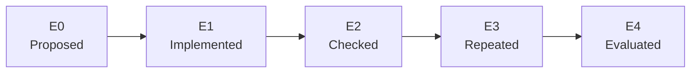

# Progress and evidence

> **Current research direction:** Pure Monkey has completed its role as the random control and is
> retired from future headline runs. Three online-learning lanes and one quality-diversity
> neuroevolution lane completed a 90-minute development pretrial. The neural population inherited a
> narrow game-start behavior; a [six-lane mechanism lab](selection-mutation-lab.md) is now qualified
> to test selection and mutation before a fresh-seed confirmation.

- **Current stage:** verified harness, online/evolutionary pretrials, and 2 × 3 mechanism calibration
- **Status date:** 2026-07-19

**Most important caveat:** the evolutionary result comes from one inherited population in a
development run. It is not a frozen autonomous evaluation, a fresh-seed replication, or an Oak's
Parcel result.

The project can now launch the exact supported game revision, issue deterministic controller
inputs, observe a small documented state, and reproduce the start of a clean game. That is useful
infrastructure. It is not evidence that an agent can play Pokémon yet.

## Status legend

| Marker | Meaning |
| --- | --- |
| ✅ Verified | Implemented and exercised by an automated check or repeatable local run |
| 🟨 In progress | Active milestone with an incomplete definition of done |
| ⬜ Planned | Specified, but not yet demonstrated |
| 🧭 Later | Directional idea whose exact design may change |

## Evidence ladder

Each claim receives the strongest level it has actually reached.

| Level | Name | Required evidence | What it does **not** prove |
| ---: | --- | --- | --- |
| E0 | Proposed | A written design or roadmap item | That code exists |
| E1 | Implemented | Code and a documented interface | That it behaves correctly in the emulator |
| E2 | Checked | Automated unit, integration, lint, or safety check | Robust performance across varied runs |
| E3 | Repeated | Reproducible run artifacts with matching declared outcomes | Generalization or task mastery |
| E4 | Evaluated | Frozen policy, fixed budget, all attempts reported, aggregate metrics | Fairness beyond the declared protocol |

Evidence levels describe support for a particular claim, not the overall quality of the project.
For example, a deterministic script can reach E3 without being intelligent, and a newly trained
policy should not be called successful until it reaches E4.



## Current evidence board

| Claim | Status | Evidence | Scope and limitation |
| --- | --- | ---: | --- |
| The harness rejects unsupported ROM revisions | ✅ Verified | E2 | Exact size, title, SHA-1, and SHA-256 are checked before emulation |
| Pokémon Red boots headlessly | ✅ Verified | E2 | Verified against the one supported US Rev. 0 fingerprint |
| Controller timing is explicit | ✅ Verified | E2 | Inputs have fixed hold and release frames; broader timing tolerances are not yet characterized |
| In-memory snapshots replay deterministically | ✅ Verified | E3 | Repeated in the smoke/bootstrap workflow; snapshots are private and never committed |
| A clean scripted boot reaches RED's bedroom | ✅ Verified | E3 | Two fresh attempts match at logical frame 9,804; this is a frozen script, not an agent |
| One-tile movement works at the bedroom start | ✅ Verified | E2 | DOWN moves one tile and snapshot restore returns to the initial state |
| Named state instrumentation is read-only | ✅ Verified | E2 | The sealed referee tracks maps, party, Pokédex, events, items, moves, badges, and blackouts; Conventional alone receives its disclosed coarse subset |
| Current smoke/bootstrap traces avoid ROM paths and bytes | ✅ Verified | E2 | Current writers and guards cover known private artifact forms; every future trace still requires review |
| A trace becomes a readable local run report | ✅ Verified | E2 | Standalone HTML escapes trace data, redacts absolute paths, and embeds no gameplay assets |
| Clean bootstrap has reviewed public evidence | ✅ Verified | E3 | Sanitized trace, two-attempt ledger, exact fingerprints, limitations, and generated report are committed |
| Pure Monkey is a non-learning random baseline | ✅ Verified | E2 | Its seeded uniform action distribution has no policy update or success-dependent state; it remains reproducible but is retired |
| The evolutionary successor has a frozen design | ✅ Verified | E1 | Genome, archive, selection, lineage, compute, and evidence rules are documented and implemented |
| A population neuroevolution runner exists | ✅ Verified | E2 | Deterministic genomes, mutation, archive replacement, genealogy, checkpointing, and a ROM-backed runner are tested |
| The population inherited game-start behavior | 🟨 In progress | E2 | One 90-minute development run found strong parent/child retention; no held-out or fresh-seed evaluation exists |
| The selection × mutation fork is ready | ✅ Verified | E2 | Six ROM-backed lanes recovered together after interruption, completed exact paired lifetimes, preserved synchronized and milestone visuals, and exited cleanly |
| Long random action sequences remain stable | ⬜ Planned | E0 | Extended stability run has not been reported |
| A human Oak's Parcel baseline exists | ⬜ Planned | E0 | No baseline action count or completion time is available yet |
| A trained policy leaves the bedroom | ⬜ Planned | E0 | Development learners have wandered beyond it, but no frozen task evaluation has been run |
| An agent completes Oak's Parcel | ⬜ Planned | E0 | No autonomous evaluation attempts exist |
| An agent defeats Brock | 🧭 Later | E0 | This is a future milestone, not a current result |

## Phase view

Project phases deliberately use task-level status instead of a percentage. A percentage would
suggest precision that does not exist before the training design and difficulty are known.

| Phase | Deliverable | Current state | Exit signal |
| --- | --- | --- | --- |
| 0 — Foundation | Reproducible, inspectable emulator harness | **Core verified; validation work remains** | Human baseline and long stability run recorded |
| 1 — Oak's Parcel | First bounded navigation/battle learning problem | **Development pretrials active** | Frozen clean-start evaluation meets a declared success threshold |
| 2 — Brock | Reusable skills plus planner, memory, and watchdog | **Not started** | Frozen clean-start evaluation defeats Brock under budget |
| Later — Comparisons | Language-model, RL, and hybrid ablations | **Not started** | Same referee and declared budgets used for all configurations |

## What the current deterministic milestone proves

```mermaid
sequenceDiagram
    participant H as Harness
    participant G as Pokémon Red
    participant O as Read-only observer
    participant R as Recorder

    H->>G: Clean boot
    H->>G: Frozen RED/BLUE input sequence
    G-->>O: Bedroom state
    O-->>R: Map, position, party, battle state
    H->>G: Move DOWN one tile
    H->>G: Restore in-memory snapshot
    O-->>R: Initial state restored
    Note over H,R: Performed twice; hashes and final frame matched
```

It proves that future experiments can begin from a repeatable playable point and that the harness
can measure a basic movement outcome. It does not prove visual understanding, planning,
exploration, battle skill, or learning.

## Metrics for future learning runs

Every chart should be reconstructable from reviewed run data. At minimum, future reports should
include the following fields.

### Task outcome

| Metric | Definition |
| --- | --- |
| Success rate | Successful frozen evaluation attempts / all frozen evaluation attempts |
| Furthest milestone reached | Highest predeclared task milestone reached in each attempt |
| Actions to success | Controller decisions used by successful attempts, with median and spread |
| Evaluation budget used | Actions, emulator frames, and wall-clock time consumed before stop |
| Failure reason | Timeout, loop, blackout, invalid state, crash, or other declared category |

### Learning process

| Metric | Definition |
| --- | --- |
| Training steps | Total environment decisions used to update a policy |
| Emulator-hours | Aggregate emulated game time; reported separately from wall-clock time |
| Training seeds | Every random seed used, not only the strongest run |
| Task return | Declared shaped return, labeled as a diagnostic rather than completion |
| Evaluation checkpoints | Frozen checkpoints evaluated on the same attempt set and budget |

### Behavior and reliability

| Metric | Definition |
| --- | --- |
| Unique map/position coverage | Distinct observed locations under the declared observation schema |
| Loop rate | Attempts terminated by the watchdog / all attempts |
| Blackout rate | Attempts ending in a loss transition / all attempts |
| Intervention count | Human actions that alter a run, including manual inputs and resets |
| Determinism check | Whether replay under the declared seed/config reproduces the recorded result |

If a language model is introduced, calls, input/output tokens, model identifier, latency, and cost
belong beside the training and evaluation budgets. They must not be hidden inside a single
"runtime" number.

## Standard milestone update

Each meaningful progress update should answer the same five questions:

1. **What changed?** Name the capability, not just the code file.
2. **What evidence exists?** Link the test, run summary, or aggregate evaluation.
3. **What was the exact starting condition?** Clean boot, private training state, or held-out state.
4. **What failed?** Include unsuccessful official attempts and known blind spots.
5. **What claim is now justified?** Assign its evidence level and avoid stronger wording.

A compact future update can use this table:

| Field | Value |
| --- | --- |
| Milestone | _Name the bounded task_ |
| Status | _Verified / in progress / planned_ |
| Evidence level | _E0–E4_ |
| Configuration | _Commit, policy/checkpoint, observation version, action version_ |
| Budget | _Training steps and/or evaluation action limit_ |
| Attempts | _All official attempts, with successes and failures_ |
| Interventions | _Count and explanation_ |
| Result | _Task outcome plus uncertainty; never reward alone_ |
| Artifacts | _Reviewed summary, metrics, trace, and generated visuals_ |

## Next evidence targets

The immediate goal is not a flashy success clip. It is to make the first learning result
interpretable.

1. Implement and round-trip the fixed recurrent genome deterministically.
2. Prove that its actor receives only the declared pixels and previous action.
3. Build and test mutation, elitism, archive replacement, genealogy, and resume logic.
4. Run 16-candidate and then 128-candidate Pokémon pretrials with four workers.
5. Freeze a clean-start early-game evaluation before enabling checkpoint-assisted expedition mode.

See [Roadmap](roadmap.md) for acceptance gates and [Visual storytelling](visual-storytelling.md) for
how those results should be shown.
