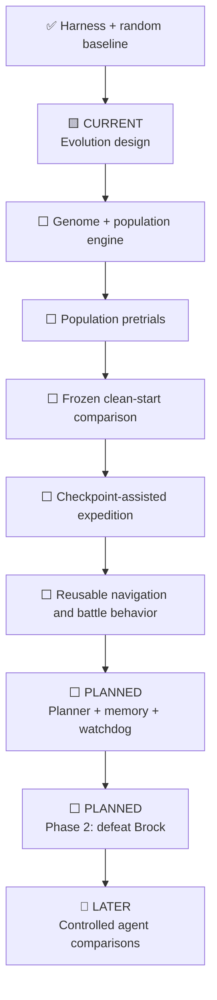

# Roadmap

> **Direction update:** Pure Monkey is retired after establishing the random baseline. The immediate
> primary track is now [Evolutionary Explorer](neuroevolution.md): a pixels-only recurrent policy
> population with mutation, quality-diversity selection, and auditable ancestry. Online Q learning
> and the later informed-agent plan remain comparisons.

## Completed blind-discovery arc

1. ✅ Freeze a pixels-and-buttons-only actor capability.
2. ✅ Implement a bounded random Monkey and visual-novelty Archivist.
3. ✅ Add resumable checkpoints, disk/time/action limits, and a live visual dashboard.
4. ✅ Exercise matched random and learning development arms from power-on.
5. ✅ Establish that Pure Monkey cannot retain a successful accident.
6. ✅ Preserve Monkey as a reproducible control and retire it from future headline arenas.

## Immediate evolutionary arc

1. 🟨 Freeze the version-1 genome, observation boundary, archive descriptors, and claims.
2. ⬜ Implement deterministic recurrent inference and genome serialization.
3. ⬜ Implement mutation-only reproduction, MAP-Elites, genealogy, and resume.
4. ⬜ Qualify 16-candidate and 128-candidate populations on Pokémon.
5. ⬜ Freeze a clean-start early-game comparison against the preserved random baseline.
6. ⬜ Add checkpoint-assisted expedition mode with required power-on lineage replay.
7. ⬜ Replace Monkey in the next four-lane living dashboard.

## Later informed-agent roadmap

The destination is a transparent hybrid agent that can plan, learn reusable skills, remember what
it discovers, and recover from loops. The route there is a series of bounded experiments. Each
milestone must produce evidence that can be understood without trusting a highlight reel.

This roadmap records intent, not a delivery schedule. Training results are uncertain, and later
designs should change when evidence points somewhere better.

## Dependency map

Arrows mean “needs evidence from,” not necessarily “must be implemented in a single strict
sequence.” Small prototypes may happen earlier, but an official result cannot skip its gates.

## Phase 0 — Build a trustworthy starting line

**Narrative question:** Can we trust the stage before judging the player?

### Complete

- ✅ Gate the harness to one exact Pokémon Red ROM fingerprint.
- ✅ Boot at unlimited speed without writing cartridge data beside the private ROM.
- ✅ Make controller hold/release timing explicit.
- ✅ Save and restore integrity-bound, in-memory snapshots.
- ✅ Write sanitized event traces and screenshots under ignored run directories.
- ✅ Expose a documented six-field, read-only instrumentation snapshot.
- ✅ Reach RED's bedroom twice from clean boots with identical state and hashes.
- ✅ Verify one-tile movement and restoration at the first playable state.
- ✅ Add tests, linting, CI, and private-artifact guards.
- ✅ Turn sanitized traces into standalone, local, human-readable run reports.

### Remaining exit work

| Deliverable | Acceptance gate | Story artifact |
| --- | --- | --- |
| Human Oak's Parcel baseline | A complete human-driven run with action/frame counts, milestones, and interventions | Annotated route timeline and milestone table |
| Extended stability run | A declared random or scripted stress budget completes without unexplained emulator/harness failure | Termination breakdown and stability timeline |

**Phase 0 exit:** both remaining deliverables are recorded under the experiment protocol. This gate
does not require a trained policy.

## Phase 1 — Make Oak's Parcel the first learning problem

**Narrative question:** Can the system turn raw controls and limited state into purposeful early-game
behavior?

Oak's Parcel is a useful first arc because it combines menus, indoor/outdoor transitions,
exploration, a starter choice, a trainer battle, travel to Viridian City, and a return journey.

### 1A — Freeze the environment contract

- ⬜ Define observation schema version 1: exactly what the policy sees and at what cadence.
- ⬜ Define action schema version 1: controller choices, timing, and invalid-action handling.
- ⬜ Separate policy observations from referee-only state.
- ⬜ Define episode starts, terminations, truncations, and recovery behavior.
- ⬜ Add deterministic environment tests around menus, movement, map transitions, and battles.

**Gate:** the same recorded action sequence produces the same observation/action-boundary trace
under the declared environment version.

### 1B — Define measurement before reward

- ⬜ Declare ordered milestones from bedroom start through parcel delivery.
- ⬜ Define task success independently from shaped reward.
- ⬜ Record the human baseline and a random-policy baseline.
- ⬜ Choose training and evaluation budgets before the official comparison.
- ⬜ Implement loop, timeout, blackout, and invalid-state classifications.

**Gate:** a script, random policy, and human run can all be scored by the same referee without
special cases that change their actions.

### 1C — Train bounded skills

- ⬜ Start with a small navigation baseline rather than the whole quest.
- ⬜ Train menu interaction and text-advance behavior as separately measurable skills if needed.
- ⬜ Add battle action selection after overworld controls are stable.
- ⬜ Evaluate held-out starts/seeds and report every checkpoint selected for evaluation.
- ⬜ Keep shaped reward plots separate from actual milestone completion.

**Gate:** at least one frozen learned policy improves on the declared random baseline under the
same attempt budget. The threshold and attempt count must be frozen before the result is called
official.

### 1D — Complete the clean-start quest

- ⬜ Leave the bedroom and house.
- ⬜ Trigger Professor Oak.
- ⬜ Choose a starter.
- ⬜ Complete the first rival battle.
- ⬜ Reach Viridian City and collect the parcel.
- ⬜ Return the parcel to Professor Oak.

**Phase 1 exit:** a frozen configuration completes the predeclared Oak's Parcel success condition
from clean game starts at the predeclared success threshold and budget, with all attempts reported.

## Phase 2 — Turn isolated behavior into a reusable agent

**Narrative question:** Can skills learned for the opening be composed into a longer strategy?

### System capabilities

- ⬜ Planner chooses bounded, inspectable goals rather than individual frames.
- ⬜ Skill selector invokes navigation, interaction, and battle policies through one interface.
- ⬜ Run-specific memory records discovered connections, outcomes, and failed approaches.
- ⬜ Watchdog detects repeated screens, position cycles, and exhausted budgets.
- ⬜ Recorder explains which component chose each action and why control changed hands.

### Brock arc

- ⬜ Navigate Route 1, Viridian City, Route 2, and Viridian Forest.
- ⬜ Manage party health and training under declared rules.
- ⬜ Reach Pewter City and enter the Gym.
- ⬜ Defeat Brock from a clean game start.

**Phase 2 exit:** a frozen hybrid configuration defeats Brock under a declared clean-start
evaluation protocol. Replanning and watchdog events are visible in the run record; silent reloads
or manual rescues count as interventions.

## Later — Ask comparative questions

**Narrative question:** Which parts of the system are actually doing useful work?

Potential configurations:

| Configuration | Main question | Required disclosure |
| --- | --- | --- |
| Language-model controller | Can high-level reasoning compensate for limited learned control? | Model/version, prompt, calls, tokens, cost, latency |
| Reinforcement-learning policy | How far can a learned controller go without language planning? | Algorithm, architecture, steps, seeds, checkpoints |
| Hybrid | Does planning plus trained execution outperform either alone? | Control-transfer rules, shared resources, component budgets |
| Ablations | Do memory and the watchdog help? | Exactly one declared component difference per comparison |

These are engineering comparisons, not automatically fair contests. Compute, information, prior
knowledge, and tool access must be reported rather than compressed into a single leaderboard.

## Milestone gates in one view

| Gate | Must be true before advancing the public claim |
| --- | --- |
| Harness trusted | Supported ROM, deterministic boundaries, trace safety, and repeated clean start are checked |
| Environment frozen | Observation, action, reward, start, and stop rules carry explicit versions |
| Baselines known | Human and random baselines use the same referee and publish comparable measures |
| Skill learned | Frozen checkpoint improves on a declared baseline over all official attempts |
| Parcel completed | Clean-start parcel success meets a frozen threshold and budget |
| Brock defeated | Clean-start Brock success meets a frozen threshold and budget |
| Comparison credible | Configurations share a referee and disclose differing resources and information |

## Near-term work queue

The immediate build order follows the evolutionary evidence gates.

1. **Genome contract** — fixed recurrent topology, pixels-only inputs, deterministic outputs.
2. **Mutation audit** — immutable parent, child seed, parameter delta, and finite-value checks.
3. **Quality-diversity archive** — milestone-first cells and deterministic elite replacement.
4. **Genealogy recorder** — every child, survivor, extinction, and code/configuration hash.
5. **Synthetic tests** — prove evolution and resume behavior outside the emulator first.
6. **Pokémon calibration** — 16 candidates, then 128, under bounded action and disk budgets.
7. **Living dashboard** — family tree, archive map, workers, mutations, and champion replay.

## What is deliberately not promised

- A completion date: training and integration difficulty are unknown.
- A full-game run: the first useful questions end much earlier.
- Absolute learning “from scratch”: even the pixels-only track receives an emulator, controller,
  action cadence, novelty calculation, archive algorithm, and computation as prior structure.
- Zero intervention: interventions will be counted, not edited out of the story.
- A single magic score: success, reliability, resources, and behavior need separate measures.

Progress against this roadmap is summarized in [Progress](progress.md). The standards for turning
milestones into honest charts and a video narrative are in
[Visual storytelling](visual-storytelling.md).
