# Roadmap

> **Direction update:** Pure Monkey, clean-start mutation, verify-only Frontier Apprentice, and the
> [parallel recurrent PPO](parallel-ppo.md) family remain preserved controls. The assisted
> [Version 11 hierarchy](version-11-hierarchical-pivot.md) also remains as a closed upper-bound
> control rather than the active runner. The final track is
> [Version 12](version-12-final-self-learner.md): one random-initialized recurrent visual policy,
> self-generated future-frame goals, explicit goal-use contrast, deterministic frozen exams, and a
> fixed result published whether it succeeds or fails.
> The Hall-of-Fame referee and the project's evidence rules remain unchanged. Version 5.1 reached
> the Pokédex and exposed a
> 3,035,252-action plateau;
> Version 5.2 reached Route 1 but showed that verified slices do not prove one policy composed them.
> Version 6 retained the policy but finished at 5/10, short of its 8/10 first connection gate.
> Version 7 is the preserved denominator: random power-on learning, no imported answer, and visual
> skills produced only by the same run's verified discoveries. Version 8 kept those information
> rules, left the V7 run untouched, separated PPO
> exploration from a recurrent Student, distilled only replay-preserving edits, and moved competence
> into frozen exams. The clean source-bound canary reached Oak's lab, created four distilled skills,
> and survived two resumes, but passed 0/7 frozen exams. The final longer run reached Route 1 with
> seven skills and better fit, but finished at 1/47 with zero competent skills. That qualifies
> wiring, not learning or later-game progress. V8 is closed.
> [Version 9](version-9-self-correcting-student.md) is the engineering-checked successor:
> consecutive edges, BC warm start, exact-target reverse closed-loop practice, bounded success
> replay, terminal counts, and checkpoint rollback. A failed first canary exposed wall-time and
> report-merge defects; commit `e1ea199` repaired them, and the corrected 144-second canary
> qualified mechanism, observability, and campaign timing at 0/3 frozen exams. PPO recovery remained
> deferred, and learned competence was not established. The V9 campaign closed intentionally after
> 2h52m39.143s at Route 1, 4/87 frozen exams, zero competent skills, and no composition. The
> matched-configuration V10 recovery campaign then closed after 1h15m03.282s and 534,924 Explorer
> actions. It again stopped at Route 1: 3/32 frozen exams, zero competent skills, and no composition.
> Recovery itself was measurable—956 of 1,977 windows escaped—but it did not solve long-horizon
> learning. [Version 11](version-11-hierarchical-pivot.md) was implemented as a disclosed assisted
> hierarchy: a structured-state language-model planner, map-local A* navigation,
> persistent memory, controller specialists, and a strict Hall-of-Fame referee. The canary sequence
> is part of the result: C1 exposed a path-resolution failure, C2 exposed an MCP-authorization
> failure, C3 ran but was rejected when initialized bedroom RAM falsely described story progress,
> and C4 qualified the opening referee with 136 actions, 70 language-model calls, empirical RIGHT-
> movement proof, and story objective 1/84. The continuous run closed after 950.308 seconds, 329
> actions, and 144 online model calls when the project rejected per-decision online assistance as
> its final premise. V12 has since passed three bounded real-ROM mechanism canaries. Its fixed
> 48-hour launcher is ready but refuses to begin until the external T7 is mounted with at least
> 150 GiB free. No competent skill or Hall-of-Fame result is claimed.

## Completed blind-discovery arc

1. ✅ Freeze a pixels-and-buttons-only actor capability.
2. ✅ Implement a bounded random Monkey and visual-novelty Archivist.
3. ✅ Add resumable checkpoints, disk/time/action limits, and a live visual dashboard.
4. ✅ Exercise matched random and learning development arms from power-on.
5. ✅ Establish that Pure Monkey cannot retain a successful accident.
6. ✅ Preserve Monkey as a reproducible control and retire it from future headline arenas.

## Immediate evolutionary arc

1. ✅ Freeze the version-1 genome, observation boundary, archive descriptors, and claims.
2. ✅ Implement deterministic recurrent inference and genome serialization.
3. ✅ Implement mutation-only reproduction, MAP-Elites, genealogy, and resume checkpoints.
4. ✅ Complete a bounded 90-minute population pretrial and freeze its archive and genealogy.
5. ✅ Diagnose uniform parent selection and destructive broad mutation as candidate bottlenecks.
6. ✅ Run the six-lane selection × mutation fork with 1,536,000 actions per lane.
7. ✅ Record that no condition passed the second-map gate; do not select a marathon winner.
8. ✅ Implement the named completion referee and integrity-bound expedition evidence foundation.
9. ✅ Integrate the single-writer checkpoint expedition, localhost dashboard, exact resume, and
   required power-on lineage replay.
10. ✅ Conclude Q1 honestly: H3 `left_home` reached, but the two-seed gate failed 1/2.
11. ✅ Index replay counts, stream lineages, validate ancestry topologically, and bound disk scans.
12. ✅ Qualify Archive v2 edge verification, bounded niches, suffix buffering, exact resume, and hard-crash recovery on the real ROM.
13. ✅ Pass [Visual Apprentice v1](visual-apprentice.md) Stage 0: two matching captures, exact
    offline/reload fit, and the exact 419-action route selected once from clean power-on.
14. ✅ Complete the adaptive reverse checkpoint curriculum while preserving every failed attempt;
    continue withholding H2 until a frozen policy passes held-out local starts.
15. ✅ Use the completed local model as a frozen visual prior in a full-game Archive v2 campaign;
    preserve its Pokédex plateau and later fresh-run evidence as the fixed-handoff baseline.
16. ✅ Implement [Frontier Apprentice](frontier-apprentice.md): adaptive exploration,
    map-balanced scheduling, loop-escape bursts, full-game reward accounting, and self-imitation
    only after verified named promotions; pass its real-ROM mechanism and exact-resume canary.
17. ✅ Implement [parallel recurrent PPO](parallel-ppo.md), exact warm-start, frozen verified
    curriculum, replay-gated promotion, resumable model checkpoints, and the four-frame dashboard.
18. ✅ Benchmark 2/4/6 emulator workers on the target M1 and select four; pass pixels-only,
    privileged-input, and production-shaped optimizer canaries.
19. ✅ Complete the Version-5.1 active-goal run: verify the Pokédex, preserve its 3,035,252-action
    post-Pokédex plateau, and close it with matching terminal hashes.
20. ✅ Use Version 5.2 to verify Oak's Lab exit and Route 1, then preserve its multi-million-action
    Viridian plateau as evidence that permanent frontier slices do not enforce composition.
21. ✅ Implement Version 6 retained PPO policy/optimizer transfer, backward rolling competence,
    hash-bound scheduler state, dashboard metrics, and failed-plus-corrected canaries.
22. ✅ Close Version 6 at 1,001,476 actions with 11/206 total successes, a terminal 5/10 rolling
    window, and no falsely claimed backward gate.
23. ✅ Implement Version 7 random power-on initialization, inherited-curriculum deletion,
    self-generated visual skills, direct self-imitation, weakest-skill scheduling, and 8/10 gates.
24. ✅ Pass the first real-ROM V7 mechanism canary: two self-discovered skills and actual
    recurrent imitation updates from zero imported actions or parameters.
25. ✅ Preserve the longer V7 self-taught snapshot unchanged as a historical denominator; report
    discovery, imitation, rehearsal, forgetting, and composition under its original protocol. V8
    sealed a path-free, hash-matched read-only checkpoint using `--v7-denominator`; resume cannot
    move that lock. It is a launch-time anchor, not a claimed terminal V7 result.
26. ✅ Implement [Version 8](version-8-distilled-student.md): nearest-prefix skill boundaries,
    replay-backed loop/chunk removal, short visual goal clips, a separately optimized recurrent
    Student, balanced sequence replay with burn-in, prerequisite scheduling, and competence
    revocation.
27. ✅ Bind Explorer, Student, both optimizers, distillation audits, datasets, scheduler, exam
    denominator, four worker memories, and action counter into one fail-closed resume set. Two clean
    resumes now preserve matching Student model/optimizer/ledger hashes. Final audit binds exact
    clean source including untracked detection, verified ROM, and frozen curriculum. Re-promotion
    from a matching `previous` artifact survives a simulated second interrupted rotation; deliberate
    process-kill real-ROM evidence remains an explicit unqualified limitation. Routine checkpoints validate new/changed shards and
    new/active compositions while trusting unchanged archives only through the last committed seal;
    resume/full audit still verifies every artifact.
28. ✅ Close V8 with qualified mechanism and negative behavioral evidence.
    The first mechanism/frozen-exam/clean-resume canary passed at 5,248 actions. A later stored-action
    real-ROM test accepted the corrected two-skill save/load-stable composition verifier and
    rejected wrong endpoints. The clean committed canary then discovered four skills through Oak's
    lab and exercised bounded multi-shard replay across two resumes, but passed 0/7 frozen exams.
    Preserve that as qualification evidence. The final longer run processed 784,386 Explorer
    actions, reached Route 1 with seven skills, and raised fit to 53.0817%, but passed only 1/47;
    zero skills became competent and no composition ran. Preserve 1/47 as the final V8 behavioral
    result. A hard-crash twin and learned multi-skill behavior were not demonstrated.
29. ⬜ Keep a matched V7/V8 causal claim deferred unless compatible terminal artifacts become
    available; the preserved V7 launch-time snapshot is not a terminal matched denominator.
30. 🟨 Train and evaluate restore-free power-on composition only after prerequisite local exams
    pass. The training mechanism now verifies a full self-generated chain and retains bounded
    goal-switch excerpts with active-prefix and replay-balance controls. Immutable admission-time
    skill shards bound routine I/O while persistent cursors cover the full source across resumes;
    multi-skill real-ROM Student behavior remains unproved. Disclose evaluation's trainer-side RAM switches through the
    ordered self-generated goal playlist; this is a frozen goal-conditioned hierarchy, not unaided
    pixel-only autonomy.
31. ✅ Implement and engineering-check [Version 9](version-9-self-correcting-student.md): exact consecutive edges,
    canonical-Student BC warm start, reverse closed-loop practice, success-only replay admission,
    exact target signatures, bounded rotating replay, terminal counts, graph/checkpoint binding,
    persisted attempt scheduling, the 27/30×2 gate, and unchanged strict exams. The current suite
    passes 276 non-integration plus 12 integration checks; do not call that behavioral qualification.
32. ✅ Qualify the V9 real-ROM mechanism boundary. Preserve the failed 248.801-second overrun;
    after `e1ea199`, the corrected run ended at a 144.082-second campaign clock against 144.0,
    retained all 22 practice outcomes, and passed 0/3 frozen exams.
33. ✅ Close the declared V9 campaign without promoting training fit into competence. It ended at
    1,431,556 Explorer actions, 4/87 frozen exams, zero competent skills, and no composition.
34. ✅ Implement and qualify V10's bounded recovery-before-reset mechanism, then preserve its
    matched-configuration terminal result: 534,924 actions, Route 1, 3/32 frozen exams, zero
    competent skills, no composition, and all 1,977 recovery windows accounted for.
35. ✅ Reject another flat-policy reward iteration as the primary completion path. V8–V10 showed
    better lesson production, fit, self-correction, and local recovery without reliable skill
    competence or composition.
36. ✅ Replace Monkey in the four-lane pretrial dashboard.
37. ✅ Implement [Version 11](version-11-hierarchical-pivot.md) as a declared assisted hierarchy,
    pinned to an auditable upstream harness revision and beginning from true power-on with empty
    run memory. No prior save, action lineage, evolved policy, or human controller input may enter a
    claimed attempt.
38. ✅ Qualify the V11 opening boundary after preserving every canary outcome. C1 failed on path
    resolution; C2 failed on MCP authorization; C3 was operational but rejected for false initialized
    state; C4 qualified after 136 actions and 70 language-model calls with real RIGHT-movement proof
    and one of 84 story objectives verified.
39. ✅ Close the fresh V11 continuous attempt after 950.308 seconds, 329 controller actions, and
    144 online model calls. Preserve it as an assisted diagnostic, not a learned completion.
40. ✅ Implement [Version 12](version-12-final-self-learner.md): direct replay-verified ROM
    power-on, one recurrent visual actor, bounded future-frame hindsight, correct-goal contrast,
    route-agnostic recovery, rare-discovery verification, frozen exams, and terminal evaluation.
41. ✅ Run three bounded real-ROM V12 canaries. Preserve the negative C2 goal-use diagnostic and
    the directional C3 correction without promoting either to competent behavior.
42. 🟨 Mount and qualify the T7, commit the exact source, and launch the fixed 48-hour V12 contract.
    Do not tune it mid-run. Publish actions, goal-use metrics, exams, composition, and terminal
    power-on outcome regardless of success.

## Later informed-agent roadmap

The destination is a transparent hybrid agent that can plan, learn reusable skills, remember what
it discovers, and recover from loops. The route there is a series of bounded experiments. Each
milestone must produce evidence that can be understood without trusting a highlight reel.

This roadmap records intent, not a delivery schedule. Training results are uncertain, and later
designs should change when evidence points somewhere better.

## Dependency map

```mermaid
flowchart TD
    P0["✅ Harness + random baseline"] --> EV0["✅ Evolution design"]
    EV0 --> EV1["✅ Genome + population engine"]
    EV1 --> PRE["✅ First inheritance<br/>90-minute pretrial"]
    PRE --> LAB["✅ Selection × mutation lab<br/>failed next-map gate"]
    LAB --> REF["✅ Named referee + lineage store"]
    REF --> P1["✅ Q0<br/>Checkpoint expedition runner"]
    P1 --> Q1["🟨 Q1<br/>H3 reached; gate 1/2"]
    Q1 --> SC["✅ Archive v2<br/>qualified substrate"]
    SC --> VA["✅ Visual Apprentice<br/>one-route mechanism"]
    VA --> V6["✅ V6<br/>composition failure measured"]
    V6 --> V7["✅ V7<br/>self-taught denominator"]
    V7 --> V8["✅ V8<br/>Student result 1/47"]
    V8 --> V9["✅ V9<br/>self-correction result 4/87"]
    V9 --> V10["✅ V10<br/>recovery result 3/32"]
    V10 --> V11["✅ V11 assisted control<br/>closed"]
    V11 --> V12["✅ V12 mechanism<br/>three canaries"]
    V12 --> RUN["🟨 Fixed 48-hour run<br/>waiting for T7"]
    RUN --> HOF["⬜ Frozen terminal policy<br/>power-on evaluation"]
    HOF --> AB["🧭 LATER<br/>Controlled comparisons"]
```

Arrows mean “needs evidence from,” not necessarily “must be implemented in a single strict
sequence.” Small prototypes may happen earlier, but an official result cannot skip its gates.

## Legacy Phase 0 — Build a trustworthy starting line

This older project phase predates the checkpoint program's separate **Q0 completion-foundation
gate**. Q0 has passed; the two broader Phase 0 evidence items below remain useful but are not
prerequisites for the now-concluded bounded Q1 checkpoint trial.

**Narrative question:** Can we trust the stage before judging the player?

### Complete

- ✅ Gate the harness to one exact Pokémon Red ROM fingerprint.
- ✅ Boot at unlimited speed without writing cartridge data beside the private ROM.
- ✅ Make controller hold/release timing explicit.
- ✅ Save and restore integrity-bound, in-memory snapshots.
- ✅ Write sanitized event traces and screenshots under ignored run directories.
- ✅ Expose a documented six-field, read-only instrumentation snapshot.
- ✅ Reach RED's bedroom twice from clean boots with identical state and hashes.
- ✅ Verify one-tile movement and restoration at the first playable state.
- ✅ Add tests, linting, CI, and private-artifact guards.
- ✅ Turn sanitized traces into standalone, local, human-readable run reports.

### Remaining exit work

| Deliverable | Acceptance gate | Story artifact |
| --- | --- | --- |
| Human Oak's Parcel baseline | A complete human-driven run with action/frame counts, milestones, and interventions | Annotated route timeline and milestone table |
| Extended stability run | A declared random or scripted stress budget completes without unexplained emulator/harness failure | Termination breakdown and stability timeline |

**Phase 0 exit:** both remaining deliverables are recorded under the experiment protocol. This gate
does not require a trained policy.

## Phase 1 — Build a verified opening curriculum

**Narrative question:** Can the system remember one useful step, prove where it came from, and then
extend it without a human route?

Oak's Parcel remains the first complete story arc, but checkpoint-assisted discovery comes before a
clean-start learned-policy claim. Those are separate artifacts and separate evidence rungs.

### 1A — Trust the expedition substrate

- ✅ Separate action-emitter inputs from referee-only state.
- ✅ Freeze deterministic action timing, named milestone semantics, and the strict completion bit.
- ✅ Bind snapshots, action segments, cells, ancestry, manifests, and audit events to hashes.
- ✅ Quarantine every unverified lineage boundary and preserve exact stop/resume state.
- ✅ Classify pixel loops and enforce action, time, output, and free-space ceilings.

**Gate:** Q0 passed. Corruption, forged semantics, false Hall of Fame, ancestor laundering, and
torn-tail recovery all have regression checks; two bounded real-ROM runs passed every replay.

### 1B — Pass one remembered step

- ✅ Run two fresh 20,000-action seeds against the exact `left_home` milestone.
- ✅ Require three complete power-on replays for each passing milestone lineage.
- ✅ Preserve failed siblings, loop stops, replay cost, and interventions in the dashboard ledger.
- ✅ Refuse post-result budget expansion; the 1/2 result triggers an emitter comparison.

**Result:** one seed reached `left_home`; one stopped at `left_bedroom`. H3 milestone evidence was
earned, but the gate requiring both seeds failed. The random emitter remains the baseline rather
than the selected completion mechanism.

### 1C — Choose and train bounded emitters

- ✅ Index replay counts, stream action lineages, validate ancestry topologically, and bound disk
  reconciliation without weakening the event hash chain.
- ✅ Implement Archive v2: one semantic/spatial primary niche with bounded visual alternatives,
  one ordinary candidate per suffix, exact edge verification for training restores, and three
  fresh power-on replays for named promotion claims.
- ✅ Implement the Stage-0 immutable demonstration extractor, recurrent cloning trainer, frozen
  reload check, and snapshot-free clean-power-on evaluator.
- ⬜ Compare random/action-sequence, recurrent visual, and hybrid emitters under matched gates.
- ⬜ Train navigation, dialogue/text advance, menu control, and battle behavior as measurable local
  skills from self-generated checkpoint distributions.
- ⬜ Keep shaped reward and archive quality separate from named success.
- ✅ Qualify replay ratio, archive arrivals, exact resume, retention marking, and dashboard privacy
  under staged real-ROM action counts before multi-day compute.

**Gate:** a frozen learned local policy improves on the random discovery denominator over every
predeclared attempt; archive search remains labeled separately.

### 1D — Discover, then learn, Oak's Parcel

- ⬜ Assemble and replay an `ACTION-LINEAGE` through house exit, Oak, starter, rival, Viridian,
  parcel collection, parcel delivery, and Pokédex.
- ⬜ Distill the successful and recovery trajectories into one visual policy.
- ⬜ Evaluate that frozen policy from power-on without archive restore or updates.

**Phase 1 exit:** report both the strongest replayed action-lineage claim and the strongest frozen-
policy claim. A discovered Parcel route does not automatically satisfy the learned-policy gate.

## Phase 2 — Turn isolated behavior into a reusable agent

**Narrative question:** Can skills learned for the opening be composed into a longer strategy?

### System capabilities

- 🟨 The V11 planner chooses bounded, inspectable goals rather than individual frames; only its
  opening boundary is qualified so far.
- 🟨 The assisted selector can invoke navigation and controller specialists through one interface;
  full-game coverage is not yet demonstrated.
- 🟨 Run-specific memory records discoveries, outcomes, and failed approaches, beginning empty on
  the fresh clean run.
- 🟨 The watchdog and referee can reject invalid progress; later-game recovery remains unproved.
- 🟨 The recorder attributes calls, objectives, and controller actions; long-run narrative coverage
  is being exercised now.

### Brock arc

- ⬜ Navigate Route 1, Viridian City, Route 2, and Viridian Forest.
- ⬜ Manage party health and training under declared rules.
- ⬜ Reach Pewter City and enter the Gym.
- ⬜ Defeat Brock from a clean game start.

**Phase 2 exit:** first replay a complete power-on `ACTION-LINEAGE` through Brock, then separately
evaluate frozen learned skills or a frozen hybrid from clean power-on. Replanning and watchdog
events remain visible; silent reloads or manual rescues count as interventions.

## Later — Ask comparative questions

**Narrative question:** Which parts of the system are actually doing useful work?

Potential configurations:

| Configuration | Main question | Required disclosure |
| --- | --- | --- |
| Language-model controller | Can high-level reasoning compensate for limited learned control? | Model/version, prompt, calls, tokens, cost, latency |
| Reinforcement-learning policy | How far can a learned controller go without language planning? | Algorithm, architecture, steps, seeds, checkpoints |
| Hybrid | Does planning plus trained execution outperform either alone? | Control-transfer rules, shared resources, component budgets |
| Ablations | Do memory and the watchdog help? | Exactly one declared component difference per comparison |

These are engineering comparisons, not automatically fair contests. Compute, information, prior
knowledge, and tool access must be reported rather than compressed into a single leaderboard.

## Milestone gates in one view

| Gate | Must be true before advancing the public claim |
| --- | --- |
| Harness trusted | Supported ROM, deterministic boundaries, trace safety, and repeated clean start are checked |
| Environment frozen | Observation, action, reward, start, and stop rules carry explicit versions |
| Baselines known | Human and random baselines use the same referee and publish comparable measures |
| Skill learned | Frozen checkpoint improves on a declared baseline over all official attempts |
| Parcel completed | Clean-start parcel success meets a frozen threshold and budget |
| Brock defeated | Clean-start Brock success meets a frozen threshold and budget |
| Comparison credible | Configurations share a referee and disclose differing resources and information |

## Near-term work queue

1. **Freeze the learned-policy lane** — retain V7–V10 artifacts and terminal denominators without
   rewriting their labels. V10 closed at 4,503.282 seconds, 534,924 actions, 3/32 frozen exams, and
   zero competent skills. Its recovery mechanism passed; its learned-competence result did not.
2. **Preserve the V11 canary ladder** — C1 path resolution, C2 authorization, C3 rejected false
   state, and C4's qualified 136-action/70-call opening are all part of the evidence. Do not edit the
   earlier failures out of the story.
3. **Keep assistance visible** — label the actor `STRUCTURED-STATE LLM PLANNER + A* NAVIGATOR +
   CONTROLLER SPECIALISTS` and the run `ASSISTED` / `HYBRID-SYSTEM`. Record model/tool usage,
   objective changes, interventions, and every controller action rather than presenting it as a
   pixels-only discovery experiment.
4. **Fail closed on provenance** — reject a run if an adjacent state loads, prior-run memory enters,
   an objective advances without game evidence, or the Champion room is mistaken for the Hall of
   Fame. Completion requires event bit `0x901` together with map `0x76`.
5. **Audit the active unbounded run** — it began fresh at power-on only after C4 verified real
   movement and story objective 1/84. Require visible game evidence, bounded disk growth, narrative
   chapters, and an exact terminal reason. Do not infer eventual completion from unlimited planned
   wall time.
6. **Turn completion into curriculum** — after a verified assisted journey, train reusable
   navigation, dialogue, battle, menu, and puzzle specialists on both success and correction states.
   Freeze replacements one component at a time and keep the assisted teacher as a separate result.

The corrected exam cadence fits the ceiling arithmetically: `66 × 10 × 16,384 = 10,813,440`
Explorer actions, about 10.8 million, for the local-grade opportunity floor across all catalogue
outcomes. Discovery, replay, Student training, composition, and recovery make the real requirement
higher.

## What is deliberately not promised

- A completion date: training and integration difficulty are unknown.
- A full-game run: the first useful questions end much earlier.
- Absolute learning “from scratch”: even the pixels-only track receives an emulator, controller,
  action cadence, novelty calculation, archive algorithm, and computation as prior structure.
- Zero intervention: interventions will be counted, not edited out of the story.
- A single magic score: success, reliability, resources, and behavior need separate measures.

Progress against this roadmap is summarized in [Progress](progress.md). The standards for turning
milestones into honest charts and a video narrative are in
[Visual storytelling](visual-storytelling.md).
