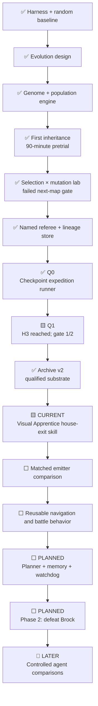

# Roadmap

> **Direction update:** Pure Monkey and clean-start mutation remain preserved controls. The
> completed 2 × 3 lab changed selection and mutation but every lane still failed the second-map
> gate. The primary track is now the [Hall of Fame completion program](completion-program.md): a
> currently random discovery emitter, privileged read-only training referee, verified frontier
> checkpoints, complete action lineages, and eventual distillation into one frozen visual policy.

## Completed blind-discovery arc

1. ✅ Freeze a pixels-and-buttons-only actor capability.
2. ✅ Implement a bounded random Monkey and visual-novelty Archivist.
3. ✅ Add resumable checkpoints, disk/time/action limits, and a live visual dashboard.
4. ✅ Exercise matched random and learning development arms from power-on.
5. ✅ Establish that Pure Monkey cannot retain a successful accident.
6. ✅ Preserve Monkey as a reproducible control and retire it from future headline arenas.

## Immediate evolutionary arc

1. ✅ Freeze the version-1 genome, observation boundary, archive descriptors, and claims.
2. ✅ Implement deterministic recurrent inference and genome serialization.
3. ✅ Implement mutation-only reproduction, MAP-Elites, genealogy, and resume checkpoints.
4. ✅ Complete a bounded 90-minute population pretrial and freeze its archive and genealogy.
5. ✅ Diagnose uniform parent selection and destructive broad mutation as candidate bottlenecks.
6. ✅ Run the six-lane selection × mutation fork with 1,536,000 actions per lane.
7. ✅ Record that no condition passed the second-map gate; do not select a marathon winner.
8. ✅ Implement the named completion referee and integrity-bound expedition evidence foundation.
9. ✅ Integrate the single-writer checkpoint expedition, localhost dashboard, exact resume, and
   required power-on lineage replay.
10. ✅ Conclude Q1 honestly: H3 `left_home` reached, but the two-seed gate failed 1/2.
11. ✅ Index replay counts, stream lineages, validate ancestry topologically, and bound disk scans.
12. ✅ Qualify Archive v2 edge verification, bounded niches, suffix buffering, exact resume, and hard-crash recovery on the real ROM.
13. 🟨 Build, train, and evaluate [Visual Apprentice v1](visual-apprentice.md) under its frozen local gate; Stage-0 code and synthetic checks are complete.
14. ⬜ Compare qualified optimized/learned emitters under a matched house-exit gate.
15. ⬜ Distill useful self-generated lineages into a richer frozen visual policy.
16. ✅ Replace Monkey in the four-lane pretrial dashboard.

## Later informed-agent roadmap

The destination is a transparent hybrid agent that can plan, learn reusable skills, remember what
it discovers, and recover from loops. The route there is a series of bounded experiments. Each
milestone must produce evidence that can be understood without trusting a highlight reel.

This roadmap records intent, not a delivery schedule. Training results are uncertain, and later
designs should change when evidence points somewhere better.

## Dependency map

Arrows mean “needs evidence from,” not necessarily “must be implemented in a single strict
sequence.” Small prototypes may happen earlier, but an official result cannot skip its gates.

## Legacy Phase 0 — Build a trustworthy starting line

This older project phase predates the checkpoint program's separate **Q0 completion-foundation
gate**. Q0 has passed; the two broader Phase 0 evidence items below remain useful but are not
prerequisites for the now-concluded bounded Q1 checkpoint trial.

**Narrative question:** Can we trust the stage before judging the player?

### Complete

- ✅ Gate the harness to one exact Pokémon Red ROM fingerprint.
- ✅ Boot at unlimited speed without writing cartridge data beside the private ROM.
- ✅ Make controller hold/release timing explicit.
- ✅ Save and restore integrity-bound, in-memory snapshots.
- ✅ Write sanitized event traces and screenshots under ignored run directories.
- ✅ Expose a documented six-field, read-only instrumentation snapshot.
- ✅ Reach RED's bedroom twice from clean boots with identical state and hashes.
- ✅ Verify one-tile movement and restoration at the first playable state.
- ✅ Add tests, linting, CI, and private-artifact guards.
- ✅ Turn sanitized traces into standalone, local, human-readable run reports.

### Remaining exit work

| Deliverable | Acceptance gate | Story artifact |
| --- | --- | --- |
| Human Oak's Parcel baseline | A complete human-driven run with action/frame counts, milestones, and interventions | Annotated route timeline and milestone table |
| Extended stability run | A declared random or scripted stress budget completes without unexplained emulator/harness failure | Termination breakdown and stability timeline |

**Phase 0 exit:** both remaining deliverables are recorded under the experiment protocol. This gate
does not require a trained policy.

## Phase 1 — Build a verified opening curriculum

**Narrative question:** Can the system remember one useful step, prove where it came from, and then
extend it without a human route?

Oak's Parcel remains the first complete story arc, but checkpoint-assisted discovery comes before a
clean-start learned-policy claim. Those are separate artifacts and separate evidence rungs.

### 1A — Trust the expedition substrate

- ✅ Separate action-emitter inputs from referee-only state.
- ✅ Freeze deterministic action timing, named milestone semantics, and the strict completion bit.
- ✅ Bind snapshots, action segments, cells, ancestry, manifests, and audit events to hashes.
- ✅ Quarantine every unverified lineage boundary and preserve exact stop/resume state.
- ✅ Classify pixel loops and enforce action, time, output, and free-space ceilings.

**Gate:** Q0 passed. Corruption, forged semantics, false Hall of Fame, ancestor laundering, and
torn-tail recovery all have regression checks; two bounded real-ROM runs passed every replay.

### 1B — Pass one remembered step

- ✅ Run two fresh 20,000-action seeds against the exact `left_home` milestone.
- ✅ Require three complete power-on replays for each passing milestone lineage.
- ✅ Preserve failed siblings, loop stops, replay cost, and interventions in the dashboard ledger.
- ✅ Refuse post-result budget expansion; the 1/2 result triggers an emitter comparison.

**Result:** one seed reached `left_home`; one stopped at `left_bedroom`. H3 milestone evidence was
earned, but the gate requiring both seeds failed. The random emitter remains the baseline rather
than the selected completion mechanism.

### 1C — Choose and train bounded emitters

- ✅ Index replay counts, stream action lineages, validate ancestry topologically, and bound disk
  reconciliation without weakening the event hash chain.
- ✅ Implement Archive v2: one semantic/spatial primary niche with bounded visual alternatives,
  one ordinary candidate per suffix, exact edge verification for training restores, and three
  fresh power-on replays for named promotion claims.
- ✅ Implement the Stage-0 immutable demonstration extractor, recurrent cloning trainer, frozen
  reload check, and snapshot-free clean-power-on evaluator.
- ⬜ Compare random/action-sequence, recurrent visual, and hybrid emitters under matched gates.
- ⬜ Train navigation, dialogue/text advance, menu control, and battle behavior as measurable local
  skills from self-generated checkpoint distributions.
- ⬜ Keep shaped reward and archive quality separate from named success.
- ✅ Qualify replay ratio, archive arrivals, exact resume, retention marking, and dashboard privacy
  under staged real-ROM action counts before multi-day compute.

**Gate:** a frozen learned local policy improves on the random discovery denominator over every
predeclared attempt; archive search remains labeled separately.

### 1D — Discover, then learn, Oak's Parcel

- ⬜ Assemble and replay an `ACTION-LINEAGE` through house exit, Oak, starter, rival, Viridian,
  parcel collection, parcel delivery, and Pokédex.
- ⬜ Distill the successful and recovery trajectories into one visual policy.
- ⬜ Evaluate that frozen policy from power-on without archive restore or updates.

**Phase 1 exit:** report both the strongest replayed action-lineage claim and the strongest frozen-
policy claim. A discovered Parcel route does not automatically satisfy the learned-policy gate.

## Phase 2 — Turn isolated behavior into a reusable agent

**Narrative question:** Can skills learned for the opening be composed into a longer strategy?

### System capabilities

- ⬜ Planner chooses bounded, inspectable goals rather than individual frames.
- ⬜ Skill selector invokes navigation, interaction, and battle policies through one interface.
- ⬜ Run-specific memory records discovered connections, outcomes, and failed approaches.
- ⬜ Watchdog detects repeated screens, position cycles, and exhausted budgets.
- ⬜ Recorder explains which component chose each action and why control changed hands.

### Brock arc

- ⬜ Navigate Route 1, Viridian City, Route 2, and Viridian Forest.
- ⬜ Manage party health and training under declared rules.
- ⬜ Reach Pewter City and enter the Gym.
- ⬜ Defeat Brock from a clean game start.

**Phase 2 exit:** first replay a complete power-on `ACTION-LINEAGE` through Brock, then separately
evaluate frozen learned skills or a frozen hybrid from clean power-on. Replanning and watchdog
events remain visible; silent reloads or manual rescues count as interventions.

## Later — Ask comparative questions

**Narrative question:** Which parts of the system are actually doing useful work?

Potential configurations:

| Configuration | Main question | Required disclosure |
| --- | --- | --- |
| Language-model controller | Can high-level reasoning compensate for limited learned control? | Model/version, prompt, calls, tokens, cost, latency |
| Reinforcement-learning policy | How far can a learned controller go without language planning? | Algorithm, architecture, steps, seeds, checkpoints |
| Hybrid | Does planning plus trained execution outperform either alone? | Control-transfer rules, shared resources, component budgets |
| Ablations | Do memory and the watchdog help? | Exactly one declared component difference per comparison |

These are engineering comparisons, not automatically fair contests. Compute, information, prior
knowledge, and tool access must be reported rather than compressed into a single leaderboard.

## Milestone gates in one view

| Gate | Must be true before advancing the public claim |
| --- | --- |
| Harness trusted | Supported ROM, deterministic boundaries, trace safety, and repeated clean start are checked |
| Environment frozen | Observation, action, reward, start, and stop rules carry explicit versions |
| Baselines known | Human and random baselines use the same referee and publish comparable measures |
| Skill learned | Frozen checkpoint improves on a declared baseline over all official attempts |
| Parcel completed | Clean-start parcel success meets a frozen threshold and budget |
| Brock defeated | Clean-start Brock success meets a frozen threshold and budget |
| Comparison credible | Configurations share a referee and disclose differing resources and information |

## Near-term work queue

The selection/mutation branch is concluded. The immediate queue follows the horizon failure it
revealed.

1. **Freeze Q1** — preserve the complete 1/2 result, 419-action successful lineage, and all failed
   branches as the random checkpoint-search denominator.
2. **Scaling foundation** — ✅ stream lineages, index replay counts, validate ancestry
   topologically, and replace recursive per-action disk scans with bounded monitoring.
3. **Archive v2 qualification** — ✅ continuous, graceful-resume, and hard-crash real-ROM trials
   reached exact budgets; ordinary edge replay stayed bounded and the crash twin's deterministic
   terminal state matched its uninterrupted control.
4. **Visual Apprentice pilot** — 🟨 the immutable extractor, 468,312-parameter recurrent policy,
   CPU overfit trainer, frozen reload, and clean-power-on evaluator are implemented and checked;
   run the two-extraction data gate, offline overfit, and live emulator gate, then gather
   independent/recovery branches under [Visual Apprentice v1](visual-apprentice.md).
5. **Emitter comparison** — compare optimized action-sequence, recurrent visual, and hybrid
   emitters under the unchanged two-seed Q1 gate.
6. **Dual-frame evidence** — retain the exact semantic event frame and a separately labeled stable
   narrative frame after transitions.
7. **Opening curriculum** — only after a new emitter passes Q1, extend checkpoint exploration through Oak, starter,
   rival, Parcel, and Pokédex.
8. **Learned-policy track** — use self-generated successful and recovery traces to train bounded
   visual skills before attempting one frozen end-to-end policy.

## What is deliberately not promised

- A completion date: training and integration difficulty are unknown.
- A full-game run: the first useful questions end much earlier.
- Absolute learning “from scratch”: even the pixels-only track receives an emulator, controller,
  action cadence, novelty calculation, archive algorithm, and computation as prior structure.
- Zero intervention: interventions will be counted, not edited out of the story.
- A single magic score: success, reliability, resources, and behavior need separate measures.

Progress against this roadmap is summarized in [Progress](progress.md). The standards for turning
milestones into honest charts and a video narrative are in
[Visual storytelling](visual-storytelling.md).
