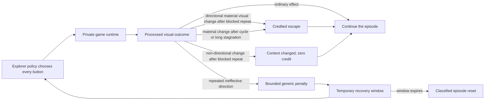

# Version 10: let the Explorer recover before resetting

Version 10 preserves Version 9's fresh-start, no-demonstration architecture and changes one narrow
part of the Explorer: what happens after it repeatedly presses a direction that has no visible
effect. Earlier versions could recognize a visual cycle or long stagnation, penalize it, and end
the episode. That protected the action budget, but it also removed the exact local situation in
which the policy needed to learn a different response.

> **Status on 2026-07-21:** the V10 recovery mechanism is implemented as a new protocol and has
> passed deterministic E2 qualification plus direct E3 mechanism calibration. A real-ROM campaign
> canary and matched behavioral comparison remain pending. No V10 gameplay, exploration, learning, or competence result is
> claimed. The active V9 campaign remains a separately frozen experiment; its live wall-bouncing
> observation is diagnostic evidence, not a rewritten terminal result.

The central idea is simple:

> The watchdog correctly detected the wall, then reset away the exact situation the agent needed
> to practice. V10 turns a loop into a bounded lesson before giving up.

## What V9 revealed

V9 was designed primarily around the Student. It retained V8's separate PPO Explorer, normalized
the Explorer's verified discoveries into consecutive skills, and let the Student practice closed
loop. During the declared long V9 campaign, the Explorer advanced through the opening and then was
visibly observed repeating ineffective directional actions with little pixel change. Its loop counters continued to
rise and its episodes restarted from the run's currently admitted, self-generated verified
frontier. Early in a fresh run that frontier remains near the opening, so repeated resets can still
look like replaying the beginning.

That behavior does not mean the process froze. PPO continued updating, four environments continued
producing experience, and the Student continued its own practice. It does expose a credit problem:

1. the policy presses a direction;
2. the player does not move;
3. the actor receives a small generic penalty;
4. repeated failure eventually triggers the loop watchdog; and
5. the episode ends, erasing the local context before the policy demonstrates an escape.

The reset is operationally valid and scientifically visible. The question is whether it is too
early to be educational.

V10 does not assume that wall collisions are the only reason V9 may fail. It does not repair the
Student's frozen-exam weakness, invent a route to Viridian City, or solve long-horizon credit
assignment. It isolates one falsifiable hypothesis: **can a bounded chance to recover from generic
ineffective directional action/pixel outcomes reduce destructive resets and produce more sustained exploration without
supplying a direction?**

## The no-cheating boundary

The recovery mechanism is deliberately weaker than a navigation helper.

The Explorer still receives only:

- processed pixels;
- its own recent executed actions; and
- its recurrent hidden state.

The separate Student retains V9's self-generated visual goal clip in addition to the same visual
and action inputs. V10 adds no map, coordinate, collision bit, route graph, landmark label,
distance-to-goal, correct direction, or human action to either actor observation.

Trainer-only code may compare the processed frame before and after the policy's submitted action to
determine whether an action had a generic visual effect. It may assign a generic penalty and
classify how the bounded recovery window closed. It receives no RAM or coordinates for this
mechanism. It may not:

- replace the policy's chosen action;
- mask a direction;
- sample a supposedly better direction on the policy's behalf;
- reward movement toward a named destination;
- consult authored route distance; or
- keep trying protocol changes inside an active run until the character escapes.

Every controller action must still come from the PPO policy. A symmetric incentive to try an
alternative after an ineffective directional action/pixel outcome is consequence feedback, not a supplied answer. The
dashboard records zero trainer-selected buttons so that this distinction remains auditable rather
than implicit.

## Recovery before reset

V10 adds a small, episode-local recovery state around generic directional failure.

The mechanism has four responsibilities.

### 1. Remember ineffective directions briefly

The environment keeps short-term, per-direction evidence that a directional action produced too
little processed-pixel change. This is trainer memory used to score the transition; it is not an
actor-visible map. A perceptually effective outcome clears the local failure counts, and the memory
does not become a permanent list of forbidden tiles. Any policy-submitted action that materially
changes the rendered state can clear those counts; the detector does not pretend it can infer the
semantic purpose of the change. Clearing a count is not automatically credited as an escape.

### 2. Make repeated failure more legible

One no-effect press can be normal: a sprite may be aligning to a tile, dialogue may be open, or an
animation may still be resolving. V10 therefore distinguishes an isolated ineffective action from
a repeated attempt at the same local obstacle. The repeated case receives a bounded generic
penalty. The penalty says only, “that action still had no effect here.” It does not say which action
would work.

### 3. Keep the local state alive temporarily

Instead of treating an eligible loop signal as an immediate reset, V10 opens a bounded recovery
window. The same policy remains in control and continues receiving the consequences of its own
choices. A sufficiently large new visual outcome outside the trapped signature set may clear
recovery and let the existing episode continue, but its classification depends on what opened the
window.

- After `blocked_repeat`, only a policy-chosen **directional material visual outcome** is `escaped` and
  earns 0.25 credit. A non-directional material change such as opening Start closes and preserves
  the episode as `context_changed`, earns zero credit, and is not counted as an escape or success.
- After `visual_cycle` or pixels-only `progress_stagnation`, any policy-chosen material visual
  change may be `escaped`. Those triggers already incur the ordinary -2 loop penalty, so the 0.25
  recovery credit cannot turn the triggering loop into positive reward.

The distinction prevents a menu change from being presented as navigation recovery while retaining
generic full-game handling for dialogue, menus, battles, and other visually repetitive contexts.
The detector still sees pixels and submitted actions, not semantic labels such as “wall” or
“conversation.”

This is the key experimental change. The PPO rollout can now contain both the failed attempts and
the policy-chosen escape, giving the optimizer a local comparison that an immediate reset could
not provide.

### 4. Retain a hard stop

Recovery is not permission to spend the entire campaign against one wall. If the policy does not
produce an eligible closing visual outcome before the declared window expires, the environment
records the failure and performs the same classified episode reset. Operational safety and bounded
compute remain intact.

V10 reports an expired recovery or stopped emulator as a true terminal failure to PPO. Only the
ordinary episode action ceiling remains a time-limit truncation. This prevents the value function
from bootstrapping through a wall state as though the failed recovery were merely an arbitrary
sampling boundary.

The recovery state clears at episode boundaries. Resume must not fabricate a half-remembered local
escape context: a fresh emulator rollout begins with fresh episode-local recovery memory. V10 binds
campaign-cumulative narrative telemetry—including recovery events, episode outcomes, reward
components, unique positions, and the ranks with active windows—into its checkpoint under
`v10-narrative-telemetry-v1`. An active window cannot silently disappear: it is classified
`abandoned_on_resume`, `abandoned_on_episode_end`, or `abandoned_on_campaign_end` as appropriate.
At any report boundary, every opened window must be exactly one of `escaped`, `context_changed`,
`expired`, active, or abandoned; the unresolved inactive count must remain zero.

## Frozen implementation defaults

The first V10 implementation declares these values before its campaign canary:

| Setting | Value |
| --- | ---: |
| Run protocol | `parallel-recurrent-ppo-v10` |
| Reward protocol | `recovery-before-reset-v1` |
| Detector protocol | `pixels-only-loop-recovery-v1` |
| Repeated blocked-direction threshold | 3 visually ineffective attempts for that direction |
| Recovery window | 32 Explorer actions |
| Pixels-only long-stagnation trigger | 1,024 consecutive ineffective pixel/action outcomes |
| Escape confirmations | 1 |
| Ineffective visual threshold | changed pixels below 2% **and** mean absolute pixel error below 2.0 |
| Escape visual threshold | changed pixels at least 5% **or** mean absolute pixel error at least 5.0, outside the trapped signature set |
| Repeated-block penalty | 0.25 raw reward units |
| Credited escape after `blocked_repeat` | 0.25 raw reward unit; directional material visual outcome only |
| `context_changed` after `blocked_repeat` | 0 reward; closes and preserves, but is not an escape/success |
| `visual_cycle` / `progress_stagnation` trigger penalty | 2.0 raw reward units before any escape credit |
| Expiration penalty | 1.0 raw reward unit |
| Policy action overrides | 0 |

A blocked trigger followed by credited directional escape is reward-neutral before the game's
ordinary consequences: -0.25 plus +0.25. A blocked trigger followed by `context_changed` remains at
-0.25 because it earns no escape credit. The credited escape was reduced from the draft 1.0 to 0.25
during an adversarial reward audit and is constrained not to exceed the repeated-block activation
penalty. Visual-cycle and pixels-only long-stagnation triggers receive the ordinary -2 loop penalty
before at most +0.25 escape credit. All values pass through the run's ordinary global reward scale.

The pixels-only detector opens `progress_stagnation` after 1,024 consecutive ineffective
pixel/action outcomes, on the same transition but before the legacy watchdog can hard-terminate the
episode. Visually effective activity—including backtracking over a known position—resets the legacy
hard-stagnation timer without clearing its separate 128-frame, at-most-eight-signature visual-cycle
detector. These numbers are frozen pre-canary hypotheses, not values selected after observing a run.

## What remains unchanged from V9

V10 is an Explorer intervention, not a replacement for the self-correcting Student.

- Explorer and Student remain separate recurrent policies after initialization.
- The run begins from fresh random parameters and imports only the power-on root. After the
  Explorer verifies its own progress, later episodes may restart from that self-generated frontier;
  no predecessor route is imported.
- No predecessor weights, actions, demonstrations, skills, or success buffers enter the run.
- The Explorer still learns through recurrent PPO under trainer-only generic consequences.
- Only replay-verified discoveries can become Student lessons.
- Consecutive skill normalization, reverse closed-loop practice, and success-only aggregation remain.
- Failed Student practice attempts remain in the denominator and never become imitation labels.
- Frozen checkpoint-separated exams, not practice percentage or training fit, decide competence.
- Restore-free composition remains a stronger claim than any local skill or Explorer discovery.

This separation matters. A V10 Explorer may record more credited directional recoveries while the
Student still passes zero frozen exams. Even if matched position evidence later establishes an
exploration improvement, that would not itself be a learned full-game policy.

## Dashboard and narrative evidence

The V10 dashboard preserves V9's four learning-depth views and adds an explicitly named
**Explorer loop recovery** panel. It should answer:

| Measure | Question |
| --- | --- |
| Ineffective directional actions | How often did a direction produce no useful local effect? |
| Repeated-block penalties | How often did the same local failure become persistent? |
| Recovery activations | How often was reset deferred to create a learning opportunity? |
| Credited policy escapes | How often did an eligible policy action materially leave the trapped visual state? |
| Context changes | How often did a blocked-repeat window close without escape credit or success? |
| Recovery expirations | How often did the bounded chance still end in reset? |
| Abandoned windows | How many active windows ended on resume, episode end, or campaign end? |
| Unresolved inactive windows | Must remain zero: every opened window is fail-closed into a denominator |
| Recovery actions | What extra interaction budget did the mechanism consume? |
| Active recovery environments | How many of the parallel games are currently attempting recovery? |
| Trainer-selected buttons | Must remain zero |

The old loop counters also remain. In V10 they mean **detections or triggers**, not necessarily
episodes cut short, because either `escaped` or `context_changed` can preserve the episode. The
report must not call `context_changed` a successful escape or use the old “loops terminated”
wording for every detection.

Hourly Markdown observations should record the action count and timestamp, then separate:

1. loop detections;
2. recovery opportunities by blocked-repeat, visual-cycle, or long-stagnation trigger;
3. credited policy escapes;
4. zero-credit context changes;
5. expired, active, and abandoned windows, with zero unresolved inactive windows;
6. new positions or verified milestones after recovery; and
7. Student practice and frozen exams.

This produces a useful visual for the eventual video: a wall collision opens a visible recovery
timer, the controller timeline continues, and the episode either survives or ends. No success clip
should hide how many recovery windows expired.

## Qualification plan

V10 has three evidence gates before a long campaign.

### Gate 1 — deterministic mechanism checks — passed at E2

- ineffective directional actions are classified consistently;
- after a blocked-repeat trigger, a directional material visual outcome is `escaped` with 0.25 credit while
  non-directional material change is `context_changed` with zero credit and no success count;
- after visual-cycle or pixels-only long-stagnation triggers, a generic material action may be
  credited only after the ordinary -2 loop penalty;
- repeated attempts receive only the declared bounded penalty;
- pixels-only long stagnation opens at 1,024 ineffective outcomes before legacy hard termination;
- visually effective backtracking resets hard stagnation without clearing the independent
  128-frame/eight-signature cycle detector;
- recovery expires at its configured boundary;
- every opened window is accounted for as escaped, context-changed, expired, active, or abandoned,
  with active ranks persisted and resume/episode/campaign abandonment classified;
- expiration is a true terminal failure while the ordinary action ceiling remains a truncation;
- the action passed to the emulator is exactly the action chosen by the policy;
- route guidance and authored destination logic are never consulted; and
- public status remains readable when no recovery has occurred.

This gate passed on 2026-07-21:

- the focused V10/PPO/dashboard suite passed 67 checks;
- the whole default suite passed 293, with 13 private-ROM checks skipped;
- all selected ROM-bearing files then passed 54/54 with the private ROM in 19.02 seconds; and
- Ruff, the private-artifact guard, documentation links/placeholders, compilation, and diff checks
  passed.

The focused checks additionally prove that a simultaneous pixels-only stagnation activation
suppresses legacy hard termination, exact recovery expiry is terminal, and the ordinary action
ceiling remains a truncation while classifying any active window abandoned. Perceptual activity can
reset hard stagnation while the short-cycle detector remains live. Persisted active ranks become
abandoned on resume, and hourly `NARRATIVE.md` reports detections beside credited escapes, context
changes, expirations, active and abandoned windows, and zero unresolved inactive windows.

The private-ROM integration files exercise deterministic mechanisms; they are not a fresh-start
campaign canary. Passing this gate proves implementation behavior, action-authority invariants,
and safety checks—not exploration, game learning, or competence.

#### Direct private-ROM detector calibration — passed at E3 mechanism scope

The committed 289-action ground-floor fixture, followed by six settling noops, produced a wide
margin around the frozen thresholds:

| Policy-submitted action | Changed pixels | Mean absolute error | Classification |
| --- | ---: | ---: | --- |
| Up | 0% | 0 | Blocked |
| Right | 0.642% | 0.509 | Blocked |
| Down | 20.972% | 23.165 | Material directional visual outcome; eligible credited escape |
| Left | 21.215% | 26.851 | Material directional visual outcome |
| Start | 37.708% | 89.667 | `context_changed` after blocked repeat; zero credit |

The integration proves two independent closures. Exactly three policy-submitted Up wall actions
open recovery, then policy-submitted Start closes it as `context_changed` with zero credit and no
escape/success count. From a fresh state, another three Up actions open recovery and policy-submitted
Down closes it as the credited `escaped` outcome. Both sequences preserve `submitted == executed`.
This is E3 calibration of one deterministic real-ROM mechanism. It is not a fresh campaign,
exploration comparison, or learning result, so Gate 2 remains open.

### Gate 2 — real-ROM canary

A short fresh-start canary must exercise at least one recovery activation, separate credited
escapes from zero-credit context changes, preserve active ranks through checkpoint accounting,
leave zero unresolved inactive windows, preserve the information boundary, stop within its declared
budget, and produce a clean checkpoint. If it never encounters an eligible failure, the canary is
inconclusive rather than a pass.

### Gate 3 — matched behavioral comparison

V9 and V10 should eventually be compared under disclosed seeds, wall time, action budget,
parallelism, and observation boundary. Report at least:

- loop detections per 100,000 Explorer actions;
- reset rate;
- credited escape, context-change, expiry, active, and abandonment denominators;
- unique positions and maps;
- verified milestone depth and time-to-first milestone;
- Student practice cost; and
- frozen local and composition exams.

The comparison must account for recovery actions. V10 cannot claim efficiency merely by spending
more emulator work between resets.

## Falsifiers

V10 should be revised or rejected if:

- trainer code ever chooses, masks, or replaces a controller action;
- a coordinate or direction hint enters actor observation;
- ordinary menu or dialogue progress systematically opens false recovery windows;
- a blocked-repeat context change is counted or rewarded as an escape/success;
- any opened window disappears without becoming escaped, context-changed, expired, active, or
  abandoned;
- the policy learns to farm recovery credit by deliberately becoming stuck;
- recovery activations rise while successful escapes remain flat;
- resets fall but unique positions, maps, and verified milestones do not improve;
- extra recovery actions consume more compute without a matched behavioral benefit;
- Explorer progress rises while frozen Student competence remains zero and the result is reported
  as whole-agent learning; or
- a human changes the recovery rule mid-run after watching a particular obstacle.

Failure under any of these conditions remains part of the project record. It is not permission to
add “walk north here” or another task-specific patch.

## Claim boundaries

| Evidence | Permitted statement | Not permitted |
| --- | --- | --- |
| Mechanism checks pass | “V10 preserves policy action authority and classifies bounded recovery.” | “The agent learned to navigate.” |
| Recovery window opens | “The watchdog deferred one reset.” | “The agent understood it was stuck.” |
| Blocked-repeat context changes | “A policy-submitted non-directional action materially changed context and preserved the episode with zero credit.” | “The agent escaped the wall” or “one success” |
| Policy earns `escaped` | “One trigger-eligible policy action materially left the trapped visual state before expiry.” | “It knows the route to Viridian City.” |
| Reset rate falls | “Fewer detected loops ended immediately.” | “Exploration improved” without position or milestone evidence |
| Unique positions or milestones improve | “V10 sustained broader exploration under this declared budget.” | “The Student became competent.” |
| Frozen exams improve | “The named Student gate improved under the declared denominator.” | “It can beat Pokémon Red” without restore-free completion |

Until a real-ROM campaign canary and matched comparison exist, the current statement is:

> V10's route-agnostic, policy-controlled recovery mechanism passed deterministic E2 qualification
> and direct E3 mechanism calibration. Its exploration and gameplay value remain untested.

## Video chapter: “The reset button was hiding the lesson”

The chapter should open on the unflattering footage: the Explorer repeatedly presses into a wall.
Overlay the rising loop counter, then cut to power-on as the watchdog resets the episode. Repeat the
sequence until the pattern is obvious.

Then freeze the frame and ask: **if every mistake ends the lesson, when does it practice the
recovery?**

Draw a short controller timeline. Under V9, the line ends at loop detection. Under V10, extend it
through a bounded amber window. Keep every policy-selected action visible. Turn a credited escape
green. Show a blocked-repeat Start/menu change in blue as **CONTEXT CHANGED · 0 CREDIT · NOT AN
ESCAPE**. If the window expires, turn it red and retain the reset. Beside every outcome, keep
**TRAINER-SELECTED BUTTONS: 0** on screen. The denominator must also show active and abandoned
windows so no unfinished lesson vanishes from the edit.

The honest ending is whichever denominator the experiment produces:

- **Mechanism failure:** menus, dialogue, or ordinary visual activity trigger false recovery.
- **No behavioral change:** the policy receives more time but still cannot escape.
- **Local improvement only:** resets fall and exploration broadens, but frozen Student exams remain
  flat.
- **Matched improvement:** broader verified exploration and later competence improve under the
  declared comparison.

The point is not that V10 must work. The point is that the next failure now asks a clearer question
without turning the trainer into a walkthrough.
