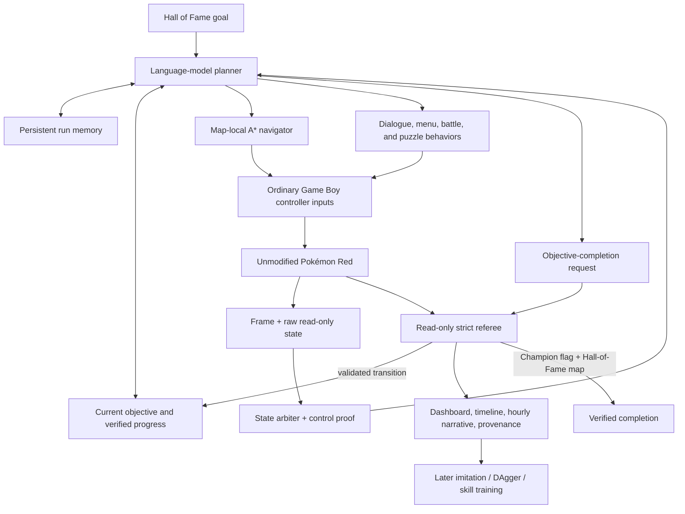

# Version 11: stop teaching one button at a time

> **Status, closed 2026-07-22:** V10 closed cleanly. V11 became operational, and its fourth bounded
> canary qualified the opening referee after three failed-but-useful diagnostics. The following
> continuous run stopped after 950.308 seconds, 329 controller actions, and 144 online model calls,
> with no party or badge progress. V11 is retained as an assisted control; V12 is the final
> experiential learner. No Hall-of-Fame result exists.

The first ten versions asked increasingly capable neural policies to discover, remember, and join
small pieces of Pokémon Red. They produced real advances: deterministic evidence, inherited
behaviors, verified routes, a recurrent Explorer, distilled skills, reverse practice, and an honest
frozen exam. They also exposed the same architectural mismatch again and again. One model was being
asked to infer a world map, remember a multi-hour quest, learn menus and battles, recover from local
mistakes, and choose the next story goal from a stream of tiny button presses.

V11 changes the unit of reasoning. It is a **declared hierarchical hybrid** whose immediate job is
to complete the game, not another reward tweak to the wall-bouncing policy.

## The premise now

The project began with a monkeys-with-typewriters question: how far can near-blind randomness go?
That control answered itself. Randomness does not retain luck. The later question became whether a
pixels-only learner could turn its own discoveries into a complete policy. V7–V10 showed that it
could generate lessons and improve training fit, but not make those lessons reliable enough to
compose: V9 ended with 68.5919% training accuracy, 4/87 frozen exams, and zero competent skills.

The new headline question is:

> **Can an explicitly assisted, memory-bearing AI plan and execute an entire Pokémon Red journey
> from power-on—and can that journey become trustworthy training data for a smaller learned
> policy?**

This is a pivot, not a retrospective rewrite. Strict-blind Monkey, neuroevolution, and V7–V10 remain
published controls. Their failures explain why the hierarchy exists.

## Architecture

The planner owns the next subgoal. A deterministic navigator may turn a same-map destination into a
sequence of directional buttons. Specialist behavior handles interactions where coordinates alone
are insufficient. Persistent memory records discoveries and failed approaches. A state arbiter
decides whether raw transition values are semantically current before exposing them. The separate
referee validates objective transitions and can stop the run, but cannot press buttons or alter
memory.

This avoids two opposite failure modes:

- a flat policy does not have to rediscover a 40-tile path while trying to reason about a parcel;
- a fixed speedrun script does not dictate every button and fail whenever a battle, menu, or NPC
  differs.

## Exact experiment label

| Field | V11 guided-completion lane |
| --- | --- |
| Actor | `STRUCTURED-STATE LLM PLANNER + A* NAVIGATOR + CONTROLLER SPECIALISTS` |
| Training / planning information | `ASSISTED`: screen, structured Red state, processed maps, current hand-authored objective, persistent run memory |
| Start | `POWER-ON` |
| Evaluated object | `HYBRID-SYSTEM` |
| Model update during run | No local foundation-model weight update; in-run files and harness memory may change |
| Prior gameplay state | None: no save state, checkpoint, action lineage, or prior-run memory |
| Human controller input | Zero after launch for a claimed attempt |
| Terminal rule | Champion-rival event **and** Hall-of-Fame map must coincide |

The objective list is walkthrough-like assistance. A successful V11 run therefore supports the
claim **“a disclosed hierarchical AI completed Pokémon Red from power-on”**. It does not support
“a pixels-only neural policy learned Pokémon from scratch,” “the model discovered the story
unassisted,” or H5 under the existing frozen-policy definition.

## What “clean start” means here

The upstream Red harness contained a ROM-adjacent state and automatically loaded such files. V11
disables that behavior by default. A run must fail closed if the clean-start rule is not active.
After its pinned fingerprint passes, the private ROM is exposed at the harness's fixed runtime path
through a filesystem link and opened only as emulator input; the ROM bytes are neither copied into
Git nor included in a public run record. All generated run data remains on the external SSD.

A claimed attempt imports none of the upstream demonstration's evolved memory, skill registry,
subagents, save state, or Lt. Surge-era policy notes. The generic V11 directive may encode
game-independent recovery principles, but the live run begins with an empty run memory.

## Why the upstream harness is used

V11 adapts [`sethkarten/continual-harness`](https://github.com/sethkarten/continual-harness) at
commit `bbab97ad73e460b7cd7c08527d10ced30cc03fbe` under its MIT license. It already provides a
Pokémon Red emulator bridge, processed maps, a full-game objective catalogue, A* navigation,
persistent stores, CLI-agent integration, and a live web view. Pinning one commit makes the external
dependency auditable while keeping copyrighted ROM data outside Git.

The project deliberately changes the upstream benchmark boundary for this lane. Its restricted CLI
agent exposes only frames and buttons so models must solve navigation themselves. V11 exposes the
expert map, objective, reflection, and memory tools because this experiment optimizes whole-game
completion. That assistance is named in every report.

## Why Codex runs locally

The Mac has an authenticated Codex CLI but no running Docker engine and no separate model API key.
The upstream Codex backend already knows how to run locally; V11 makes that path an explicit launch
mode instead of pretending a container exists. The game, run cache, recordings, model transcript,
and narrative artifacts live on the external SSD. One planner/game pair replaces the four
simultaneous flat V10 workers, leaving more memory for the browser, emulator, and recording.

## The continuous loop

1. Observe the frame, context, location, party, items, badge state, and active objective.
2. Select one verifiable subgoal rather than one distant reward.
3. Navigate to a local waypoint or execute a dialogue/menu/battle/puzzle behavior.
4. Re-observe and compare the expected and actual state.
5. Store a useful discovery or failed approach.
6. Request objective completion; the server accepts it only when the objective's evidence validator
   passes, then continue immediately.
7. If repeated attempts fail, reflect and change the plan instead of repeating the same buttons.

Backtracking is explicitly valid when the goal requires it. This directly addresses the parcel
failure that exposed V5's novelty bias: going south can be correct even after going north was
rewarded.

## State truth before planning

Read-only memory is not automatically present-tense truth. Pokémon Red initializes the future
bedroom map, coordinates, player name, and money while Professor Oak's introduction is still on
screen. Canary 3 exposed those plausible future values as if RED were already controllable. The
planner then completed the opening objective and asked A* to walk toward the PC while Oak was still
talking.

V11 now enforces three opening invariants outside the planner prompt:

1. pre-control map, coordinates, and generic milestones remain unavailable;
2. dialogue and menu context use visible/structural UI evidence rather than treating a completed
   text-print register as proof that the dialogue box vanished; and
3. the opening objective cannot complete until an ordinary directional input causes a real
   coordinate change in the upstairs bedroom.

Action grading is also context-aware. A DOWN press that changes a naming-menu selection is not a
failed walking attempt merely because overworld coordinates stayed still. These rules make state
agreement and control proof part of the experiment rather than something the model is asked to
infer from contradictory sensors.

## Recording the story

The live page must make four layers visually distinct:

| Layer | Viewer question | Recorded evidence |
| --- | --- | --- |
| Game | What is happening now? | current frame, location, coordinates, context, party |
| Plan | Why is it doing that? | current objective, most recent reasoning/tool call, next subgoal |
| Journey | Is it actually advancing? | ordered milestones, badges, objective count, route timeline |
| Reliability | Can we trust the claim? | clean-start receipt, ROM/source hashes, intervention count, strict terminal fields |

The supervisor writes a timestamped status snapshot and append-only event timeline. It initializes
one Markdown narrative per run and appends a data-derived hourly chapter containing elapsed time,
action/tool counts, location, objective, new milestones, party changes, stalls, and recoveries.
Important frames are retained at milestone, objective, map, badge, and terminal changes. These
artifacts are private during the run and sanitized before publication. Runtime control tokens and
private absolute paths are removed before metrics or backups become public evidence.

## Canary qualification record

The bounded qualification used four fresh power-on runs rather than erasing the failed attempts:

| Canary | Measured result | Boundary learned |
| --- | --- | --- |
| 1 — `v11-canary-20260721-224100` | 25.559 seconds; zero actions and zero completed planner calls | The planner working directory was resolved twice. Absolute scratch paths and fail-closed unexpected harness exits replaced the ambiguous clean exit. |
| 2 — `v11-canary2-20260721-225000` | Operator stop at 108.110 seconds; 13 language-model calls; zero actions | MCP requests were cancelled under the unattended approval policy. The Pokémon server is now required, preapproved, and restricted to the exact audited tool allowlist. |
| 3 — `v11-canary3-20260721-230000` | Operator stop at 251.630 seconds; 50 actions; the planner, MCP bridge, dashboard, recording, and shutdown all operated | Rejected progress result. Oak was visibly introducing the game while state claimed `RedsHouse2f (3,6)` and `overworld`; an unguarded call falsely completed `pallet_000`. |
| 4 — `v11-canary4-20260721-233000` | 600.521 supervisor seconds / 596.087 metrics seconds; 136 actions; 70 language-model calls; 2,438,617 logged tokens; $0.5150955 logged estimated cost | The opening referee qualified. RIGHT moved RED from `(3,6)` to `(4,6)` at `2026-07-22T03:22:41Z`; only after that proof did `pallet_000` complete at 450.05 seconds / 111 actions. |

Canary 4 ended in `RedsHouse2f (0,2)` at story index 1/84, with no party, badges, or Hall-of-Fame
result. It qualifies true power-on, authenticated local planning, ordinary controller authority,
opening state arbitration, objective rejection before control, visible evidence, and bounded clean
shutdown. It does not qualify later objectives, battles, puzzles, sustained recovery, or whole-game
completion.

The canary also found an early server-layer pre-game map leak that did not reach the guarded public
planner state or objective ledger. That residual leak was fixed before the fresh continuous run.

The qualification gate requires all of the following:

- local Codex authentication works without Docker or an API key;
- the ROM boots from true power-on despite the adjacent upstream state file;
- the full Red objective sequence is visible to the planner;
- navigation and memory tools operate through the declared controller boundary;
- frame, context, map, and coordinate evidence agree before navigation;
- a server-side validator rejects objective completion until its evidence passes;
- frame, objective, milestone, reasoning, and status panels refresh visibly;
- stopping the parent process closes the agent, server, frame service, and MCP bridge cleanly;
- no V10 process remains; and
- the final run record reports every intervention and stop reason.

Canary 4 passed the opening-referee portion of that gate. The following continuous run,
`v11-continuous-20260721-233300`, closed after 950.308 seconds, 329 controller actions, and 144
online model calls. It produced no party or badge progress. The project stopped it because live
per-decision model assistance did not answer the selected experiential-learning question. See
[Version 12](version-12-final-self-learner.md) for the successor and its fixed information rules.
It must still show that the planner changes strategy after stalls and advances later required story
objectives without a human rescue. Neither launch nor elapsed time implies eventual completion.

## What happens after the first completion

A guided V11 completion is useful even though it does not train a new local foundation model. It
creates the artifact the earlier learners lacked: one coherent, state-aware, failure-inclusive
journey through the entire game. That data can support three progressively harder successors:

1. **Behavioral cloning:** train reusable visual/controller specialists on successful V11 segments.
2. **DAgger-style correction:** let a student act, ask the planner to correct the student's visited
   mistakes, and train on those off-route states instead of successes alone.
3. **Frozen hierarchy evaluation:** replace planner or specialist components one at a time and test
   a fixed system from power-on with no inherited save or live human input.

The completion run is therefore both an endpoint and a teacher. The narrative does not have to hide
that transition: ten versions tried to make a single network invent the whole ladder; V11 first
builds a ladder worth learning from.

## Falsifiers and honest endings

- **Planner loops despite expert tools:** the bottleneck is not sparse reward alone; instrument the
  failed plan/recovery transition before adding another reward.
- **Objectives advance without game evidence:** reject the run and harden verification.
- **A state file was loaded:** reject the clean-start claim even if later play is impressive.
- **Champion room triggers completion before victory:** reject the terminal result; only the strict
  dual condition counts.
- **The AI reaches the Hall of Fame:** claim disclosed hierarchical completion, preserve the full
  provenance chain, then begin student distillation. Do not relabel it as pixels-only learning.

## Video chapter

**Working title:** *We Stopped Teaching the AI One Button at a Time*

Open with all four V10 screens walking into the same corner. Freeze them together. Then zoom out:
the missing object was not another reward, but a hierarchy. After introducing the planner, cut to
Canary 3's sharper contradiction: Oak visibly says “Hello there!” while telemetry confidently says
`RedsHouse2f (3,6) · OVERWORLD`. Let the objective turn green and A* draw a route to a PC that is not
yet on screen. Every direction comes back blocked. The hierarchy's first lesson was not Pokémon;
it was deciding which part of its own laboratory to believe. Resolve the beat with Canary 4's
measured RIGHT move and server-accepted control proof, then return to the still-dark strict
Hall-of-Fame detector. The suspense is now whether the same honesty can survive an entire adventure.
