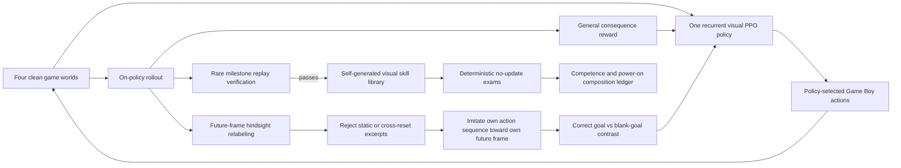

# Version 12: every journey creates its next lesson

> **Final status, 2026-07-22:** V12 is closed. Its declared final run observed 8,236,144 actions in
> 35,696.136 seconds, reached Route 1, and performed 4,021 PPO updates. It ended at 55/502 frozen
> exams, zero competent skills, zero composition attempts, and no Hall-of-Fame result. The process
> was stopped at the user's request after a long plateau. A shutdown finalizer failure left the last
> status stale and produced no terminal power-on evaluation; the last integrity-bound checkpoint
> and this limitation are both published in the
> [V12 final result](../experiments/v12-final/README.md).

Version 12 was the final experimental learner, not another open-ended repair loop. Its rules were
frozen before the long run, it began with random neural parameters and a directly verified ROM
power-on state, and it received no live language-model decisions, walkthrough, demonstration,
route, coordinates, or predecessor policy. The attempt ended early by explicit user choice and is
reported as run, without retroactive tuning.

The governing question is:

> Can one local recurrent visual policy turn ordinary experience into reusable, goal-sensitive
> behavior, preserve rare discoveries, and eventually connect those behaviors from power-on?

The ultimate target was the Hall of Fame. V12 did not assume that 48 hours on an M1 would be enough
to reach it. The fixed run measured whether the learning architecture was moving in that direction
without a human repeatedly dividing the game into hand-selected slices.

## Final result

The run answered the governing question negatively under this implementation and budget. It found
useful trajectories much faster than it learned reusable behavior.

| Measure | Final value |
| --- | ---: |
| Last integrity-bound checkpoint | 8,224,768 actions / 35,634.036 s |
| Last observed status | 8,236,144 actions / 35,696.136 s |
| PPO updates observed | 4,021 |
| Replay-verified frontier | Route 1, reached at action 378,388 |
| Hindsight lessons / action examples | 64,336 / 3,518,624 |
| Frozen exams | 55 / 502 |
| Competent skills at end | 0 |
| Composition attempts | 0 |
| Hall-of-Fame completions | 0 |
| Online decision-model calls | 0 |

All seven promotions arrived in the first 30 minutes. More than 7.85 million additional observed
actions produced no Viridian City promotion. “The adventure begins” passed 55/160 exams and
briefly crossed the rolling competence gate, but lost that status twice and ended at 1/10. “Reached
the ground floor” passed 0/342. Later discovered skills remained ineligible behind that sequential
gate, so the actor never attempted restore-free composition.

At qualification, correct-goal contrast had moved the matched canary diagnostic to a small positive
`+0.00353084`. At the final checkpoint the goal-conditioned log-probability advantage was
effectively zero and contrast loss sat at `0.10`. Millions of hindsight examples therefore did not
produce stable goal use. The policy updated and briefly changed behavior, but it did not acquire
durable cumulative competence.

The full endpoint, milestone timeline, per-skill exam denominator, and shutdown-integrity note are
in the [public final evidence record](../experiments/v12-final/README.md). The broader interpretation
is in the [final retrospective](final-retrospective.md).

## Why this is different

| Earlier approach | What it learned from | Failure exposed | V12 response |
| --- | --- | --- | --- |
| Pure Monkey | Nothing; every action was fresh randomness | Luck vanished immediately | One recurrent policy retains gradient updates |
| V1–V6 reward curricula | Consequences plus increasingly specific authored lessons | The host kept choosing the next fire to extinguish | No authored route, next coordinate, quest plan, or imported checkpoint |
| V7 shared self-imitation | Rare replay-verified milestones | Most actions taught nothing; PPO and imitation interfered | Every visually meaningful rollout can create local hindsight lessons |
| V8–V10 Explorer/Student split | Successful milestone traces and later closed-loop practice | Better training fit did not become frozen competence or composition | One actor owns exploration, goal practice, and final evaluation; there is no second policy to hand off to |
| V11 assisted hierarchy | Live LLM planner, structured state, objectives, maps, A*, and specialists | It tested online assisted reasoning, not local experiential learning | V11 is closed and labeled as an upper-bound control; V12 makes zero online model calls |

The core change is not simply “run PPO longer.” Earlier self-taught learners received a strong
learning event mainly after a rare named milestone. V12 asks a denser question after every rollout:

> You reached a visibly different future screen. Which of your own actions got you there, and do
> those actions fit that future goal better than they fit no goal at all?

That turns ordinary wandering into supervised experience without adding an outside answer.

## Architecture

There is one button-choosing network. PPO, hindsight learning, and verified-skill rehearsal update
that same recurrent actor between rollouts. They do not query another model for an action.

### 1. Consequence learning

Four emulators collect experience for one recurrent PPO policy. The policy sees the previous and
current processed frames, its three recent actions, and one visual goal channel. The goal channel is
blank during open exploration. Trainer-only RAM can grade durable outcomes and run the strict
referee, but it cannot enter the actor observation or choose a button.

The reward remains game-general: visual and spatial novelty, durable event changes, party and item
changes, battle consequences, Pokédex changes, experience, and badges. Authored milestone reward,
Mart direction, route distance, and named next-goal guidance remain zero.

### 2. Future-frame hindsight

At the end of each PPO rollout, V12 examines each environment separately and splits the buffer at
real episode resets. It samples action excerpts of 8–128 actions whose final frame visibly differs
from the starting frame. The final frame becomes the target, and the actual intervening actions
become the lesson.

An excerpt is rejected when:

- it crosses an episode reset;
- it is shorter than the declared minimum;
- its endpoint is too visually similar to its start; or
- the rollout has already filled the fixed 16-lesson budget.

Pending lessons are hash-bound, trained before the next rollout, and then deleted. An append-only
audit retains their origin, horizon, visual-change statistics, target hash, size, and training
denominator without retaining an unlimited second copy of the pixels.

### 3. Correct-goal contrast

Canary 2 exposed a subtle loophole: hindsight loss could fall while the actor ignored its goal.
The measured demonstrated-action log-probability advantage was `-0.00018086` for the real future
goal versus an all-zero goal—effectively no goal use.

V12 now evaluates the same observations and actions twice during hindsight training:

1. with the future frame the sequence actually reached; and
2. with a blank goal.

Alongside ordinary action imitation, a contrastive margin penalizes cases where the demonstrated
actions are not more likely under their real goal. The fixed weight is `0.25` and the fixed margin
is `0.10`. Canary 3 moved the measured advantage to `+0.00353084`. That is directional mechanism
evidence, not mastery of the margin. The live dashboard keeps the value visible so a falling
imitation loss cannot masquerade as goal-conditioned learning.

### 4. Rare discoveries and rehearsal

Named story milestones remain sealed referee watchpoints. When exploration appears to advance, the
candidate edge must replay from its parent and its complete lineage must replay from power-on three
times. Only then can its terminal frame and self-generated actions enter the visual skill library.

Seventy-five percent of episodes continue at the self-discovered frontier. The remainder may
rehearse the weakest self-generated skill. The scheduler can select only something this run already
reached; it has no walkthrough or list of desirable destinations.

### 5. Recovery without controller assistance

V12 retains V10's pixels-only recovery window. Repeated visually ineffective directional actions
open a bounded local learning opportunity before reset. Every submitted and executed action still
comes from the policy. The trainer records an invariant count of zero selected, replaced, or masked
buttons.

Unlike historical V7, V12's stagnation timing cannot use authored route distance, milestone
ordinal, or Mart-script progress. Its recovery detector receives rendered pixels and the actor's
submitted action only.

### 6. Exams that training cannot grade for itself

Every 16,384 training actions, the current checkpoint takes one deterministic no-update exam. Only
these checkpoint-separated attempts may establish V12 skill competence. The requirement remains
8 successes in the latest 10 exams.

When competent skills form a continuous chain, a composition exam starts at exact power-on and
switches only among self-generated visual targets at referee-verified endpoints. It does not restore
between skills. At campaign end, the final policy is sealed and evaluated once more:

- with its competent self-generated goal chain when one exists; or
- with a blank goal for 32,768 actions from power-on when no competent chain exists.

The terminal artifact records the policy hash, action count, deepest milestone, target, restores,
updates during evaluation, trainer-selected buttons, and Hall-of-Fame result.

## Exact information contract

### Actor may receive

- the current and previous 72×80 processed game frames;
- its own three most recent actions;
- one goal frame generated by this run, or a blank goal during open exploration; and
- recurrent hidden state within the current episode.

### Trainer may receive but actor may not

- read-only game RAM for general consequence rewards;
- milestone and Hall-of-Fame referee state;
- replay snapshots and lineage hashes;
- visual-change measurements for hindsight and recovery; and
- curriculum and competence bookkeeping.

### Forbidden from gameplay

- online LLM, Codex, API, or internet decisions;
- human controller actions after launch;
- human or scripted demonstrations;
- predecessor actions, weights, skills, or save states;
- OCR, walkthrough text, semantic dialogue interpretation, or quest instructions;
- actor-visible map IDs, coordinates, RAM, collision maps, route graphs, or target directions; and
- trainer action replacement, action masks, forced recovery buttons, or emulator writes.

The local dashboard and file server use localhost only. They report the run; they do not decide how
to play.

## A cleaner power-on boundary

V7–V10 imported a completed earlier run solely as a container for its verified power-on snapshot,
then deleted every later entry. No answer survived that process, but the provenance was needlessly
hard to explain.

V12 starts two clean emulator instances directly from the private ROM. The first freezes the exact
power-on state. The second must load it and reproduce the same processed frame and complete
read-only state before the curriculum is created. Controller actions, imported parameters, imported
actions, inherited skills, and discarded later entries are all zero.

## Hardware fit

The target is a 2021 M1 iMac with four performance/efficiency CPU pairs, an 8-core GPU, and 8 GB of
unified memory. V12 deliberately remains CPU-sized:

- four headless Game Boy emulators;
- one compact convolutional encoder, 128-unit recurrent layer, and policy/value heads;
- bounded 16-lesson hindsight batches;
- no local foundation model and no GPU-scale replay database; and
- one current and one previous policy checkpoint rather than an ever-growing model archive.

The qualified canaries sustained 133–164 counted actions per second while training. If that range
held continuously, 48 hours would represent roughly 23–28 million counted training actions. The
150-million ceiling is therefore a safety limit, not the expected stopping condition.

Canary 1 occupied 23.85 MB after 20,000 actions, including checkpoints, screenshots, narrative,
curriculum, and a 290 KB hindsight audit. Most large files are bounded or replaced. The final run
is expected to remain comfortably below 10 GB, but the launcher requires 150 GiB free and retains a
100 GiB output ceiling so a logging defect cannot consume the SSD.

## Qualification record

All canaries began from random weights and a directly verified clean power-on state.

| Canary | Frozen design at start | Measured outcome | Conclusion |
| --- | --- | --- | --- |
| C1 — `v12-canary-20260722-002324` | Hindsight imitation, no goal-use diagnostic | 20,000 actions in 126.161 s; 158.527 actions/s; 39 PPO rollouts; 624/624 hindsight lessons trained over 19,748 examples; three replay-verified discoveries through `Stepped outside`; 1/9 frozen exams; zero competent skills | End-to-end mechanism, throughput, direct power-on, replay, telemetry, recovery, checkpointing, and clean close qualified; no competence |
| C2 — `v12-canary2-20260722-002841` | Goal-use diagnostic, no contrastive objective | 6,000 actions in 36.711 s; 163.440 actions/s; 176 lessons over 4,594 examples; best verified `game_started`; correct-goal advantage `-0.00018086`; 2,048-action terminal blank-goal exam remained at power-on | Rejected learning qualification: lower hindsight loss did not prove the goal affected behavior |
| C3 — `v12-canary3-20260722-003128` | Fixed `0.25 × margin 0.10` correct-goal contrast | Same seed and 6,000-action training budget as C2; 45.094 s; 133.055 actions/s; 176 lessons over 4,968 examples; best verified `left_bedroom`; contrast loss `0.09755049`; correct-goal advantage `+0.00353084`; 512-action terminal blank-goal exam remained at power-on | The corrective mechanism moved the goal-use metric in the intended direction and retained usable throughput; still no competent skill or clean-start mastery |

C2 and C3 are matched for seed, training action budget, emulator count, PPO shape, and hindsight
sampling. Their terminal blank-goal budgets differ, so terminal outcomes are not treated as a
matched comparison. The milestone difference is descriptive, not a causal claim from one seed.

The qualification result is deliberately narrow: **V12 can generate, train, contrast, record, and
evaluate self-created visual goals on this Mac.** It does not show that hindsight caused the early
milestones, that the actor will master its goals, or that 48 hours can solve Pokémon Red.

## Fixed 48-hour contract

| Setting | Frozen value |
| --- | ---: |
| Run protocol | `parallel-recurrent-ppo-v12` |
| Reward protocol | `self-generated-hindsight-goals-v1` |
| Wall-clock budget | 48 hours |
| Safety ceiling | 150,000,000 counted training actions |
| Seed | 20260722 |
| Parallel environments | 4 |
| Episode ceiling | 32,768 actions |
| PPO rollout | 512 actions × 4 environments |
| PPO batch / epochs | 256 / 4 |
| Learning rate / gamma / entropy | 0.00025 / 0.997 / 0.01 |
| Frontier allocation | 75% |
| Hindsight lessons per rollout | at most 16 |
| Hindsight horizon | 8–128 actions |
| Hindsight epochs | 1 |
| Goal contrast | weight 0.25; margin 0.10 |
| Skill competence | 8/10 deterministic checkpoint exams |
| Exam interval | 16,384 counted training actions |
| Terminal blank-goal budget | 32,768 actions when no competent chain exists |
| Minimum free space during run | 50 GiB |
| Output ceiling | 100 GiB |
| Dashboard | `http://127.0.0.1:8777/index.html` |

The launcher recorded a SHA-256 of this configuration in the run manifest and declared mid-run rule
changes forbidden. A defect may stop and invalidate the attempt; it may not be silently tuned into
a better result while continuing under the same run name.

The checked launcher is [`scripts/launch_v12_final.sh`](../scripts/launch_v12_final.sh). It refuses
to begin unless the T7 is mounted, at least 150 GiB is free, the source tree is committed, the ROM
exists, and the dashboard port is unused. It uses macOS `caffeinate -imsu`, allowing the display to
turn off while keeping the computer and disks awake. It runs in a dedicated Terminal foreground
session rather than as an orphaned shell child or privacy-restricted LaunchAgent. The desktop
safety layer did not operate Terminal directly, so the actual run used a persistent Codex terminal
session and recorded that provenance inside the private run. There was no automatic restart. The
user-requested interrupt terminated the process, but a broken pipe prevented the normal finalizer
from writing its terminal evaluation and finished status.

## What would count as progress

The dashboard keeps separate denominators for:

1. counted training actions and PPO updates;
2. hindsight lessons generated, trained, and pending;
3. correct-goal log-probability advantage and contrast loss;
4. replay-verified milestone discoveries;
5. deterministic skill exam attempts and successes;
6. competent skills;
7. restore-free composition attempts and depth; and
8. the terminal fixed-policy power-on evaluation.

More actions, lower imitation loss, more unique positions, or one lucky discovery are not enough.
The strongest evidence is a rising correct-goal advantage followed by repeated checkpoint-exam
success and deeper restore-free composition.

## Falsifiers and honest endings

- **Hindsight count rises but correct-goal advantage stays near zero:** the actor is cloning its
  behavior while ignoring the goal. Report the architecture as failed.
- **Correct-goal advantage rises but exams remain near zero:** the goal affects action probability,
  but the learned controller is not robust closed loop.
- **Skills pass alone but composition stays at power-on:** modular competence still did not become a
  journey.
- **Frontier milestones rise while the terminal policy cannot reproduce them:** archive-assisted
  training progress exists; clean-start mastery does not.
- **The run reaches the Hall of Fame only through restored states:** reject the completion claim.
- **The fixed terminal policy reaches the strict Hall of Fame from power-on:** report the first
  learned completion, with its exact information card and every denominator intact.
- **The run ends anywhere else:** publish the deepest verified discovery, goal-use diagnostic,
  exam record, composition depth, and any missing terminal evidence as the final outcome. This is
  the observed V12 ending.

## Narrative purpose

V12 completes the project's central arc without pretending the earlier failures were wasted:

1. randomness could stumble but could not remember;
2. rewards and checkpoints could make progress but also let the host keep choosing each lesson;
3. self-generated milestone traces could improve fit without producing competence;
4. a live LLM hierarchy could reason, but that proved access to a planner rather than local learning;
5. the final learner therefore makes its own dense lessons from experience and must prove that it
   actually uses their goals before the story credits it with learning.

That is a stronger ending even if the Hall of Fame remains out of reach. The project is no longer a
promise that enough overnight compute must eventually win. It is a fixed experiment capable of
showing exactly where experiential learning begins—and exactly where it still breaks.
