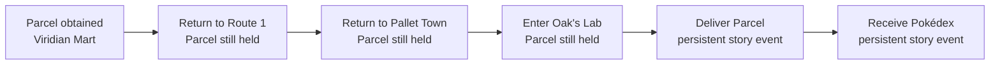
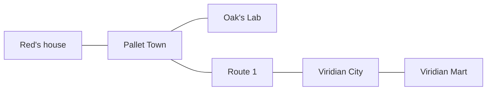

# Version 5.1: learning that progress sometimes points backward

## The problem this version exists to test

Version 5 reached the Viridian Mart and obtained Oak's Parcel, but exposed a structural reward
error immediately afterward. The agent's next correct move was to reverse a route it had already
traveled: leave the Mart, cross Viridian City, walk south through Route 1, return to Pallet Town,
and enter Oak's Lab. The trainer still paid its expired “approach the Mart” lesson after the Parcel
was obtained. Novel positions were also generally more valuable than familiar ground.

That made the experiment teach two incompatible ideas:

- the explicit story goal said to deliver the Parcel to Oak; and
- the dense reward said that returning toward the Mart and seeking unfamiliar tiles was progress.

This is not a one-off Oak's Parcel problem. Pokémon Red repeatedly asks the player to revisit
places, carry items back to earlier characters, heal, leave a dungeon by a known route, and return
after acquiring a field move. A system that equates “new” with “good” cannot reliably finish the
game. Version 5.1 therefore tests a more general proposition:

> Can a learning system distinguish exploration from goal-directed return, and reuse a route in
> both directions without being paid to oscillate on it?

## Preserved Version-5 evidence

The Version-5 run stopped cleanly on 2026-07-20 after 1,390,596 combined actions, 1,358 PPO updates,
723 episodes, and 5,862.825 seconds. It produced three replay-verified promotions and ended at
`obtained_oaks_parcel`, canonical milestone 10. The two new promotions occurred close together:

| Verified event | Combined action | Local time (EDT) | Complete lineage depth |
| --- | ---: | --- | ---: |
| Entered the Viridian Poke Mart | 619,660 | 3:57:16 PM | 9,164 actions |
| Obtained Oak's Parcel | 619,956 | 3:57:45 PM | 9,238 actions |

The finished checkpoint's model SHA-256 is
`65b11c5c1df2445d46b1e901b3381fbdd2eaeec34659a7738586720bc7fbe816`; the saved model and all four
worker novelty memories matched their declared terminal hashes. This evidence remains valid under
its original Version-5 protocol. Version 5.1 imports the verified curriculum but deliberately does
not resume Version-5 PPO weights under a changed observation and reward objective.

## The Version-5 reward bug

The final Version-5 ledger contained 2,774.75 points of Mart-approach credit even though only
923.00 had accumulated when the Parcel was first obtained. That means 1,851.75 additional points
were paid after the lesson had already been completed. The reward was bounded within an episode,
so it was not an infinite single-episode exploit, but it was not gated to the active goal across
the run.

This distinction matters. A reward can be locally non-farmable and still be globally obsolete.
The correction is not “make the number smaller”; it is “make the reward conditional on the lesson
that currently owns it.”

## The new task structure

Version 5.1 inserts three replay-verifiable checkpoints between obtaining and delivering the
Parcel:

1. `returned_to_route_1_with_parcel`
2. `returned_to_pallet_town_with_parcel`
3. `entered_oaks_lab_with_parcel`

Each checkpoint requires both the destination map and Oak's Parcel in the bag. Merely revisiting
Route 1 or Pallet Town earlier in the game cannot trigger a false return milestone. Delivering the
Parcel and receiving the Pokédex remain later story outcomes. If the game jumps directly to a
stronger persistent event, the monotonic referee may still recognize that later truth; the micro-
milestones exist to make the ordinary route learnable and visible, not to weaken the evidence gate.

## Active-goal reward ownership

Every local lesson now has an owner:

- Mart doorway distance is active only while the verified frontier is Viridian City and the next
  lesson is entering the Mart.
- Mart dialogue-stage progress is active only after the Mart has been entered and before the Parcel
  is obtained.
- Once the Parcel is obtained, both Mart lessons expire. Returning to their trigger states pays
  nothing.

The general rule is: **a completed lesson cannot continue voting on later behavior.** This becomes
the template for future dialogue, fetch, navigation, and battle shaping.

## Bidirectional route memory

The assisted teacher has two sources of topological knowledge:

- certified edges already present in a replay-verified curriculum lineage; and
- map transitions observed by that worker during training.

An already demonstrated edge may be considered in both directions for route guidance. This is a
training scaffold, not a claim that every Pokémon warp is physically reversible; incorrect future
assumptions must be corrected by observed evidence. The initial certified graph contains only the
opening transitions already demonstrated through the Parcel:

The assisted actor receives the current map, active goal, next map on the shortest known route,
and bounded route distance. It still chooses every controller action. It does not receive a tile-
by-tile solution, collision map, future route graph, target button, or emulator write access.

## Reward without oscillation profit

Map-level guidance uses a signed potential change. If the known distance to the active goal falls
from two map transitions to one, the trainer pays eight raw points. Moving back from one to two
removes eight points. A complete back-and-forth cycle therefore has zero net route reward.

This is intentionally different from “pay whenever closer than before.” The signed formulation
allows necessary retreat to be represented honestly while preventing a loop from creating return:

`route reward = 8 × (previous known distance − current known distance)`

Entering the target map changes the canonical milestone and is paid by the ordinary named-
milestone reward. The potential is reset for the next goal so a single transition is not counted
twice under two lessons.

## Goal-aware stagnation

The visual watchdog still cuts short tight screen cycles and very long intervals without useful
progress. It now also treats a decrease in known route distance as useful progress. Familiar map
tiles are therefore allowed to matter when they are carrying the agent toward the current task.
The watchdog remains trainer-only and cannot choose buttons or restore state.

## What Version 5.1 does not solve

This version is a reusable opening-game mechanism, not a complete hierarchical Pokémon player.
It does not yet provide:

- automatic extraction of every future quest from game text;
- a learned planner choosing among competing long-term objectives;
- hindsight experience replay for arbitrary achieved goals;
- proven bidirectional execution of every discovered map edge;
- pixels-only access to the teacher's route scaffold; or
- a frozen, restore-free power-on completion result.

The intended progression remains: assisted teacher discovers and verifies trajectories, a student
learns from those trajectories with progressively fewer aids, then a frozen student takes a clean
power-on exam. Version 5.1 is successful if it makes return behavior learnable and measurable. It
is not successful merely because its curriculum checkpoint can be loaded near the destination.

## Long-run result

Version 5.1 answered its central behavioral question positively. It reached Pallet Town with the
Parcel at action 105,760, entered Oak's Lab at 123,068, and received the Pokédex at 402,320. The
run ended cleanly after 3,437,572 actions, 3,357 updates, and 1,900 episodes with six verified
promotions and no verification failures. Its complete verified lineage reached 10,819 actions.

The result also exposed the next limit. After the Pokédex, 3,035,252 additional actions produced no
Viridian Forest promotion. Only 305 additional global positions were found, and all 1,900 episodes
ended as either long stagnation (1,241) or a visual cycle (659). The model and four worker memories
matched their terminal hashes.

This makes Version 5.1 a successful backtracking experiment and an unsuccessful general
post-Pokédex curriculum. It is closed, not abandoned. Version 5.2 preserves its verified lessons
and decomposes the road through Viridian Forest and Pewter Gym. See
[Version 5.2: from one solved errand to the road to Brock](version-5-2-northbound.md).

## Falsifiable run questions

The next run should answer these in order:

1. Does net active-route credit become positive without large alternating positive/negative churn?
2. Does at least one worker leave the Mart and reach Route 1 while still holding the Parcel?
3. Does that candidate pass one parent-edge replay and three full power-on replays?
4. After promotion, can the same policy reach Pallet Town and Oak's Lab under the new active goals?
5. Does expired Mart credit remain exactly unchanged after the Parcel frontier is loaded?
6. Do the three return lessons reduce episode count or actions-to-promotion relative to Version 5?
7. If progress still plateaus, is the failure local tile navigation, dialogue interaction, battle
   interruption, or route selection? The dashboard and narrative ledger must distinguish them.

## Engineering canary

The first four-worker real-ROM canary completed its exact 8,192-action limit in 34.705 seconds
(236.05 combined actions per second) and eight PPO rollout updates. It imported all 21 Version-5
curriculum entries and retained Oak's Parcel plus all three verified promotions. The active lesson
was `returned_to_route_1_with_parcel`.

The reward ledger recorded +24.00 net active-route credit, five newly observed maps, eight new
warps, and 387 worker-reported new positions. Neither `mart_approach` nor
`mart_dialogue_progress` appeared after the Parcel frontier was loaded. Three visual cycles were
terminated, no candidate failed verification, and no new milestone was claimed. The final PPO
archive and all four novelty memories matched their checkpoint hashes.

This qualifies curriculum migration, the expanded observation, fresh warm start, route reward,
dashboard, optimizer, checkpoint, and clean action-limit shutdown. It does not qualify the return
behavior; the canary was deliberately too short to use “no Route 1 promotion” as performance
evidence.

## Video narrative

The central beat is not “the AI forgot where Oak lives.” It is subtler and more useful:

> We taught the AI that progress meant novelty, then Pokémon asked it to do the opposite.

The Parcel is the first moment where the game's structure challenges the reward designer rather
than only the policy. The model did what the numbers encouraged. Version 5.1 is the moment the
project stops treating backtracking as wasted motion and starts representing intent. A useful
visual is a route line from Pallet to Viridian turning around after the Parcel, while two meters
separate *novelty* from *distance to the current goal*. The former falls; the latter improves.

The honest ending depends on evidence. If the return succeeds, the takeaway is that explicit task
state and route reuse converted a contradiction into a composable skill. If it fails, the return
milestones still isolate which missing skill comes next. Either result advances the project because
the failure can no longer hide inside one undifferentiated “no progress” counter.
