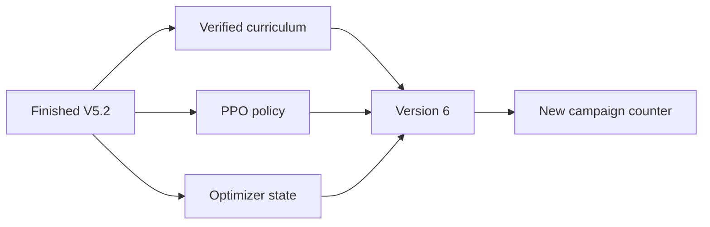
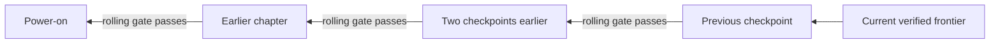

# Version 6: make one policy remember the journey

## The premise changed again

Versions 4 through 5.2 produced real replay-verified progress. They also revealed that the project
was measuring two different accomplishments with one word:

1. **Discovery:** some training branch found a new state and its recorded action lineage replayed.
2. **Competence:** the current policy can reproduce several learned segments in sequence.

The verifier measured discovery extremely well. It did not require competence. A new PPO version
usually began from the same Frontier Apprentice visual seed rather than the previous PPO policy.
Training restored the newest curriculum checkpoint 90 percent of the time. When a worker found the
next milestone, the archive preserved its buttons and emulator state. Three complete power-on
replays proved that the *recorded lineage* was valid, but those replays did not ask the current
neural policy to choose those buttons.

The result looked exactly like the observed behavior: each explicit lesson could eventually pass,
while the model struggled to combine lessons without another checkpoint or reward change.

Version 6 changes the unit of progress:

> A newly discovered segment is useful evidence, but the training start must move backward until
> the same retained policy can traverse the combined journey.

## What carries forward now

Version 6 imports two different artifacts from one cleanly finished predecessor:

- the replay-verified private curriculum; and
- the actual recurrent PPO policy **plus its optimizer state**.

The source must be a cleanly finished Version-5.2-or-later run. Its terminal action count, actor
mode, training shape, and model SHA-256 must agree across the status, checkpoint, manifest, and
model file. Mode, rollout length, batch size, epochs, learning rate, gamma, and entropy coefficient
must remain compatible. A failed, running, corrupt, or differently shaped source is rejected.

The new campaign receives a fresh action counter and budget. The inherited policy's historical
action count is retained as provenance but cannot shorten the successor run.

This is transfer learning from the project's own prior policy, not a human demonstration or an
external walkthrough. The manifest records the source run, protocol, terminal action count,
frontier, file hash, optimizer retention, and counter reset.

## The backward competence gate

Every training episode is assigned one of two roles:

- **Frontier practice:** begin at the newest verified milestone and search for the next discovery.
- **Consolidation practice:** begin at the active earlier checkpoint and try to reach the current
  verified frontier with the retained policy.

Only consolidation episodes count toward composition. Starting at the target itself is never a
success. Each episode records its start mode, starting milestone index, fixed target index, and
furthest outcome reached.

The first consolidation start is the verified checkpoint immediately before the current frontier.
When the rolling window meets its declared threshold, the start moves one available checkpoint
backward. The target does not move. This repeats until training begins at power-on.

If a frontier episode discovers and verifies a new milestone, that new milestone becomes the
target and the active start becomes the old frontier. The model first learns the new edge, then
must work backward again. Earlier gate evidence remains in the ledger but is not treated as proof
for the longer target.

The planned production gate is eight successes in the latest ten consolidation attempts. This is
a **training competence gate**, not a frozen evaluation. PPO updates still occur during these
episodes. A separate frozen, restore-free exam remains necessary for the final claim.

## Why this is different from more slices

Micro-milestones remain useful for diagnosis and discovery. Version 6 prevents them from becoming
the permanent definition of learning:

| Earlier system | Version 6 |
| --- | --- |
| Usually restart PPO from the apprentice seed | Retain the previous PPO policy and optimizer |
| Restore newest checkpoint 90% of the time | Split compute between frontier and composition |
| Promotion proves a recorded action lineage | Promotion still proves discovery; rolling gates measure policy traversal |
| No requirement to replay prior skills | Start expands backward after competence |
| One “best milestone” meter | Separate discovery frontier and consolidation start/target/window |

The archive can still progress before the model consolidates. That difference is shown rather than
hidden. A run might report “Forest discovered, consolidated only from Route 1.” That is more honest
and more informative than one undifferentiated milestone number.

## What the actor receives

The actor information boundary is unchanged from V5.2:

- two processed screen frames;
- its three most recent actions;
- episodic visited/current map memory;
- active goal and coarse skill label; and
- next map plus bounded distance from the declared trainer topology.

The actor does not receive the consolidation success flag, emulator snapshot bytes, the verified
lineage's future buttons, a target tile, collision map, menu command, or memory-writing access.
The scheduler may choose a checkpoint because this is an assisted training system. It cannot choose
the policy's next action.

## What is—and is not—whole-lineage learning

Version 6's first stage rehearses the whole accumulated task by starting progressively earlier and
letting PPO act. It does not yet apply supervised behavioral cloning to every historical lineage
action. The verified lineages remain available for a later auxiliary imitation phase, but adding
that loss safely requires explicit recurrent-state, goal-label, and action-alignment tests.

This distinction is intentional:

- **Implemented now:** retain weights, retain optimizer, rehearse combined spans, expand backward,
  report rolling training competence, hash-bind scheduler state.
- **Next compatible addition:** replay verified lineages into a goal-conditioned offline dataset,
  add an imitation loss, and compare retained-PPO-only against retained-PPO-plus-imitation.
- **Still required:** frozen attempts from earlier starts and eventually clean power-on.

## Crash and resume integrity

The consolidation ledger is an atomic JSON artifact containing:

- available verified milestone indices;
- current target and active start;
- rolling window size and threshold;
- attempts, successes, and best reached index for every start→target gate;
- every passed backward gate; and
- whether the power-on training gate has passed.

Every PPO checkpoint stores the ledger's SHA-256 beside the model and four novelty-memory hashes.
Resume fails if any of these artifacts disagree. Environment processes read the atomic ledger only
when choosing a new episode, so an in-flight episode keeps the start and target it declared at
reset.

## Dashboard and narrative

The living dashboard adds four separate cards:

- consolidation start;
- consolidation target;
- rolling successes/attempts; and
- backward gates passed.

Hourly narrative chapters record the same fields. Reward, battle, loop, and discovery metrics stay
visible, but none substitutes for the competence window.

## Engineering evidence

The implementation passed 180 tests with the supported private ROM. Focused regressions prove that:

- frontier practice cannot count as competence;
- a gate advances only after the complete rolling threshold;
- the start moves exactly one available verified rung backward;
- a new promotion resets the target to the new frontier and the start to the old frontier;
- power-on training passage is explicit;
- persisted consolidation state round-trips;
- corrupt or running policy sources fail closed;
- incompatible actor/training shapes fail closed; and
- a retained fresh campaign receives its full new action budget.

### Preserved failed canary

The first V6 canary retained an 8,192-action V5.2 source correctly but stopped after one 1,024-action
rollout. The new budget had been calculated before Stable-Baselines reset the inherited timestep
counter, so the predecessor's 8,192 actions were mistakenly subtracted from the successor's 8,192-
action ceiling.

The run is preserved as a failed engineering attempt. The correction distinguishes two cases:

- a true resume receives only its remaining budget; and
- a new retained-policy campaign receives its entire declared budget.

A regression test freezes this boundary.

### Corrected canary

The corrected four-worker canary completed exactly 8,192 actions and eight PPO updates at 202.73
combined actions per second. It retained the V5.2 policy and optimizer, reset the campaign counter,
wrote all four live frames, and ended at the action limit with zero promotion failures.

Its terminal model, four novelty memories, and consolidation ledger all matched their checkpoint
hashes. Two episodes began from the active consolidation checkpoint, `entered_oaks_lab_with_parcel`,
with Pokédex index 15 as the target. One reached the target and one did not, producing an honest
rolling result of 1/2. The shortened canary gate required 3/4, so it did not advance. Frontier
episodes were excluded as designed.

This qualifies wiring and accounting, not robust combined competence.

### First declared long run

V5.2 closed cleanly at 5,354,500 actions, 5,229 PPO updates, 3,146 episodes, and eight verified
promotions with zero replay failures. It had promoted Route 1 at action 707,472, so more than four
million subsequent actions failed to reach Viridian City. Its terminal model and four worker
novelty memories matched their checkpoint hashes. This is the predecessor denominator, not a
hand-picked early checkpoint.

The first declared V6 campaign began from that exact policy and optimizer with four simultaneous
workers, a 24-hour duration, a 150-million-action ceiling, a 50/50 frontier-to-consolidation episode
split, and the production 8/10 rolling gate. Its initial target is Route 1 and its first earlier
start is `left_oaks_lab_with_pokedex`.

The first heartbeat at 20,484 new actions reported 20 PPO updates at 222.49 combined actions per
second, all four live frames, six completed episodes, and zero replay failures. Three episodes
entered the consolidation window; none reached Route 1. This is not called regression or success
yet. It is the first direct measurement of the exact capability earlier versions never required.

## Production questions

The first long consolidation run should answer:

1. Does retained V5.2 behavior improve the current Route 1→Viridian problem without rediscovery?
2. Can the policy pass 8/10 from the immediately preceding checkpoint?
3. After the start moves backward, does performance collapse or recover?
4. How many PPO actions does each backward rung require?
5. Do earlier skills degrade while frontier reward rises?
6. Does the policy reach the current frontier from the Parcel, starter, house, and power-on states?
7. Do new discoveries reset consolidation in a controlled way?
8. Does a later frozen policy reproduce any passed training gate without updates?

## Claim boundary

Version 6 can establish that one continuously retained policy is improving across progressively
longer checkpoint-restored spans. It cannot by itself establish autonomous play from the beginning.

The evidence ladder is now:

1. **Discovered:** recorded candidate passed exact replay admission.
2. **Consolidated in training:** retained policy passed the rolling earlier-start gate while updates
   were enabled.
3. **Frozen local competence:** fixed policy passed repeated attempts from that earlier snapshot.
4. **Frozen power-on competence:** fixed policy completed the declared objective from power-on with
   no restores or updates.
5. **Hall of Fame:** the same frozen power-on standard reaches the completion condition.

## Narrative beat

The honest line for the video is:

> We had taught the archive to beat Pokémon. We had not yet taught one brain to remember how.

Show the verified lineage as a chain assembled from differently colored fragments. Then replace it
with one continuous policy line. Move the training start leftward only when the rolling competence
meter passes. The audience can see three truths simultaneously: the furthest place ever discovered,
how far back the current model is rehearsing, and whether it can reliably connect the two.

This turns the apparent weakness—“you keep prodding it through little slices”—into the next central
experiment. The slices remain the textbook. Version 6 finally tests whether one student can retain
the whole lesson.
