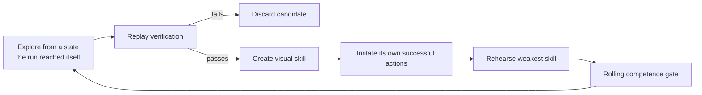

# Version 7: let a new player teach itself

Version 7 is an architectural and philosophical reset.

> **Denominator note, 2026-07-21:** the active V7 long run continues under this exact protocol.
> Version 8 is implemented and qualified separately at the mechanism level; it does not modify
> V7's running process, raw datasets, shared PPO/self-imitation network, scheduler, or declared
> result. This preserves a real comparison instead of upgrading the baseline after observing it. See
> [Version 8: separate discovery from learning](version-8-distilled-student.md).

At `2026-07-21T17:29:11Z`, this unchanged run's live snapshot was 6,466,564 actions, Route 1,
seven discoveries, zero competent skills, 19/1,274 rehearsals, and 66,560 imitation examples. It is
an interim denominator, not the terminal V7 result.

Final-audit compatibility rules protect that active run. V8-only controls are omitted from V7's
serialized configuration so its saved config still matches the format with which it launched. If
a legacy manifest lacks explicit ROM identity, resume backfills the identity only after verifying
the supplied ROM and does not rewrite the manifest's recorded source provenance.

V7's historical stagnation watchdog is a disclosed limitation: it can treat authored route
distance, milestone index, and Viridian Mart script as useful progress for termination timing.
Those values do not enter the actor or choose a button, but the watchdog boundary is not fully
blind. V7 retains this behavior so resume does not silently change the live denominator. V8 removes
the channel instead of retroactively improving V7.

The project originally asked whether an agent could encounter Pokémon Red without being told how
to play. Successive versions drifted toward a different experiment: a trainer named the next
problem, restored a nearby checkpoint, added a reward for that problem, and waited for PPO to solve
one more slice. Those experiments were useful, but continuing the same pattern would no longer
answer the original question.

V7 asks:

> Can a randomly initialized agent explore from power-on, remember only what it discovered itself,
> turn reproducible discoveries into reusable skills, and eventually compose those skills without
> a human playthrough or walkthrough?

The Hall of Fame remains the final objective. V7 does not claim that it is already likely or close.
It creates a learning loop whose successes would actually support that claim.

## What "like a new player" means

The phrase is not treated as marketing language. It is an information contract.

The V7 policy may receive:

- the current 72×80 processed game screen;
- the previous processed screen;
- its own three most recent button choices;
- during rehearsal, the final screen of a state this same run previously reached; and
- recurrent neural state accumulated during the current episode.

The V7 policy may not receive:

- a human or scripted playthrough;
- action sequences imported from an earlier agent;
- neural weights imported from an earlier agent;
- a walkthrough, quest graph, or declared next map;
- target coordinates or collision maps;
- a semantic goal or skill label;
- RAM state, event flags, map identifiers, battle state, or menu state;
- a scripted recovery button; or
- emulator writes that advance the game.

The sealed trainer may read RAM to grade consequences, detect loops, verify deterministic replay,
and decide whether a self-generated transition is durable. Those values never enter the policy.

This is not identical to a biological human. A person arrives with vision, language, motor priors,
and experience with games. V7 begins with random neural parameters. Save-state rehearsal is a
training accelerator analogous to deliberate practice, not evidence of clean-start mastery.

## The central change

Earlier PPO versions tried to make one reward function teach every behavior. V7 separates four
jobs:

### 1. Open exploration

When no skill exists, every worker begins at the unique clean power-on snapshot. The recurrent PPO
policy is initialized randomly. It receives general consequence feedback for novel screens and
durable game changes, but no reward for the next authored story milestone.

After discoveries exist, a declared fraction of episodes continues exploring from the furthest
self-generated verified frontier. Exploration prevents the library from becoming a closed set of
memorized opening actions.

### 2. Replay verification

A named milestone is a sealed referee watchpoint, not an actor instruction. When the run appears to
reach a new watchpoint, the exact candidate edge must replay from its parent and the complete action
lineage must replay three times from power-on.

Failure creates no skill. A screen that merely looks promising cannot enter training.

### 3. Self-generated visual skills

Every admitted transition produces:

- the verified source snapshot;
- the terminal screen, processed exactly as the actor sees it;
- the run's own button sequence;
- the exact observation/action training examples reconstructed by replay; and
- hashes for the target image and compressed training data.

The terminal screen becomes the goal representation. The actor never receives the referee's label
for that state. It learns an option of the form "from this situation, make the screen become like
this previously observed screen."

### 4. Direct self-imitation

PPO can fail to assign useful credit across hundreds or thousands of actions. Once an action
sequence has passed replay, V7 no longer asks PPO to rediscover why it was valuable. It directly
increases the likelihood of the successful actions under the recurrent policy.

Training uses only this run's own verified examples. Up to eight skills are balanced into each
self-imitation pass so a later discovery cannot silently erase the opening.

Self-imitation does not prove competence. It creates a hypothesis that rehearsal must test.

## The small hierarchy

V7 has two levels:

1. a scheduler chooses open exploration or the weakest self-discovered visual skill; and
2. one recurrent visual policy chooses Game Boy buttons.

The scheduler does not know a solution route. It can select only goals already discovered by this
run. Skills that have not passed their rolling competence window receive priority over skills that
have.

This is deliberately smaller than a hand-authored library of navigation, battle, and menu modules.
If V7 later discovers stable clusters of visual skills, those clusters may justify learned specialist
heads. They will not be declared in advance merely because a human knows that Pokémon contains
battles and menus.

## General feedback versus authored directions

The trainer retains general, non-repeatable feedback for:

- first visits to maps, positions, and warps;
- first event-bit changes;
- new items, moves, party members, species, levels, and experience;
- opponent damage and durable battle success;
- badges;
- blackouts, repeated actions, and visual loops.

V7 explicitly zeroes:

- named-milestone reward;
- Mart approach and dialogue reward;
- active-route progress;
- declared next-map guidance; and
- navigation-recovery credit tied to an authored landmark goal.

The referee still reports watchpoints so results remain comparable with earlier versions. A
watchpoint's label does not enter the observation or reward.

## Starting clean

V7 may use an earlier finished run only as an integrity-checked container for the supported clean
power-on snapshot. During initialization it:

1. imports the verified private curriculum;
2. locates the unique index-zero root;
3. deletes every inherited later entry;
4. resets the best milestone and promotion count to power-on; and
5. records how many inherited entries were discarded.

The model manifest records `random_untrained_policy`, zero imported parameters, zero imported
actions, an empty human-demonstration list, and the power-on-only flag.

## Competence and final evidence

Each skill maintains a rolling success window. A skill becomes training-competent only after at
least eight successes in its latest ten rehearsal attempts. Frontier exploration never enters this
window.

The evidence ladder is:

1. **Discovered:** the run reached a new state once.
2. **Replay verified:** the exact self-generated lineage reproduced it.
3. **Self-imitated:** direct policy updates used the verified examples.
4. **Training competent:** the active policy passed the 8/10 rehearsal window.
5. **Frozen skill competent:** a fixed policy passed repeated attempts without updates.
6. **Frozen clean-start composition:** one fixed policy connected multiple skills from power-on.
7. **Hall of Fame:** the same frozen clean-start rule completed the game.

Only the final two levels answer whether the agent can play continuously from the beginning.

## Dashboard and narrative

The V7 dashboard adds:

- self-discovered skill count;
- competent skill count;
- weakest active skill;
- its rolling success window;
- total self-imitation examples; and
- the unchanged live screens for every worker.

The manifest and dashboard print the actor boundary in plain language. Hourly chapters preserve
discoveries, imitation work, competence, failures, battle outcomes, loops, and action throughput.

## Engineering evidence

The implementation passed 188 tests with the supported private ROM. New checks cover:

- the random/power-on-only configuration gate;
- target-screen feature dimensions;
- a real recurrent-policy gradient update from a self-generated dataset;
- empty-library exploration;
- admission of verified skills;
- rolling competence;
- weakest-skill scheduling;
- persistence and imitation accounting;
- restart-safe pending self-imitation state;
- checkpoint-specific ledger rollback when live bookkeeping moves ahead of the saved model; and
- the existing replay, checkpoint, privacy, documentation, and ROM integration suite.

## First real-ROM canary

The first four-worker V7 canary began with random neural parameters and a power-on-only curriculum.
It explicitly discarded 25 inherited later entries and imported no actions or model parameters.

In 8,192 actions and 47.747 seconds it:

- completed eight PPO updates at 171.57 combined actions per second while V6 was also running;
- replay-verified `game_started` and `left_bedroom`;
- created two self-generated visual skills from 326- and 409-action edges;
- applied eight direct self-imitation updates over 2,048 examples;
- completed one rehearsal of the ground-floor skill successfully;
- visited 77 distinct reported positions;
- recorded zero promotion failures; and
- ended exactly at its declared action ceiling.

The terminal model, self-skill ledger, two compressed datasets, two target images, and four novelty
memories matched their recorded hashes.

This canary qualifies the complete learning loop. It does not establish 8/10 competence, robustness,
or progression beyond the house.

The first longer-launch preflight then reached starter selection with five verified self-generated
skills in 41,256 actions. It was deliberately stopped when a durability audit found that the live
skill ledger could advance after the most recent model checkpoint. V7 now freezes a separate ledger
copy with every model checkpoint and restores that exact pair after interruption. The preflight is
preserved as mechanism evidence, not relabeled as the overnight trial.

## What would falsify the approach

V7 should be rejected or redesigned if a long run shows any of these patterns:

- discoveries increase while self-generated skill competence remains near zero;
- imitation loss decreases but rehearsal success does not improve;
- later skills erase previously competent skills;
- workers exploit generic novelty without producing durable transitions;
- the visual target fails to disambiguate conflicting actions;
- clean-start frozen exams remain flat while checkpoint rehearsal rises; or
- meaningful progress still requires a human-authored reward for each new obstacle.

Those are architectural failures, not invitations to add one more local reward.

## Realistic expectation

V7 makes full-game learning more coherent, not easy. A random visual agent may still require enormous
experience to discover rare menu sequences, Cut, dungeon exits, battle strategy, and late-game
quests. Four local workers are far below research-cluster scale.

The honest claim is narrower:

> If this project eventually reaches the Hall of Fame, V7 provides a path by which the agent can
> genuinely teach itself rather than inherit a human solution or receive a new handcrafted nudge at
> every obstacle.

## Video narrative

The turning point is not another success montage. It is the admission that the experiment drifted.

> We wanted to watch a machine learn a game. Instead, we slowly became its walkthrough.

Show V6's transition window rising from 0/10 to 5/10 but failing its 8/10 gate beside the growing
stack of reward patches. Then erase the route
graph, imported model, and inherited curriculum. Leave one power-on screen and random weights.

The first V7 canary supplies the next beat: without a demonstration, it starts the game, reaches the
ground floor, saves those discoveries as its own visual memories, and trains on what it—not a human—
did correctly.

That is not the ending. It is the moment the original experiment begins again with better tools.

## The successor question

V7 deliberately makes one recurrent network explore and imitate. It also preserves every action in
a verified edge as a training target. Those are testable choices, not permanent definitions of
self-teaching. V8 keeps V7's source-of-knowledge rule while asking whether replay can remove
unnecessary loops and whether a separate recurrent Student can retain the result without later PPO
updates overwriting it.

Until V8 passes its qualification and frozen attempts, this is a hypothesis rather than an
improvement. V7's complete denominator—including failed skills, raw action counts, forgetting, and
compute—remains part of the final report either way.
