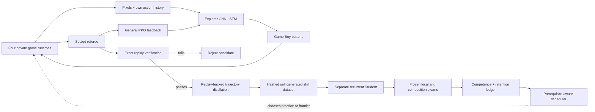
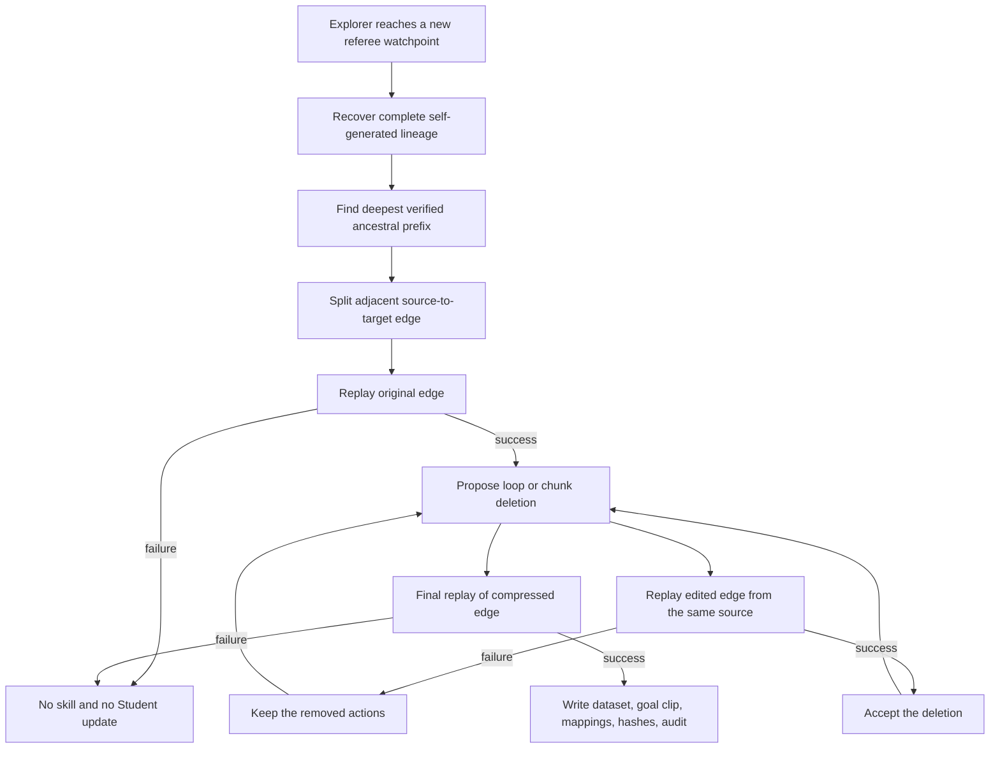

# Version 8: separate discovery from learning

Version 8 is the engineering successor to Version 7's self-taught experiment. It does not restore a
human route, a scripted planner, or the assisted lesson graph. It keeps the new-player premise and
changes the machinery used to remember an earned success.

> **Status on 2026-07-21:** the V8 implementation has passed its first real-ROM mechanism and clean
> stop/resume canary. One trivial `game_started` skill exercised self-generated distillation, the
> separate Student optimizer, frozen local exams, power-on composition, and hash-bound resume. This
> validates the pipeline, not useful learning: the run did not reach later gameplay, did not compare
> against chance, and did not establish that Student training caused its successes. Its repeated
> 2/2 local attempts came from one deterministic Student version and are now explicitly superseded
> as a robustness measure. Current V8 permits exactly one deterministic grade per Student
> checkpoint. The
> already-running V7 trial remains untouched as the denominator. Its final result must be reported
> under V7's original rules, even if V8 later performs better.

The central question is:

> Can noisy exploration produce its own lessons, can replay remove the accidental wandering from
> those lessons, and can a separate recurrent student turn them into reliable behavior without
> ever seeing a human solution?

The Hall of Fame is still the north star. V8 is not a claim that the game is solved, or even that
this architecture will solve it. It is an attempt to make the route from accident to competence
testable.

## Why V7 is not simply being allowed to run forever

V7 corrected the largest philosophical drift in the project. It started from random parameters
and power-on, imported no action sequence or model, and created visual skills only from transitions
the same run replay-verified. That is the right source of experience for this experiment.

Its mechanism still combines jobs that can work against one another:

1. one recurrent PPO network explores, including many deliberately noisy and unsuccessful actions;
2. the same network directly imitates a newly verified action sequence;
3. later PPO updates can immediately move those imitated probabilities again;
4. the stored sequence can contain loops, stalls, menu detours, and lucky corrections that were
   unnecessary to the outcome; and
5. a single terminal image can be an ambiguous description of a temporally complex goal.

A successful V7 replay proves that an action lineage worked. It does not prove that every action in
the lineage was useful training data. A falling imitation loss also does not prove that the policy
can reproduce the skill after its weights are frozen.

V8 therefore treats V7 as a required denominator, not an embarrassing draft to overwrite. The V7
run answers what happens when exploration and self-imitation share one continually changing
network and train on minimally processed verified traces. V8 asks whether role separation,
replay-backed compression, temporal goals, sequence-aware training, and real exams improve that
result.

## The two learners

V8 uses two neural policies with identical action and visual interfaces but different authority.

| Component | Job | How its parameters change | What may train it | What it cannot do |
| --- | --- | --- | --- | --- |
| **Explorer** | Discover new consequences in four simultaneous games | Recurrent PPO from open-play rollouts | General novelty and durable-consequence feedback under the V7 information boundary | Mark a skill competent or overwrite the Student |
| **Student** | Reproduce and retain verified discoveries | Recurrent sequence imitation with a separate optimizer | Only replay-verified, self-generated, distilled trajectories | Explore into the archive, receive PPO gradients, or learn from a human route |
| **Replay verifier** | Decide whether a discovery or proposed edit still works | No learned parameters | Private emulator state and the sealed progress referee | Choose a live controller action |
| **Scheduler/examiner** | Allocate practice and run frozen exams | Persistent declared rules | The self-generated prerequisite graph and recorded exam outcomes | Reveal semantic labels, coordinates, or a walkthrough to either policy |

This is not an actor ensemble. The Explorer and Student do not take turns pressing buttons during
one evaluation. Explorer gameplay creates candidate experience. Student exams measure whether a
separate policy learned that experience. A future end-to-end claim must name exactly which frozen
policy acted for the complete attempt.

## The information contract

### What the Explorer may receive

- the current and previous processed 72×80 game frames;
- its own three most recent action choices;
- recurrent state accumulated since the episode reset; and
- a zero visual-goal tensor during open exploration.

### What the Student may receive

- the same processed current and previous frames;
- its own three most recent action choices;
- its own recurrent state; and
- a short visual clip taken from the end of a transition that this run discovered and verified.

The clip is pixels, not a label such as `deliver_parcel`, a coordinate, a map ID, or an instruction.
Using several adjacent terminal frames is meant to distinguish motion or dialogue state that one
still image can collapse. It does not guarantee that every goal is visually identifiable.

### What remains trainer-only

The sealed trainer may read declared RAM fields to detect durable outcomes, identify candidate
milestone boundaries, compare states, reject false visual matches, schedule already discovered
prerequisites, restore training snapshots, and grade exams. It may also use trainer-only state
signatures to propose removable loops. Those values never enter either neural observation.

Restore-free composition is nevertheless **goal-conditioned hierarchical control**, not unaided
pixel-only autonomy. During that exam, the trainer reads the declared milestone referee to decide
when to replace the Student's current self-generated target clip with the next clip in an ordered
playlist. The playlist contains only transitions this run discovered, and the trainer supplies no
authored quest direction or controller action, but its RAM-triggered goal switch is real control
structure and belongs in every completion claim.

The V8 stagnation watchdog is intentionally less informed than the assisted lanes.
It may reset its timer for new positions and general durable consequences such as experience,
items, Pokédex ownership, badges, or battle progress. It does **not** consult authored route
distance, the canonical milestone index, or the Viridian Mart script. Those fields remain available
to the sealed verifier for post-action grading, but they cannot tell a blind Explorer that it is
moving toward a human-written next task.

The reward path has the same narrow intent. V8 sets authored navigation, recovery, milestone, and
Mart reward weights to zero; with those navigation/Mart weights disabled, the tracker does not call
the authored `route_guidance` or `active_goal` systems and skips Mart-distance and Mart-script
calculations. General novelty and durable-consequence feedback remains trainer-only.

This correction is not retroactive. V7 intentionally retains its historical route-distance,
milestone-index, and Mart-script termination shaping so the live denominator can resume with the
same serialized configuration and behavior. V7 therefore remains self-generated at the action and
demonstration boundary but is not fully blind at the trainer-side watchdog boundary.

### What V8 still forbids

- human demonstrations or manual controller traces;
- action sequences from V1–V7 or from another project;
- predecessor neural parameters;
- a walkthrough, authored quest plan, or full map graph;
- target coordinates, collision tiles, RAM observations, or semantic goal text;
- scripted recovery actions;
- an external model choosing buttons; and
- game-memory writes that manufacture progress.

Calling V8 **self-taught** means that all positive action examples came from this run. It does not
mean that the experiment is free of structure. The action set, neural architecture, reward family,
replay rules, milestone referee, compression algorithm, training starts, and exam protocol are all
human-designed and must remain visible in the report.

## How an accident becomes a lesson

Every candidate passes through a fail-closed chain.

### 1. Use the nearest verified prefix

A later discovery may share most of its power-on lineage with skills already in the library. V8
finds the deepest replay-verified lineage that is an exact action prefix and creates only the
adjacent edge from that source to the new target. It does not make the Student repeatedly imitate
the entire opening every time one later outcome is found.

This also creates the prerequisite graph. A skill's prerequisite is not inserted because a human
knows the story order. It is inherited from the sequence of transitions the Explorer actually
used. The sealed milestone index is still used to protect success semantics and must be disclosed
as privileged training information.

### 2. Remove replay-verified loops

The compressor records a trainer-only state signature before and after every action. If the same
signature reappears, the intervening actions are a candidate loop. Deleting that interval is only
accepted if a fresh emulator replay from the same source still reaches the protected target.

Signature equality proposes an edit; it never proves the edit safe. This matters because a coarse
signature can miss hidden game state.

### 3. Delete unnecessary chunks

After loop proposals, bounded delta-style reduction tries progressively smaller contiguous action
chunks. Every candidate deletion goes through the same replay oracle. A failed edit is preserved,
not approximated or repaired by a human.

The compressor has fixed attempt budgets so one long trajectory cannot consume unbounded replay
time. Reaching the budget leaves a longer valid lesson; it does not weaken verification.

### 4. Replay the final result

The original edge must pass before editing and the final compressed edge must pass after editing.
If either fails, no Student dataset is admitted. The audit records:

- original and compressed action counts;
- the compression ratio;
- proposed, accepted, and rejected loop deletions;
- proposed, accepted, and rejected chunk deletions;
- oracle-call counts and exhausted budgets;
- compressed-to-original and original-to-compressed mappings; and
- the replay-verification identity and artifact hashes.

Compression is not hindsight route writing. The machine proposes deletions mechanically and the
game judges each proposal. It is still a powerful training transformation, so compressed and raw
counts must always be shown together.

## What enters the Student dataset

For each retained action, replay reconstructs:

- the two-frame pixel observation available before that action;
- the three-action history available at that point;
- the short terminal goal clip;
- the action selected by the Explorer's verified lineage;
- episode boundaries;
- its position in the uncompressed lineage; and
- a uniform loss weight for every retained local action.

The compressor's final replay is the necessity test; V8 does not apply a recency or gamma tilt to
the surviving local actions. Composition examples also use uniform per-action loss weights.
Composition receives additional exposure through explicit replay tickets—one per constituent
skill—not by secretly changing individual action targets or weights.

The private source snapshot and exact replay stream remain local. Public reports contain hashes,
counts, ratios, and sanitized summaries rather than ROM, save-state, or proprietary image data.

## Sequence-aware Student training

A recurrent policy cannot be trained faithfully by shuffling isolated frames. Its decision at
action 300 may depend on memory accumulated over actions 1–299. V8 therefore trains on overlapping
contiguous windows.

Each sampled window has two regions:

1. **burn-in:** preceding observations rebuild the LSTM state without applying action loss; and
2. **training horizon:** the Student predicts the Explorer's retained actions and receives the
   imitation gradient.

The recurrent state is detached at the burn-in boundary. This bounds memory and compute while
preserving more context than single-frame behavior cloning. Short overlapping strides prevent one
arbitrary cut from owning every gradient near a boundary.

Replay sampling is balanced by skill rather than by raw action count. Otherwise one long, noisy
edge could drown out many short early skills. New discoveries enter a continuous replay pool, and
older skills remain eligible after competence so retention can be measured rather than assumed.

The Student has its own optimizer and checkpoint. Explorer PPO never updates Student parameters;
Student imitation never updates Explorer parameters. Checkpoint reports must therefore show two
model hashes and two optimizer histories, not one ambiguous “latest model.”

Training diagnostics include:

- action negative log likelihood;
- action accuracy;
- Student policy entropy;
- entropy of the demonstrated action distribution;
- examples and updates by skill; and
- burn-in versus loss-bearing examples.

These are mechanism measures. High action accuracy can coexist with failed gameplay if the model
has learned an open-loop sequence, if small mistakes compound, or if the visual goal is ambiguous.
Only exams measure competence.

### Admission-time bounded replay shards

The full verified skill dataset is valuable provenance, but repeatedly opening a monolithic NPZ
for every Student round would make memory and I/O grow with the longest skill. V8 therefore makes
the bounded training representation **once, at admission**, while the verified arrays are already
in memory:

1. write and hash the immutable full skill NPZ;
2. divide its loss-bearing action range into disjoint, contiguous chunks of at most 512 examples;
3. prepend up to the configured burn-in length from the preceding chunk to each later shard;
4. write every shard atomically and bind its hash, byte size, source hash, offsets, and counts into
   skill-ledger schema 2; and
5. retain the full NPZ, target PNG, and distillation audit as provenance rather than routine
   Student input.

The owned loss-bearing ranges exactly cover the full source once. Predecessor overlap exists only
to rebuild recurrent state: loss and diagnostics begin at `replay_train_offset`, so an overlap is
never counted as another supervised example. With the V8 campaign defaults, a selected shard owns
at most 512 training examples and stores at most 544 examples after its possible 32-action burn-in
prefix.

Each skill ledger records `replay_shards`, `replay_shard_example_cap`,
`replay_shard_burn_in`, and a persistent `replay_cursor`. Each shard binds its immutable file,
SHA-256, stored bytes, index/count, full-source hash and action count, context start, owned training
start/stop, and context/training/stored example counts. In the ledger, `source_start` and the
explicit `source_context_start` must agree; `source_train_start` and `source_stop` delimit the
owned range. The NPZ repeats those identities as `source_context_start`, `source_train_start`,
`source_train_stop`, source hash/skill/action count, and shard index/count. Routine replay selects
`replay_cursor % shard_count`, hashes and opens exactly that one shard, and never opens the full
skill NPZ, target, or distillation audit. The cursor advances only after Student training and
diagnostics complete successfully, then survives ledger checkpoint/resume. A skill with three
shards therefore selects `0, 1, 2, 0, …` rather than repeatedly favoring its first segment.

This bounds routine memory and reads; it does not pretend the provenance is free. The full source
plus its complete shard set stores the pixels roughly twice, plus small burn-in overlap and
metadata. Resume and a deliberate full audit reread all of it.

### Train the transitions between skills

Independent local edges do not teach the Student what to do when one visual goal ends and the next
begins. Once at least two adjacent skills in a power-on chain are locally competent, V8 proposes a
**self-generated composition replay**:

1. concatenate the replay-distilled action streams in the order this run discovered them;
2. start from the exact power-on snapshot and replay the entire chain without a state restore;
3. at every declared boundary, require the sealed verifier to match that skill's protected target;
4. reject and ledger the proposal if any boundary fails; and
5. only after a complete pass, write a hash-bound composition dataset and audit.

The audit binds the ordered skill IDs, every source dataset and distillation-audit hash, action
offsets, protected boundary results, and the successful continuous power-on replay. The training
array does not copy that ever-growing full prefix. It retains bounded excerpts around each goal
switch: pre-switch burn-in, the switch, and a post-switch learning horizon. Every excerpt declares
its start, preserves continuous action history and recurrent context through the switch, and never
resets hidden state at the boundary. Hidden state does reset between separate excerpts, and the
preceding side supplies the full declared burn-in whenever that neighboring skill is long enough.
Compact per-skill three-frame clips plus per-example goal indices replace an action-sized duplicate
goal tensor.

Only the deepest verified composition is active in Student loading. Earlier composition ledger,
dataset, and audit artifacts remain hash-checked history, while routine Student replay skips them.
Individual skills enter each round through the single immutable shard selected by their persisted
cursor; no full dataset is sampled in memory. Balanced replay gives the active composition one
sampling ticket per constituent skill, and at least half of its draws rotate
deterministically across goal-switch excerpts using a persisted boundary cursor. Training-update
counts follow that expanded sampling cycle rather than the number of files. Together these bounds
keep one long prefix from producing quadratic active training data while preventing its rare
handoffs from vanishing beneath local-skill examples.

The composition ledger makes the two action scales explicit. `action_count` and
`goal_switch_offsets` describe the flattened bounded training excerpts;
`full_action_count` and `full_goal_switch_offsets` describe the continuously verified power-on
stream. `excerpt_offsets` identify resets between retained excerpts, `active` selects the sole
loaded composition, and dataset/audit hashes bind the files. A global
`composition_boundary_cursor` survives resume so rebuilding the replay object cannot repeatedly
favor the first switch.

This trains the Student on the transitions it will face in the composition exam; it does not make
the verified action stream available during that exam.

The focused replay/Student/PPO/dashboard suite passed 61 tests after the final schema tweak, and
the full private-ROM suite passed 246. A successful dataset build proves only that already verified
local actions compose once under
exact replay and are valid training material. It does not prove that the Student can produce the
chain.

### The save/load-stable composition verifier

A real-ROM integration exposed a P0 defect in the original verifier assumption. PyBoy's complete
game-area hash changed after save/load even when the processed visual and every enumerated gameplay
RAM value were identical. Because composition compares a live chain boundary with a separately
loaded protected snapshot, that volatile derived hash rejected valid boundaries.

Composition now requires exact equality of a save/load-stable signature: the processed visual hash,
milestone index, and the enumerated gameplay state and RAM blobs for game start, map and position,
battle, party structure/species/levels/moves/experience/HP, badges, Pokédex, event flags, bag,
enemy HP, Mart script, money, and status. It omits only the observed save/load-volatile game-area
hash. Distillation deliberately keeps that stricter hash because each candidate is replayed from
the same source snapshot and should match the tighter oracle.

The real-ROM acceptance uses stored self-generated actions, not a trained policy:

- 230 actions replay `power_on → game_started`;
- the next 59 replay `game_started → left_bedroom`;
- the 289-action continuous chain matches both protected boundaries and produces the bounded
  composition excerpts;
- four consecutive one-noop skills reproduce the sole volatile-hash mismatch and still compose
  under the stable exact signature; and
- replacing the final target with a validly encoded wrong snapshot fails closed in both fixtures.

This is strong mechanism evidence for endpoint identity and composition admission. It is not a
Student exam, not learned two-skill competence, and not autonomous progress beyond the bedroom.

## Prerequisite-aware practice

V7 prioritized the weakest skill. V8 makes that choice explicit and protects earlier skills from
silent forgetting. A scheduling decision has one of four modes:

| Mode | Meaning | When it is eligible |
| --- | --- | --- |
| `self_evaluation` | Collect the minimum evidence for a newly admitted skill | Its prerequisite is competent and it has too few exam attempts |
| `self_mastery` | Focus on an eligible skill that has not met the threshold | The minimum evaluation quota exists but the rolling window is below the gate |
| `self_retention` | Re-examine an older competent skill | It has gone too long without a retention decision or is selected by the retention budget |
| `self_frontier` | Let the Explorer seek another discovery | Every required prerequisite is currently competent, or the declared exploration allocation fires |

The scheduler has a starvation bound: repeated practice of one skill cannot suppress every other
eligible skill forever. A retention failure can revoke competence and block descendants until the
prerequisite is recovered. The ledger stores scheduling reasons, last practice and retention
decisions, rolling outcomes, competence losses, and prerequisite identities.

This scheduler is trainer structure, not proof that the Student inferred a quest. It can arrange
only skills this run already discovered. A complete report must therefore distinguish:

- **discovery depth:** furthest replay-verified watchpoint ever reached;
- **library depth:** furthest distilled skill admitted;
- **local competence depth:** furthest prerequisite chain passing frozen local exams; and
- **composition depth:** furthest point one frozen Student reaches without restores.

## Frozen exams

Training is practice. V8 introduces periodic exams in which Student parameters and optimizer are
unchanged during each attempt. The next grade occurs only after a later Student checkpoint, so the
ten-grade window deliberately spans changing Student versions.

### Local skill exam

The examiner restores the skill's self-generated source snapshot, resets Student recurrent state
and action history, supplies only its visual goal clip, and allows a bounded number of Student
actions. The sealed referee records whether the protected target was reached. Every attempt—pass,
failure, loop, blackout, or timeout—enters the denominator.

Every Student checkpoint contributes at most **one deterministic attempt**. The production
competence window contains the most recent ten grades from ten distinct Student checkpoints and
Student parameter versions. A skill becomes competent at 8/10. V8 never performs ten identical
resets with one frozen network and calls that ten independent evidence points. The action budget is
derived from the compressed self-generated edge with a declared multiplier. A skill that once
passed may later lose competent status after retention failures collected from later checkpoints.

Passing is **checkpoint-separated local training competence from a training snapshot**. Each grade
was frozen, but the ten grades do not describe ten trials of one fixed model. It is not fixed-model
robustness, power-on competence, generalization to an unseen source, or game completion.

### Composition exam

Once prerequisites are locally competent, a stronger exam starts at power-on with one frozen
Student. The trainer follows the ordered chain that this run discovered and uses declared RAM
milestones to switch from one self-generated visual clip to the next. It never chooses a button or
inserts an authored route, but the switch policy is part of the controller hierarchy. The attempt
may not restore a snapshot, update weights, replay stored actions, or accept human input. Like a
local grade, one Student checkpoint supplies one deterministic composition attempt.

Any goal-switching rule is part of the evaluated system and must be reported. The strongest future
claim available to this V8 system is that one recurrent policy reached the Hall of Fame under the
frozen, declared goal-switching protocol. It would not be a claim of unaided pixel-only autonomy.
Until that happens, V8 is a training architecture, not a solved playthrough.

## Checkpoint and crash integrity

V7 already showed why model and ledger state must be atomic: its longer preflight discovered that
live skill bookkeeping could move ahead of the most recent saved model. V8 expands the bound set.
A recoverable checkpoint must identify:

- Explorer model and PPO optimizer;
- Student model and Student optimizer;
- self-generated skill ledger and prerequisite scheduler state;
- distillation audit and dataset hashes;
- frozen-exam counters and rolling windows;
- four worker novelty memories and live action counter; and
- exact source commit, ROM fingerprint, protocol, and configuration.

A resume must load one compatible set or fail closed. Mixing a newer skill ledger with an older
Student would convert untrained skills into apparent responsibilities; mixing a newer Student with
older exam outcomes would erase evidence. Neither is permitted.

Routine checkpoint cost is bounded without letting mutable metadata certify itself. The only
prior seals eligible for reuse come from the skill snapshot whose SHA-256 is already committed in
the current `checkpoint.json`. For every new or changed skill, checkpointing validates the target,
full provenance NPZ, distillation audit, and every replay shard including file size. It also
validates every new composition and whichever composition is active. An unchanged inactive
composition may skip another full-file hash only when its exact dataset/audit seal exists in that
committed snapshot. A newer snapshot left by an interrupted checkpoint is untrusted and cannot
suppress validation.

Resume and full audit take the slower path: they verify every full skill artifact, every shard hash
and size, and every active or archived composition dataset and audit. This makes the optimization
an incremental committed-seal check, not a weaker integrity definition.

Atomic artifact recovery is hardened against a second interrupted rotation. If the checkpoint's
hash matches only the `previous` generation, resume copies that generation back to `latest`
atomically while leaving `previous` intact. A unit test simulates another interrupted rotation and
recovers the same bytes again. This checks the file-generation mechanism; it is not yet the
deliberate full-process-kill real-ROM crash twin required before a long V8 claim.

V8 also refuses to launch from source that cannot be named exactly. The Git worktree must be clean,
and the cleanliness check includes untracked files. Every checkpoint binds the exact source commit,
explicit verified-ROM identity, frozen curriculum snapshot, Explorer, Student, Student optimizer,
and checkpoint-specific skill/exam ledger. Resume rejects a source or ROM mismatch.

V7 remains readable under its historical serialized configuration: V8-only fields are omitted from
V7 configuration records so an active legacy checkpoint does not become incompatible merely
because V8 controls were added. If an older V7 manifest lacks ROM identity, that identity is
backfilled only during resume after the ROM is verified; its recorded source provenance is not
rewritten.

### Lock the V7 denominator once

A fresh V8 launch may receive `--v7-denominator PATH`. The operation is read-only and accepts only
a running or finished V7 `self_taught` run. Because that run may rotate its model while V8 reads
it, the lock reads the V7 checkpoint and finds the checkpoint-declared model SHA-256 in either
`ppo-latest.zip` or `ppo-previous.zip`; it retries a crossing rotation rather than binding a mixed
pair.

The V8 manifest stores a path-free `v7_denominator` record: `run_id`, `total_actions`,
`best_index`, `best_label`, model-generation `checkpoint_sha256`, checkpoint-file
`checkpoint_json_sha256`, `source_state_at_lock`, `source_updated_at`, and `locked_at`, plus the
V7 protocol and `source_path_recorded: false`. The same sealed value flows into status and the
dashboard. It does not follow later V7 progress. `--v7-denominator` is legal only for a fresh V8
run; resume reads the existing manifest and rejects any attempt to re-lock or move the comparison.

## Default implementation budgets

The first implementation exposes these development defaults. They are parameters, not performance
claims, and may be changed before a declared production run if the change is recorded first.

| Setting | Initial default | Purpose |
| --- | ---: | --- |
| Explorer workers | 4 | Match the Mac-qualified parallel shape |
| Distillation edit attempts | 32 per candidate | Bound replay cost while removing obvious waste |
| Student replay interval | 4 PPO rollouts | Keep discoveries in continuous rehearsal |
| Student replay epochs | 2 | Limit offline work between exploration batches |
| Recurrent burn-in | 32 actions | Rebuild context without loss |
| Loss-bearing horizon | 64 actions | Bound backpropagation through time |
| Loss-bearing examples per individual shard | 512 maximum | Bound active Student replay memory; one immutable shard is selected per skill per round |
| Stored examples per selected shard | 544 maximum at defaults | Add at most 32 loss-free predecessor examples to the 512 owned examples |
| Student learning rate | 0.0005 | Separate imitation optimizer |
| Frozen-exam cadence | 16,384 Explorer actions | Produce one grade from a new Student checkpoint at a declared cadence |
| Frozen attempts per Student checkpoint | 1 | Prevent duplicate deterministic resets from masquerading as robustness |
| Exam action-budget multiplier | 2.0× compressed edge | Allow recovery without an unlimited attempt |

The 150-million-action ceiling remains a safety ceiling for a future declared long run, not a
prediction that V8 will need or deserve that budget.

### Feasibility of checkpoint-separated grading

The milestone catalogue currently contains 66 outcomes. In the deliberately conservative case
where every one eventually becomes a local skill and every skill needs ten checkpoint-separated
grades, the Explorer-action clock needed merely to make those exam opportunities available is:

`66 skills × 10 grades × 16,384 Explorer actions = 10,813,440 Explorer actions`

| Quantity | Arithmetic | Result |
| --- | ---: | ---: |
| Local grades needed | 66 × 10 | 660 distinct-checkpoint grades |
| Explorer cadence per grade | 1 × 16,384 | 16,384 actions |
| Local-exam opportunity floor | 660 × 16,384 | 10,813,440 actions, about 10.8 million |
| Share of 150-million ceiling | 10,813,440 ÷ 150,000,000 | about 7.2% |

This is a scheduling floor, not a completion estimate. It excludes the actions needed to discover
all 66 skills, replay and distill them, train the Student, recover lost competence, run composition
exams, and complete the game. Some milestones may require far more than ten scheduled opportunities.

## Dashboard and narrative evidence

The living dashboard should make the separation visible without requiring the viewer to understand
PPO or recurrent networks.

| Visible panel | Question it answers |
| --- | --- |
| Four Explorer screens | What is being tried right now? |
| Explorer actions, updates, reward parts, loops, and throughput | Is open play running or stuck? The V8 total excludes offline replay work |
| Raw versus distilled actions by skill | How much wandering was removed, and at what replay cost? |
| Student updates, examples, loss, accuracy, and entropy | Is the Student fitting the retained lessons? |
| Replay shard counts, examples, bytes, cursors, coverage, and active/archived compositions | Is bounded replay staying within its declared memory and I/O shape? |
| Frozen exam strip | Does fitting turn into repeatable behavior? |
| Prerequisite graph | Which earned skill currently blocks the frontier? |
| Competence-loss counter | Did the Student forget something it had passed? |
| Discovery/library/local/composition depths | Is the archive ahead of the actual policy? |
| Explorer and Student checkpoint hashes | Are the two learners genuinely separate and resumable? |
| V7 denominator card | Is V8 being compared with the unchanged predecessor rather than a rewritten baseline? |

The implemented V8 dashboard renders all four depth claims separately, shows an explicit
Hall-of-Fame completion count, distinguishes Explorer and Student checkpoint hashes, and preserves
the locked V7 denominator card. Its distillation panel uses audit fallbacks: if an older status
record lacks aggregate accepted/rejected edits or oracle counts, it derives what it can from loop
and chunk fields and labels missing values **not recorded yet** instead of inventing zeroes.
The public status record exposes the replay contract under
`self_taught.student.replay_memory`:

| Status fields | Meaning |
| --- | --- |
| `individual_skill_datasets`, `active_composition_datasets` | Bounded local shards and active composition datasets loaded this round |
| `retained_examples`, `retained_bytes` | Total in-memory footprint of what was actually loaded |
| `max_examples_per_individual_skill`, `retained_example_ceiling`, `train_example_ceiling` | Declared per-shard training cap and stored/loss-bearing total ceilings |
| `skill_shards_total`, `skill_shards_loaded` | Immutable shards available versus the one selected for each skill this round |
| `shard_examples_loaded`, `shard_train_examples_loaded`, `shard_context_examples_loaded` | Stored examples split into loss-bearing ownership and loss-free predecessor context |
| `shard_bytes_read`, `full_skill_artifacts_opened` | Routine I/O evidence; the latter must remain zero during Student replay |
| `cursor_min`, `cursor_max`, `minimum_completed_coverage_cycles`, `shard_selections` | Persistent coverage progress and the exact per-skill shard/offset choice |
| `sampling_cycle_size` | Ticket-expanded balanced-replay cycle including composition exposure |

The per-round training report retains the underlying `replay_shards_total`,
`replay_shards_loaded`, `replay_shard_examples_loaded`,
`replay_shard_train_examples_loaded`, `replay_shard_context_examples_loaded`,
`replay_shard_bytes_read`, `replay_full_skill_artifacts_opened`,
`replay_shard_selections`, `replay_cursor_min`, `replay_cursor_max`, and
`replay_coverage_cycle_min` fields. Composition status separately reports active and archived
datasets, active training examples, and failed builds.

The rendered V8 Student card turns those fields into selected/total shard count, stored versus
owned/loss-free-context footprint, bytes read and retained, minimum full-coverage cycles, and the
number of full skill files opened. Routine replay should show zero full-source opens. The page calls
the main clock **Explorer actions**, not combined actions, and the frozen-composition copy states
that the trainer switches only among self-generated goals at declared RAM milestone endpoints.
The locked V7 card shows its sealed run ID, action count, best milestone, and short model hash; it
does not query the source run live.

Hourly Markdown chapters should record new discoveries, accepted and rejected compression edits,
Student diagnostics, every exam denominator, competence changes, composition attempts, throughput,
storage, interventions, and the next falsifiable question. A highlight clip may illustrate one
attempt, but it cannot replace the strip of all attempts.

## Qualification before a long run

V8 earns larger compute in stages:

1. **Pure algorithm checks:** loop erasure, chunk deletion, provenance mappings, prerequisite
   scheduling, recurrent windows, burn-in, balanced replay, bounded composition excerpts,
   admission-time shard coverage, loss-free predecessor overlap, persisted replay and boundary
   cursors, active/archive selection, and competence revocation.
2. **Private-ROM mechanism canary:** four Explorers discover at least one transition; the original
   and distilled edges replay; a separate Student receives a real gradient update; artifacts hash
   correctly.
3. **Private-ROM composition-verifier acceptance:** a continuous multi-edge stored trace matches
   every protected endpoint across save/load, and a validly encoded wrong endpoint fails closed.
4. **Frozen-exam canary:** planned local attempts use the Student, apply no updates during the
   denominator, and record outcomes independently from Explorer rollout reward.
5. **Crash/resume twin:** interruption restores matching Explorer, Student, optimizers, ledger,
   datasets, exam counters, and action budget.
6. **Production-shaped bounded run:** all four frames, periodic Student replay, frozen exams,
   hourly narrative, storage guard, and terminal hashes complete under a small declared budget.
7. **Long comparison:** only after those gates pass may V8 receive a long budget beside the
   completed, unchanged V7 denominator.

The first real-ROM canary passed the mechanism, frozen-exam wiring, and clean stop/resume portions
of this ladder. Atomic fallback artifacts also survive a simulated second interrupted rotation in
a unit test. The later stored-action composition acceptance passed its two-skill, save/load, and
wrong-endpoint cases, while bounded-shard tests observed one selected shard and zero full-source
opens during routine replay. The old repeated-attempt grading semantics have since been replaced by
one grade per Student checkpoint. These checks do not substitute for a deliberate process-kill
real-ROM crash twin, a ten-distinct-checkpoint competence window, a learned multi-skill Student
exam, or a long comparison. Passing engineering gates proves the mechanism is wired and
recoverable. It does not prove that the Student learns useful Pokémon behavior.

## First real-ROM qualification canary

Run `parallel-ppo-v8-resume-canary-20260721-seed20260791` started from the declared V8 boundary,
stopped and resumed cleanly twice, and then ended for `stop_requested`. It completed 5,248 Explorer
actions in 48.038 seconds.

| Measure | Canary result | Honest interpretation |
| --- | ---: | --- |
| Furthest milestone | `game_started` | The first and easiest protected outcome only |
| Verified self-generated skills | 1 | Enough to exercise the pipeline, not a hierarchy |
| Raw → distilled actions | 256 → 254 | Two actions were removed; the final compressed edge replayed successfully |
| Student training | 8 rounds / 8 updates / 128 examples | The separate optimizer performed real work |
| Final Student action NLL | 2.06915 | Fit diagnostic, not gameplay competence |
| Final Student action accuracy | 16.14% | Low accuracy and no causal baseline; not evidence of route understanding |
| Historical frozen local wiring | 2/2 duplicate deterministic attempts | Both used the same Student version; superseded and not robustness evidence |
| Historical power-on wiring | 14/14 deterministic attempts | Only `game_started`; superseded as evidence and no later skill or long horizon was tested |
| Resume integrity | Two clean stop/resume cycles | Student model, Student optimizer, and bound ledger hashes matched the checkpoint |

The strongest permitted conclusion is:

> V8 can discover one self-generated opening edge, replay-distill it without breaking the protected
> outcome, train a separately checkpointed recurrent Student, run frozen attempts, and resume the
> bound state cleanly on the real ROM.

The canary does **not** show that distillation helped, that Student updates caused the old 2/2 or
14/14 results, or that those results exceeded chance. Repeating a deterministic model from the same
state supplied mechanism stress, not independent evidence. `game_started` is also too trivial for a
causal claim. Those grades are retained in history but excluded from current robustness language.
The corrected protocol must accumulate one grade from each later Student checkpoint. The canary
says nothing about leaving the bedroom, navigating Route 1, retaining multiple prerequisites,
completing Oak's errand, or reaching the Hall of Fame.

### Live V7 denominator at the qualification snapshot

At `2026-07-21T17:29:11Z`, the unchanged V7 run had completed 6,466,564 actions and remained on
Route 1. It held seven discoveries, zero competent skills, 19 successful rehearsals in 1,274
attempts, and 66,560 imitation examples. This is a live snapshot rather than V7's terminal result.
Its 0-competent denominator is important context, but it is not yet a matched comparison with V8:
the V8 canary tested only `game_started`, used a two-attempt local window, and ran for 5,248 actions.

## Claim boundaries

| Evidence | Permitted wording | Wording still forbidden |
| --- | --- | --- |
| Distilled edge replays | “The machine shortened one of its own successful routes without breaking it.” | “It understood the route.” |
| Student loss falls | “The separate Student fit its self-generated data.” | “It learned the skill.” |
| Local exam reaches 8/10 across ten distinct Student checkpoints | “Successive frozen Student versions reproduced this skill from its training source.” | “One model is robust, or it can reach that source from the beginning.” |
| Power-on composition passes | “One frozen Student connected these declared skills without restores.” | “It can beat Pokémon Red.” |
| Hall of Fame detector passes under the frozen goal-switching protocol | “One frozen policy completed Pokémon Red under the declared self-generated goal hierarchy.” | “It was unaided pixel-only autonomy, or it generally understands Pokémon.” |

The same result can occupy different evidence levels for different claims. A compressor may be E2
checked while local competence remains E0 proposed.

## Falsifiers and stop conditions

V8 should be revised or rejected if a declared run shows any of these patterns:

- compression removes many actions but increases Student exam failure;
- compressed edges replay only under one accidental hidden state;
- Student action accuracy rises while frozen success remains flat;
- Student policy entropy collapses into one-button behavior;
- Explorer discoveries continue while the Student cannot master the earliest prerequisite;
- local skills pass but power-on composition remains flat;
- competence repeatedly disappears after new skills enter replay;
- frozen exams accidentally update weights, reuse recurrent state, or omit failures;
- scheduler starvation prevents an eligible skill from receiving its declared quota;
- privileged semantic fields enter a neural observation or choose a controller action;
- the long run still requires a new human-authored reward or task slice at each obstacle; or
- V8 improves only because its V7 denominator was interrupted, reconfigured, or incompletely
  reported.

Possible responses must be architectural and predeclared: alter replay balance, goal encoding,
memory horizon, optimizer isolation, capacity, or exploration allocation; compare the change under
a matched budget. Adding a bespoke “walk south now” reward would answer a different question.

## Ablations worth preserving

If the mechanism qualifies, the most informative comparisons are:

| Comparison | Causal question |
| --- | --- |
| V7 shared policy vs. V8 separate Student | Does PPO overwrite self-imitation? |
| Raw verified traces vs. replay-distilled traces | Does removing accidental action reduce compounding error? |
| One terminal frame vs. a short goal clip | Does temporal visual context disambiguate success? |
| Isolated-frame cloning vs. burn-in sequence cloning | Does reconstructed recurrent context matter? |
| Length-proportional vs. skill-balanced replay | Does the largest skill erase smaller prerequisites? |
| Training-window competence vs. frozen exams | How optimistic was the moving-policy metric? |
| Local snapshot exams vs. power-on composition | Are skills real but non-composable? |

These comparisons are more valuable than changing several mechanisms and reporting only the best
run.

## The video chapter

The central reveal is that V7 asked one brain to be both the reckless discoverer and the careful
student.

1. Show the V7 Explorer stumbling into a verified success.
2. Draw its raw action trace as a long tangled line, including loops and reversals.
3. Remove one loop; flash **REPLAY FAILED**, and put it back.
4. Remove another; flash **REPLAY PASSED**, and shorten the line.
5. Split the screen into an orange Explorer and a blue Student. Only the orange side wanders; only
   the blue side studies the surviving actions.
6. Let training loss fall, then stop the music and label it **PRACTICE, NOT PROOF**.
7. Freeze the blue model for one grade, then advance to the next Student checkpoint. Build ten
   checkpoint-labeled exam tiles over time, including failures.
8. End with four simultaneous meters: discovered, distilled, locally competent, and composed.

The episode's honest question is not “did we finally beat the game?” It is:

> Did separating luck from memory turn one more lucky route into a skill that survives an exam?

The unchanged V7 result belongs beside that answer. If V8 fails, the split-screen and distillation
audit still explain *where* it failed without converting the next obstacle into another hand-made
lesson.

## What success would change

If V8 passes local exams but not composition, the project has evidence for reusable pieces and a
specific hierarchy problem. If both remain flat, the self-generated visual-target premise or model
capacity may be wrong. If composition expands from power-on, the project may finally scale the
same loop toward Oak's Parcel, Brock, the remaining badges, and the Hall of Fame without asking the
host to explain each new quest.

That is the purpose of V8: not to guarantee the ending, but to make every step toward—or away
from—the ending legible.
