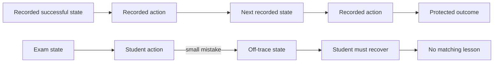
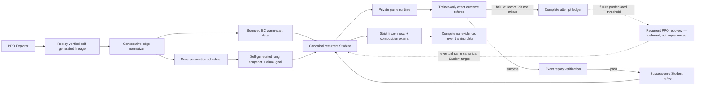
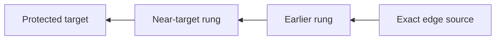

# Version 9: let the Student practice being wrong

Version 9 is the proposed behavioral successor to Version 8. It preserves V8's clean information
boundary, replay provenance, separate Explorer and Student, immutable bounded datasets, and strict
frozen exams. It changes the Student's training distribution: after a behavioral-cloning warm
start, the Student must act in the emulator, encounter the states caused by its own choices, and
earn any additional training trajectory through exact success.

> **Status on 2026-07-21:** the first-stage engineering and real-ROM mechanism path is qualified. The
> canonical Student receives behavioral cloning, reverse closed-loop practice, and success-only
> aggregation of exact-target, replay-verified Student rollouts. Consecutive graph hashes, complete
> terminal-reason counters, bounded rotating success replay, checkpoint-bound practice rollback,
> and the two-window 27/30 gate are integrated. The corrected real-ROM canary exercised those paths,
> reporting, and the wall-time boundary, then passed 0/3 frozen exams. The current suite passes 276
> non-integration plus 12 integration checks, 288 total. Mechanism, observability, and wall-time
> control qualify; learned competence and later-game progress do not. Recurrent PPO recovery
> remains a disabled, unimplemented later escalation. The declared long V9 campaign is now closed:
> the user intentionally stopped it after 2h52m39.143s to begin the matched-configuration V10
> successor. It reached Route 1 and raised Student fit to 68.5919%, but 4/87 frozen exams produced
> zero competent skills and no composition. The `8h` in its name was a ceiling, not its duration.

## The result V8 leaves behind

V8 answered an engineering question and produced a negative learning result at the same time. Its
clean, source-bound canary began with random weights and power-on only, discovered four transitions
through Professor Oak's lab, converted them into replay-distilled bounded lessons, and survived two
stop/resume cycles. It passed 0/7 frozen exams and remains the qualification record. A later longer
run extended the library through Route 1 and improved fit substantially, but it still did not
produce one competent skill.

| V8 qualification canary measure | Result | What it means |
| --- | ---: | --- |
| Explorer actions | 3,584 | A short mechanism canary, not a full training budget |
| Furthest discovery | Index 4, `met_professor_oak` | The Explorer reached Oak; the Student did not |
| Verified/distilled skills | 4 / 4 | The self-generated lesson pipeline worked |
| Student training | 51 rounds / 134 optimizer updates | The separate Student received sustained updates |
| Final action fit | NLL 2.07149 / accuracy 13.7795% | Near the 12.5% eight-action uniform reference; not convincing imitation |
| Frozen local exams | 0 / 7 | The decisive behavioral result: no learned skill passed |
| Competent skills | 0 | No composition was eligible |
| Routine full-skill opens | 0 | Bounded shard replay worked as designed |
| Resume | Two clean cycles | The bound engineering state was recoverable |

The canary's then-current supported-ROM suite passed 245/245 checks in 24.80 seconds. That is
historical V8 qualification evidence; it is not the final V8 behavioral run.

| V8 final longer-run measure | Result | What it means |
| --- | ---: | --- |
| Run / terminal reason | `parallel-ppo-v8-distilled-student-8h-20260721-seed20260793` / `stop_requested` | The `8h` name was an intended ceiling; the run was explicitly stopped after 5,668.623 s |
| Explorer actions / rate | 784,386 / 138.373 actions/s | 1,532 PPO updates continued discovery |
| Furthest discovery | Seven promotions; index 7, Route 1 | The verified library grew beyond the canary |
| Verified/distilled skills | 7 | 13,011 original actions compressed to 8,582 |
| Distillation cost | 238 oracle calls / 373,639 replay actions | Compression had a large, separately counted emulator cost |
| Student training | 387 rounds / 2,513 updates / 137,437 examples | Substantially more BC than the canary |
| Final action fit | NLL 1.295676 / accuracy 53.0817% | Offline fit improved dramatically |
| Frozen local exams | 1/47 | Still far below the checkpoint-separated 8/10 competence gate |
| Competent skills / compositions | 0 / 0 attempts | No reliable skill or restore-free chain was demonstrated |

The honest V8 conclusion is:

> The system could discover, verify, compress, store, replay, and resume several self-generated
> lessons. More data lifted offline action fit from 13.78% to 53.08%, but the Student still did not
> turn those lessons into frozen closed-loop competence.

V9 begins from that failure rather than relabeling either the four-item canary library or the
seven-item longer-run library as learning.

## Qualification: keep the broken canary, trust the corrected one

### Pre-hardening diagnostic

The first real-ROM run, `parallel-ppo-v9-canary-20260721-seed20260801`, was configured for 180
seconds. Synchronous campaign work overran that boundary; a manual STOP ended it at 248.801 seconds
and 12,360 Explorer actions. It reached milestone index 3, `left_home` / `Stepped outside`, with
three verified promotions, zero promotion failures, and six skills. Practice produced 19 exact
targets and three timeouts in 22 attempts; all three frozen exams failed.

That run also exposed an observability defect. Each immediate success-only
`record_student_training()` report replaced the richer periodic Student report instead of merging
with it, so dashboard diagnostics could collapse to empty or zero-valued fields. The manual STOP
made the defect visible; shutdown did not cause it. The run is useful evidence for the closed-loop
path and for two failed engineering assumptions, but it is not the authoritative qualification.

Commit `e1ea199` (`Keep V9 work inside campaign boundaries`) added cancellation checks around
synchronous campaign work and merged immediate success reports with the richer periodic status.

### Authoritative corrected canary

Run `parallel-ppo-v9-canary2-20260721-seed20260802` started at
`2026-07-21T21:31:41.473766Z` and wrote its final status at
`2026-07-21T21:34:08.155927Z`, a 146.682-second process span including roughly 2.6 seconds of setup
and finalization. Its measured campaign clock was 144.082 seconds against a configured 144.0-second
budget, and it ended automatically with `duration_limit`.

| Measure | Corrected canary result | Honest interpretation |
| --- | ---: | --- |
| Explorer actions / rate | 12,520 / 86.895 actions/s | Campaign work remained inside the measured wall-time boundary |
| Explorer PPO | 12 updates | Explorer training ran; this is not Student competence |
| Furthest discovery | Index 2, `Reached the ground floor` | Two verified promotions, zero promotion failures |
| Skills | 3 | Enough to exercise normalized skill and practice scheduling paths |
| Student training | 20 rounds / 64 optimizer updates / 1,400 examples | The separate Student and status merge remained observable |
| Final Student fit | Accuracy 0.1415313 / NLL 2.211105 | Near-chance fit diagnostic, not learning evidence |
| Practice attempts | 16/22 exact target (72.727%) | Two wrong-state outcomes and four timeouts preserve the full denominator |
| Success-only admission | 16 retained / 32 updates | Only replay-verified exact-target attempts trained |
| Aggregated replay, last round | 3 datasets / 39 examples / 20,000 bytes | Bounded rotating success replay was visible rather than overwritten |
| Frozen local exams | 0/3 | No skill became competent |
| Run storage | 42,336,864 bytes | Canary artifact footprint, not a long-run estimate |

The allowed conclusion is narrow:

> V9's mechanism, observability, and campaign wall-time control qualified on the supported ROM.
> The Student did not demonstrate competence.

Practice success is assisted training evidence. It starts from disclosed reverse-rung snapshots and
cannot replace a frozen exam. The 16/22 practice result beside 0/3 exams is exactly why the two
meters remain separate.

## Final long campaign record

Run `parallel-ppo-v9-self-correcting-8h-20260721-seed20260809` began at
`2026-07-21T21:43:57.163627Z` from source commit `d1c0c0d` with seed 20260809. This section freezes
the protocol that governed the now-closed run. Source was clean. The user intentionally requested
its stop at `2026-07-22T00:36:38.849066Z` so the matched-configuration V10 successor could begin.
The `8h` run-name component records the original ceiling, not the 2h52m39.143s actual duration.

| Launch field | Declared value |
| --- | --- |
| Start | Fresh power-on |
| V8 contribution | Root curriculum state only; no weights, optimizer, actions, distilled skills, or success buffer |
| Campaign limit | 8 hours |
| Action safety ceiling | 150,000,000 Explorer actions |
| Parallelism | 4 emulator environments |
| Explorer rollout | 256 steps per environment |
| Reverse-practice gate | 27/30 successes in two consecutive non-overlapping windows |
| Practice cadence | Every 4 Explorer rollouts, 2 attempts |
| Frozen-exam cadence | Every 16,384 Explorer actions |
| Storage guard | 100 GiB output cap; 50 GiB minimum free space |
| Dashboard | Local port 8774 |
| PPO recovery | Disabled |
| Mid-run protocol edits | Forbidden |

The V8 root is a bootstrapping state, not a transferred solution. The active Student and Explorer
begin without V8 model parameters. No V8 controller action, learned skill, replay success, or
optimizer state enters the campaign. Calling this “fresh power-on” would be misleading without that
boundary, so both facts are recorded together.

### First scheduled exam-boundary snapshot

At the first 16,384-action exam cadence, the status writer had recorded 16,388 Explorer actions.
The following snapshot is **provisional E1 live evidence**:

| Measure | First-boundary value |
| --- | ---: |
| Campaign elapsed | 161.420 s |
| Explorer actions / rate | 16,388 / 101.524 actions/s |
| Explorer PPO updates | 16 |
| Furthest discovery | Index 2, `Reached the ground floor` |
| Promotions / skills | 2 / 3 |
| Student training | 13 rounds / 60 optimizer updates |
| Student diagnostics | Accuracy 0.1396277 / NLL 2.105477 |
| Practice | 7/8 exact target; 1 timeout |
| Success-only state | 7 retained successes / 14 updates |
| Frozen exam | 0/1 over 556 actions |
| Competent skills / composition | 0 / 0 |

One exam failure could not establish a learning curve, and 7/8 assisted near-target practice could
not replace it. This snapshot remains preserved as provisional history; the terminal denominator
below decides the result.

### Terminal result

The final audit verified the model and checkpoint hashes and closed the complete denominator:

| Measure | Terminal V9 result |
| --- | ---: |
| Terminal reason | `stop_requested` |
| Elapsed | 10,359.143 s = 2h52m39.143s |
| Explorer actions / rate | 1,431,556 / 138.1925 actions/s |
| Explorer PPO updates / episodes | 1,398 / 558 |
| Unique positions | 716 |
| Promotions / best milestone | 7 / Route 1 |
| Skills discovered / competent | 8 / 0 |
| Student training | 797 rounds / 10,692 updates / 330,505 examples |
| Final Student fit | 68.5919% accuracy / 0.904136 NLL |
| Frozen exams | 4/87; zero competent skills |
| Closed-loop practice | 558/698 exact-target successes |
| Practice updates / actions | 882 / 651,629 |
| Composition attempts | 0 |
| Episode loop endings | 139 visual cycles / 419 stagnations |
| Battle successes | 146 |
| Final artifact size | 57 MiB |

The decisive contradiction is that offline/action-prediction fit rose to 68.5919% and four isolated
frozen attempts succeeded, yet no skill satisfied the checkpoint-separated competence gate. Zero
skills were competent and composition never became eligible. V9 therefore closes as a useful
negative learning result: self-correction produced much more training and some isolated exam hits,
but not reliable reusable behavior.

### Operational handoff

Two background-launch approaches failed before the campaign directory was created. A generic
`nohup` handoff was rejected after it failed to become the durable owner. A launchd service wrapper
was also rejected because its service context could not access the external SSD. Neither attempt
consumed experiment actions or changed the protocol.

The successful launch uses a detached user session. It retains the interactive user's filesystem
permissions and adds sleep prevention, allowing the monitor to turn off without suspending the
campaign. This is an operational choice, not a model or training change. Documentation intentionally
omits private absolute storage paths.

## The suspected failure: exposure bias

V8 trained primarily by behavioral cloning. During training, the Student saw observations collected
along a successful action trace and learned to predict the next recorded button. During an exam,
however, the Student chose its own button. One imperfect prediction changed the next screen; that
new screen might never have appeared in the successful trace. The following prediction was then
made from an unfamiliar state, so errors could compound.

This difference is called **exposure bias**:



Behavioral cloning is still useful: it gives a random Student a direction and can cheaply absorb
many self-generated successes. The mistake is treating teacher-forced fit as sufficient. V9 keeps
BC as a warm start, then measures and trains the distribution the Student actually creates.

Neither the 0/7 canary nor the final 1/47 result proves exposure bias was the only cause. Low
capacity, ambiguous visual goals, poor optimization, insufficient data, or recurrent-state
handling may also matter. The longer run makes “too few cloning updates” a weaker explanation, but
V9 remains a test of exposure bias rather than an assumption that the diagnosis is correct.

## Design principles

V9 follows seven constraints:

1. **No imported answer.** Every action target still comes from this run's Explorer or from a
   successful closed-loop Student rollout.
2. **Normalize before practice.** Each lesson must be an exact consecutive edge, not an overlapping
   prefix whose source and target are ambiguous.
3. **Practice closed loop.** The Student receives the consequences of its own buttons.
4. **Move backward only after success.** Start near the target, then expand toward the true source.
5. **Aggregate successes only.** Failed attempts remain evidence but never become imitation labels.
6. **Escalate automatically, not manually.** A future PPO recovery lane may activate only through a
   predeclared failure rule and the same actor information boundary.
7. **Keep practice outside the exam.** Only strict frozen attempts can grant competence.

## Architecture



The orange/blue separation from V8 remains: the Explorer finds possible lessons; the Student tries
to acquire them. V9 adds the green feedback loop in which the Student can create a new successful
route from states produced by its own policy.

## 1. Normalize discoveries into consecutive edges

A discovery lineage may contain overlapping prefixes, skipped catalogue outcomes, or a skill whose
recorded source is merely the nearest convenient verified state. Closed-loop practice needs a
stricter unit: one exact source, one exact next target, and only the actions between them.

For every verified power-on lineage, the normalizer should:

1. replay the lineage from its sealed source;
2. locate each protected outcome in chronological order;
3. cut the lineage into adjacent source-to-next-target segments;
4. require the target signature of edge *i* to equal the source signature of edge *i + 1*;
5. reconstruct pixels, recent-action history, target clip, and recurrent episode boundary from the
   exact edge source; and
6. hash-bind the normalized edge to its original lineage offsets and protected snapshots.

This creates a chain such as:

```text
power_on → game_started → left_bedroom → left_home → met_professor_oak
```

instead of four datasets that each silently contain some or all of the same opening prefix.
Normalization does not add a button, shorten an edge by human judgment, or tell the actor what the
milestone means. It is trainer-side accounting over the run's own verified lineage.

### Why consecutive edges matter

- Practice budgets describe one local problem rather than an ever-growing prefix.
- A reverse rung can be placed relative to a known edge target.
- Adjacent skills share an exact handoff state, which makes later composition falsifiable.
- Success aggregation cannot accidentally relabel a route from a different source.
- Failures can be attributed to one edge without claiming the earlier chain failed.

The original V8 skill, distillation audit, full NPZ, and shards remain immutable provenance. V9's
normalized edge is a new derived artifact with its own identity; it does not rewrite history.

### Current implemented normalization contract

The standalone normalizer uses protocol `self-generated-consecutive-skill-graph-v1`. It accepts one
verified replay plus the replay-local **first concrete hit** for every milestone in the covered
range. Each node binds both a save/load-stable state SHA-256 and the SHA-256 of its private
restorable snapshot. Node and edge IDs derive from replay ID, exact offsets, verification identity,
and those concrete state identities—not from milestone ordinal alone.

The normalizer rejects:

- a missing intermediate first hit, rather than borrowing a same-index state from another replay;
- non-increasing action offsets or milestone indices;
- duplicate concrete state identities under different milestones;
- an edge whose action slice does not exactly cover its declared offsets; and
- a first/last boundary that does not cover the complete replay.

Its public audit records protocol, replay ID, source/target index, first-hit and edge counts,
inserted split boundaries, node/edge hashes and IDs, offsets, and action counts. It deliberately
excludes controller actions and private save-state payloads. The V9 runner now uses the normalized
edges when preparing skills and binds the graph-audit file and SHA-256 into every skill record,
distillation audit, checkpoint, and resume validation. Automated checks cover this path. A real-ROM
V9 run has not yet qualified its behavior.

## 2. Warm-start the canonical Student with behavioral cloning

V9 does not throw away V8's useful machinery. The canonical Student first trains on bounded,
sequence-aware examples from the normalized self-generated edges:

- current and recent processed frames;
- recent self-actions;
- a short self-generated visual goal clip;
- loss-free recurrent burn-in; and
- the run's own replay-verified action targets.

This BC phase is a **warm start**, not a competence gate. Loss, accuracy, and entropy remain fit
diagnostics. The Student must still control the emulator in later practice and frozen exams.

The initial V9 qualification needs a matched **BC-only ablation**. It should use the same normalized
edges, model initialization, update budget, checkpoints, and exams, but omit success aggregation.
Without that control, an improvement could be caused by normalization or extra updates rather than
closed-loop self-correction.

## 3. Practice each edge backward in closed loop

For a normalized edge with actions `a[0:n]`, reverse practice begins from a self-generated snapshot
near the target. If the Student can reach the protected target reliably, the scheduler moves the
start earlier. It repeats until the exact normalized edge source is included.



Every rung is still closed loop:

- recurrent state resets at the declared rung source;
- the Student chooses every button from its allowed observation;
- the emulator advances from those buttons rather than replaying the recorded suffix;
- the target clip remains fixed for that edge;
- trainer-only state decides success, timeout, invalidity, and loop termination; and
- every planned attempt, including every failure, enters the ledger.

The snapshot is training assistance and must be disclosed. It is allowed only because the same run
previously reached and sealed that point. A near-target success means “the Student solved this
training rung,” not “the Student can reach the point from power-on.”

### Moving the start backward

One lucky success should not unlock a harder rung. A production protocol must predeclare:

- attempts per rung;
- rolling success threshold;
- action budget relative to the normalized edge;
- how timeout, blackout, loop, crash, and invalid attempts count;
- whether a failure merely holds the rung or moves it forward again; and
- how retention checks prevent an earlier edge from being forgotten.

Those values are implementation configuration, not facts about learning. Initial qualification may
use shortened gates for mechanism testing only if the report says so.

### Current implemented practice contract

The staged reverse-practice core uses protocol
`v9-student-closed-loop-reverse-practice-v1`. Its declared ladder is 8, 16, 32, 64, and successively
longer suffix horizons through the full normalized edge. A rung earns a training promotion only
after **27/30** successes in **two consecutive, non-overlapping windows**. This is deliberately a
hard practice gate; it is still not a frozen competence exam.

Scheduling reserves a deterministic **25% retention share** under a configuration constrained to
20–25%, so expanding the frontier cannot consume every opportunity to revisit an older rung. The
ledger serializes the pending scheduling choice and its derived attempt seed before execution;
resume must repeat that choice exactly rather than drawing an easier replacement.

The implementation names the configuration, rung, ledger, choice, and successful-record types
`ReversePracticeConfig`, `ReversePracticeRung`, `StudentPracticeLedger`, `PracticeChoice`, and
`SuccessfulRolloutMetadata`. The runner now invokes this ledger from the V9 training loop. These
engineering checks do not mean the real-ROM mechanism or learning hypothesis has qualified.

## 4. Aggregate only replay-verified Student successes

When the Student reaches the target during practice, V9 freezes that attempt and replays its exact
actions from the exact rung snapshot. Only a replay that reproduces the protected target may enter
the self-correction dataset.

The admitted item binds:

- Student checkpoint and optimizer identity;
- normalized edge and rung identity;
- start snapshot and target hashes;
- selected actions and action count;
- terminal exact-signature result;
- replay-verification result and cost;
- model-visible observations and recurrent boundaries; and
- whether the trajectory came from BC-initialized Student practice or a later declared recovery
  phase.

Multiple successful paths may be retained. Balanced sampling should prevent the shortest edge, the
latest success, or a prolific easy rung from erasing rarer skills.

Successful action artifacts use protocol `v9-student-successful-rollout-v1`. Each rung retains at
most 32 successful-rollout metadata records through deterministic reservoir sampling, bounding
ledger growth without silently keeping only the newest or shortest successes. A record is
ineligible unless its terminal outcome and exact action replay are both verified.

The integrated exact-target check requires both the intended milestone depth and the sealed target
signature. Merely crossing the target ordinal in a different state is
`milestone_wrong_state`, not success. Every attempt increments exactly one bounded public terminal
counter: `exact_target`, `timeout`, `emulator_stopped`, or `milestone_wrong_state`. Counter totals
must agree with ledger attempts, and `exact_target` must agree with retained success accounting.

Every admitted success is stored as an immutable dataset and split into the same bounded,
hash-checked replay-shard format used by V8. Student training deterministically rotates across the
retained rollout reservoir and then across its shards. It does not reopen every complete success
artifact or silently train forever on only the latest success.

### What happens to failures?

Failures are never discarded. They remain in the attempt denominator with their reason, terminal
state, action count, and checkpoint identity. They simply do not become imitation targets. Asking
the Student to clone every failed turn would train the very behavior the system is trying to
correct.

“Success-only” applies to supervised aggregation, not to evidence. It also does not imply that a
future PPO optimizer ignores failures: reinforcement learning needs complete rollouts to estimate
its objective. That later lane must report its own experience and budget separately.

## 5. Predeclare conditional automatic recurrent PPO recovery

Success-only aggregation has a cold-start problem: if BC never succeeds even on the easiest rung,
there is nothing new to aggregate. V9 therefore designs a future bounded recurrent PPO recovery
lane. If it is later implemented and enabled, escalation must be automatic rather than a human
rescue.

The proposed trigger is a persisted, configuration-bound failure condition such as a declared
number of eligible closed-loop attempts without one replay-verified success. Once enabled, PPO may
optimize the **canonical goal-conditioned Student** for the current normalized edge using the same
actor observation and trainer-only outcome boundary. The canonical Student is the eventual PPO
target; this is not a disposable expert whose hidden answer is copied afterward.

No PPO fallback exists in the current implementation scope. Recovery is deliberately **disabled,
deferred, and unclaimed in initial V9 qualification**. The first gate must establish that:

1. normalized edges are exact and consecutive;
2. closed-loop Student practice really uses Student actions;
3. only verified successes enter aggregation;
4. failures and budgets are complete;
5. stop/resume preserves the scheduler and dataset; and
6. the matched BC-only ablation is runnable.

Only after those gates pass may a later protocol enable automatic PPO escalation. Its trigger,
reward terms, learning rate, update budget, rollback behavior, and effect on the canonical Student
must be frozen before the run. No dashboard or document may imply the fallback was active when it
was not.

### PPO fallback may not become a hidden walkthrough

The trainer may reward the already declared protected outcome and general consequence/novelty
signals. It may not add “walk south,” route distance, Mart approach, named quest action, map
coordinate, or scripted button reward because a rung is difficult. A stalled PPO fallback is a
result, not permission to write another obstacle solution.

## Actor information boundary

The V9 actor may receive:

- `pixels`: processed game frames;
- `action_history`: its own recent actions;
- its recurrent hidden state, carried internally rather than supplied as privileged state; and
- `target_pixels`: the current short visual goal clip generated by this run's verified experience.

Those are the only actor observation keys. Practice resets use protocol
`zero-recurrent-sentinel-history-duplicate-frame-v1`: episode start is true, recurrent state is
zeroed, action history contains the sentinel reset pattern, and the current frame is duplicated to
form the initial temporal observation. Skill ID, Student checkpoint, rung, horizon, attempt seed,
and scheduler choice remain trainer-only and are absent from `PracticeChoice.actor_reset()`.

The actor may **not** receive:

- RAM, map ID, coordinates, event flags, party statistics, or milestone index;
- a milestone name, quest instruction, route graph, distance-to-goal, or direction hint;
- the normalized edge offset or “correct next action”;
- a human, language-model, reference-repository, or predecessor action trace;
- a hidden-state snapshot from the successful demonstrator; or
- the result of an exam before choosing its action.

Trainer-only code may:

- restore a self-generated practice snapshot;
- choose the eligible normalized edge and reverse rung;
- present that edge's self-generated visual goal;
- inspect exact RAM/processed-visual signatures for success and replay verification;
- schedule practice, aggregation, retention, and a future automatic PPO escalation; and
- log every attempt and integrity hash.

Trainer-only code may never choose a controller action. Reverse starts and goal selection are real
curriculum assistance and must remain visible in every claim.

## Strict frozen exams remain the authority

V9 practice produces training evidence, not competence evidence. The examiner stays outside every
optimizer and aggregation loop.

### Local edge exam

- Load one named Student checkpoint and reset recurrent state.
- Restore the exact normalized edge source, not a near-target practice rung.
- Hold weights, optimizer, scheduler, and replay buffers fixed.
- Let the Student choose every action under the declared deterministic evaluation rule.
- Record success, timeout, loop, blackout, crash, and invalid outcomes.
- Do not aggregate a successful exam into training data.
- Permit at most one grade from that Student checkpoint.

The current competence rule remains 8/10 across ten distinct Student checkpoint versions unless a
future protocol change is declared before data collection. Ten duplicate resets of one frozen
model are not ten independent grades.

### Restore-free composition exam

Local competence is still weaker than composition. A composition exam begins at power-on, resets
recurrent state once, uses one frozen Student, and allows no emulator restore. The trainer may
switch only among the ordered self-generated visual goals at declared RAM milestone endpoints.
That is disclosed goal-conditioned hierarchical control, not unaided pixel-only autonomy.

### Hall-of-Fame claim

A Hall-of-Fame claim requires one frozen Student to reach the Hall of Fame from power-on under the
fully declared goal-switching protocol, with no parameter update, scripted rescue, save-state jump,
or missing attempt. A growing closed-loop practice library does not satisfy that claim.

## Checkpoint, budget, and audit requirements

V9 extends V8's atomic checkpoint set. A recoverable implementation should bind:

- Explorer model/optimizer and action counter;
- canonical Student model and every enabled optimizer;
- normalized-edge manifest and source-lineage hashes;
- reverse-rung scheduler, attempts, windows, and retention state;
- success-only datasets, replay audits, and sampling cursors;
- automatic PPO trigger state, even while disabled;
- frozen-exam denominators and composition state;
- ROM/source/configuration identities; and
- the locked V7/V8 comparison records used by the report.

The current implementation binds `student-practice.checkpoint.json` and its SHA-256 to the same
atomic generation as the Student model and optimizer. A hash-matching previous generation is a
valid recovery source. Resume validates every ledger, terminal denominator, reservoir record,
success dataset, and bounded shard, then rewrites the live practice ledger from that committed
snapshot. This checkpoint-bound rollback prevents a newer scheduling choice, promotion window, or
success buffer from being paired with an older recovered Student. Pending attempt choice and seed
therefore repeat rather than being redrawn after interruption.

Budgets must separate:

1. Explorer actions;
2. distillation and normalization replay actions;
3. BC updates/examples;
4. closed-loop practice actions;
5. verification replay actions;
6. future PPO fallback actions/updates; and
7. frozen local/composition exam actions.

Combining those into one “training steps” number would hide whether V9 learned efficiently or
merely spent far more emulator work.

## Dashboard and hourly narrative

The V9 dashboard should preserve V8's four depth meters and add a self-correction lane:

| Panel | Question |
| --- | --- |
| Normalized edge chain | Are sources and targets exactly consecutive? |
| Active reverse rung | How far backward has closed-loop practice honestly expanded? |
| Practice attempts by outcome | Is the Student succeeding, failing, looping, or timing out? |
| Verified Student successes | How many on-policy successes became training data? |
| Aggregated examples by edge/rung | Is one easy lesson dominating replay? |
| BC-only versus self-correcting exam strip | Did closed-loop aggregation cause a difference? |
| PPO fallback state | Disabled, eligible, active, exhausted, or passed—never implied silently |
| Practice/verification/exam actions | What did the result cost? |
| Local and composition frozen exams | Did training survive the exam door? |

Every hourly Markdown chapter should answer:

- What normalized edge and rung was eligible?
- How many closed-loop attempts ran, and how did all of them end?
- Which successes passed exact replay and entered aggregation?
- Did the Student checkpoint change?
- Was PPO fallback disabled, merely eligible, or active?
- What did the matched BC-only lane do at the same budget?
- What would falsify the current hypothesis next?

## Qualification ladder

V9 earns a behavioral claim in stages. The current 288-check engineering suite covers stages 1–4
at E2, and the corrected canary passes stage 5 at E3 mechanism scope. Neither establishes
competence.

1. **✅ Engineering-checked normalization:** consecutive source/target identity, exact lineage coverage,
   no added actions, stable hashes, and corrupted-edge rejection.
2. **✅ Engineering-checked closed-loop authority:** every practice button comes from the canonical Student,
   not recorded suffix replay or trainer action selection.
3. **✅ Engineering-checked success-only admission:** exact success enters once; failure, wrong endpoint, hash
   mismatch, and replay mismatch never train but remain in the denominator.
4. **✅ Engineering-checked reverse-rung and recovery state:** start expands only after the two
   consecutive 27/30 windows; terminal counters, rotating reservoirs, graph hashes, and checkpoint-
   bound rollback remain consistent.
5. **✅ Real-ROM V9 mechanism canary:** the corrected 144-second campaign exercises BC warm
   start, closed-loop attempts, replay admission, bounded aggregation, complete terminal reporting,
   frozen exams, and the wall-time boundary. Its 0/3 exam result grants no competence.
6. **⬜ Matched BC ablation:** same normalized data, initialization, update/action budget, and frozen
   exams with and without success aggregation.
7. **✅ Frozen local evaluation recorded:** the long campaign passed 4/87 isolated attempts, but
   zero skills met the checkpoint-separated competence gate. Practice successes do not replace it.
8. **PPO fallback qualification:** only after stages 1–7 may the predeclared automatic escalation
   be enabled and compared with the non-PPO V9 lane.
9. **Restore-free composition:** only locally competent consecutive edges may be attempted from
   power-on under one frozen Student.
10. **✅ Long self-correcting campaign closed:** the user stopped it at 2h52m39.143s to begin V10.
    It reached Route 1 but ended with zero competent skills and no composition.
11. **🟨 Matched-configuration successor:** compare the closed V9 run with the new V10 recovery run,
    disclosing the different source commits and start times while retaining seed and run config.

## Falsifiers and stop conditions

V9 should be revised or rejected if:

- normalized edges do not reproduce their sealed source/target chain;
- “closed-loop” practice secretly replays recorded actions after the first mistake;
- failed attempts disappear from the denominator;
- non-replayable Student successes enter training;
- reverse practice improves near-target rungs but never the exact edge-source exam;
- aggregated data increases while frozen success remains flat;
- BC-only matches V9 under the same budget;
- easy rungs monopolize updates and old edges are forgotten;
- PPO fallback activates before its declared trigger or receives privileged actor inputs;
- the fallback reward grows into a route-specific walkthrough;
- resume changes rung, buffer, optimizer, or exam history incompatibly; or
- a human must add a new correction for every later quest.

The response to a falsifier is another declared architecture or ablation—not editing the failure
out of the story.

## Claim boundaries

| Evidence | Permitted statement | Not permitted |
| --- | --- | --- |
| Normalized edge replays | “The run's own lineage was cut into exact consecutive lessons.” | “The Student understands the route.” |
| Near-target practice succeeds | “The Student solved this disclosed training rung.” | “It can reach that rung from power-on.” |
| Student success enters aggregation | “One on-policy route replayed to the protected outcome.” | “Self-correction caused competence.” |
| Corrected V9 canary | “Mechanism, observability, and campaign timing qualified; frozen exams were 0/3.” | “V9 learned a skill.” |
| Frozen edge exam reaches 8/10 | “Eight of ten checkpoint-separated Student versions reproduced this edge from its exact source.” | “One model is robust from power-on.” |
| Frozen composition passes | “One frozen goal-conditioned Student connected this chain without restores.” | “It beat Pokémon Red unaided.” |
| PPO fallback later helps | “Predeclared same-boundary PPO improved the declared metric under this budget.” | “PPO was active in the initial V9 result.” |

## The video chapter: “It Never Practiced Being Wrong”

The V9 story should begin with V8's contradiction, not a new architecture diagram.

### Beat 1 — Better fit, still no competent skill

Show four sealed lesson cards appearing as the Explorer reaches Oak. Let Student updates count up to
134. Reveal the clean canary's seven red frozen-exam tiles. Then extend the timeline: seven lessons,
2,513 updates, 53.08% fit, and only one green tile among 47. The line is:

> It had studied only stories where every earlier button was already correct.

### Beat 2 — Step off the recorded line

Draw the successful trace as a narrow rail. One wrong Student action leaves it. The next frame has
no matching label. Name exposure bias in plain language: “The training set knew how to continue a
perfect run; it did not know how to recover from the model's own run.”

### Beat 3 — Turn the route into exact adjacent lessons

Replace overlapping ribbons with consecutive cards whose endpoints physically click together.
Show source and target hashes matching at every handoff. Label the operation **NORMALIZATION, NOT A
NEW DEMONSTRATION**.

### Beat 4 — Move the starting line backward

Start the blue Student one step from the target. Let it act live. After a declared success gate,
slide the starting line backward. Keep a visible snapshot icon and the caption **TRAINING
ASSISTANCE** so the audience never confuses a reverse rung with clean-start play.

### Beat 5 — Let success write the next lesson

When the Student succeeds, replay its actions. A green path enters the dataset only after the
verifier stamp. Failed paths remain on the denominator wall but do not become arrows to imitate.

### Beat 6 — Let the lab fail on camera

Put 180 seconds on screen and let the first canary cross it. Show the immediate success reports
replacing richer periodic diagnostics, then the manual STOP at 248.801. Explain that this is not an
agent failure; it is a measuring-instrument failure. Keep the run in the story.

Cut to commit `e1ea199`, then rerun. Separate the 146.682-second process span from the 144.082-second
campaign clock, show all 22 terminal outcomes, and freeze on 0/3. The honest line is: “We qualified
the experiment, not the intelligence.”

### Beat 7 — Show the emergency lever, keep it covered

Draw a lever labeled **AUTOMATIC PPO RECOVERY** behind glass. Explain its predeclared trigger and
same observation boundary, then leave it disabled for the initial qualification. This turns restraint
into visible scientific design rather than an omitted implementation detail.

### Beat 8 — Return to the exam door

Put BC-only and self-correcting Student checkpoints side by side under the same budget. Freeze both.
Count every attempt. If both fail, that is the result. If V9 improves, the matched ablation makes the
claim more meaningful than another highlight clip.

## What would count as progress?

The first meaningful V9 result is not another discovery. It is one normalized edge for which:

1. BC-only and self-correcting lanes start comparably;
2. closed-loop attempts and failures are complete;
3. at least one Student-generated success replay-verifies;
4. aggregation changes a later Student checkpoint; and
5. a strict frozen edge exam improves under the declared denominator.

Until that exists, V9 is a mechanism-qualified hypothesis without a learned-competence result. Its
purpose is not to guarantee the Hall of Fame. Its purpose is to make the Student practice the state
distribution it creates, without smuggling in a walkthrough and without weakening the exam that
exposed V8's failure. The active long run does not change this wording until it closes and its full
frozen denominator is audited.
