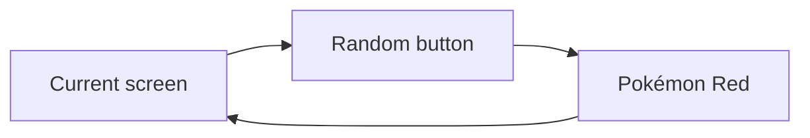
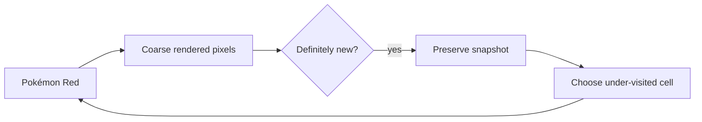

# Video series bible — *A Monkey That Can Remember*

## The central promise

This series is not “watch an AI beat Pokémon.” It is a documented attempt to answer a stranger and
more honest question:

> **What can emerge when an agent is given Pokémon Red's screen and buttons, but nobody tells it
> what the game is?**

The audience should be able to enjoy the discoveries as a story while also understanding exactly
what caused them. Every episode therefore has two obligations:

1. create a clear dramatic question; and
2. make the experimental boundary visible enough that a surprising clip cannot carry a stronger
   claim than the evidence supports.

The first central comparison is **chance versus chance with memory**. The Monkey presses uniformly
random buttons in one continuous run. The Archivist presses the same kind of random buttons, but a
pixel-only trainer preserves visually novel screens and begins new branches from under-explored
archive cells. Neither knows what a Pokémon, door, menu, battle, or objective is.

## The title and logline

**Recommended episode title:** *I Gave Pokémon Red to a Monkey That Can Remember*

**Logline:** Two game-naive agents begin Pokémon Red at power-on. Both press random buttons. One is
condemned to live with every mistake; the other can remember visually unfamiliar moments and try
again from them. Does memory create discovery—or merely a more elaborate way to get lost?

Other usable titles:

- *Can Randomness Learn Pokémon If It Has a Memory?*
- *I Gave an AI Pokémon Red—but Never Told It the Goal*
- *Five Million Random Buttons vs. Pokémon Red*
- *The AI That Knows Nothing About Pokémon*

Avoid titles claiming the agent “learned Pokémon,” “understood the game,” or “played from scratch”
unless a later experiment supports those narrower claims.

## The cast

### The Monkey — pure chance

The Monkey is the control and comic character. It has no persistent learning state. Its speed and
large raw novelty count may initially make it look impressive, which creates an important reversal:
many changing screens can be animation, text churn, or menu chaos rather than progress.

### The Archivist — chance with memory

The Archivist is the protagonist of the first experiment. Its individual buttons are still random.
Its advantage is outside the button chooser: a trainer turns coarse rendered pixels into visual
cells, remembers definite first visits, and restores under-visited discoveries for new random
branches. It is snapshot-assisted and is not one continuous playthrough.

### The Curious agent — the successor

The planned Curious agent will eventually use pixels to choose actions directly. It should enter
the story only after the audience understands why the Monkey and Archivist exist. They establish
the baseline, dataset, failure modes, and vocabulary the learned policy must improve on.

### The experimenter — builder and unreliable interpreter

The human role is not an invisible authority. The experimenter chose the emulator, action cadence,
pixel compression, novelty definition, archive strategy, and budgets. The narration should admit
when human intuition expected the wrong thing. That fallibility is part of the series rather than a
blemish to edit out.

## Episode 1 narrative spine

Target length: **12–16 minutes**.

### 0:00–0:35 — Cold open: the apparent breakthrough

Open on the most legible surprising screen from the discovery reel. Do not reveal immediately
whether it came from the Monkey or Archivist.

Suggested voiceover:

> “This is Pokémon Red. The thing pressing the buttons has never been told what Pokémon is. It
> doesn't know that text should be read, that doors lead somewhere, or that the person on screen is
> supposed to go on an adventure. A few hours earlier, it knew only nine buttons.”

Cut rapidly between a discovery screen, a rising curve, the two agent labels, and an honest failure
such as a blank screen or name-entry loop.

End the cold open with the thesis:

> “I didn't give it a goal. I gave one version a memory.”

On-screen evidence labels:

- `DEVELOPMENT RUN`
- `BUTTONS: UNIFORM RANDOM`
- `TRAINER: PIXELS ONLY`
- `NOT A CONTINUOUS PLAYTHROUGH` for Archivist footage

### 0:35–2:00 — Why a literal monkey is not enough

Explain the typewriter analogy visually. A random controller can eventually produce useful input
sequences, but it cannot recognize or preserve them. Pokémon compounds this problem with menus,
dialogue, transitions, and extremely long delays between locally useful actions and recognizable
progress.

Show the Monkey loop:

Then add the Archivist's one advantage:

Say plainly that this is an adaptive search algorithm, not a neural network.

### 2:00–3:30 — The rules of blindness

Present the experimental contract as a clean checklist:

| Available | Forbidden |
| --- | --- |
| Rendered screen pixels | RAM, map ID, or coordinates |
| Game Boy buttons | OCR or text transcripts |
| Seeded randomness | Walkthroughs or internet access |
| Pixel novelty and visit counts for the trainer | Human play demonstrations |
| Trainer-owned snapshots for Archivist | Pokémon-specific goals or milestone rewards |

The visual should draw a thick boundary between the agent/trainer lane and a future sealed referee.
Outcome labels such as “name-entry screen” are human post-hoc descriptions, never training signals.

### 3:30–5:00 — Building a trustworthy stage

Compress Phase 0 into a short engineering montage:

- exact legal private-ROM fingerprint;
- headless emulator;
- explicit button timing;
- deterministic clean boots;
- safe snapshots and private-artifact rules;
- traces, heartbeats, checkpoints, and resource ceilings; and
- tests replaying every retained parent-to-child archive edge.

The narrative purpose is not to celebrate infrastructure. It answers: “Why should the viewer trust
that a discovery was produced under the stated rules?”

### 5:00–7:00 — Release the Monkey

Show the Monkey's first minutes at high speed. Pair the fast action rate with its visual-cell curve.
Let the raw count create an expectation that the Monkey may win.

Then inspect the discovery reel. Classify examples in plain language: title animation, dialogue,
name-entry variation, menu movement, blank transitions, or meaningful scene change. Keep uncertain
screens labeled `UNKNOWN`, not forced into a story.

Central line:

> “The counter was measuring visual unfamiliarity. I was the one tempted to call it progress.”

### 7:00–10:00 — Give chance a memory

Introduce archive cells as pinned moments on a wall. Animate branches growing from selected cells.
Show the archive size and restore count beside the discovery curve.

Clarify the trade:

- The Archivist is slower per wall-clock second because saving, compressing, and restoring states
  costs computation.
- It can repeatedly investigate rare screens rather than losing them forever.
- It may also preserve useless novelty and systematically explore the wrong thing.

Compare both arms twice:

1. **At equal controller actions** — tests search efficiency.
2. **At equal wall time** — tests what a viewer could obtain with the same overnight wait.

Never compare the Monkey's later five-million-action result with the Archivist's earlier result as
if the budgets matched.

### 10:00–12:30 — The novelty trap

This is the likely intellectual center of Episode 1. Select the clearest reward exploit or
misleading visual pattern. Explain why the algorithm valued it and why a human would not.

Possible outcomes:

- dialogue or name-entry screens generate abundant visual cells;
- animated screens inflate novelty;
- coarse pixel cells merge different hidden game states;
- the Archivist spends many restores refining an irrelevant interface; or
- memory discovers a transition that pure chance rarely revisits.

The episode succeeds even if neither arm reaches recognizable gameplay. The result becomes a map of
what “curiosity” gets wrong when it has no concepts.

### 12:30–14:30 — What actually happened

Present a compact evidence card:

| Field | Required presentation |
| --- | --- |
| Commit | Exact frozen source revision |
| Seeds | Every seed in the comparison |
| Budgets | Allowed and actually used actions, wall time, and frames |
| Stops | Every stop reason and invalid run |
| Inputs | Button-policy inputs and trainer inputs separately |
| Snapshot assistance | Restore count and continuous-playthrough status |
| Discovery | Curves plus representative screens, not only a final number |
| Interpretation | Human post-hoc labels clearly identified |

State the strongest justified claim in one sentence. Examples:

- “The Archivist retained and revisited more rare visual situations per action.”
- “The Monkey generated more visual cells per second, primarily through interface variation.”
- “Neither system produced evidence of goal-directed play.”

Do not end with a vague declaration that the “AI learned.”

### 14:30–end — The next question

The sequel should follow directly from the observed failure:

- If novelty farms animation, build an animation-resistant visual representation.
- If both systems reach interfaces but cannot act consistently, train the Curious pixel policy.
- If memory helps, test whether a learned policy can internalize archive trajectories.
- If the power-on prologue dominates everything, compare strict power-on and explicitly assisted
  bedroom starts as different experiments.

Closing line:

> “The monkey could stumble into a sentence. The Archivist could save the page. Next, I want to
> know whether anything can learn why the sentence matters.”

## Visual grammar

Use the same colors and labels in every episode:

| Element | Visual treatment |
| --- | --- |
| Monkey | Warm yellow; continuous line; `RANDOM / CONTINUOUS` badge |
| Archivist | Green; branching line; `PIXEL ARCHIVE / SNAPSHOT-ASSISTED` badge |
| Curious policy | Blue; introduced only when implemented |
| Privileged referee | Gray dashed border; `POST-HOC — NOT TRAINING INPUT` |
| Invalid or failed run | Red outline; never removed from aggregate ledgers |
| Planned claim | Hollow shape |
| Measured development evidence | Half-filled shape |
| Frozen evaluation evidence | Filled shape |

Recurring visuals:

- **Run strip:** start → actions → discoveries → stop.
- **Discovery curve:** unique visual cells versus actions, with a separate wall-time view.
- **Archive tree:** selected cells and branch depth without implying map progress.
- **Screen atlas:** post-hoc groups of representative screenshots.
- **Button histogram:** catches biased or broken action sampling.
- **Truth card:** observation, trainer inputs, snapshot assistance, budget, commit, and run class.

Avoid route maps until a sealed referee can generate them without feeding them back into training.

## Thumbnail direction

Recommended composition:

- left: one recognizable Game Boy screen framed as evidence, not extracted game art;
- center: a chaotic yellow line splitting into a structured green archive tree;
- right: large text, `IT KNOWS NOTHING`; and
- small badge, `5,000,000 BUTTONS` only if the completed run actually used that count.

Do not put a completed-game screen or badge collection in the thumbnail for an episode whose agents
never reached them.

## Series arc

1. **Trust the stage** — deterministic emulator and honest measurement.
2. **Chance versus memory** — Monkey and Archivist.
3. **Curiosity's loophole** — repair the strongest novelty exploit.
4. **A policy that can look** — train the first pixel-to-button Curious agent.
5. **Can it remember without rewinding?** — recurrent memory and restore-free evaluation.
6. **First recognizable milestone** — whatever the frozen evidence genuinely supports.
7. **Informed agent comparison** — only later introduce semantic state or language-model planning as
   an explicitly different track.

The long-term destination may still include Oak's Parcel, Brock, and a hybrid agent. The audience
should arrive there through earned experimental questions rather than a prewritten success arc.

## Editorial integrity checklist

Before locking an episode:

- [ ] Every result screenshot displays its run class.
- [ ] Snapshot-assisted footage is never called a continuous playthrough.
- [ ] Button-policy inputs and trainer inputs are described separately.
- [ ] Comparisons use equal actions or equal wall time and say which.
- [ ] All official attempts and stop reasons appear in the ledger.
- [ ] Human post-hoc labels are marked as interpretation.
- [ ] Novelty is not substituted for semantic progress.
- [ ] The strongest claim is written before the title and thumbnail are finalized.
- [ ] ROMs, save states, checkpoints, private paths, and unreviewed traces remain unpublished.
- [ ] The next episode follows from the observed failure rather than hiding it.
