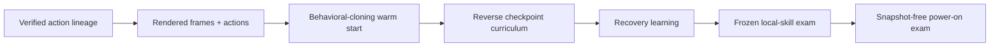

# Visual Apprentice v1

> **Status:** Stage 0 passed on the real ROM. Two independent captures agreed, one recurrent pixel
> policy reached 419/419 offline under both feedback modes, its frozen reload was identical, and it
> selected the exact original 419-action route from clean power-on to `left_home`. This proves the
> pipeline connects; it is still one memorized trajectory, not recovery, generalization, or H2.

## The question

Can a small recurrent policy turn a route discovered by blind checkpoint search into a reactive
skill that survives mistakes and then leaves Red's house from power-on without loading a snapshot?

This is the bridge between two deliberately separate achievements:

1. the expedition remembers a lucky sequence and proves that it replays; and
2. one frozen model observes pixels, chooses every action, and succeeds without checkpoint help.

The first achievement supplies data for the second. It does not automatically prove it.



## Information contract

The training label is:

```text
Actor: PIXEL-ACTOR
Training information: PRIVILEGED-TRAINING-REFEREE
Training start: ARCHIVE-RESTORE
Evaluated object: FIXED-POLICY
Evaluation start: POWER-ON or a declared held-out local start
```

The actor may receive only:

- rendered screen pixels under a frozen preprocessing schema;
- its previous action;
- its own recurrent hidden state; and
- an episode-start signal that resets that state.

The actor may not receive map IDs, coordinates, milestone names, RAM values, reward components,
checkpoint IDs, action-lineage position, emulator objects, save-state bytes, or a scripted route.

The sealed training referee may inspect declared read-only game state to calculate rewards, select
curriculum starts, classify failures, and determine task success. It cannot choose an action,
alter memory, or pass its semantic values to the actor. During evaluation, rewards and curriculum
selection are disabled and snapshots are unavailable to the evaluated policy.

## Why the preceding agents are not enough

| Predecessor | What it established | Why it is not the final learner |
| --- | --- | --- |
| Uniform random emitter | A reproducible luck baseline | No observation changes its next action distribution |
| Hashed Q learner | Online updates and explicit reward ledgers work | Coarse hashes fragment visually similar states and do not provide durable sequence memory |
| 13,096-parameter evolutionary RNN | A behavior can affect ancestry | Fixed clean-start lifetimes repeatedly pay the entire opening horizon and mutations often erase fragile prerequisites |
| Checkpoint expedition | Useful accidents can accumulate and replay | The archive learns where to branch, but its random button emitter does not learn |
| Open-loop action lineage | The discovered route is executable | It cannot react when one screen, timing, or action differs |

Visual Apprentice is not a claim that neural networks are automatically better. It is a bounded
test of whether gradient learning, recurrent memory, and a checkpoint curriculum address the
specific failures already observed.

## Version-1 observation and action schema

### Observation

The initial candidate uses two recent `72 × 80` grayscale frames, stored as `uint8`, plus an
eight-element previous-action indicator. Version 1 freezes integer grayscale as
`(77R + 150G + 29B + 128) >> 8`, followed by a non-overlapping `2 × 2` integer mean. The two frames
expose small motion and transition cues without retaining a long unbounded history. The recurrent
state supplies longer memory. The first observation duplicates the clean power-on frame; later
observations pair the previous and current decision boundaries.

The old `20 × 18` novelty signature and `10 × 9` policy hash remain diagnostics. They are too coarse
to be the complete neural observation for text, menus, doors, and sprite alignment.

Preprocessing must be deterministic and versioned. Changing crop, scale, palette conversion,
frame cadence, or history length creates a new observation version and invalidates direct
checkpoint comparisons.

### Actions

Version 1 retains the established eight-action vocabulary:

1. Up
2. Down
3. Left
4. Right
5. A
6. B
7. Start
8. No-op

Every decision retains the existing fixed eight held frames and twelve released frames. The model
does not choose timing in this first experiment. This isolates policy learning from another action
dimension and preserves comparison with Q1.

## Candidate network

The first model should remain small enough that emulator collection, not parameter count, is the
main engineering question.

```text
two 72x80 grayscale frames
        |
Conv2D: 16 filters, 8x8 kernel, stride 4
Conv2D: 32 filters, 4x4 kernel, stride 2
Conv2D: 32 filters, 3x3 kernel, stride 1
Linear: 256 features
        |
concatenate previous-action indicator
        |
one LSTM layer, 128 units
        |
eight-action policy head
```

The implemented Stage-0 actor has exactly 468,312 trainable parameters. Its cloning checkpoint has
no value head because no value loss is used in the overfit smoke; the later PPO actor-critic will
add a value head without silently relabeling this architecture. Training samples from the policy
distribution in later stages. The canonical Stage-0 evaluation uses deterministic argmax;
separately declared stochastic evaluation seeds may measure reliability in later gates.

## Turning one accident into training data

### Preserve before minimizing

The original 419-action lineage remains immutable evidence. A deterministic chunk-deletion pass
may find a shorter equivalent route, but the shortened sequence is a derived action-search
artifact. Its reduction does not retroactively change the original discovery.

### Replay into visual demonstrations

For every verified successful lineage, replay from its declared start and record:

- actor-visible pixels before the decision;
- previous action and episode boundary;
- selected action and fixed timing;
- lineage, branch, and replay identifiers;
- referee-only milestone transitions and terminal classification; and
- frame, screen, action-segment, configuration, and source hashes.

Private rendered frames and checkpoints stay outside Git. Public documentation retains reviewed
counts, anonymous identifiers, hashes, and derived charts.

### Avoid frame-level data leakage

Adjacent frames from one deterministic lineage are nearly duplicates. Training, validation, and
test splits must therefore group by complete search seed or ancestral branch, never by randomly
shuffling individual frames. Test snapshot hashes are sealed before training and never used to
choose a checkpoint.

The first lineage may be used for a deliberate overfit smoke. That run verifies preprocessing,
sequence batching, recurrent resets, checkpoint serialization, and action decoding. It supports no
generalization claim.

Before an official local-skill evaluation, target at least:

- five independently discovered and replay-verified house-exit lineages; and
- 200 nearby failed, perturbed, or recovery branches.

Those are initial dataset gates, not claims that five routes capture every possible house state.

## Training stages

### Stage 0 — Deliberate overfit smoke

Train on the original lineage until the model can reproduce its actions from the recorded visual
sequence. Then replay the learned policy in the emulator. Record failure as useful evidence if
small prediction errors compound before the exit.

The smoke answers “does the pipeline connect?” It does not answer “did the policy learn a robust
skill?”

The implemented qualification has three independent statuses:

| Gate | Exact requirement | What failure means |
| --- | --- | --- |
| Data | Two immutable extractions produce the same logical dataset hash; each contains 419 labels and 420 decision-boundary frames; the new terminal replay exactly matches the certified promotion | The historical route, observation alignment, or artifact writer is not trustworthy enough to train |
| Offline overfit | One CPU-trained checkpoint and its frozen reload predict 419/419 labels with both teacher-forced and predicted previous actions | The recurrent training or serialization path cannot even memorize its one example |
| Closed loop | The frozen reload starts from clean power-on with zero recurrent state and reaches exact `left_home` within 1,000 model-selected actions | Offline accuracy did not survive interaction with the emulator |

Stage 0 passes only when all three pass. Exact equality with the original 419 actions is reported
separately from task success. Without exact route equality, the strongest permitted sentence is:
**“One frozen model exactly fit its single trajectory offline and reached `left_home` once in
closed loop.”** It is not an H2 claim and says nothing yet about perturbation recovery, held-out
starts, or general Pokémon play.

### Implemented Stage-0 boundaries

- The historical expedition opens through a read-only checkpoint view; extraction never repairs,
  audits, or appends to the source store.
- The extractor requires cell `4618cb56f99c95b594534474`, its public lineage hash, a genuine
  milestone promotion, three historical power-on certificates, and zero lineage deficits.
- Frames, labels, previous actions, episode boundaries, model tensors, per-action rollout traces,
  and milestone images remain private on the external SSD.
- Dataset files, manifests, model metadata, and model tensors are individually hashed. Model tensor
  values also receive a container-independent hash.
- The trainer uses direct PyTorch 2.13 on CPU, full-sequence backpropagation, Adam at `1e-3`, a
  fixed seed, deterministic algorithms, at most four threads, and a 15-minute/2,000-epoch ceiling.
- The live evaluator has no snapshot API, reward input, update step, retry, or human intervention.
  RAM-derived state exists only in the separate referee that decides whether `left_home` occurred.
- Repository safety checks reject tracked `.npy`, `.npz`, `.pt`, `.pth`, and `.ckpt` payloads.

The `apprentice-extract`, `apprentice-dataset-verify`, `apprentice-overfit`, and
`apprentice-evaluate` commands expose each boundary separately. Training writes a live-updating
private `index.html`, `status.json`, metrics ledger, events, frozen model, and summary. A failed
gate remains a result; it does not receive a `SUCCESS` marker.

### Real-ROM Stage-0 result

The first declared attempt passed every gate. Both 419-label/420-frame captures produced logical
dataset SHA-256 `a8b03101d6f145e9d19831bc7d75caae90ca9f41b0c6518adf52e89eaa730aec`.
Training reached exact teacher-forced and predicted-feedback accuracy after 316 epochs and 99.112
seconds, then reproduced the same result after frozen reload. The live actor reached
`game_started` at action 243, `left_bedroom` at 302, and `left_home` at 419. Its 419 selected
actions were exactly equal to the original demonstration. No failed Stage-0 attempt was discarded
or repeated.

The [reviewed Stage-0 result](../experiments/visual-apprentice-stage0/README.md) publishes the
complete denominator, aggregate metrics, bundle hashes, and an original visual without exposing
the private frames or model. The strongest justified sentence is: **“One frozen model exactly fit
its single training trajectory offline and replayed that exact route from clean power-on once.”**
The next run must vary the start and retain failures if it is to measure a skill rather than route
memorization.

### Stage 1 — Behavioral-cloning warm start

Train the recurrent policy to predict actions from all available successful self-generated
lineages. The teacher is the project's own search process, not a human walkthrough. Report action
accuracy by entire held-out branch, but do not confuse high offline accuracy with emulator success.

### Stage 2 — Reverse checkpoint curriculum

Sparse success from power-on is the problem the expedition was built to avoid. Train backward from
the verified goal:

| Rung | Approximate remaining horizon | Start distribution |
| --- | ---: | --- |
| A | 8 actions | Stable states immediately before the door transition |
| B | 16 actions | Nearby ground-floor states |
| C | 32 actions | Wider ground-floor states and short mistakes |
| D | 64 actions | Ground-floor navigation and interaction |
| E | 128 actions | Bedroom and stairs states |
| F | 256 actions | Early game-start states |
| G | Complete opening | Title sequence or clean power-on |

Every checkpoint start resets recurrent memory to zero. Restoring a hidden state captured beside a
game snapshot would let training smuggle route position into the policy. If a local start is
visually ambiguous with zero memory, begin earlier or define a pixel/action-history burn-in rather
than exposing checkpoint identity.

Unlock the next rung only after the current rung passes a fixed development gate twice. Retain
20–25% rehearsal starts from earlier rungs. Reject promotion when an earlier rung loses more than
five percentage points; that regression becomes part of the forgetting ledger.

The first implemented development pilot deliberately precedes PPO. It reconstructs the seven
starts by replaying the certified demonstration, primes each suffix with the same self-generated
teacher, then samples from the pixel policy. Only a sampled attempt that actually reaches
`left_home` creates a self-imitation update; failed attempts are retained with no gradient. Demo
priming and learner updates have separate counters. Promotion requires 27/30 successes twice.
This launch version does not yet mix 20–25% earlier-rung starts into every update or run the frozen
forgetting check above; its per-rung results must therefore be treated as calibration, and those
two protections remain required before a formal local-skill gate.

The pilot has an eight-hour wall limit, a 15-million total-action ceiling, a two-million-action
no-promotion stop, a 1.5 GiB process-memory stop, a 50 GiB free-space floor, and one CPU learner.
It is development data because its starts, demonstration, and gate are used for training. A later
frozen attempt set remains necessary for H2.

The launch checkpoint restores model, optimizer, random streams, counters, and promotion state from
a hash-checked payload. Its append-only episode/update/event tails are not yet transactionally
rolled back to that checkpoint after a hard crash, so a crash-resumed run may contain duplicate
diagnostic rows and cannot become formal evaluation evidence. The uninterrupted canary and
overnight pilot remain useful development tests; Archive v2's stronger crash-tail protocol is the
model for the later qualified learner runner.

### Stage 3 — Recovery and dataset aggregation

Behavioral cloning mostly sees states created by the teacher. A learned policy creates different
states after its own mistakes. Generate recovery experience by:

- injecting short wrong-action or no-op perturbations into successful branches;
- starting from nearby verified failed branches;
- retaining the learner's own loops, timeouts, and recoveries; and
- using archive or bounded action-sequence search to find successful continuations when possible.

Successful continuations become new self-generated demonstrations. All attempts remain recurrent
RL experience and narrative evidence. The learner is never manually rescued during a recorded
attempt.

## Initial reward ledger

Rewards are deltas from the episode's starting checkpoint. Achievements already present in that
checkpoint pay nothing again.

| Signal | Initial value | Limit |
| --- | ---: | --- |
| Reach exact `left_home` | `+50` | Once; successful termination |
| Newly reach `left_bedroom` | `+10` | Once |
| Newly start the game | `+2` | Once |
| New directed transition | `+2` | Once per transition |
| New coarse position | `+0.02` | At most `+1` per episode |
| New visual cell | `+0.005` | At most `+0.25` per episode |
| Controller decision | `-0.001` | Every action |
| Confirmed loop or blackout | `-0.5` | Once; failed termination |

The exact house-exit event defines success independently of this ledger. Position and visual
novelty remain small and capped so a menu animation or local coordinate collector cannot outrank
the task.

Reward values are calibration hypotheses. Changing them creates a new training version and must be
recorded before the next run rather than silently joining incompatible curves.

## Initial recurrent-PPO pilot

The first bounded pilot uses:

| Setting | Initial value |
| --- | ---: |
| Emulator workers | 2 |
| Rollout steps per worker | 256 |
| Minibatch | 64–256 after memory profiling |
| Optimization epochs | 4 |
| Learning rate | `2.5e-4`, decayed |
| Discount | `0.995` |
| GAE lambda | `0.95` |
| PPO clip | `0.2` |
| Entropy coefficient | `0.01`, decayed |
| Gradient norm limit | `0.5` |
| Pilot ceiling | 500,000 environment actions |
| Conditional extension | At most 2,000,000 while held-out success improves |
| Stagnation stop | 250,000 actions without frozen-validation improvement |

These are engineering defaults, not selected scientific winners. Profile a 100,000-action
calibration before estimating the overnight rate. The M1 iMac has 8 GB of unified memory, so begin
with one learner process and two emulator workers. Increase to three or four only if total memory
stays comfortably below the no-swap threshold and throughput improves. Do not run six deep-learning
lanes or a thousand resident models simultaneously; a population can be evaluated as a queue.

Start on CPU because emulator collection and small recurrent operations may dominate. Benchmark
Apple Metal acceleration separately and record both throughput and memory before selecting it.

## Evaluation gates

Training success is diagnostic. A claim requires a frozen checkpoint and a sealed attempt set.

### Curriculum development gate

- 30 predeclared start/seed pairs per rung;
- at least 27/30 successes twice consecutively;
- the previous rung also remains at least 27/30; and
- no more than a five-point prior-rung decline.

These checks decide curriculum movement. They are not headline evidence.

### H2 local-skill gate

- one frozen policy checkpoint;
- 50 branch-grouped held-out start/seed pairs;
- at least 45/50 exact house-exit successes;
- zero restored recurrent states, updates, retries, or interventions;
- fixed action and watchdog budgets; and
- every success, loop, timeout, blackout, crash, and invalid attempt retained.

Passing permits: **“One frozen visual policy learned the bounded house-exit skill from held-out
local starts.”** It does not prove that the policy can reach those starts from power-on.

### Power-on composition gate

- 20 predeclared policy/timing pairs plus one canonical deterministic argmax attempt;
- at least 18/20 exact `left_home` successes within 1,000 actions;
- clean power-on, zero recurrent state, no snapshots, no reward, no updates, and no retries; and
- declared timing or stochastic-policy seeds that create technically meaningful attempts.

Identical deterministic replays are integrity checks, not independent statistical trials. The
perturbation set and seeds must be frozen before the first evaluated result is opened.

## Controls and ablations

Every comparison shares the same task success event, start set, controller cadence, action ceiling,
and referee.

| Configuration | Question |
| --- | --- |
| Seeded uniform random | What does matched luck accomplish? |
| Exact open-loop lineage | Can the route replay, and how brittle is it to a perturbation? |
| Historical evolutionary RNN | What did the old representation retain? |
| Behavioral cloning only | How far does imitation go before compounding errors? |
| Behavioral cloning plus recovery PPO | Does interactive recovery create a reusable skill? |
| PPO from scratch, if affordable | How much did self-generated demonstration data help? |

The primary learning ablation is behavioral cloning alone versus cloning plus recovery learning.
Shaped return is never the comparison's success metric.

## Dashboard and video contract

The central narrative is **“Can the machine turn a lucky accident into knowledge?”** Keep three
views visually distinct:

### Discovery

- archive tree and verified lineage ribbon;
- exploration actions versus verification actions;
- exact causal milestone frame and separately labeled stable frame; and
- random-search denominator and every failed sibling.

### Apprenticeship

- curriculum staircase from 8 actions to power-on;
- current rung, lock state, and exact development denominator;
- behavioral-cloning loss, PPO diagnostics, and frozen validation on separate plots;
- recovery map showing where one wrong action was corrected or became a loop;
- prior-rung forgetting panel; and
- compute, memory, swap, throughput, storage, and replay backlog.

### Frozen exam

- an unmistakable `FROZEN EVALUATION` banner;
- all-attempt outcome strip, not only the champion;
- milestone funnel and median successful action count;
- fixed model/config/data hashes; and
- interventions, invalid attempts, and failure reasons.

Choose video footage by a rule frozen in advance: show the median successful attempt and first
failure, then label any best run explicitly as “best of N.” Training footage never substitutes for
the frozen exam.

## Run artifact contract

Each training or evaluation bundle should contain reviewed equivalents of:

```text
manifest.json
events.jsonl
metrics.csv
curriculum.json
eval_attempts.csv
summary.md
visuals/
```

Private checkpoints, snapshots, raw action payloads, full frame datasets, ROM-derived material, and
gameplay captures remain outside Git. Public files may contain reviewed aggregate metrics, hashes,
anonymous identifiers, schematics, and generated charts.

## Known risks

- One route can be memorized without producing recovery behavior.
- A recurrent network can encode elapsed action count rather than read the screen.
- Checkpoint starts can leak progress through saved hidden state or their selection rule.
- Semantic rewards can produce a pixels-only actor but not a strict-blind training system.
- A deterministic emulator can make repeated trials look statistically richer than they are.
- Curriculum promotion can hide catastrophic forgetting without explicit rehearsal checks.
- PPO diagnostics can improve while exact task success stays flat.
- Unified memory means GPU acceleration can compete with emulator and rollout storage.

Each risk has a corresponding disclosure, split rule, ablation, or evaluation gate above. A failed
pilot remains useful evidence and does not become an evaluation because its footage looks good.

## Research anchors

- [First return, then explore](https://www.nature.com/articles/s41586-020-03157-9) motivates
  separating archived discovery from later policy robustification.
- [Reverse Curriculum Generation for Reinforcement Learning](https://arxiv.org/abs/1707.05300)
  motivates expanding training starts backward from a known achieved goal.
- [DAgger](https://proceedings.mlr.press/v15/ross11a.html) motivates collecting data from the
  learner-induced state distribution rather than only teacher trajectories.
- [Proximal Policy Optimization Algorithms](https://arxiv.org/abs/1707.06347) defines the planned
  policy-gradient family.
- [RecurrentPPO documentation](https://sb3-contrib.readthedocs.io/en/master/modules/ppo_recurrent.html)
  documents the candidate maintained recurrent implementation.

The complete claim boundaries remain authoritative in the
[Hall of Fame completion program](completion-program.md) and
[experiment protocol](experiment-protocol.md).
