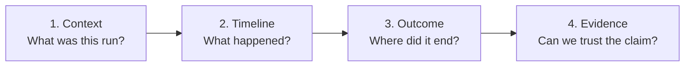
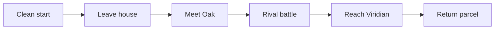
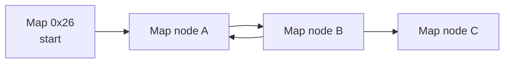

# Visual storytelling guide

The project should be understandable at three distances:

- **three seconds:** what stage are we at, and did this attempt succeed?
- **thirty seconds:** what did the agent try, where did it stall, and what changed since last time?
- **three minutes:** what could it observe, how was it trained, and how strong is the evidence?

The visuals should make failure interesting rather than hiding it. A loop, a confused menu, or a
badly timed action is part of the learning story when it is labeled and measured.

## The visual grammar

Use the same concepts and colors everywhere so a README chart, run summary, and video frame tell
the same story.

| Concept | Suggested treatment | Meaning |
| --- | --- | --- |
| Verified foundation | Green / solid outline | Harness capability supported by checks or repeated evidence |
| Active experiment | Amber / solid outline | Current work; outcome not yet established |
| Future work | Gray / dashed outline | Planned capability, not a result |
| Success | Check plus text label | Task completion under the declared rule |
| Failure | Cross plus named reason | Timeout, loop, blackout, crash, or another declared category |
| Human intervention | Hand marker plus count | Any human action that changes the run |
| Policy action | Blue event | Action chosen by the evaluated policy |
| Planner decision | Purple event | Higher-level goal or strategy change |
| Referee event | Neutral event | Measurement only; must not influence action selection |

Never rely on color alone. Every state needs a word, icon, pattern, or direct label for
accessibility and grayscale viewing.

## One run, explained visually

A future run summary should answer four questions in order.



### 1. Context card

Show enough metadata to prevent a clip from becoming detached from its experiment:

| Field | Display |
| --- | --- |
| Run type | Script / human baseline / training / development evaluation / official evaluation |
| Start | Clean boot or named development state |
| Agent | Configuration and checkpoint identifier, or “none — scripted harness test” |
| Observation/action versions | Explicit schema identifiers |
| Budget | Maximum actions/frames/time and training budget if applicable |
| Seed | Evaluation and environment seed values |
| Intervention | Count, including manual resets or recovery |
| Source | Git commit and reviewed run-summary identifier |

### 2. Event timeline

Group controller frames into decisions or skills so the viewer sees intent rather than an
unreadable stream of button presses.

```text
clean boot ── leave room ── explore house ── exit ── loop detected ── stop
              success         success       fail        referee       timeout
```

The text above is a layout example, not a recorded agent result. A real timeline must come from a
trace and include milestone boundaries, planner changes, battle starts, loops, blackouts, and human
interventions.

Recommended timeline layers:

1. **Goal:** current planner or scripted objective.
2. **Skill:** navigation, interaction, menu, or battle component in control.
3. **World:** map transitions, coordinates, battles, party changes, and milestones.
4. **Health:** repeated states, uncertainty, exhausted budget, and watchdog events.
5. **Human:** intervention markers, always visible.

### 3. Outcome card

Put task completion first, reward second.

| Lead with | Then show | Avoid |
| --- | --- | --- |
| Success/failure and exact completion rule | Furthest milestone, actions, time, termination reason | “High score” without defining the task |
| Attempt number and denominator | Comparison with fixed baseline | Presenting the best seed as typical |
| Intervention count | Resource usage | Calling an assisted run autonomous |

### 4. Evidence footer

Every exported chart or video panel should carry a compact footer such as:

```text
EVIDENCE: official evaluation | all declared attempts included | commit: <short hash>
OBS/ACTION: <versions> | START: clean boot | INTERVENTIONS: <count>
```

Placeholders must be replaced from reviewed run metadata; never type values manually into the
final graphic.

## Standard visual set

These graphics answer different questions and should not be collapsed into one dashboard.

### Evolutionary visual set

The successor experiment needs visuals that teach inheritance rather than disguising it as an
ordinary training curve:

| Visual | Question answered | Required labels |
| --- | --- | --- |
| Family tree | Which ancestor produced this behavior? | Genome ID, parent ID, generation, milestone |
| MAP-Elites grid | Which different kinds of champion survived? | Descriptor axes, empty cells, replacement rule |
| Mutation difference map | What numerically changed from parent to child? | Mutation seed, scale, changed-parameter fraction |
| Worker queue | How can hundreds of models run on four emulators? | Active workers, queued/evaluated candidates, throughput |
| Lineage replay ribbon | Does a checkpoint-assisted milestone reproduce from power-on? | Start condition, ancestor boundaries, replay result |
| Claim ladder | What was actually demonstrated? | Population reached / lineage replayed / one policy solved |

A generation curve should show archive coverage, best milestone, surviving lineage count, and
median child quality. It must not show only the best descendant. Extinct children remain in the
denominator even when the graphic visually emphasizes elites.

### A. Milestone funnel

**Question:** How far do attempts reliably get?



For each node, show `attempts reaching node / all attempts`. Because the milestones are nested,
the count should never rise to the right. This is more informative than one final success rate
when early policies fail in different places.

### B. Evaluation success by checkpoint

**Question:** Does training improve actual completion?

- X-axis: training environment steps.
- Y-axis: frozen-evaluation success rate.
- Show the number of attempts at every point.
- Add uncertainty intervals when the attempt count supports them.
- Use the same evaluation starts, budget, and referee across checkpoints.
- Do not substitute episodic training return for this chart.

### C. Training diagnostics

**Question:** Is optimization changing behavior, even before success appears?

- Plot per-seed raw returns faintly and a clearly labeled aggregate prominently.
- If a smoothed curve is used, state the smoothing window and retain access to unsmoothed data.
- Pair reward with concrete submetrics: maps reached, loop rate, battles entered, or milestones.
- Mark reward/config changes with vertical annotations; do not join incompatible regimes as one
  uninterrupted curve.

### D. Abstract trajectory map

**Question:** Where does the agent explore or loop?

Render anonymous map nodes and tile-coordinate paths from the documented state instrumentation. Use
data-derived geometry, not extracted map tiles or proprietary sprites.



The graph above demonstrates the visual form only; the future node labels and edges must be
generated from run data. Within a map, use paths, occupancy heatmaps, and repeated-state markers.
Label map IDs as anonymous unless a documented translation is part of the declared observation or
presentation layer.

### E. Loop anatomy strip

**Question:** Why did this attempt stop making progress?

Show a short repeated sequence as small, original schematic frames:

```text
state A → state B → state C → state B → state C → watchdog threshold → replan/stop
```

Include coordinates or screen hashes, chosen actions, component in control, and the threshold that
fired. This turns a frustrating failure clip into an inspectable debugging story.

### F. Resource panel

**Question:** What did the result cost?

Report separately:

- wall-clock training time;
- aggregate emulator-hours;
- environment steps and seeds;
- evaluation actions/frames;
- language-model calls, tokens, latency, and monetary cost when applicable; and
- human interventions and manual labeling time.

A faster emulator and a faster wall clock are different achievements. Do not merge them.

### G. Comparison small multiples

**Question:** How do language-model, RL, and hybrid systems behave differently?

Give each configuration the same panel size and axes. Show success, milestone funnel, actions,
failure reasons, interventions, and resource use. Add a disclosure row for information and tools
that differ. Avoid one composite “winner” score unless its weighting was declared in advance.

## Anti-cherry-picking rules for charts

- Official plots include every attempt in the declared evaluation set.
- Select checkpoints before looking at final evaluation outcomes, or disclose the selection method.
- Show individual seeds or attempts when there are few of them.
- Keep axes and milestone definitions fixed across comparisons.
- Start rate axes at zero unless a zoomed inset is clearly labeled.
- Label development runs separately from official evaluations.
- Report crashes and invalid runs; do not silently remove them from the denominator.
- Mark configuration, reward, observation, or action-space changes as new experimental regimes.
- Preserve failed traces under the same retention/review rules as successful traces.
- Link each published visual to the data and script that generated it when those are safe to share.

## A future run artifact contract

The current harness writes a sanitized JSONL trace and screenshots. Before model training, the
recorder should grow toward a reviewed bundle with clear public/private boundaries:

```text
run-<id>/
├── manifest.json          # configuration, versions, seeds, budgets
├── events.jsonl           # time-ordered sanitized events
├── metrics.csv            # chart-ready scalar series
├── summary.md             # human-readable outcome and caveats
└── visuals/               # generated charts and diagrams
```

This is a proposed contract, not the current on-disk schema. ROMs, save states, emulator memory,
private file paths, API keys, copyrighted extracted assets, and unreviewed raw traces stay out of
the public repository.

## Repository visuals without proprietary assets

The public visual identity can be recognizable without copying game art:

- Use original diagrams, typography, geometric controller symbols, and data-derived charts.
- Draw abstract tile grids and map graphs from measurements rather than extracted game maps.
- Use anonymous colored tokens for the agent, goals, battles, and obstacles.
- Keep emulator screenshots and video captures out of Git history unless they pass a deliberate
  legal, privacy, and repository-size review.
- Never bundle sprites, tilesets, music, ROM-derived fonts, or other extracted assets.
- Add alt text or a nearby textual explanation for every meaningful image.

Generated charts should have deterministic scripts and reviewed source data. A polished graphic
that cannot be regenerated is decoration, not evidence.

## A possible video narrative

The strongest story is not “AI instantly beats Pokémon.” It is “we built a way to watch learning
honestly, then discovered what the task actually demands.”

### Act I — Build the stage

1. **The question:** What would it mean for an AI to play Pokémon Red?
2. **The trap:** A successful clip can hide resets, privileged state, and failed attempts.
3. **The contract:** Show policy, referee, recorder, and the evidence ladder.
4. **The first proof:** Two clean scripted boots land on the same playable state.

Suggested visual: architecture diagram → ROM privacy boundary → matching bootstrap hashes →
one-tile movement calibration.

### Act II — Teach one useful behavior

1. Establish the human and random baselines.
2. Explain the observation/action space visually.
3. Show early failures: walls, menu confusion, loops, or mistimed inputs.
4. Introduce reward and show why return is not the same as quest completion.
5. Evaluate frozen checkpoints on the same milestone funnel.

Suggested visual: abstract trajectory → loop anatomy → learning diagnostics → evaluation success.

### Act III — Compose a journey

1. Give the planner a bounded goal and a learned skill interface.
2. Show control moving among planner, skills, memory, and watchdog.
3. Follow one complete attempt with an event timeline.
4. Reveal the full evaluation set before showing the best run.
5. End with what failed, what generalized, and the next honest question.

Suggested visual: control-transfer timeline → all-attempt outcome grid → representative run →
resource/caveat card.

## Editing rules for video and social clips

- On-screen text must say whether footage is scripted, training, development evaluation, or
  official evaluation.
- Speed-up and removed waiting time should be labeled; action counts must remain based on raw data.
- Re-enactments or reconstructed timelines must say so.
- A montage of failures should state its selection rule.
- If the shown run is the best, say “best of N” and show the aggregate result nearby.
- Human inputs, resets, and snapshot loads get visible markers.
- Narration should distinguish “the agent observed,” “the referee measured,” and “we inspected
  during development.”
- Captions should define unfamiliar terms without requiring the viewer to read the code.

## A visual release checklist

Before publishing a chart, screenshot, animation, or video panel:

- [ ] Is the run type clearly labeled?
- [ ] Are the task rule, attempt denominator, and budget visible or linked?
- [ ] Does the visual come from reviewed data rather than hand-entered metrics?
- [ ] Are failures and invalid attempts accounted for?
- [ ] Are interventions and snapshot loads visible?
- [ ] Are policy-visible and referee-only information kept distinct?
- [ ] Are axes, smoothing, and uncertainty explained?
- [ ] Are commit, configuration, and schema versions recoverable?
- [ ] Is private information absent?
- [ ] Is proprietary extracted game art absent from repository assets?
- [ ] Does color-independent labeling and alt text make the point accessible?
- [ ] Is the caption no stronger than the evidence level supports?

For the current facts that these visuals must reflect, see [Progress](progress.md). For evaluation
rules, see [Experiment protocol](experiment-protocol.md).
