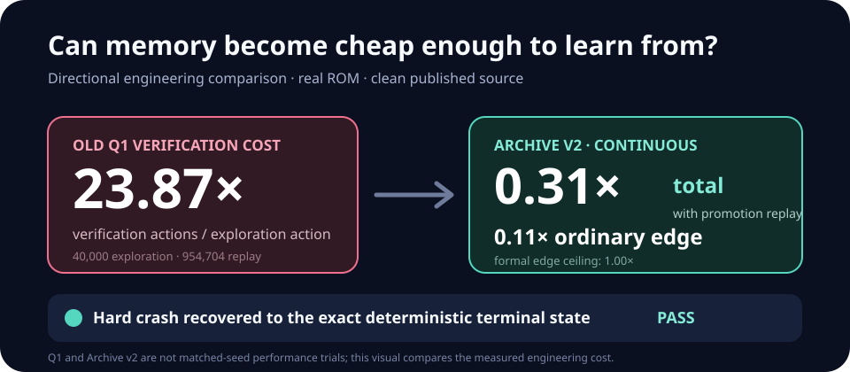
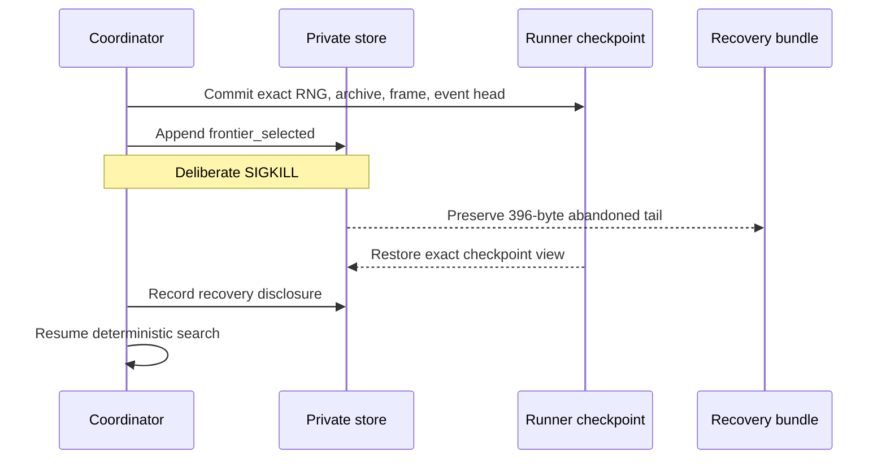

# Archive v2 qualification

> **Result:** Passed the staged engineering gate on 2026-07-19. This result authorizes Archive v2
> as the checkpoint substrate for the next bounded learning pilot. It does not show that the random
> action emitter learned, and it does not authorize a Hall-of-Fame claim.

## The question

Q1 proved that checkpoint search could preserve one lucky house-exit route, but it paid an
unacceptable price: 40,000 exploration actions triggered 954,704 verification actions. Its archive
also admitted visual states faster than useful frontier states could be revisited.

Archive v2 asks a narrower engineering question:

> Can the expedition retain useful stepping stones, verify them exactly, survive normal and abrupt
> interruption, and keep ordinary replay and file arrivals bounded?

This is the bridge between a one-off search demonstration and the Visual Apprentice learning
pilot. If the bridge loses state after a crash or spends dozens of actions proving every action it
takes, a longer training run would mainly produce cost and misleading footage.



The Q1 comparison in the visual is directional, not a matched-seed performance comparison. Q1 used
the old protocol, different budgets, and two different seeds. It establishes the scale of the
engineering problem; the staged trials below test whether the new invariants actually hold.

## Frozen implementation

All qualifying trials used clean source provenance:

| Identity | Value |
| --- | --- |
| Git commit | `e4e50b11eaaadf4b33e83a93c7597e3af72afb40` |
| Worktree | Clean |
| Runner protocol | `checkpoint-expedition-runner-v2` |
| Store protocol | `checkpoint-expedition-v2` |
| Implementation hash | `0685d6de725743d42670025c93d014395e3d74d732703263a88aa4895b2c7a2a` |
| Supported ROM SHA-256 | `5ca7ba01642a3b27b0cc0b5349b52792795b62d3ed977e98a09390659af96b7b` |
| Actor | `RANDOM-ACTION-EMITTER` |
| Training information | `PRIVILEGED-TRAINING-REFEREE` |
| Start rule | `ARCHIVE-RESTORE` after a verified root |
| Evaluated object | Checkpoint-search infrastructure, not a learned policy |

Every ordinary cell required one exact parent-to-child edge replay. A named milestone advance
required three additional fresh power-on replays. Each semantic/spatial primary niche could retain
one representative plus at most three visual alternatives. Each suffix could persist no more than
one ordinary candidate.

## Runs and complete denominator

Four fresh directories were retained. Three are qualification evidence; one is a useful failed
interruption attempt.

| Run | Role | Seed | Exploration actions | Interruption | Result |
| --- | --- | ---: | ---: | --- | --- |
| Continuous | Deterministic control | `20260740` | 4,096 | None | Exact action limit |
| Stop-timing calibration | Failed operational attempt | `20260741` | 2,048 | Stop request arrived after completion | Preserved; not counted as resume evidence |
| Graceful resume | Planned interruption | `20260741` | 4,096 | Stopped at action 1,023, then resumed | Exact action limit |
| Hard crash | Crash-tail recovery | `20260740` | 4,096 | `SIGKILL` with one selection event beyond the checkpoint | Recovered, then exact action limit |

The 2,048-action stop miss matters. The emulator was fast enough that a separate CLI invocation
could not place the marker before the action ceiling. The run was not relabeled as resume evidence.
The repeated trial used a larger declared ceiling and placed the same documented STOP marker
immediately; it then exercised the real resume path.

The machine-readable aggregate is [summary.csv](summary.csv).

## Measured result

| Measure | Continuous | Graceful resume | Hard crash |
| --- | ---: | ---: | ---: |
| Exploration actions | 4,096 | 4,096 | 4,096 |
| Attempts / completed suffixes | 78 | 58 | 78 |
| Stored evidence cells, including root | 18 | 5 | 18 |
| Active cells | 14 | 4 | 14 |
| Active primary niches | 4 | 1 | 4 |
| Edge replay actions | 453 | 56 | 453 |
| Edge replay / exploration ratio | 0.111 | 0.014 | 0.111 |
| Promotion replay actions | 831 | 0 | 831 |
| Total verification / exploration ratio | 0.313 | 0.014 | 0.313 |
| Best named milestone | `game_started` | `power_on` | `game_started` |
| Final private bytes | 388,583 | 166,065 | 430,382 |
| Recorded elapsed seconds | 18.321 | 15.966 | 18.496 |

The crash run is larger because it retains the recovery evidence rather than hiding it.

## What the crash test actually did

The coordinator was killed only after a guard observed all of the following:

1. a stable runner checkpoint;
2. a complete post-checkpoint event line;
3. a `frontier_selected` event in that tail; and
4. a process command containing the exact private qualification directory.

The kill left 396 post-checkpoint bytes containing one event. Resume created one private recovery
bundle with ID:

```text
8890bef6092935baa138543b8f8ea79e60fa0f7a9c3306d3b6d6cf1b2fa24da4
```

The bundle retained the abandoned bytes under their SHA-256
`f5c6fa177b3c81069e7b768be6f0dcfb10d1a2ddddf4f97188530e362a6edaee`. The live store returned to
the exact checkpoint, recorded a public-safe recovery disclosure, and continued. No pending
transaction marker remained after completion.



## Determinism result

The continuous and hard-crash trials used the same seed and configuration. After removing only
elapsed time, timestamps, trace offsets, and event-chain identity—which must differ when recovery is
disclosed—the following terminal fields matched exactly:

- configuration, ROM, source, and implementation identities;
- every non-time counter;
- random-number-generator state;
- archive contents, selection counts, and warmup state;
- per-parent attempt counts;
- best and observed milestones;
- completion-cell value;
- ordered store cell IDs; and
- immutable checkpoint-frame hash.

Both finished with 4,096 actions, 78 attempts, 18 stored cells, 14 active cells, four primary
niches, 453 edge-replay actions, 831 promotion-replay actions, and `game_started` as the best named
milestone.

## Acceptance assertions

One post-run audit reopened every store and required all of these conditions:

- runner, store, and checkpoint schemas were v2;
- source provenance was clean and bound to the published commit;
- all three qualifying runs finished at their exact action limits;
- every recorded edge and power-on replay passed;
- edge replay actions never exceeded exploration actions;
- aggregate replay counters reconciled exactly;
- every non-root stored cell had an edge certificate;
- every named promotion had at least three successful power-on certificates;
- every suffix persisted zero or one ordinary candidate;
- completed-suffix actions summed to the exact exploration total;
- active archive size stayed within 128 and each primary niche stayed within four cells;
- index IDs exactly matched cell metadata before reopening;
- checkpoint event sequence, event head, and ordered cell IDs matched the reopened store;
- embedded frame bytes matched their declared shape and hash;
- final reported disk bytes matched a fresh exact file-tree sum; and
- public manifest, status, trace, and dashboard files contained neither the ROM filename nor its
  private path.

All assertions passed.

## What passed—and what did not

Archive v2 passed its staged engineering gate. In this bounded sample, ordinary edge verification
cost at most 0.111 actions per exploration action, far below the formal 1.0 ceiling. The measured
total verification ratio reached 0.313 when the first named milestone correctly triggered three
full power-on replays.

This does **not** prove:

- that the random emitter became a learned policy;
- that `game_started` is reliable across seeds;
- that the archive can reach Oak, a starter, the Parcel, or the Hall of Fame;
- that the same ratios remain constant at extremely deep lineages; or
- that a multi-day neural learner is already implemented.

The next experiment is the [Visual Apprentice](../../docs/visual-apprentice.md): turn verified
self-generated routes into pixel/action sequences, deliberately overfit one route as a pipeline
smoke, then test whether a recurrent policy can recover from its own mistakes. That is where the
project returns from reliable memory to actual model learning.

