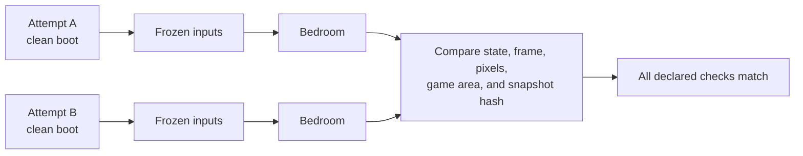

# Phase 0 clean-bootstrap evidence

> **Result:** E3 — Repeated calibration evidence. This is a scripted harness test, not model
> training or autonomous gameplay.

## Question

Can two independent clean boots reach the same first playable bedroom state with identical logical
frame, instrumentation, screen, game-area, and private snapshot hashes?

## Identity

| Field | Value |
| --- | --- |
| Run class | Calibration |
| Actor | Scripted harness |
| Source commit | [`f7c03f8eda8dc9c6aadf33e957a4642897bbd315`](https://github.com/PeteAndrews1289/pokemon-red-ai/commit/f7c03f8eda8dc9c6aadf33e957a4642897bbd315) |
| Worktree at run time | Clean |
| Start condition | New emulator process and clean game boot |
| Action schema | `controller-v1` |
| Instrumentation schema | `state-instrumentation-v1` |
| PyBoy | 2.7.0 |
| Human interventions | 0 |
| Recorded | 2026-07-19 04:32 UTC |

The ROM identity is present in the sanitized [trace](trace.jsonl). The ROM itself, its local path,
screenshots, save data, and in-memory snapshot payloads are not published.

## Protocol

Both attempts used a fresh emulator instance and the same frozen sequence:

1. Wait 1,800 frames for the title state.
2. Advance the introduction with explicit 8-frame holds and 16-frame releases.
3. Select the built-in RED and BLUE names.
4. Stop after the final transition at logical frame 9,804.
5. Verify the bedroom map-script input-ready condition.
6. Move DOWN exactly one tile, then restore the untouched in-memory snapshot.
7. Compare the two attempts.

## Attempt ledger

| Attempt | Final frame | Bedroom | Input ready | One-tile DOWN | State | Outcome |
| --- | ---: | :---: | :---: | :---: | --- | --- |
| A | 9,804 | yes | yes | yes | map 38, x 3, y 6, party 0, no battle | pass |
| B | 9,804 | yes | yes | yes | map 38, x 3, y 6, party 0, no battle | pass |

The exact screen, game-area, and snapshot hashes are identical across the two attempts and remain
available in the machine-readable trace. The standalone [visual run report](report.html) displays
shortened fingerprints for readability.

## Outcome

- Both attempts reached the expected first playable bedroom state.
- Both attempts ended at logical frame 9,804.
- Both state snapshots were identical.
- Both screen hashes were identical.
- Both game-area hashes were identical.
- Both in-memory snapshot hashes were identical.
- An 8-frame DOWN hold plus 16-frame release moved RED from `(3, 6)` to `(3, 7)` in both attempts.
- Loading the private in-memory snapshot restored the untouched start.

This supports the narrow claim that the clean-bootstrap calibration is repeatable under the recorded
software and input contract.

## What it does not prove

- No model chose an action.
- No reinforcement learning or language-model planning occurred.
- The sequence does not demonstrate visual understanding, exploration, or quest completion.
- Two deterministic attempts do not establish robustness across emulator versions, ROM revisions,
  operating systems, or changed timing.
- The private screenshots were visually reviewed locally but are not part of this public evidence.

## Artifacts

- [Sanitized JSONL trace](trace.jsonl) — full public metadata and hashes
- [Standalone HTML report](report.html) — accessible presentation of the same trace
- [Experiment protocol](../../docs/experiment-protocol.md) — claim and publication rules

The trace is authoritative. The HTML page is a bounded presentation layer generated from it.
