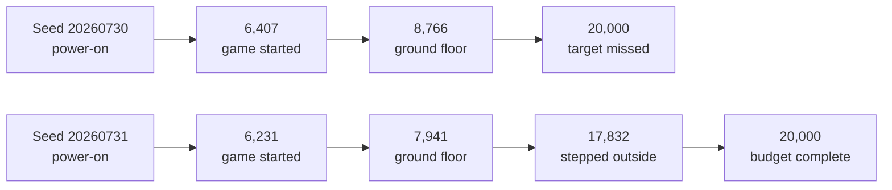

# Q1 result: one remembered step outside

> **Result, 2026-07-19:** one of two frozen development seeds reached `left_home`. The successful
> 419-action lineage replayed from power-on three times with matching state, screen, snapshot, and
> semantic milestone. Because the protocol required both seeds to succeed, Q1 did **not** pass. The
> result supports the narrower H3 claim that the checkpoint expedition reached and verified a named
> milestone. It does not show that a model learned to leave the house.

## Question

Can a checkpoint-assisted search using observation-free random action suffixes discover Red's house
exit, preserve the complete ancestry, and reproduce it from power-on under two fresh bounded seeds?

## Frozen protocol

| Field | Value |
| --- | --- |
| Source commit | `57a0009ba16af0f9367cb25602065c07b1ec8510` |
| Run class | Development |
| Actor | `RANDOM-ACTION-EMITTER` (`seeded-uniform-random-sequence-v1`) |
| Training information | `PRIVILEGED-TRAINING-REFEREE` |
| Start/evaluated object | `ARCHIVE-RESTORE / ACTION-LINEAGE` |
| Target | Exact named milestone `left_home` |
| Seeds | `20260730`, `20260731` |
| Exploration ceiling | 20,000 actions per seed |
| Wall-clock ceiling | One hour per seed |
| Output ceiling | 2 GiB per seed; stop below 50 GiB free |
| Suffix schedule | 32–1,024 actions, doubled after eight selections of a parent |
| Selection | 75% highest milestone, 10% lowest-tier rehearsal, 15% whole archive |
| Verification | One complete power-on replay per local cell; three for milestone advances |
| Human interventions | 0 |

The emitter received no pixels, RAM, checkpoint bytes, milestone, reward, or coordinate. Rendered
pixels were used only by the loop detector. The sealed referee used documented read-only state for
milestones and archive selection.

## Complete result

| Measure | Seed `20260730` | Seed `20260731` |
| --- | ---: | ---: |
| Target result | Failed | **Passed** |
| Furthest milestone | `left_bedroom` | **`left_home`** |
| First `game_started` action | 6,407 | 6,231 |
| First `left_bedroom` action | 8,766 | 7,941 |
| First `left_home` action | — | **17,832** |
| Shortest furthest lineage | 336 actions | **419 actions** |
| Exploration actions | 20,000 | 20,000 |
| Replay actions | 472,072 | 482,632 |
| Replay/exploration ratio | 23.60× | 24.13× |
| Replay passes | 1,456 / 1,456 | 1,528 / 1,528 |
| Attempts | 630 | 629 |
| Active frontier cells | 1,087 | 1,197 |
| Stored evidence cells | 1,202 | 1,300 |
| Loop stops | 22 | 13 |
| Elapsed wall time | 39m 51s | 45m 10s |
| Mean exploration rate | 8.36 actions/s | 7.38 actions/s |
| Stop reason | Action limit | Action limit |
| Status SHA-256 | `255fa5ee920fa20b0a239d04c499033c7877e397f81e2e5c3cadeaeedde2cd04` | `cc0898a011f87f2073365afb5852b22346f3b228956daefe00a8315ffd64ecc1` |

Across both seeds, the emulator executed 40,000 exploration actions and 954,704 verification
actions: **994,704 controller actions total**. It admitted 2,317 cells, retained 2,284 active cells,
and passed all 2,984 replay attempts. One seed succeeded, so the observed target rate is 1/2. With
only two development seeds this is a complete denominator, not a general success-rate estimate.

## Successful lineage anchor

The first accepted `left_home` cell was `4618cb56f99c95b594534474`. Its public integrity anchors are:

| Field | Hash or value |
| --- | --- |
| Complete lineage length | 419 actions |
| Lineage SHA-256 | `84aa0179b01df7a8c9d5220d5bd5ba042f639489e2918459570b5c4e42d0c25c` |
| Snapshot SHA-256 | `66e5a0b66101bc86d4fa5e2d9219578300167c7939d9bfd83fa2d7374760d879` |
| Screen SHA-256 | `64ece8c2262ecd6bca8816a7ae6a47e7ff9891c07612f8a65d03c5400e7120ed` |
| Semantic result | Pallet Town, `(3, 7)`, `left_home` |
| Promotion replays | 3 / 3 passed |

The ROM, snapshot bytes, action payloads, run paths, and gameplay images remain private and outside
Git. The exact milestone capture occurred during the transition and is scientifically valid but
visually unclear; a later ordinary run frame clearly showed Red outside. Future recording should
preserve both the exact causal frame and a separately labeled first stable narrative frame.

## Interpretation

### What worked

- The checkpoint archive converted random, non-learning actions into cumulative search progress.
- A complete power-on lineage crossed the title sequence, bedroom, ground floor, and house exit.
- Independent semantic verification prevented a visual transition frame from becoming the sole
  meaning of success.
- Every attempted replay passed, and both seeds stopped exactly at the declared action ceiling.

### What failed

- The result did not repeat in both seeds, so Q1's robustness gate failed.
- The button emitter learned nothing; success remained stochastic search plus archive memory.
- Verification consumed almost 24 times the exploration budget because nearly every local visual
  cell was replayed from power-on.
- Archive breadth grew faster than useful frontiers could be revisited, delaying exploitation of
  newly promising positions.
- The exact milestone screenshot was a transition frame rather than a strong narrative image.

## Decision

Do not rerun the unchanged random emitter with a larger budget and do not begin a multi-day
campaign. Preserve this as the random checkpoint-search baseline. Before the next gate:

1. stream lineage replay and index replay state instead of repeatedly materializing and rescanning;
2. verify local branches selectively while retaining three exact replays for milestone promotion;
3. prevent a flood of one-use visual cells from starving newly advanced frontiers;
4. compare an optimized action-sequence emitter and a recurrent visual emitter against this same
   two-seed, 20,000-action `left_home` protocol; and
5. record exact milestone frames and stable narrative frames as separate evidence.

Only a materially different emitter should advance to the opening curriculum. One successful
random lineage is useful self-generated data, not the final learning mechanism.
