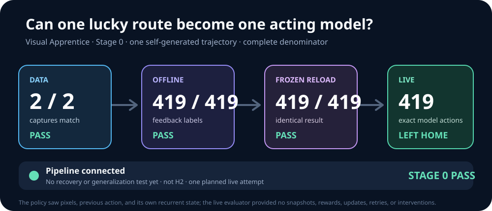

# Visual Apprentice Stage 0

> **Result:** Passed on 2026-07-19 local time. One 468,312-parameter recurrent pixel policy
> exactly fit the project's single 419-action self-generated route, survived a frozen save/reload,
> and then selected that same complete route from a clean power-on to `left_home`. This proves the
> learning pipeline connects. It does not prove recovery, generalization, H2, or general Pokémon
> play.

## The question

The Q1 checkpoint expedition discovered one lucky route out of Red's house. Archive v2 proved that
the project could preserve such routes without repeating their entire histories for every ordinary
branch. Stage 0 asks the next deliberately small question:

> Can a neural policy receive only processed screen pixels, its previous action, and its own
> recurrent state; memorize one verified route; and execute every action itself from power-on?

## Frozen identity

| Identity | Value |
| --- | --- |
| Git commit | `8794ae97f85a6ad4774380df8fe18e20602b2028` |
| Worktree | Clean |
| Protocol | `visual-apprentice-stage0-v1` |
| Dataset SHA-256 | `a8b03101d6f145e9d19831bc7d75caae90ca9f41b0c6518adf52e89eaa730aec` |
| Model SHA-256 | `3c16f60e08a3ac923028b4aced5634059846ed1e8f462ca6fc73d75138cce8ed` |
| Architecture | Two-frame CNN, 128-unit LSTM, eight-action policy head |
| Parameters | 468,312 |
| Actor | `PIXEL-ACTOR` |
| Training information | Self-generated verified route; privileged referee never chooses an action |
| Evaluation start | `POWER-ON` |
| Evaluated object | One frozen policy |

The actor received two processed `72 × 80` grayscale frames, its previous controller action, and
its own recurrent state. It did not receive RAM, map, coordinates, milestones, checkpoint IDs,
route position, or the teacher's next action. The live evaluation disabled snapshots, rewards,
updates, retries, and interventions.

## Complete denominator

There were two independent data captures, one training run, one frozen reload check, and one live
evaluation attempt. No failed attempt was discarded or repeated under the Stage-0 protocol.

| Gate | Denominator | Requirement | Result |
| --- | ---: | --- | --- |
| Data | 2 captures | Both independently replay the certified route and produce the same logical dataset | **PASS** |
| Offline | 1 training run | Teacher-forced and predicted-feedback labels both reach 419/419 | **PASS** |
| Reload | 1 frozen reload | Saved model reproduces the complete offline result exactly | **PASS** |
| Closed loop | 1 planned live attempt | From clean power-on, reach exact `left_home` within 1,000 model actions | **PASS** |

The machine-readable aggregate is [summary.csv](summary.csv).

## Measured result

| Measure | Value |
| --- | ---: |
| Training labels | 419 |
| Decision-boundary frames | 420 |
| Independent logical dataset hashes agreeing | 2/2 |
| Training epochs | 316 |
| Training wall time | 99.112 seconds |
| Maximum resident memory reported | 426.922 MiB |
| Teacher-forced accuracy | 419/419 |
| Predicted-feedback accuracy | 419/419 |
| Frozen-reload accuracy | 419/419 |
| Live actions to `left_home` | 419 |
| Original-route prefix matched | 419/419 |
| Exact original action sequence | Yes |
| Live rollout wall time | 0.753 seconds |
| Human interventions during evaluation | 0 |

The policy crossed the declared intermediate milestones at model action 243 (`game_started`), 302
(`left_bedroom`), and 419 (`left_home`). The private evidence bundle retains the corresponding
frames, per-action ledger, model tensors, and complete integrity closure outside Git.

## Artifact closure

Every private bundle was sealed before the composite pass:

| Bundle | SHA-256 |
| --- | --- |
| Two-capture data gate | `aaef4f0a0231d0b860675ab7abf85242639d2e603d72aec537b10bca6b93ed3d` |
| Training and frozen reload | `af3bd8b1f768ae1edf892278bfdd5a152b27b608a19818e47c354b013d62b694` |
| Clean-power-on evaluation | `6d13e8578ef0a170381851d419128b6b4c0b74790cc5e223bd6a4b1d3f0be3fb` |
| Composite qualification | `236da389cc2ee18661d0e52ae58525cdd0c42b6068427a5ac34fd5cf662cfdde` |

The composite qualification is the only Stage-0 PASS authority. A data, training, or evaluation
directory by itself cannot make that claim.

## What this changes

Before this run, the project had a verified action lineage but no evidence that the neural input,
recurrent model, serialization, action decoder, and emulator could operate as one closed loop. They
now can. That removes an important engineering uncertainty and creates a warm-start model for the
next learning experiment.

It does **not** answer the more interesting question. The live attempt followed its one training
route exactly; it was not asked to recover from an unfamiliar screen or a wrong action. A model can
memorize a sequence without learning a robust house-exit skill.

The next bounded experiment therefore uses a reverse checkpoint curriculum. It starts the model
near the door with zero recurrent memory, samples attempts, retains only genuine `left_home`
successes for self-imitation, and moves the start farther backward only after a declared success
gate. Failed attempts remain in the denominator. That pilot is development evidence, not H2.

